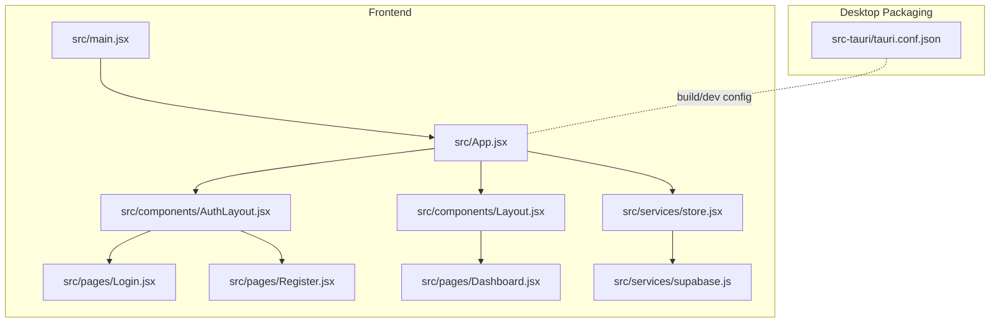
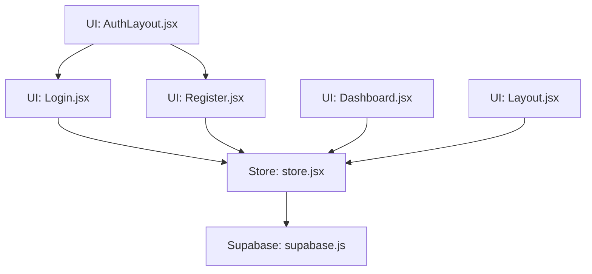
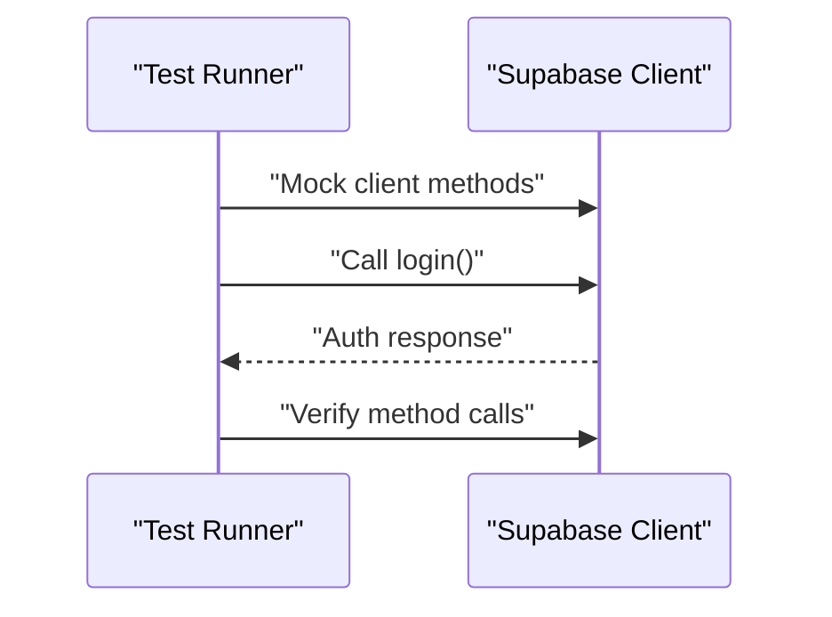
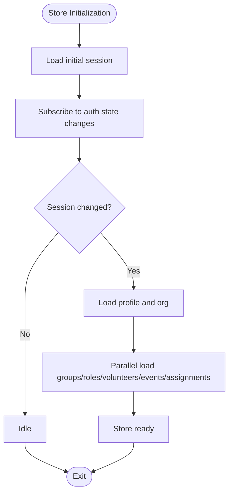
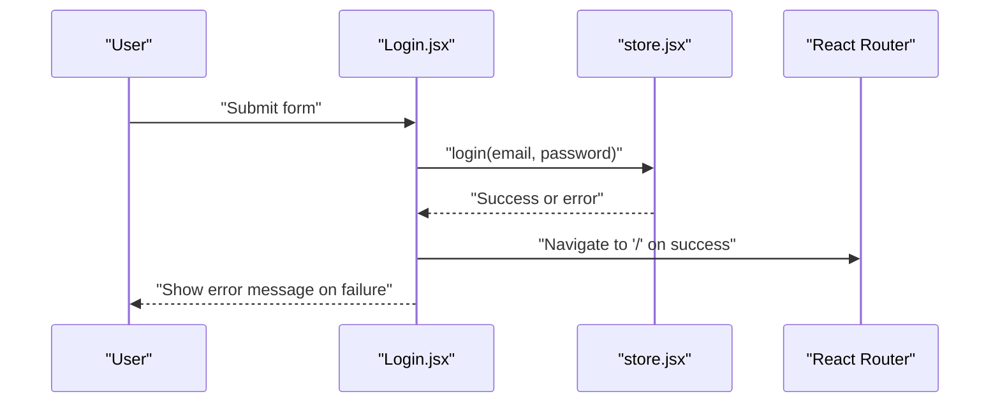
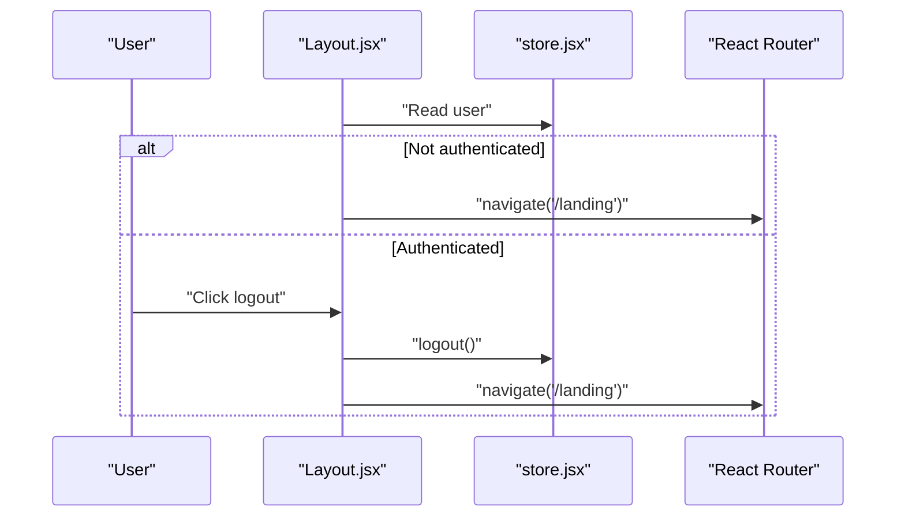
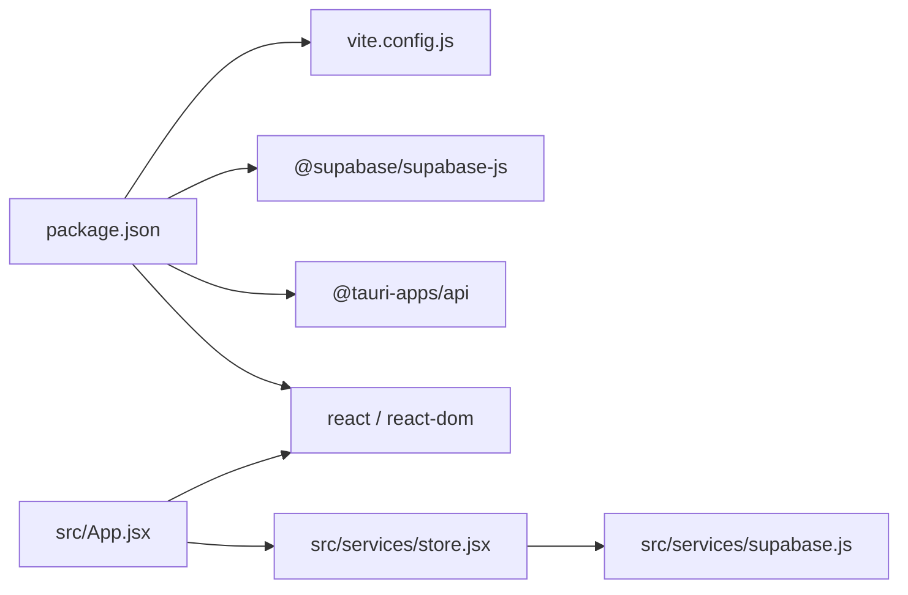

# Testing Strategy

<cite>
**Referenced Files in This Document**
- [package.json](file://package.json)
- [vite.config.js](file://vite.config.js)
- [.env.example](file://.env.example)
- [src/services/supabase.js](file://src/services/supabase.js)
- [src/services/store.jsx](file://src/services/store.jsx)
- [src/App.jsx](file://src/App.jsx)
- [src/main.jsx](file://src/main.jsx)
- [src/pages/Login.jsx](file://src/pages/Login.jsx)
- [src/pages/Register.jsx](file://src/pages/Register.jsx)
- [src/pages/Dashboard.jsx](file://src/pages/Dashboard.jsx)
- [src/components/Layout.jsx](file://src/components/Layout.jsx)
- [src/components/AuthLayout.jsx](file://src/components/AuthLayout.jsx)
- [src-tauri/tauri.conf.json](file://src-tauri/tauri.conf.json)
- [.github/workflows/release.yml](file://.github/workflows/release.yml)
</cite>

## Table of Contents
1. [Introduction](#introduction)
2. [Project Structure](#project-structure)
3. [Core Components](#core-components)
4. [Architecture Overview](#architecture-overview)
5. [Detailed Component Analysis](#detailed-component-analysis)
6. [Dependency Analysis](#dependency-analysis)
7. [Performance Considerations](#performance-considerations)
8. [Troubleshooting Guide](#troubleshooting-guide)
9. [Conclusion](#conclusion)
10. [Appendices](#appendices)

## Introduction
This document defines a comprehensive testing strategy for the RosterFlow application. It covers unit testing for React components and custom hooks, state management testing, Supabase integration testing, authentication flows, and real-time subscriptions. It also outlines integration testing for component interactions and user workflows, desktop application testing considerations using Tauri, and best practices for organizing tests and continuous testing in CI/CD pipelines.

## Project Structure
RosterFlow is a React application built with Vite and packaged as a desktop app using Tauri. The application uses Supabase for authentication and real-time data. The frontend is structured around:
- Pages: route-level components for authentication and main application views
- Components: shared UI components (layout, modals, etc.)
- Services: Supabase client and centralized store for state and data operations
- Root entry: App and main rendering

**Diagram sources**
- [src/main.jsx](file://src/main.jsx#L1-L11)
- [src/App.jsx](file://src/App.jsx#L1-L37)
- [src/components/AuthLayout.jsx](file://src/components/AuthLayout.jsx#L1-L26)
- [src/components/Layout.jsx](file://src/components/Layout.jsx#L1-L108)
- [src/pages/Login.jsx](file://src/pages/Login.jsx#L1-L80)
- [src/pages/Register.jsx](file://src/pages/Register.jsx#L1-L101)
- [src/pages/Dashboard.jsx](file://src/pages/Dashboard.jsx#L1-L90)
- [src/services/supabase.js](file://src/services/supabase.js#L1-L13)
- [src/services/store.jsx](file://src/services/store.jsx#L1-L472)
- [src-tauri/tauri.conf.json](file://src-tauri/tauri.conf.json#L1-L35)

**Section sources**
- [src/main.jsx](file://src/main.jsx#L1-L11)
- [src/App.jsx](file://src/App.jsx#L1-L37)
- [src/services/store.jsx](file://src/services/store.jsx#L1-L472)
- [src/services/supabase.js](file://src/services/supabase.js#L1-L13)
- [src-tauri/tauri.conf.json](file://src-tauri/tauri.conf.json#L1-L35)

## Core Components
This section focuses on testing approaches for the primary building blocks of the application.

- Supabase client
  - Purpose: Provides authentication and database access.
  - Test approach: Mock the client globally so all components and hooks under test use the mocked instance. Verify method calls and returned data.
  - Key considerations: Environment variables must be configured for tests; see Environment Setup.

- Centralized store (custom hook)
  - Purpose: Manages authentication state, profile, organization, and CRUD operations for groups, roles, volunteers, events, and assignments. Handles real-time auth state changes and data loading.
  - Test approach: Unit tests for store functions (login, logout, registerOrganization, add/update/delete operations) and integration tests for data loading and derived user object. Snapshot tests for state shape and effects of actions.
  - Key considerations: Parallel data loads, error handling, and cleanup of auth listeners.

- Authentication pages
  - Login page: Tests should cover form submission, loading states, navigation on success, and error display.
  - Registration page: Tests should cover form submission, multi-step backend process, and navigation on success.

- Application layout
  - Auth layout: Renders authentication forms with proper routing and branding.
  - Main layout: Guards routes, renders sidebar navigation, and handles logout.

- Desktop packaging
  - Tauri configuration: Defines window size, dev URL, and build output. Useful for desktop-specific tests and screenshots.

**Section sources**
- [src/services/supabase.js](file://src/services/supabase.js#L1-L13)
- [src/services/store.jsx](file://src/services/store.jsx#L1-L472)
- [src/pages/Login.jsx](file://src/pages/Login.jsx#L1-L80)
- [src/pages/Register.jsx](file://src/pages/Register.jsx#L1-L101)
- [src/components/AuthLayout.jsx](file://src/components/AuthLayout.jsx#L1-L26)
- [src/components/Layout.jsx](file://src/components/Layout.jsx#L1-L108)
- [src-tauri/tauri.conf.json](file://src-tauri/tauri.conf.json#L1-L35)

## Architecture Overview
The testing architecture aligns with the application’s layered design: UI components depend on the store hook, which depends on the Supabase client. Authentication and real-time subscriptions are central to both UI behavior and data synchronization.

**Diagram sources**
- [src/pages/Login.jsx](file://src/pages/Login.jsx#L1-L80)
- [src/pages/Register.jsx](file://src/pages/Register.jsx#L1-L101)
- [src/pages/Dashboard.jsx](file://src/pages/Dashboard.jsx#L1-L90)
- [src/components/Layout.jsx](file://src/components/Layout.jsx#L1-L108)
- [src/components/AuthLayout.jsx](file://src/components/AuthLayout.jsx#L1-L26)
- [src/services/store.jsx](file://src/services/store.jsx#L1-L472)
- [src/services/supabase.js](file://src/services/supabase.js#L1-L13)

## Detailed Component Analysis

### Supabase Client Testing
- Objective: Ensure the client is initialized with correct environment variables and that all store functions delegate to the client appropriately.
- Strategies:
  - Mock @supabase/supabase-js globally in test environments.
  - Verify initialization parameters and warn conditions when environment variables are missing.
  - Snapshot tests for client instance properties.
- Example scenarios:
  - Environment variables missing: verify warning is logged.
  - Client methods called during login/register: assert method calls and arguments.
  - Real-time auth listener: verify subscription creation and cleanup.

**Diagram sources**
- [src/services/supabase.js](file://src/services/supabase.js#L1-L13)
- [src/services/store.jsx](file://src/services/store.jsx#L114-L124)

**Section sources**
- [src/services/supabase.js](file://src/services/supabase.js#L1-L13)
- [src/services/store.jsx](file://src/services/store.jsx#L114-L124)

### Store (Custom Hook) Testing
- Objective: Validate store initialization, auth state synchronization, data loading, and CRUD operations.
- Strategies:
  - Unit tests for store functions: login, logout, registerOrganization, add/update/delete for volunteers, events, assignments, roles, and groups.
  - Integration tests for data loading pipeline: verify parallel fetches, transformations, and state updates.
  - Effect tests: verify auth session retrieval, auth state change listener, and cleanup.
  - Error handling: assert errors thrown and logged appropriately.
- Example scenarios:
  - Successful login: verify session state and profile loading.
  - Registration flow: verify user creation, organization creation, profile creation, and auto-login.
  - Volunteer CRUD: verify insert/update/delete and cascading role relationships.
  - Data refresh: verify loadAllData and derived user object.

**Diagram sources**
- [src/services/store.jsx](file://src/services/store.jsx#L21-L52)

**Section sources**
- [src/services/store.jsx](file://src/services/store.jsx#L1-L472)

### Authentication Pages Testing
- Login page:
  - Form submission: enter credentials, submit, assert navigation and error handling.
  - Loading states: button disabled while submitting.
- Registration page:
  - Multi-step registration: assert calls to registerOrganization and navigation on success.
  - Loading states: button disabled while submitting.

**Diagram sources**
- [src/pages/Login.jsx](file://src/pages/Login.jsx#L14-L25)
- [src/services/store.jsx](file://src/services/store.jsx#L114-L124)
- [src/App.jsx](file://src/App.jsx#L18-L22)

**Section sources**
- [src/pages/Login.jsx](file://src/pages/Login.jsx#L1-L80)
- [src/pages/Register.jsx](file://src/pages/Register.jsx#L1-L101)
- [src/services/store.jsx](file://src/services/store.jsx#L114-L124)
- [src/App.jsx](file://src/App.jsx#L18-L22)

### Layout Components Testing
- Auth layout:
  - Render outlet for authentication routes.
  - Preserve branding and footer.
- Main layout:
  - Guard routes: redirect to landing when not authenticated.
  - Navigation: sidebar links and active state.
  - Logout: trigger store logout and redirect.

**Diagram sources**
- [src/components/Layout.jsx](file://src/components/Layout.jsx#L19-L30)
- [src/services/store.jsx](file://src/services/store.jsx#L119-L124)
- [src/App.jsx](file://src/App.jsx#L24-L29)

**Section sources**
- [src/components/AuthLayout.jsx](file://src/components/AuthLayout.jsx#L1-L26)
- [src/components/Layout.jsx](file://src/components/Layout.jsx#L1-L108)
- [src/services/store.jsx](file://src/services/store.jsx#L119-L124)
- [src/App.jsx](file://src/App.jsx#L24-L29)

## Dependency Analysis
- External dependencies relevant to testing:
  - @supabase/supabase-js: core dependency for authentication and database operations.
  - @tauri-apps/api: desktop runtime integration.
  - @vitejs/plugin-react: development and build tooling.
- Internal dependencies:
  - App wraps pages with StoreProvider and Router.
  - Pages consume the store hook.
  - Layouts wrap page content and enforce authentication.

**Diagram sources**
- [package.json](file://package.json#L15-L24)
- [vite.config.js](file://vite.config.js#L1-L10)
- [src/App.jsx](file://src/App.jsx#L1-L37)
- [src/services/store.jsx](file://src/services/store.jsx#L1-L472)
- [src/services/supabase.js](file://src/services/supabase.js#L1-L13)

**Section sources**
- [package.json](file://package.json#L15-L24)
- [vite.config.js](file://vite.config.js#L1-L10)
- [src/App.jsx](file://src/App.jsx#L1-L37)
- [src/services/store.jsx](file://src/services/store.jsx#L1-L472)
- [src/services/supabase.js](file://src/services/supabase.js#L1-L13)

## Performance Considerations
- Parallel data loading: The store loads multiple datasets concurrently; tests should validate that all requests resolve and that state updates occur atomically.
- Auth listener cleanup: Ensure subscriptions unsubscribe to prevent memory leaks in tests.
- Rendering performance: Prefer shallow rendering for components that primarily render static content; use full DOM rendering for components with complex interactions.
- Mock granularity: Mock only what is necessary to avoid brittle tests.

## Troubleshooting Guide
- Missing environment variables:
  - Symptom: Warning logs during client initialization.
  - Action: Set VITE_SUPABASE_URL and VITE_SUPABASE_ANON_KEY in test environment.
- Authentication redirects:
  - Symptom: Layout redirects to landing unexpectedly.
  - Action: Ensure store session is properly mocked or initialized in tests.
- Real-time subscription issues:
  - Symptom: Tests hang or fail due to lingering subscriptions.
  - Action: Verify subscription cleanup in afterEach hooks.
- Desktop packaging:
  - Symptom: Dev server not reachable in Tauri window.
  - Action: Confirm dev URL matches Vite configuration and Tauri build settings.

**Section sources**
- [src/services/supabase.js](file://src/services/supabase.js#L6-L8)
- [src-tauri/tauri.conf.json](file://src-tauri/tauri.conf.json#L6-L9)
- [vite.config.js](file://vite.config.js#L5-L8)

## Conclusion
A robust testing strategy for RosterFlow requires coordinated unit, integration, and desktop-focused tests. Mocking the Supabase client and the store enables isolated testing of UI components and business logic. Real-time auth state changes and parallel data loading must be explicitly tested. Desktop testing should leverage Tauri configuration for reliable builds and development workflows. CI/CD should automate frontend builds and desktop bundling to ensure consistent quality.

## Appendices

### Test Environment Setup
- Environment variables:
  - Configure VITE_SUPABASE_URL and VITE_SUPABASE_ANON_KEY for Supabase integration tests.
- Vite configuration:
  - Base path is set to relative to support both dev and build environments.
- Tauri configuration:
  - Dev URL points to Vite dev server; window size and identifiers defined for desktop builds.

**Section sources**
- [.env.example](file://.env.example#L1-L5)
- [vite.config.js](file://vite.config.js#L5-L8)
- [src-tauri/tauri.conf.json](file://src-tauri/tauri.conf.json#L6-L9)

### Continuous Integration and CD
- Workflow overview:
  - Builds and packages the desktop application for macOS, Ubuntu, and Windows.
  - Uses Tauri action to produce platform-specific artifacts.
- Recommendations:
  - Add unit and integration tests to the CI pipeline before packaging.
  - Cache dependencies to speed up builds.
  - Publish artifacts on tagged releases.

**Section sources**
- [.github/workflows/release.yml](file://.github/workflows/release.yml#L1-L49)
- [src-tauri/tauri.conf.json](file://src-tauri/tauri.conf.json#L1-L35)