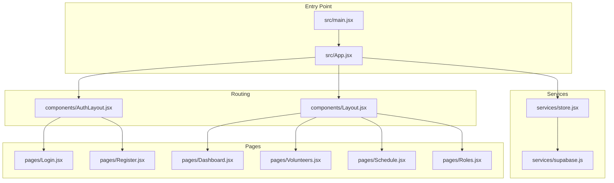

# Getting Started

<cite>
**Referenced Files in This Document**
- [package.json](file://package.json)
- [.env.example](file://.env.example)
- [supabase-schema.sql](file://supabase-schema.sql)
- [src/services/supabase.js](file://src/services/supabase.js)
- [src/services/store.jsx](file://src/services/store.jsx)
- [src/App.jsx](file://src/App.jsx)
- [src/main.jsx](file://src/main.jsx)
- [vite.config.js](file://vite.config.js)
- [src/pages/Dashboard.jsx](file://src/pages/Dashboard.jsx)
- [src/pages/Volunteers.jsx](file://src/pages/Volunteers.jsx)
- [src/pages/Login.jsx](file://src/pages/Login.jsx)
- [src/pages/Register.jsx](file://src/pages/Register.jsx)
- [src/components/AuthLayout.jsx](file://src/components/AuthLayout.jsx)
- [README.md](file://README.md)
</cite>

## Table of Contents
1. [Introduction](#introduction)
2. [Prerequisites](#prerequisites)
3. [Installation](#installation)
4. [Initial Setup](#initial-setup)
5. [Development Workflow](#development-workflow)
6. [First-Time User Setup](#first-time-user-setup)
7. [Project Structure Overview](#project-structure-overview)
8. [Quick Start Examples](#quick-start-examples)
9. [Troubleshooting Guide](#troubleshooting-guide)
10. [Conclusion](#conclusion)

## Introduction
RosterFlow is a React-based volunteer scheduling application that integrates with Supabase for authentication and data persistence. It provides a modern interface for managing church teams, roles, events, and assignments with built-in row-level security policies.

## Prerequisites
Before installing RosterFlow, ensure you have the following:

- Node.js 18+ installed on your development machine
- npm (comes with Node.js) for dependency management
- A Supabase account with a project created
- Git for version control (recommended)

Key requirements verified in the project:
- React 19.x and Vite 7.x for the frontend framework
- Supabase JavaScript client for database connectivity
- Tailwind CSS for styling infrastructure

**Section sources**
- [package.json](file://package.json#L15-L39)
- [README.md](file://README.md#L1-L17)

## Installation
Follow these steps to set up the development environment:

1. Clone the repository to your local machine
2. Navigate to the project directory
3. Install dependencies using npm:
   ```
   npm install
   ```

The project uses Vite as the build tool and includes React with TypeScript support. The package.json defines scripts for development, building, and previewing the application.

**Section sources**
- [package.json](file://package.json#L7-L14)

## Initial Setup
Complete these essential setup steps before running the application:

### Environment Configuration
1. Copy the example environment file:
   ```bash
   cp .env.example .env
   ```
2. Configure your Supabase credentials in the `.env` file:
   - Set `VITE_SUPABASE_URL` to your Supabase project URL
   - Set `VITE_SUPABASE_ANON_KEY` to your Supabase anonymous key

### Database Schema Setup
1. Log in to your Supabase dashboard
2. Open the SQL Editor (found under "SQL Editor" in the left sidebar)
3. Paste the entire contents of `supabase-schema.sql`
4. Execute the SQL script to create all tables and policies

The schema includes:
- Organizations table for multi-tenant support
- Profiles table extending Supabase auth.users
- Groups, Roles, Volunteers, Events, and Assignments tables
- Row-level security policies for data isolation
- Helper functions for organization-based access control

**Section sources**
- [.env.example](file://.env.example#L1-L5)
- [supabase-schema.sql](file://supabase-schema.sql#L1-L251)

## Development Workflow
Start the development server with hot module replacement:

```bash
npm run dev
```

This command launches Vite's development server with React Fast Refresh enabled. The application will be accessible at http://localhost:5173 by default.

### Build and Preview
For production builds:
```bash
npm run build
npm run preview
```

The preview server runs on port 4173 by default.

**Section sources**
- [package.json](file://package.json#L7-L14)
- [vite.config.js](file://vite.config.js#L1-L10)

## First-Time User Setup
Complete these steps to set up your organization and admin account:

### Step 1: Access the Landing Page
1. Open the application in your browser
2. Click "Get Started" to navigate to the registration page

### Step 2: Register Organization and Admin
1. On the registration form, enter:
   - Church Name: Your organization's name
   - Admin Name: Your full name
   - Work Email: Your email address
   - Password: Secure password for your account
2. Submit the form to create your organization and admin user

### Step 3: Verify Authentication
1. You will be automatically logged in
2. The dashboard will display your organization's data
3. Verify that your profile shows as an admin user

### Step 4: Initial Configuration
1. Navigate to the "Roles" section to create ministry areas
2. Add groups (teams) within your organization
3. Create specific roles for each group
4. Start adding volunteers to your roster

**Section sources**
- [src/pages/Register.jsx](file://src/pages/Register.jsx#L16-L27)
- [src/services/store.jsx](file://src/services/store.jsx#L126-L159)

## Project Structure Overview
RosterFlow follows a modern React architecture with clear separation of concerns:



**Diagram sources**
- [src/main.jsx](file://src/main.jsx#L1-L11)
- [src/App.jsx](file://src/App.jsx#L1-L37)
- [src/services/store.jsx](file://src/services/store.jsx#L1-L472)

### Key Directories and Files
- `src/components/`: Reusable UI components
- `src/pages/`: Route-specific page components
- `src/services/`: Application services and state management
- `src/utils/`: Utility functions
- `public/`: Static assets
- `dist/`: Production build output

**Section sources**
- [src/App.jsx](file://src/App.jsx#L1-L37)
- [src/main.jsx](file://src/main.jsx#L1-L11)

## Quick Start Examples
Here are practical examples for common tasks:

### Adding Your First Volunteer
1. Navigate to the Volunteers page
2. Click "Add Volunteer" button
3. Enter volunteer details:
   - Full Name: Required
   - Email Address: Required
   - Phone Number: Optional
4. Select qualified roles from the checkbox groups
5. Click "Add Volunteer"

### Creating a Service Schedule
1. Navigate to the Schedule page
2. Click "Add Event" button
3. Enter event details:
   - Title: Service name or event title
   - Date: Service date
   - Time: Optional service time
4. Click "Add Event"

### Managing Ministry Roles
1. Navigate to the Roles page
2. Create groups (ministry teams)
3. Add specific roles within each group
4. Assign roles to volunteers during registration

**Section sources**
- [src/pages/Volunteers.jsx](file://src/pages/Volunteers.jsx#L45-L66)
- [src/pages/Dashboard.jsx](file://src/pages/Dashboard.jsx#L64-L84)

## Troubleshooting Guide

### Common Issues and Solutions

#### Supabase Connection Errors
**Problem**: Application shows warnings about missing Supabase environment variables
**Solution**: 
1. Verify `.env` file exists and contains proper values
2. Ensure environment variables are prefixed with `VITE_`
3. Restart the development server after making changes

#### Authentication Failures
**Problem**: Login attempts fail with error messages
**Solution**:
1. Check that your Supabase project is properly configured
2. Verify the user exists in the Supabase Auth section
3. Confirm the password meets security requirements

#### Database Schema Issues
**Problem**: Application shows errors related to missing tables
**Solution**:
1. Re-run the SQL script from `supabase-schema.sql`
2. Verify all tables are created in the Supabase SQL Editor
3. Check that Row Level Security policies are enabled

#### Development Server Problems
**Problem**: Port conflicts or build failures
**Solution**:
1. Change the default port in `vite.config.js` if needed
2. Clear node_modules and reinstall dependencies
3. Check for conflicting global installations

**Section sources**
- [src/services/supabase.js](file://src/services/supabase.js#L6-L8)
- [src/services/store.jsx](file://src/services/store.jsx#L114-L124)

## Conclusion
RosterFlow provides a comprehensive solution for church volunteer management with a clean React interface and robust backend infrastructure. The setup process is straightforward, requiring only Node.js/npm and a Supabase account. Once configured, the application offers intuitive workflows for managing volunteers, roles, and schedules while maintaining data security through Supabase's Row Level Security features.

For ongoing development, the project supports both web and desktop deployment through Vite and Tauri integration, respectively. The modular architecture ensures easy maintenance and extension of functionality as your organization grows.