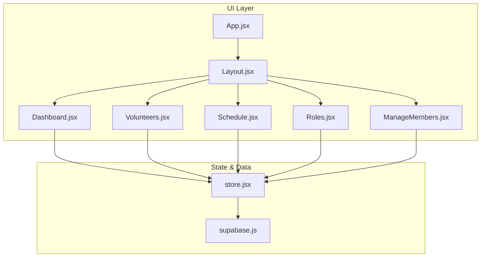
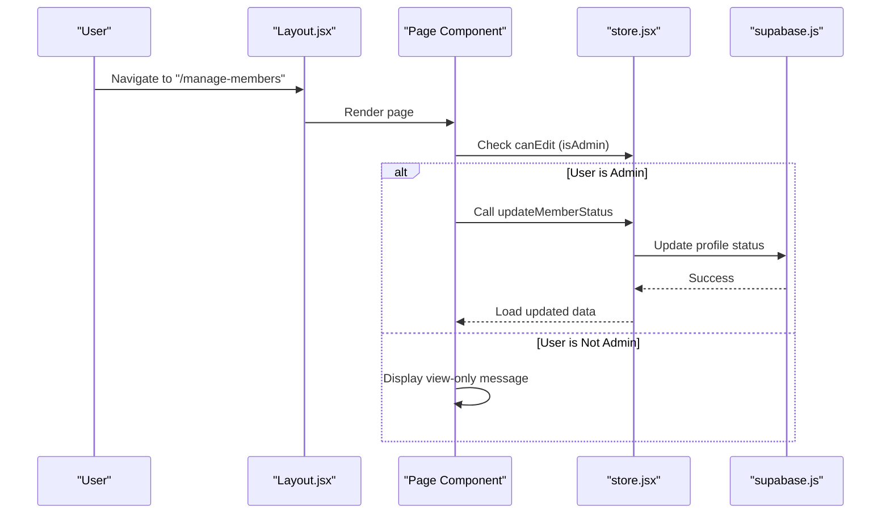
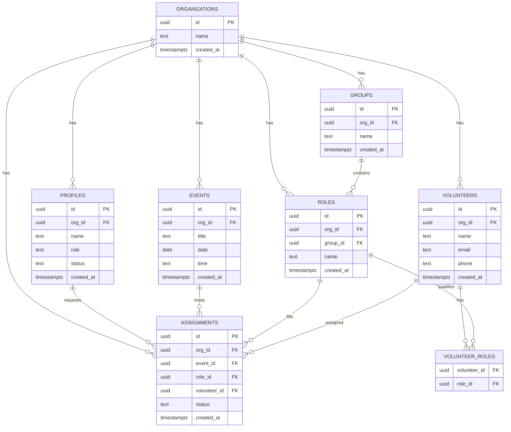
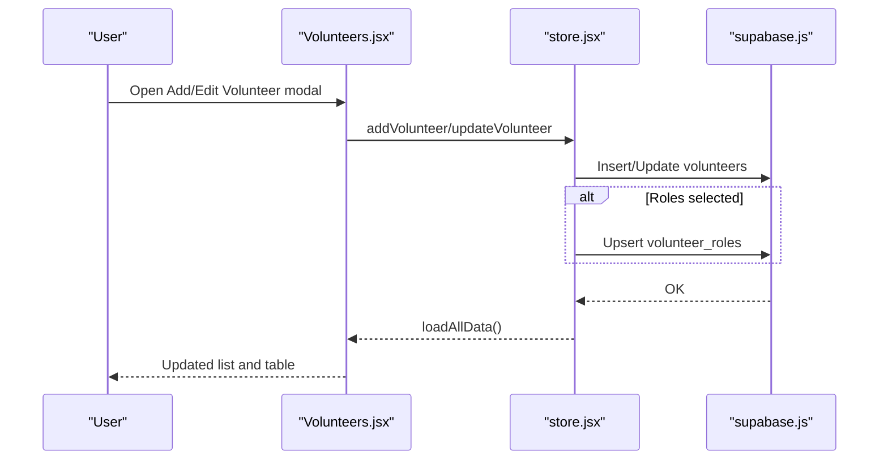
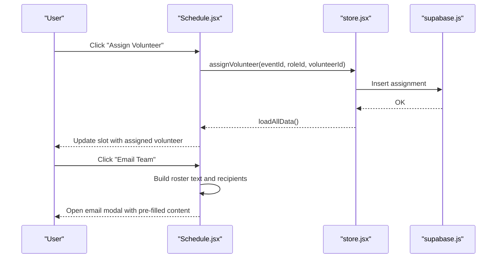
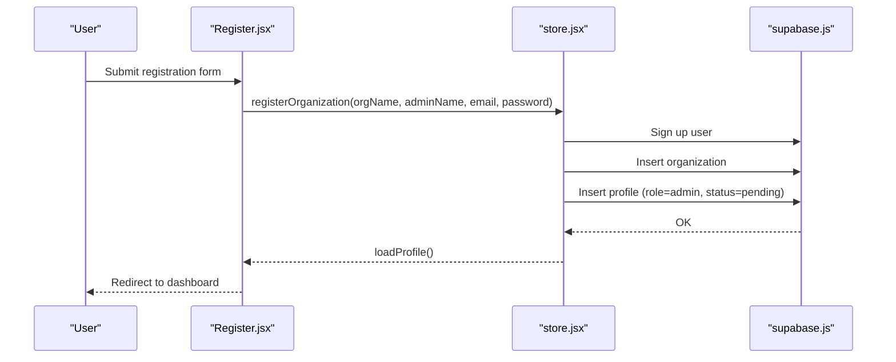
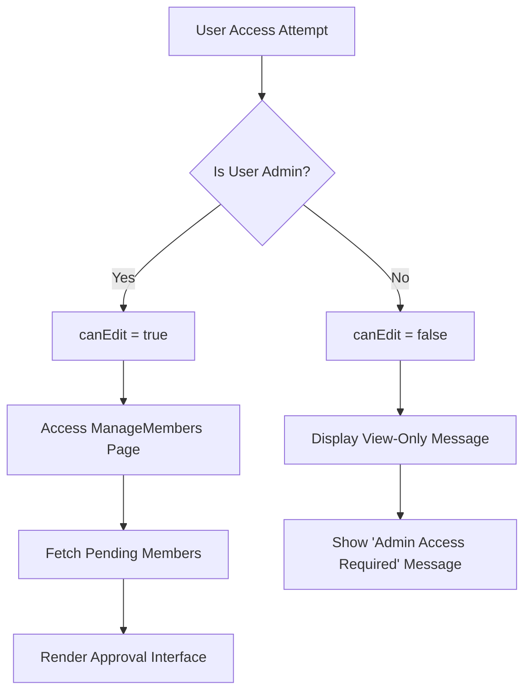
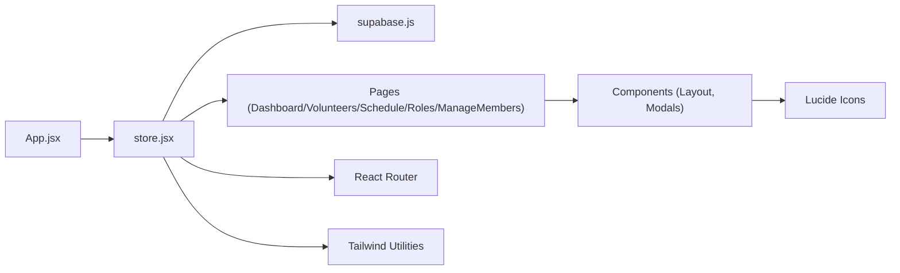

# Ministry Organization

<cite>
**Referenced Files in This Document**
- [README.md](file://README.md)
- [supabase-schema.sql](file://supabase-schema.sql)
- [supabase-role-policies.sql](file://supabase-role-policies.sql)
- [package.json](file://package.json)
- [src/App.jsx](file://src/App.jsx)
- [src/services/supabase.js](file://src/services/supabase.js)
- [src/services/store.jsx](file://src/services/store.jsx)
- [src/components/Layout.jsx](file://src/components/Layout.jsx)
- [src/pages/Dashboard.jsx](file://src/pages/Dashboard.jsx)
- [src/pages/Login.jsx](file://src/pages/Login.jsx)
- [src/pages/Register.jsx](file://src/pages/Register.jsx)
- [src/pages/Roles.jsx](file://src/pages/Roles.jsx)
- [src/pages/Volunteers.jsx](file://src/pages/Volunteers.jsx)
- [src/pages/Schedule.jsx](file://src/pages/Schedule.jsx)
- [src/pages/ManageMembers.jsx](file://src/pages/ManageMembers.jsx)
</cite>

## Update Summary
**Changes Made**
- Added role-based access control documentation for member management
- Updated permission mapping section to reflect admin-only member management
- Enhanced security architecture documentation with role-based access patterns
- Added new ManageMembers page documentation with access control implementation

## Table of Contents
1. [Introduction](#introduction)
2. [Project Structure](#project-structure)
3. [Core Components](#core-components)
4. [Architecture Overview](#architecture-overview)
5. [Detailed Component Analysis](#detailed-component-analysis)
6. [Role-Based Access Control](#role-based-access-control)
7. [Dependency Analysis](#dependency-analysis)
8. [Performance Considerations](#performance-considerations)
9. [Troubleshooting Guide](#troubleshooting-guide)
10. [Conclusion](#conclusion)
11. [Appendices](#appendices)

## Introduction
This document explains the Ministry Organization system implemented in the application. It covers how church organizations are structured around hierarchical groups (ministries/teams), roles (positions), volunteers, and events. It documents how areas and teams are configured, how roles map to skills and assignments, how scheduling integrates with volunteer management, and how permissions and data isolation are enforced. The system now implements comprehensive role-based access control where only administrators can manage team members, while other users receive view-only access. It also provides practical configuration scenarios for different church sizes and needs.

## Project Structure
The application is a React single-page app with routing and a centralized store that connects to Supabase for authentication and data persistence. Pages are organized by domain: dashboard, volunteers, schedule, roles, and member management. The store manages state for organizations, groups, roles, volunteers, events, assignments, and member profiles, and exposes CRUD functions for each entity. A new ManageMembers page specifically handles team member approval workflows with strict access controls.

**Diagram sources**
- [src/App.jsx:13-34](file://src/App.jsx#L13-L34)
- [src/components/Layout.jsx:14-101](file://src/components/Layout.jsx#L14-L101)
- [src/services/store.jsx:6-467](file://src/services/store.jsx#L6-L467)
- [src/services/supabase.js:1-13](file://src/services/supabase.js#L1-L13)
- [src/pages/ManageMembers.jsx:1-132](file://src/pages/ManageMembers.jsx#L1-L132)

**Section sources**
- [src/App.jsx:13-34](file://src/App.jsx#L13-L34)
- [src/components/Layout.jsx:14-101](file://src/components/Layout.jsx#L14-L101)
- [src/services/store.jsx:6-467](file://src/services/store.jsx#L6-L467)
- [src/services/supabase.js:1-13](file://src/services/supabase.js#L1-L13)
- [src/pages/ManageMembers.jsx:1-132](file://src/pages/ManageMembers.jsx#L1-L132)

## Core Components
- Organizations: Top-level tenant container with row-level security.
- Groups: Ministry teams or departments within an organization.
- Roles: Specific positions within groups (e.g., "Lead Vocalist", "Sound Tech").
- Volunteers: Individuals who serve, optionally linked to roles via a many-to-many relationship.
- Events: Scheduled services or gatherings.
- Assignments: Links between events, roles, and volunteers, with a status field.
- Profiles: User accounts with role-based access control including member approval workflows.

These entities are defined in the database schema and mirrored in the UI through the store and page components, with enhanced security through role-based access controls.

**Section sources**
- [supabase-schema.sql:7-86](file://supabase-schema.sql#L7-L86)
- [src/services/store.jsx:14-18](file://src/services/store.jsx#L14-L18)
- [src/pages/Roles.jsx:6-21](file://src/pages/Roles.jsx#L6-L21)
- [src/pages/Volunteers.jsx:7-13](file://src/pages/Volunteers.jsx#L7-L13)
- [src/pages/Schedule.jsx:7-33](file://src/pages/Schedule.jsx#L7-L33)
- [src/pages/ManageMembers.jsx:1-132](file://src/pages/ManageMembers.jsx#L1-L132)

## Architecture Overview
The system follows a client-state pattern with enhanced security:
- Authentication via Supabase Auth.
- Centralized store orchestrating reads/writes to Supabase tables with role-based access controls.
- UI pages render lists, forms, and modals for managing data with conditional access based on user roles.
- Row-level security policies enforce per-organization data isolation.
- Role-based access control restricts sensitive operations to administrators only.

**Diagram sources**
- [src/components/Layout.jsx:14-101](file://src/components/Layout.jsx#L14-L101)
- [src/pages/ManageMembers.jsx:6-24](file://src/pages/ManageMembers.jsx#L6-L24)
- [src/services/store.jsx:1214-1216](file://src/services/store.jsx#L1214-L1216)
- [src/services/supabase.js:1-13](file://src/services/supabase.js#L1-L13)

## Detailed Component Analysis

### Database Schema and Permissions
The schema defines core tables and enforces row-level security so that users can only access data belonging to their organization. Triggers and helper functions assist with automatic organization scoping. The profiles table now includes a status field for member approval workflows and role-based access control.

Key points:
- Organizations, groups, roles, volunteers, events, assignments are secured.
- Profiles include role and status fields for access control.
- Policies restrict visibility and modification to the user's organization.
- Helper function resolves the current user's organization ID.
- Triggers auto-fill org_id on insert for several tables.

**Diagram sources**
- [supabase-schema.sql:7-86](file://supabase-schema.sql#L7-L86)
- [supabase-schema.sql:14-22](file://supabase-schema.sql#L14-L22)
- [supabase-schema.sql:50-55](file://supabase-schema.sql#L50-L55)
- [supabase-schema.sql:67-76](file://supabase-schema.sql#L67-L76)

**Section sources**
- [supabase-schema.sql:7-86](file://supabase-schema.sql#L7-L86)
- [supabase-schema.sql:88-251](file://supabase-schema.sql#L88-L251)

### Roles and Groups Management
The Roles page organizes roles under teams (groups). It supports:
- Creating/editing teams (ministries/departments).
- Creating/editing roles within teams.
- Searching across roles and teams.
- Handling orphan roles (roles not assigned to a valid team).
- Conditional UI elements based on user role access.

**Diagram sources**
- [src/pages/Roles.jsx:6-21](file://src/pages/Roles.jsx#L6-L21)
- [src/pages/Roles.jsx:28-42](file://src/pages/Roles.jsx#L28-L42)
- [src/pages/Roles.jsx:113-215](file://src/pages/Roles.jsx#L113-L215)
- [src/pages/Roles.jsx:268-338](file://src/pages/Roles.jsx#L268-L338)
- [src/pages/Roles.jsx:340-382](file://src/pages/Roles.jsx#L340-L382)

**Section sources**
- [src/pages/Roles.jsx:6-21](file://src/pages/Roles.jsx#L6-L21)
- [src/pages/Roles.jsx:28-42](file://src/pages/Roles.jsx#L28-L42)
- [src/pages/Roles.jsx:113-215](file://src/pages/Roles.jsx#L113-L215)
- [src/pages/Roles.jsx:268-338](file://src/pages/Roles.jsx#L268-L338)
- [src/pages/Roles.jsx:340-382](file://src/pages/Roles.jsx#L340-L382)

### Volunteer Management and Skills
The Volunteers page allows:
- Adding/updating volunteers with contact info.
- Assigning qualified roles grouped by team.
- Bulk importing volunteers from CSV.
- Viewing assigned roles per volunteer.

**Diagram sources**
- [src/pages/Volunteers.jsx:7-13](file://src/pages/Volunteers.jsx#L7-L13)
- [src/pages/Volunteers.jsx:22-66](file://src/pages/Volunteers.jsx#L22-L66)
- [src/pages/Volunteers.jsx:247-350](file://src/pages/Volunteers.jsx#L247-L350)
- [src/services/store.jsx:161-242](file://src/services/store.jsx#L161-L242)
- [src/services/supabase.js:1-13](file://src/services/supabase.js#L1-L13)

**Section sources**
- [src/pages/Volunteers.jsx:7-13](file://src/pages/Volunteers.jsx#L7-L13)
- [src/pages/Volunteers.jsx:15-75](file://src/pages/Volunteers.jsx#L15-L75)
- [src/pages/Volunteers.jsx:247-350](file://src/pages/Volunteers.jsx#L247-L350)
- [src/services/store.jsx:161-242](file://src/services/store.jsx#L161-L242)

### Scheduling and Assignments
The Schedule page enables:
- Creating and editing events.
- Assigning volunteers to predefined roles for an event.
- Updating assignment metadata such as area and designated role.
- Generating shareable schedules and sending emails to assigned volunteers.
- Printing schedules.

**Diagram sources**
- [src/pages/Schedule.jsx:7-33](file://src/pages/Schedule.jsx#L7-L33)
- [src/pages/Schedule.jsx:37-49](file://src/pages/Schedule.jsx#L37-L49)
- [src/pages/Schedule.jsx:294-314](file://src/pages/Schedule.jsx#L294-L314)
- [src/pages/Schedule.jsx:62-95](file://src/pages/Schedule.jsx#L62-L95)
- [src/services/store.jsx:294-314](file://src/services/store.jsx#L294-L314)
- [src/services/supabase.js:1-13](file://src/services/supabase.js#L1-L13)

**Section sources**
- [src/pages/Schedule.jsx:7-33](file://src/pages/Schedule.jsx#L7-L33)
- [src/pages/Schedule.jsx:37-49](file://src/pages/Schedule.jsx#L37-L49)
- [src/pages/Schedule.jsx:62-95](file://src/pages/Schedule.jsx#L62-L95)
- [src/pages/Schedule.jsx:294-314](file://src/pages/Schedule.jsx#L294-L314)
- [src/services/store.jsx:294-314](file://src/services/store.jsx#L294-L314)

### Authentication and Authorization
- Registration creates a user, organization, and profile with admin role.
- Login uses Supabase Auth.
- The store loads the user session and profile, then fetches organization-scoped data.
- Navigation guards redirect unauthenticated users to landing.
- Role-based access control determines UI visibility and functionality.

**Diagram sources**
- [src/pages/Register.jsx:5-27](file://src/pages/Register.jsx#L5-L27)
- [src/services/store.jsx:126-159](file://src/services/store.jsx#L126-L159)
- [src/services/supabase.js:1-13](file://src/services/supabase.js#L1-L13)

**Section sources**
- [src/pages/Register.jsx:5-27](file://src/pages/Register.jsx#L5-L27)
- [src/pages/Login.jsx:5-25](file://src/pages/Login.jsx#L5-L25)
- [src/services/store.jsx:126-159](file://src/services/store.jsx#L126-L159)

## Role-Based Access Control

### Member Management Access Control
The system implements strict role-based access control for member management operations. Only administrators can approve or reject new team member requests, while other users receive view-only access.

Key features:
- Admin-only member approval workflow in ManageMembers page
- Conditional UI rendering based on canEdit flag
- Automatic redirection for non-admin users attempting to access member management
- Status-based member workflows with pending, approved, and rejected states

**Diagram sources**
- [src/pages/ManageMembers.jsx:9-24](file://src/pages/ManageMembers.jsx#L9-L24)
- [src/services/store.jsx:1214-1216](file://src/services/store.jsx#L1214-L1216)
- [src/components/Layout.jsx:18-19](file://src/components/Layout.jsx#L18-L19)

**Section sources**
- [src/pages/ManageMembers.jsx:6-24](file://src/pages/ManageMembers.jsx#L6-L24)
- [src/services/store.jsx:1214-1216](file://src/services/store.jsx#L1214-L1216)
- [src/components/Layout.jsx:18-19](file://src/components/Layout.jsx#L18-L19)

### Permission Mapping
The system uses a simple but effective role-based permission model:

- **Admin (admin)**: Full access to all organization data and management functions including member approvals, role management, and administrative settings.
- **Member (member)**: Limited access to organization data for volunteer scheduling and basic profile management.
- **Team Member (team_member)**: Similar to member role with additional team-specific permissions.

Access control implementation:
- `canEdit` flag equals `isAdmin` for determining write operations
- Navigation items conditionally rendered based on user role
- Member management page completely blocked for non-admin users
- Role-based UI elements (edit buttons, action menus) hidden for non-admin users

**Section sources**
- [src/services/store.jsx:1214-1216](file://src/services/store.jsx#L1214-L1216)
- [src/components/Layout.jsx:18-19](file://src/components/Layout.jsx#L18-L19)
- [src/pages/ManageMembers.jsx:9-24](file://src/pages/ManageMembers.jsx#L9-L24)

## Dependency Analysis
External libraries and integrations:
- Supabase client for authentication and database operations.
- React Router for navigation.
- Tailwind CSS utilities for styling.
- Lucide icons for UI.

**Diagram sources**
- [src/App.jsx:1-37](file://src/App.jsx#L1-L37)
- [src/services/store.jsx:1-472](file://src/services/store.jsx#L1-L472)
- [src/services/supabase.js:1-13](file://src/services/supabase.js#L1-L13)
- [package.json:15-39](file://package.json#L15-L39)

**Section sources**
- [package.json:15-39](file://package.json#L15-L39)
- [src/services/supabase.js:1-13](file://src/services/supabase.js#L1-L13)

## Performance Considerations
- Parallel data loading: The store fetches groups, roles, volunteers, events, assignments, and member profiles concurrently to minimize latency.
- Local state updates: After mutations, the store reloads data to keep the UI consistent.
- UI rendering: Grouping and filtering are client-side; for very large datasets, consider server-side pagination and virtualization.
- Access control checks: Role-based access control is performed locally in the store, minimizing server round trips for permission decisions.

Recommendations:
- Add server-side filters for volunteers and events.
- Implement debounced search for large lists.
- Lazy-load heavy modals and tables.
- Cache role-based UI state to avoid repeated permission calculations.

**Section sources**
- [src/services/store.jsx:82-111](file://src/services/store.jsx#L82-L111)
- [src/services/store.jsx:1214-1216](file://src/services/store.jsx#L1214-L1216)

## Troubleshooting Guide
Common issues and resolutions:
- Environment variables missing: If Supabase URL or anon key are not set, a warning is logged. Ensure .env contains the required keys.
- Authentication failures: Verify credentials and network connectivity; check browser console for errors.
- Data not visible: Confirm the user belongs to the correct organization; RLS policies restrict access to org-scoped data.
- CSV import errors: Ensure headers include "Name" and "Email"; verify file encoding and delimiter.
- Member management access denied: Non-admin users attempting to access member management will see a view-only message; ensure proper admin credentials are used.
- Status column errors: The system gracefully handles missing status columns in profiles table with fallback mechanisms.

**Section sources**
- [src/services/supabase.js:6-8](file://src/services/supabase.js#L6-L8)
- [src/services/store.jsx:48-52](file://src/services/store.jsx#L48-L52)
- [src/pages/Volunteers.jsx:77-121](file://src/pages/Volunteers.jsx#L77-L121)
- [src/pages/ManageMembers.jsx:39-45](file://src/pages/ManageMembers.jsx#L39-L45)

## Conclusion
The Ministry Organization system provides a clear, scalable foundation for managing church teams, roles, volunteers, and schedules. Its organization-per-tenant model, enforced by Supabase RLS, ensures data isolation and security. The enhanced role-based access control system now provides granular permissions where administrators have full management capabilities while other users maintain appropriate access levels. The Roles, Volunteers, Schedule, and ManageMembers pages offer intuitive workflows for configuration and daily operations, while the centralized store simplifies data access and mutation with robust security enforcement.

## Appendices

### Configuration Scenarios

- **Small Church (10–50 volunteers)**
  - Teams: Worship, Children's Ministry, Outreach
  - Roles: Worship Leader, Acoustic Guitar, Vocals, Sound, Projection, Kids Coordinators
  - Practices: Keep roles simple; use "Other" for ad-hoc roles; rely on CSV import for volunteers; implement basic member approval workflow.

- **Medium Church (50–200 volunteers)**
  - Teams: Worship, Children's Ministry, Youth, Music, Facilities, Marketing
  - Roles: Expand by instrument/skill; add "Area Lead" roles; track volunteer availability via roles.
  - Practices: Use area assignments and designated roles for clarity; email/share schedules regularly; implement member approval process for new volunteers.

- **Large Church (200+ volunteers)**
  - Teams: Multiple worship teams, Departments (Music, IT, Facilities), Ministries (Youth, Kids, Missions)
  - Roles: Specialized positions; cross-team roles; certifications or skill badges can be modeled as roles.
  - Practices: Integrate external tools for advanced scheduling; export/import for bulk updates; monitor fill rates per event; establish clear member approval workflows.

### Permission Mapping Notes
- Profiles include role and status fields with values "admin", "member", and "team_member".
- The store exposes user object with orgId and role-based access flags (isAdmin, isTeamMember, canEdit).
- Administrators have full access to all organization data and management functions.
- Members have limited access appropriate for volunteer coordination and scheduling.
- The ManageMembers page is completely restricted to administrators with clear view-only messaging for other users.
- Role-based UI elements (edit buttons, action menus) are conditionally rendered based on canEdit flag.

**Section sources**
- [supabase-schema.sql:14-21](file://supabase-schema.sql#L14-L21)
- [src/services/store.jsx:424-430](file://src/services/store.jsx#L424-L430)
- [src/services/store.jsx:1214-1216](file://src/services/store.jsx#L1214-L1216)
- [src/pages/ManageMembers.jsx:9-24](file://src/pages/ManageMembers.jsx#L9-L24)