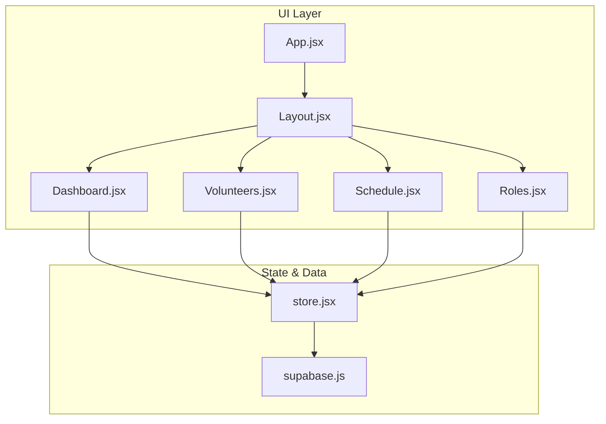
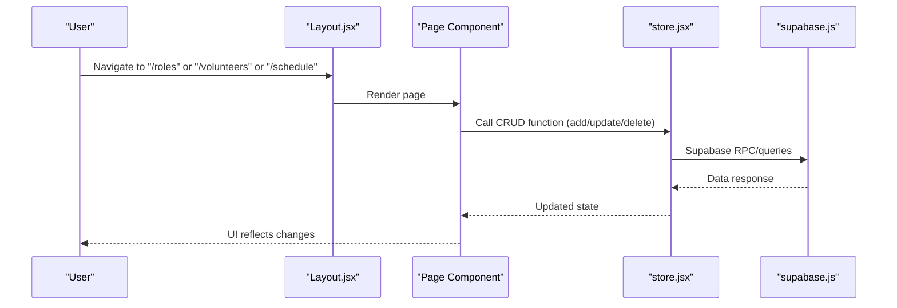
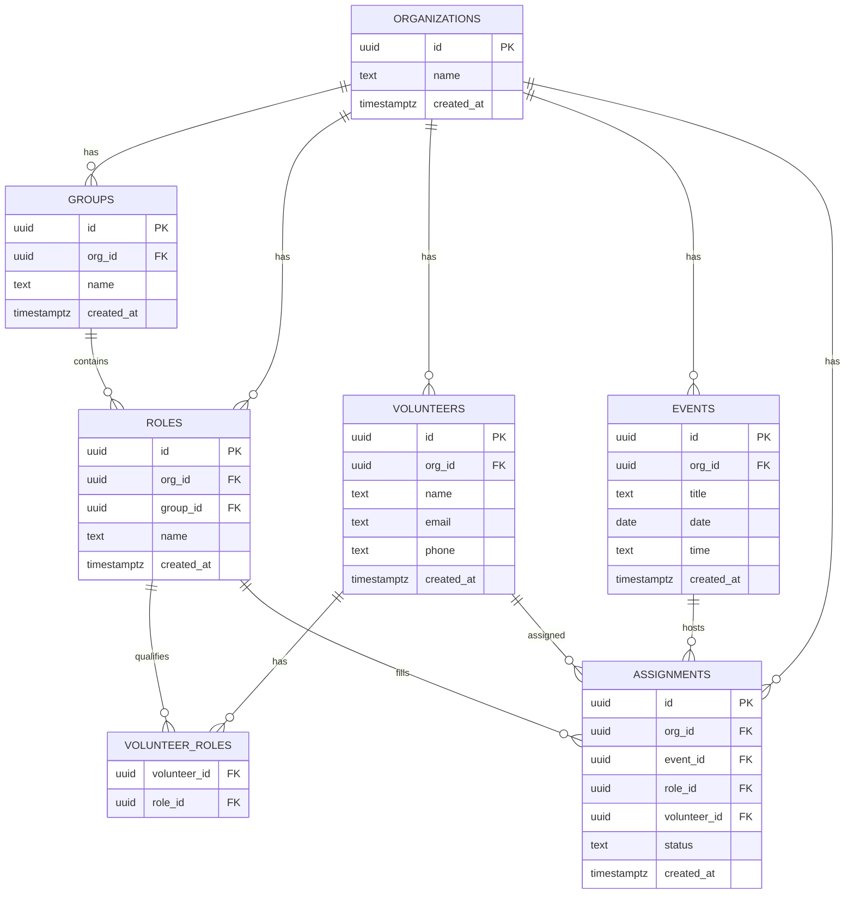
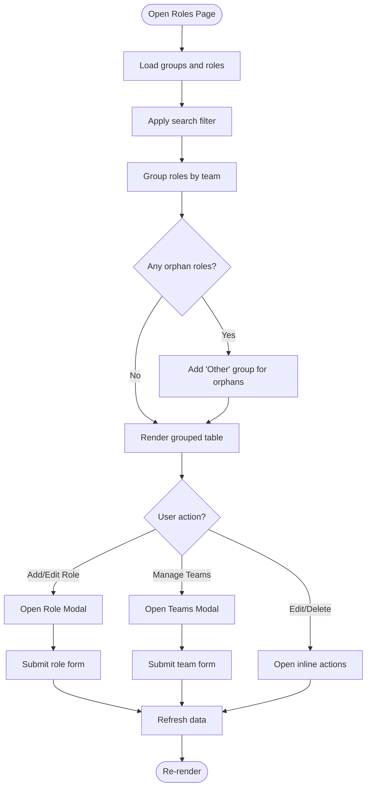
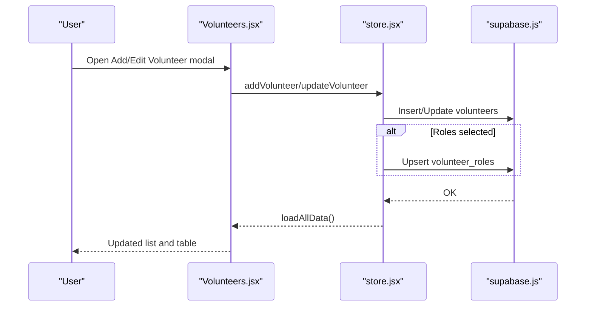
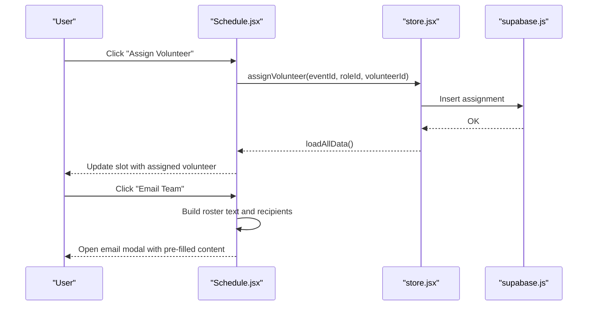
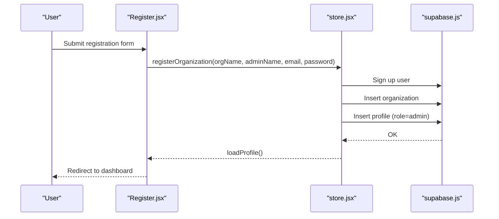
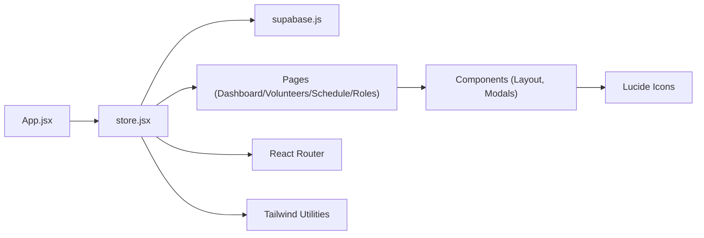

# Ministry Organization

<cite>
**Referenced Files in This Document**
- [README.md](file://README.md)
- [supabase-schema.sql](file://supabase-schema.sql)
- [package.json](file://package.json)
- [src/App.jsx](file://src/App.jsx)
- [src/services/supabase.js](file://src/services/supabase.js)
- [src/services/store.jsx](file://src/services/store.jsx)
- [src/components/Layout.jsx](file://src/components/Layout.jsx)
- [src/pages/Dashboard.jsx](file://src/pages/Dashboard.jsx)
- [src/pages/Login.jsx](file://src/pages/Login.jsx)
- [src/pages/Register.jsx](file://src/pages/Register.jsx)
- [src/pages/Roles.jsx](file://src/pages/Roles.jsx)
- [src/pages/Volunteers.jsx](file://src/pages/Volunteers.jsx)
- [src/pages/Schedule.jsx](file://src/pages/Schedule.jsx)
</cite>

## Table of Contents
1. [Introduction](#introduction)
2. [Project Structure](#project-structure)
3. [Core Components](#core-components)
4. [Architecture Overview](#architecture-overview)
5. [Detailed Component Analysis](#detailed-component-analysis)
6. [Dependency Analysis](#dependency-analysis)
7. [Performance Considerations](#performance-considerations)
8. [Troubleshooting Guide](#troubleshooting-guide)
9. [Conclusion](#conclusion)
10. [Appendices](#appendices)

## Introduction
This document explains the Ministry Organization system implemented in the application. It covers how church organizations are structured around hierarchical groups (ministries/teams), roles (positions), volunteers, and events. It documents how areas and teams are configured, how roles map to skills and assignments, how scheduling integrates with volunteer management, and how permissions and data isolation are enforced. It also provides practical configuration scenarios for different church sizes and needs.

## Project Structure
The application is a React single-page app with routing and a centralized store that connects to Supabase for authentication and data persistence. Pages are organized by domain: dashboard, volunteers, schedule, and roles. The store manages state for organizations, groups, roles, volunteers, events, and assignments, and exposes CRUD functions for each entity.

**Diagram sources**
- [src/App.jsx](file://src/App.jsx#L13-L34)
- [src/components/Layout.jsx](file://src/components/Layout.jsx#L14-L101)
- [src/services/store.jsx](file://src/services/store.jsx#L6-L467)
- [src/services/supabase.js](file://src/services/supabase.js#L1-L13)

**Section sources**
- [src/App.jsx](file://src/App.jsx#L13-L34)
- [src/components/Layout.jsx](file://src/components/Layout.jsx#L14-L101)
- [src/services/store.jsx](file://src/services/store.jsx#L6-L467)
- [src/services/supabase.js](file://src/services/supabase.js#L1-L13)

## Core Components
- Organizations: Top-level tenant container with row-level security.
- Groups: Ministry teams or departments within an organization.
- Roles: Specific positions within groups (e.g., “Lead Vocalist”, “Sound Tech”).
- Volunteers: Individuals who serve, optionally linked to roles via a many-to-many relationship.
- Events: Scheduled services or gatherings.
- Assignments: Links between events, roles, and volunteers, with a status field.

These entities are defined in the database schema and mirrored in the UI through the store and page components.

**Section sources**
- [supabase-schema.sql](file://supabase-schema.sql#L7-L86)
- [src/services/store.jsx](file://src/services/store.jsx#L14-L18)
- [src/pages/Roles.jsx](file://src/pages/Roles.jsx#L6-L21)
- [src/pages/Volunteers.jsx](file://src/pages/Volunteers.jsx#L7-L13)
- [src/pages/Schedule.jsx](file://src/pages/Schedule.jsx#L7-L33)

## Architecture Overview
The system follows a client-state pattern:
- Authentication via Supabase Auth.
- Centralized store orchestrating reads/writes to Supabase tables.
- UI pages render lists, forms, and modals for managing data.
- Row-level security policies enforce per-organization data isolation.

**Diagram sources**
- [src/components/Layout.jsx](file://src/components/Layout.jsx#L14-L101)
- [src/pages/Roles.jsx](file://src/pages/Roles.jsx#L6-L21)
- [src/pages/Volunteers.jsx](file://src/pages/Volunteers.jsx#L7-L13)
- [src/pages/Schedule.jsx](file://src/pages/Schedule.jsx#L7-L33)
- [src/services/store.jsx](file://src/services/store.jsx#L331-L375)
- [src/services/supabase.js](file://src/services/supabase.js#L1-L13)

## Detailed Component Analysis

### Database Schema and Permissions
The schema defines core tables and enforces row-level security so that users can only access data belonging to their organization. Triggers and helper functions assist with automatic organization scoping.

Key points:
- Organizations, groups, roles, volunteers, events, assignments are secured.
- Policies restrict visibility and modification to the user’s organization.
- Helper function resolves the current user’s organization ID.
- Triggers auto-fill org_id on insert for several tables.

**Diagram sources**
- [supabase-schema.sql](file://supabase-schema.sql#L7-L86)
- [supabase-schema.sql](file://supabase-schema.sql#L50-L55)
- [supabase-schema.sql](file://supabase-schema.sql#L67-L76)

**Section sources**
- [supabase-schema.sql](file://supabase-schema.sql#L7-L86)
- [supabase-schema.sql](file://supabase-schema.sql#L88-L251)

### Roles and Groups Management
The Roles page organizes roles under teams (groups). It supports:
- Creating/editing teams (ministries/departments).
- Creating/editing roles within teams.
- Searching across roles and teams.
- Handling orphan roles (roles not assigned to a valid team).

**Diagram sources**
- [src/pages/Roles.jsx](file://src/pages/Roles.jsx#L6-L21)
- [src/pages/Roles.jsx](file://src/pages/Roles.jsx#L28-L42)
- [src/pages/Roles.jsx](file://src/pages/Roles.jsx#L113-L215)
- [src/pages/Roles.jsx](file://src/pages/Roles.jsx#L268-L338)
- [src/pages/Roles.jsx](file://src/pages/Roles.jsx#L340-L382)

**Section sources**
- [src/pages/Roles.jsx](file://src/pages/Roles.jsx#L6-L21)
- [src/pages/Roles.jsx](file://src/pages/Roles.jsx#L28-L42)
- [src/pages/Roles.jsx](file://src/pages/Roles.jsx#L113-L215)
- [src/pages/Roles.jsx](file://src/pages/Roles.jsx#L268-L338)
- [src/pages/Roles.jsx](file://src/pages/Roles.jsx#L340-L382)

### Volunteer Management and Skills
The Volunteers page allows:
- Adding/updating volunteers with contact info.
- Assigning qualified roles grouped by team.
- Bulk importing volunteers from CSV.
- Viewing assigned roles per volunteer.

**Diagram sources**
- [src/pages/Volunteers.jsx](file://src/pages/Volunteers.jsx#L7-L13)
- [src/pages/Volunteers.jsx](file://src/pages/Volunteers.jsx#L22-L66)
- [src/pages/Volunteers.jsx](file://src/pages/Volunteers.jsx#L247-L350)
- [src/services/store.jsx](file://src/services/store.jsx#L161-L242)
- [src/services/supabase.js](file://src/services/supabase.js#L1-L13)

**Section sources**
- [src/pages/Volunteers.jsx](file://src/pages/Volunteers.jsx#L7-L13)
- [src/pages/Volunteers.jsx](file://src/pages/Volunteers.jsx#L15-L75)
- [src/pages/Volunteers.jsx](file://src/pages/Volunteers.jsx#L247-L350)
- [src/services/store.jsx](file://src/services/store.jsx#L161-L242)

### Scheduling and Assignments
The Schedule page enables:
- Creating and editing events.
- Assigning volunteers to predefined roles for an event.
- Updating assignment metadata such as area and designated role.
- Generating shareable schedules and sending emails to assigned volunteers.
- Printing schedules.

**Diagram sources**
- [src/pages/Schedule.jsx](file://src/pages/Schedule.jsx#L7-L33)
- [src/pages/Schedule.jsx](file://src/pages/Schedule.jsx#L37-L49)
- [src/pages/Schedule.jsx](file://src/pages/Schedule.jsx#L294-L314)
- [src/pages/Schedule.jsx](file://src/pages/Schedule.jsx#L62-L95)
- [src/services/store.jsx](file://src/services/store.jsx#L294-L314)
- [src/services/supabase.js](file://src/services/supabase.js#L1-L13)

**Section sources**
- [src/pages/Schedule.jsx](file://src/pages/Schedule.jsx#L7-L33)
- [src/pages/Schedule.jsx](file://src/pages/Schedule.jsx#L37-L49)
- [src/pages/Schedule.jsx](file://src/pages/Schedule.jsx#L62-L95)
- [src/pages/Schedule.jsx](file://src/pages/Schedule.jsx#L294-L314)
- [src/services/store.jsx](file://src/services/store.jsx#L294-L314)

### Authentication and Authorization
- Registration creates a user, organization, and profile with admin role.
- Login uses Supabase Auth.
- The store loads the user session and profile, then fetches organization-scoped data.
- Navigation guards redirect unauthenticated users to landing.

**Diagram sources**
- [src/pages/Register.jsx](file://src/pages/Register.jsx#L5-L27)
- [src/services/store.jsx](file://src/services/store.jsx#L126-L159)
- [src/services/supabase.js](file://src/services/supabase.js#L1-L13)

**Section sources**
- [src/pages/Register.jsx](file://src/pages/Register.jsx#L5-L27)
- [src/pages/Login.jsx](file://src/pages/Login.jsx#L5-L25)
- [src/services/store.jsx](file://src/services/store.jsx#L126-L159)

## Dependency Analysis
External libraries and integrations:
- Supabase client for authentication and database operations.
- React Router for navigation.
- Tailwind CSS utilities for styling.
- Lucide icons for UI.

**Diagram sources**
- [src/App.jsx](file://src/App.jsx#L1-L37)
- [src/services/store.jsx](file://src/services/store.jsx#L1-L472)
- [src/services/supabase.js](file://src/services/supabase.js#L1-L13)
- [package.json](file://package.json#L15-L39)

**Section sources**
- [package.json](file://package.json#L15-L39)
- [src/services/supabase.js](file://src/services/supabase.js#L1-L13)

## Performance Considerations
- Parallel data loading: The store fetches groups, roles, volunteers, events, and assignments concurrently to minimize latency.
- Local state updates: After mutations, the store reloads data to keep the UI consistent.
- UI rendering: Grouping and filtering are client-side; for very large datasets, consider server-side pagination and virtualization.

Recommendations:
- Add server-side filters for volunteers and events.
- Implement debounced search for large lists.
- Lazy-load heavy modals and tables.

**Section sources**
- [src/services/store.jsx](file://src/services/store.jsx#L82-L111)

## Troubleshooting Guide
Common issues and resolutions:
- Environment variables missing: If Supabase URL or anon key are not set, a warning is logged. Ensure .env contains the required keys.
- Authentication failures: Verify credentials and network connectivity; check browser console for errors.
- Data not visible: Confirm the user belongs to the correct organization; RLS policies restrict access to org-scoped data.
- CSV import errors: Ensure headers include “Name” and “Email”; verify file encoding and delimiter.

**Section sources**
- [src/services/supabase.js](file://src/services/supabase.js#L6-L8)
- [src/services/store.jsx](file://src/services/store.jsx#L48-L52)
- [src/pages/Volunteers.jsx](file://src/pages/Volunteers.jsx#L77-L121)

## Conclusion
The Ministry Organization system provides a clear, scalable foundation for managing church teams, roles, volunteers, and schedules. Its organization-per-tenant model, enforced by Supabase RLS, ensures data isolation and security. The Roles, Volunteers, and Schedule pages offer intuitive workflows for configuration and daily operations, while the centralized store simplifies data access and mutation.

## Appendices

### Configuration Scenarios

- Small Church (10–50 volunteers)
  - Teams: Worship, Children’s Ministry, Outreach
  - Roles: Worship Leader, Acoustic Guitar, Vocals, Sound, Projection, Kids Coordinators
  - Practices: Keep roles simple; use “Other” for ad-hoc roles; rely on CSV import for volunteers.

- Medium Church (50–200 volunteers)
  - Teams: Worship, Children’s Ministry, Youth, Music, Facilities, Marketing
  - Roles: Expand by instrument/skill; add “Area Lead” roles; track volunteer availability via roles.
  - Practices: Use area assignments and designated roles for clarity; email/share schedules regularly.

- Large Church (200+ volunteers)
  - Teams: Multiple worship teams, Departments (Music, IT, Facilities), Ministries (Youth, Kids, Missions)
  - Roles: Specialized positions; cross-team roles; certifications or skill badges can be modeled as roles.
  - Practices: Integrate external tools for advanced scheduling; export/import for bulk updates; monitor fill rates per event.

### Permission Mapping Notes
- Profiles include a role field with values “admin” and “member”. The store exposes a user object with orgId for UI decisions. While the schema defines a role field, the current UI does not expose role-based access controls beyond admin/member distinction. Administrators can manage all organization data due to RLS and UI flows.

**Section sources**
- [supabase-schema.sql](file://supabase-schema.sql#L14-L21)
- [src/services/store.jsx](file://src/services/store.jsx#L424-L430)