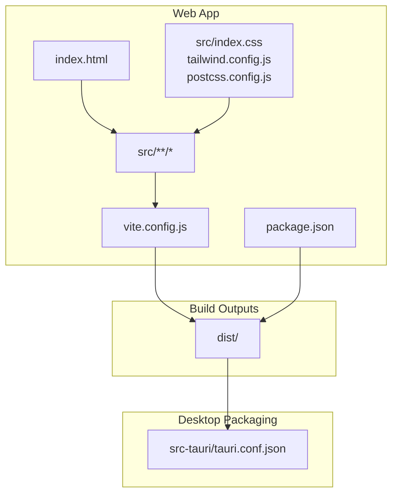
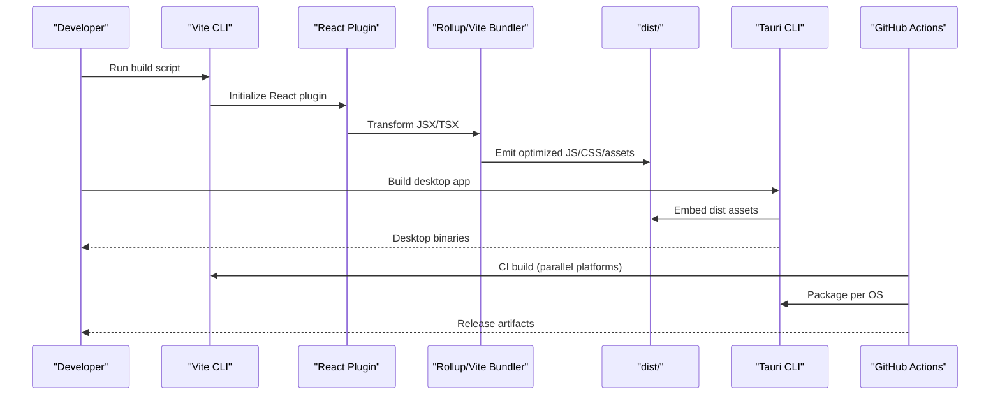
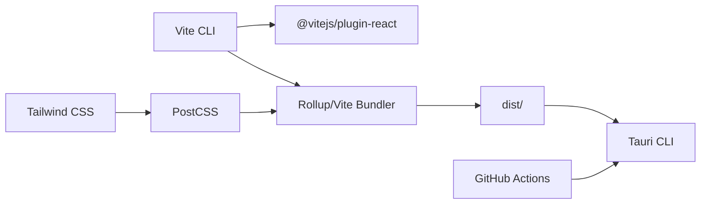

# Build Process & Asset Optimization

<cite>
**Referenced Files in This Document**
- [vite.config.js](file://vite.config.js)
- [package.json](file://package.json)
- [postcss.config.js](file://postcss.config.js)
- [tailwind.config.js](file://tailwind.config.js)
- [src-tauri/tauri.conf.json](file://src-tauri/tauri.conf.json)
- [index.html](file://index.html)
- [.github/workflows/release.yml](file://.github/workflows/release.yml)
- [eslint.config.js](file://eslint.config.js)
- [.env.example](file://.env.example)
- [src/main.jsx](file://src/main.jsx)
- [src/App.jsx](file://src/App.jsx)
- [ELECTRON_BUILD.md](file://ELECTRON_BUILD.md)
</cite>

## Table of Contents
1. [Introduction](#introduction)
2. [Project Structure](#project-structure)
3. [Core Components](#core-components)
4. [Architecture Overview](#architecture-overview)
5. [Detailed Component Analysis](#detailed-component-analysis)
6. [Dependency Analysis](#dependency-analysis)
7. [Performance Considerations](#performance-considerations)
8. [Troubleshooting Guide](#troubleshooting-guide)
9. [Conclusion](#conclusion)
10. [Appendices](#appendices)

## Introduction
This document explains the build process and asset optimization strategies for the project. It covers Vite configuration for production builds, code splitting, and bundle optimization; asset optimization techniques such as CSS minification and JavaScript bundling; deployment pipeline configuration and environment-specific optimizations; cache optimization strategies, CDN integration, and asset delivery best practices; build performance optimization, parallel processing, and incremental builds; and troubleshooting guidance for build failures and optimization bottlenecks.

## Project Structure
The project uses Vite for the web application build and Tauri for desktop packaging. The React application is bundled and served via Vite, while Tauri consumes the built output from the dist directory. Tailwind CSS and PostCSS are configured for styling, and GitHub Actions orchestrates cross-platform releases.

**Diagram sources**
- [vite.config.js](file://vite.config.js#L1-L10)
- [package.json](file://package.json#L1-L44)
- [index.html](file://index.html#L1-L14)
- [tailwind.config.js](file://tailwind.config.js#L1-L51)
- [postcss.config.js](file://postcss.config.js#L1-L7)
- [src-tauri/tauri.conf.json](file://src-tauri/tauri.conf.json#L1-L35)

**Section sources**
- [vite.config.js](file://vite.config.js#L1-L10)
- [package.json](file://package.json#L1-L44)
- [index.html](file://index.html#L1-L14)
- [tailwind.config.js](file://tailwind.config.js#L1-L51)
- [postcss.config.js](file://postcss.config.js#L1-L7)
- [src-tauri/tauri.conf.json](file://src-tauri/tauri.conf.json#L1-L35)

## Core Components
- Vite configuration defines the plugin stack and base path for assets.
- Tailwind CSS and PostCSS configure CSS generation and autoprefixing.
- Tauri consumes the built dist output for desktop distribution.
- GitHub Actions automates multi-platform releases using Tauri’s action.
- Environment variables enable environment-specific configurations.

**Section sources**
- [vite.config.js](file://vite.config.js#L1-L10)
- [tailwind.config.js](file://tailwind.config.js#L1-L51)
- [postcss.config.js](file://postcss.config.js#L1-L7)
- [src-tauri/tauri.conf.json](file://src-tauri/tauri.conf.json#L1-L35)
- [.github/workflows/release.yml](file://.github/workflows/release.yml#L1-L49)
- [.env.example](file://.env.example#L1-L5)

## Architecture Overview
The build pipeline transforms source code into optimized assets, then packages them for distribution. The Vite build produces the web app dist artifacts, which Tauri embeds into desktop binaries. GitHub Actions coordinates cross-platform builds.

**Diagram sources**
- [package.json](file://package.json#L7-L13)
- [vite.config.js](file://vite.config.js#L5-L8)
- [src-tauri/tauri.conf.json](file://src-tauri/tauri.conf.json#L6-L9)
- [.github/workflows/release.yml](file://.github/workflows/release.yml#L8-L49)

## Detailed Component Analysis

### Vite Configuration and Production Build
- Plugin stack: React plugin enables JSX/TSX transformations.
- Base path: Relative base ensures assets resolve correctly when hosted under subpaths.
- Scripts: Standard dev, build, preview commands are defined for local and preview workflows.

Optimization opportunities:
- Add explicit output configuration for deterministic chunking and asset hashing.
- Enable CSS extraction and minification via Vite’s CSS options.
- Configure dynamic import code splitting for route-level lazy loading.
- Integrate compression plugins for production builds.

**Section sources**
- [vite.config.js](file://vite.config.js#L1-L10)
- [package.json](file://package.json#L7-L13)

### CSS Pipeline: Tailwind and PostCSS
- Tailwind content scanning targets HTML and source directories to purge unused styles.
- PostCSS applies Tailwind directives and autoprefixing for vendor support.
- Theme customization defines color palettes used across components.

Asset optimization:
- Keep purgeable content globs minimal to avoid unintended style removal.
- Use Tailwind’s JIT mode for faster rebuilds during development.
- Minify CSS in production using Vite’s CSS options.

**Section sources**
- [tailwind.config.js](file://tailwind.config.js#L1-L51)
- [postcss.config.js](file://postcss.config.js#L1-L7)

### JavaScript Bundling and Code Splitting
- Current routing uses static imports; consider dynamic imports for route-level lazy loading to reduce initial bundle size.
- React plugin integrates with Vite’s module resolution and transformation pipeline.

Optimization strategies:
- Split vendor and application chunks.
- Use dynamic imports for heavy routes or modals.
- Enable tree-shaking by avoiding side-effectful imports and using pure ES modules.

**Section sources**
- [src/App.jsx](file://src/App.jsx#L1-L37)
- [src/main.jsx](file://src/main.jsx#L1-L11)
- [vite.config.js](file://vite.config.js#L1-L10)

### Desktop Packaging with Tauri
- Tauri configuration specifies the frontend dist directory and dev URL.
- Icons and bundling targets are defined for multi-format distribution.

Integration with build:
- Ensure the build script emits to the dist directory referenced by Tauri.
- Validate that asset paths remain relative for packaged apps.

**Section sources**
- [src-tauri/tauri.conf.json](file://src-tauri/tauri.conf.json#L6-L9)
- [package.json](file://package.json#L10-L11)

### Deployment Pipeline and Multi-Platform Releases
- GitHub Actions job matrix builds for macOS, Ubuntu, and Windows.
- Node and Rust toolchains are set up; platform-specific dependencies are installed for Linux.
- Tauri action handles artifact creation with versioned tag replacement.

Environment-specific optimizations:
- Use environment variables for service URLs and keys.
- Separate CI builds per platform to leverage native toolchains.

**Section sources**
- [.github/workflows/release.yml](file://.github/workflows/release.yml#L1-L49)
- [.env.example](file://.env.example#L1-L5)

### Asset Delivery Best Practices
- Serve assets from the dist directory after Vite build.
- Use relative base paths to ensure assets resolve under subpath hosting.
- For CDN distribution, switch base to absolute CDN URL and configure cache headers accordingly.

**Section sources**
- [vite.config.js](file://vite.config.js#L7-L8)
- [src-tauri/tauri.conf.json](file://src-tauri/tauri.conf.json#L7-L8)

### Legacy Electron Build Notes
- Electron build instructions and scripts are documented separately; they build the React app to dist and package with Electron.

**Section sources**
- [ELECTRON_BUILD.md](file://ELECTRON_BUILD.md#L1-L41)

## Dependency Analysis
The build depends on Vite, React plugin, Tailwind CSS, and PostCSS. Tauri consumes the built output. GitHub Actions coordinates multi-platform builds.

**Diagram sources**
- [vite.config.js](file://vite.config.js#L1-L10)
- [postcss.config.js](file://postcss.config.js#L1-L7)
- [tailwind.config.js](file://tailwind.config.js#L1-L51)
- [package.json](file://package.json#L25-L38)
- [src-tauri/tauri.conf.json](file://src-tauri/tauri.conf.json#L6-L9)
- [.github/workflows/release.yml](file://.github/workflows/release.yml#L8-L49)

**Section sources**
- [vite.config.js](file://vite.config.js#L1-L10)
- [package.json](file://package.json#L25-L38)
- [postcss.config.js](file://postcss.config.js#L1-L7)
- [tailwind.config.js](file://tailwind.config.js#L1-L51)
- [src-tauri/tauri.conf.json](file://src-tauri/tauri.conf.json#L6-L9)
- [.github/workflows/release.yml](file://.github/workflows/release.yml#L8-L49)

## Performance Considerations
- Parallelization: GitHub Actions matrix builds run concurrently across platforms.
- Incremental builds: Vite’s dev server leverages fast refresh and module federation patterns; consider enabling React fast refresh in development.
- Bundle size: Implement route-level code splitting and remove unused CSS via Tailwind’s content configuration.
- Asset caching: Use long-lived cache headers for hashed filenames; ensure CDN cache invalidation policies are aligned with versioned assets.
- Compression: Enable gzip or brotli compression at the server level; integrate Vite compression plugins for production builds.

[No sources needed since this section provides general guidance]

## Troubleshooting Guide
Common build issues and resolutions:
- Missing dist directory after build: Verify the build script emits to the dist directory referenced by Tauri.
- Asset path errors under subpath hosting: Confirm the base path setting and relative asset references.
- CSS not applied or purged incorrectly: Review Tailwind content globs and ensure all template paths are included.
- Platform-specific build failures: Install required system dependencies for Linux and ensure Rust toolchain is available.
- Environment variable not applied: Ensure variables are prefixed appropriately for the framework and loaded at runtime.

**Section sources**
- [vite.config.js](file://vite.config.js#L7-L8)
- [tailwind.config.js](file://tailwind.config.js#L3-L5)
- [.github/workflows/release.yml](file://.github/workflows/release.yml#L29-L35)
- [.env.example](file://.env.example#L1-L5)

## Conclusion
The project’s build pipeline centers on Vite for web bundling, Tailwind/PostCSS for styling, and Tauri for desktop packaging. To optimize performance, adopt route-level code splitting, enable CSS extraction and minification, and leverage parallel CI builds. Align asset delivery with CDN best practices and robust caching strategies for production deployments.

[No sources needed since this section summarizes without analyzing specific files]

## Appendices
- Environment variables: Configure service URLs and keys using the provided example pattern.
- Scripts reference: Use the defined scripts for development, preview, and build tasks.

**Section sources**
- [.env.example](file://.env.example#L1-L5)
- [package.json](file://package.json#L7-L13)