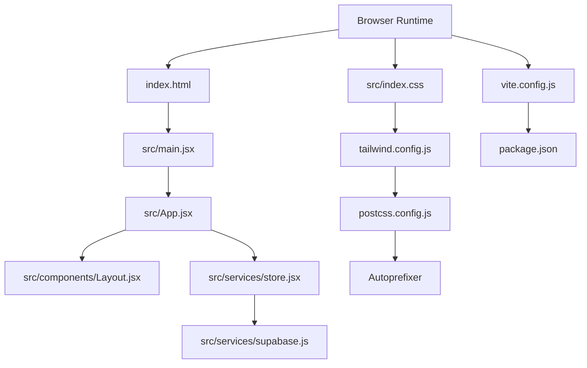
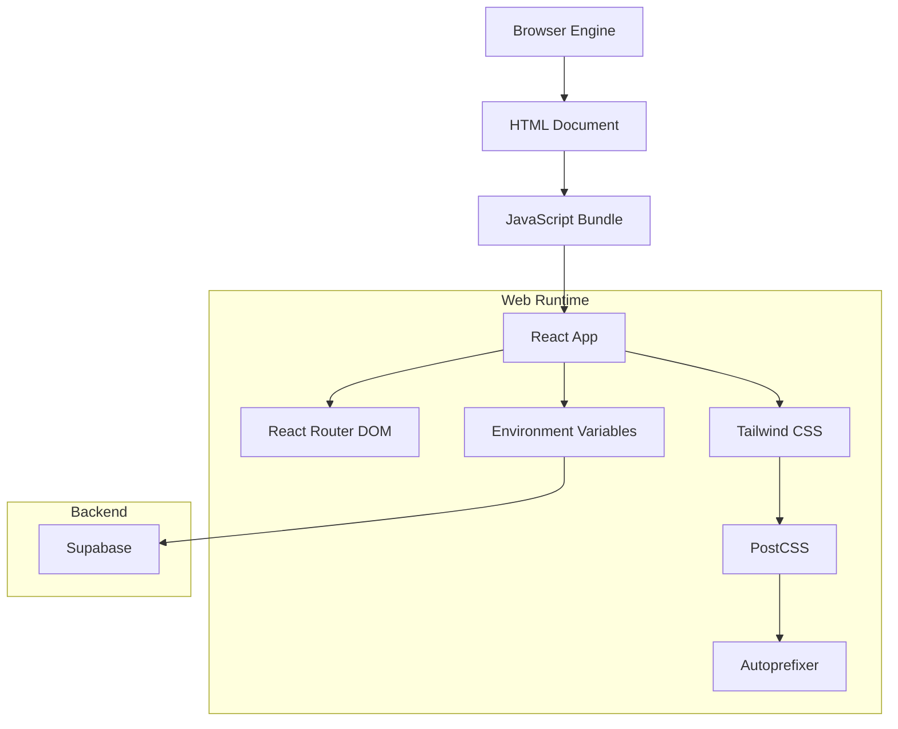
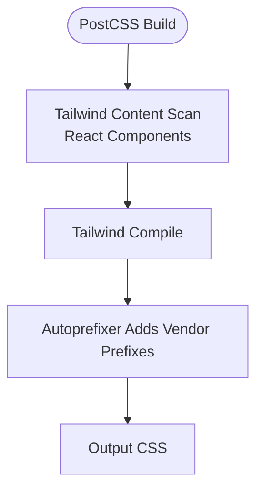
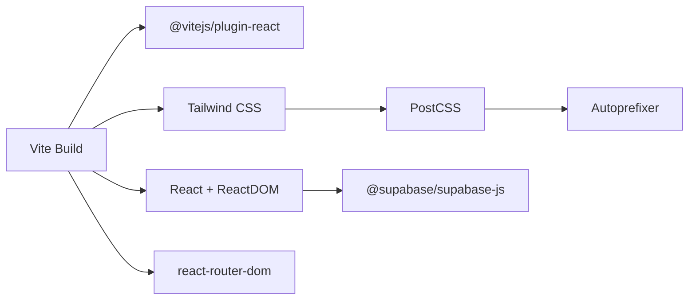

# Cross-Browser Compatibility Testing

<cite>
**Referenced Files in This Document**
- [package.json](file://package.json)
- [vite.config.js](file://vite.config.js)
- [tailwind.config.js](file://tailwind.config.js)
- [postcss.config.js](file://postcss.config.js)
- [src/index.css](file://src/index.css)
- [src/main.jsx](file://src/main.jsx)
- [src/App.jsx](file://src/App.jsx)
- [index.html](file://index.html)
- [src/utils/cn.js](file://src/utils/cn.js)
- [src/components/Layout.jsx](file://src/components/Layout.jsx)
- [src/services/store.jsx](file://src/services/store.jsx)
- [src/services/supabase.js](file://src/services/supabase.js)
- [src-tauri/tauri.conf.json](file://src-tauri/tauri.conf.json)
</cite>

## Table of Contents
1. [Introduction](#introduction)
2. [Project Structure](#project-structure)
3. [Core Components](#core-components)
4. [Architecture Overview](#architecture-overview)
5. [Detailed Component Analysis](#detailed-component-analysis)
6. [Dependency Analysis](#dependency-analysis)
7. [Performance Considerations](#performance-considerations)
8. [Troubleshooting Guide](#troubleshooting-guide)
9. [Conclusion](#conclusion)
10. [Appendices](#appendices)

## Introduction
This document provides comprehensive guidance for cross-browser compatibility testing and validation strategies tailored to the current project. It covers the browser support matrix implied by the stack, polyfill and transpilation requirements, CSS vendor prefixing, feature detection patterns, testing procedures for major browsers (Chrome, Firefox, Safari, Edge), and mobile browsers. It also outlines automated testing and continuous integration strategies, common compatibility issues, and practical guidelines for progressive enhancement and graceful degradation.

## Project Structure
The application is a modern React single-page application built with Vite, styled via Tailwind CSS and PostCSS with Autoprefixer. Supabase provides backend services, and Tauri is configured for desktop bundling. The structure supports straightforward compatibility testing because:
- Build tooling (Vite + React plugin) targets modern browsers by default.
- CSS is processed through Tailwind and Autoprefixer, which automatically adds vendor prefixes for widely supported features.
- Environment variables are used for Supabase configuration, enabling runtime checks for missing configuration.

**Diagram sources**
- [index.html](file://index.html#L1-L14)
- [src/main.jsx](file://src/main.jsx#L1-L11)
- [src/App.jsx](file://src/App.jsx#L1-L37)
- [src/components/Layout.jsx](file://src/components/Layout.jsx#L1-L108)
- [src/services/store.jsx](file://src/services/store.jsx#L1-L472)
- [src/services/supabase.js](file://src/services/supabase.js#L1-L13)
- [src/index.css](file://src/index.css#L1-L10)
- [tailwind.config.js](file://tailwind.config.js#L1-L51)
- [postcss.config.js](file://postcss.config.js#L1-L7)
- [vite.config.js](file://vite.config.js#L1-L10)
- [package.json](file://package.json#L1-L44)

**Section sources**
- [package.json](file://package.json#L1-L44)
- [vite.config.js](file://vite.config.js#L1-L10)
- [tailwind.config.js](file://tailwind.config.js#L1-L51)
- [postcss.config.js](file://postcss.config.js#L1-L7)
- [src/index.css](file://src/index.css#L1-L10)
- [src/main.jsx](file://src/main.jsx#L1-L11)
- [src/App.jsx](file://src/App.jsx#L1-L37)
- [index.html](file://index.html#L1-L14)

## Core Components
- Build and Transpilation: Vite with the React plugin builds the app for modern browsers. No explicit Babel configuration is present, so Vite’s default transform pipeline applies. This implies targeting modern JavaScript features commonly supported by recent Chrome, Firefox, Safari, and Edge versions.
- CSS Toolchain: Tailwind CSS with Autoprefixer ensures vendor-prefixed properties for widely supported features. The content scanning pattern includes JSX/TSX files, aligning with React components.
- Routing and Navigation: React Router DOM is used for client-side routing, which is compatible across modern browsers.
- State Management: A custom React context provider manages application state and integrates with Supabase for authentication and data operations.
- Backend Integration: Supabase client is initialized with environment variables, enabling runtime checks for missing credentials.

**Section sources**
- [package.json](file://package.json#L1-L44)
- [vite.config.js](file://vite.config.js#L1-L10)
- [tailwind.config.js](file://tailwind.config.js#L1-L51)
- [postcss.config.js](file://postcss.config.js#L1-L7)
- [src/index.css](file://src/index.css#L1-L10)
- [src/App.jsx](file://src/App.jsx#L1-L37)
- [src/services/store.jsx](file://src/services/store.jsx#L1-L472)
- [src/services/supabase.js](file://src/services/supabase.js#L1-L13)

## Architecture Overview
The runtime architecture relies on a web-based stack with a clear separation between presentation (React), styling (Tailwind + PostCSS), and data (Supabase). Desktop bundling is handled by Tauri, but compatibility testing primarily focuses on web browsers.

**Diagram sources**
- [src/App.jsx](file://src/App.jsx#L1-L37)
- [src/index.css](file://src/index.css#L1-L10)
- [tailwind.config.js](file://tailwind.config.js#L1-L51)
- [postcss.config.js](file://postcss.config.js#L1-L7)
- [src/services/supabase.js](file://src/services/supabase.js#L1-L13)
- [index.html](file://index.html#L1-L14)

## Detailed Component Analysis

### Browser Support Matrix and Feature Coverage
- Modern browsers: Chrome, Firefox, Safari, Edge (desktop) and their mobile counterparts generally support the JavaScript and CSS features used in this project.
- Key features in use:
  - React with hooks and JSX.
  - Tailwind utility classes and CSS Grid/Flexbox.
  - Environment variables for Supabase configuration.
  - Client-side routing with React Router DOM.
- Vendor prefixes: Automatically generated by Autoprefixer via PostCSS for widely supported CSS features.

Recommendations:
- Define a minimum browser matrix aligned with your deployment targets (e.g., last 2 versions of major browsers).
- Use feature detection for advanced APIs rather than relying solely on browser versions.

**Section sources**
- [package.json](file://package.json#L1-L44)
- [tailwind.config.js](file://tailwind.config.js#L1-L51)
- [postcss.config.js](file://postcss.config.js#L1-L7)
- [src/index.css](file://src/index.css#L1-L10)

### Polyfills and Transpilation
- Current setup: Vite’s default React plugin targets modern browsers. There is no explicit Babel configuration in the repository.
- Guidance:
  - If you need to support older browsers, introduce a modernizing preset (e.g., a recommended preset) and configure Vite accordingly.
  - Keep polyfills minimal and scoped to features that cannot be transpiled away.

**Section sources**
- [vite.config.js](file://vite.config.js#L1-L10)
- [package.json](file://package.json#L1-L44)

### CSS Vendor Prefixes and PostCSS Pipeline
- Tailwind CSS is configured to scan React components.
- Autoprefixer is enabled via PostCSS to add vendor prefixes for widely supported CSS features.
- Ensure that any custom CSS follows Tailwind utility classes to leverage automatic vendor prefixing.

**Diagram sources**
- [tailwind.config.js](file://tailwind.config.js#L1-L51)
- [postcss.config.js](file://postcss.config.js#L1-L7)
- [src/index.css](file://src/index.css#L1-L10)

**Section sources**
- [tailwind.config.js](file://tailwind.config.js#L1-L51)
- [postcss.config.js](file://postcss.config.js#L1-L7)
- [src/index.css](file://src/index.css#L1-L10)

### JavaScript Transpilation and Module System
- The project uses ES modules and React with JSX. Vite handles transpilation and bundling.
- For broader compatibility, consider:
  - Adding a modernizing preset for Vite if older browsers are required.
  - Ensuring dynamic imports and modern APIs are either transpiled or feature-detected.

**Section sources**
- [package.json](file://package.json#L1-L44)
- [vite.config.js](file://vite.config.js#L1-L10)

### Feature Detection Patterns
- Supabase initialization includes a runtime warning when environment variables are missing. This is a form of feature detection for configuration availability.
- Recommended additions:
  - Detect browser APIs (e.g., Web Crypto, Fetch, URL pattern) and apply fallbacks or polyfills conditionally.
  - Use capability checks for CSS Grid/Flexbox and degrade gracefully where necessary.

**Section sources**
- [src/services/supabase.js](file://src/services/supabase.js#L1-L13)

### Testing Procedures Across Browsers
- Desktop browsers:
  - Chrome: Use DevTools for responsive testing and Lighthouse audits.
  - Firefox: Validate rendering differences and accessibility.
  - Safari: Check Flexbox/Grid behavior and CSS custom properties.
  - Edge: Confirm parity with Chrome and test compatibility mode scenarios.
- Mobile browsers:
  - Test responsive breakpoints and touch interactions.
  - Validate viewport meta tag behavior and pinch-to-zoom.
- Automated testing:
  - Integrate browser automation (e.g., Playwright or Cypress) in CI to run tests against Chrome, Firefox, and Safari.
  - Use headless modes for speed and reproducibility.
- Continuous Integration:
  - Configure matrix builds to run tests across major browsers.
  - Cache dependencies and build artifacts to optimize CI performance.

[No sources needed since this section provides general guidance]

### Progressive Enhancement and Graceful Degradation
- Progressive enhancement:
  - Start with semantic HTML and core functionality.
  - Enhance with Tailwind utilities and modern CSS features.
  - Layer in React components and animations progressively.
- Graceful degradation:
  - Provide fallbacks for unsupported CSS features (e.g., Grid with Flexbox).
  - Use feature detection for JavaScript APIs and supply polyfills only when needed.

[No sources needed since this section provides general guidance]

## Dependency Analysis
The application’s compatibility depends on the interplay between Vite, Tailwind, PostCSS/Autoprefixer, and Supabase. The following diagram highlights key dependencies and their roles in ensuring cross-browser compatibility.

**Diagram sources**
- [package.json](file://package.json#L1-L44)
- [vite.config.js](file://vite.config.js#L1-L10)
- [tailwind.config.js](file://tailwind.config.js#L1-L51)
- [postcss.config.js](file://postcss.config.js#L1-L7)
- [src/services/supabase.js](file://src/services/supabase.js#L1-L13)
- [src/App.jsx](file://src/App.jsx#L1-L37)

**Section sources**
- [package.json](file://package.json#L1-L44)
- [vite.config.js](file://vite.config.js#L1-L10)
- [tailwind.config.js](file://tailwind.config.js#L1-L51)
- [postcss.config.js](file://postcss.config.js#L1-L7)
- [src/services/supabase.js](file://src/services/supabase.js#L1-L13)
- [src/App.jsx](file://src/App.jsx#L1-L37)

## Performance Considerations
- Minimize CSS and JavaScript payloads by leveraging Tailwind’s utility-first approach and tree-shaking via Vite.
- Use responsive images and defer non-critical resources.
- Monitor Largest Contentful Paint (LCP) and First Input Delay (FID) across browsers.

[No sources needed since this section provides general guidance]

## Troubleshooting Guide
Common compatibility issues and solutions:
- Missing environment variables for Supabase:
  - Symptom: Console warnings during initialization.
  - Solution: Ensure environment variables are set in the runtime environment and validated early.
- CSS rendering inconsistencies:
  - Symptom: Differences in layout across browsers.
  - Solution: Prefer Tailwind utilities and avoid vendor-prefixed CSS manually; rely on Autoprefixer.
- JavaScript errors in older browsers:
  - Symptom: Syntax or API errors.
  - Solution: Introduce a modernizing preset for Vite or feature detection with polyfills.
- Responsive layout problems:
  - Symptom: Breakage on mobile devices.
  - Solution: Verify viewport meta tag and test responsive breakpoints.

**Section sources**
- [src/services/supabase.js](file://src/services/supabase.js#L1-L13)
- [src/index.css](file://src/index.css#L1-L10)
- [index.html](file://index.html#L1-L14)

## Conclusion
The project’s modern toolchain (Vite, React, Tailwind, PostCSS/Autoprefixer) provides a solid foundation for cross-browser compatibility. By establishing a clear browser support matrix, augmenting with feature detection, and integrating automated browser testing in CI, you can ensure consistent experiences across Chrome, Firefox, Safari, Edge, and mobile browsers. Apply progressive enhancement and graceful degradation strategies to maintain robustness while embracing modern web standards.

[No sources needed since this section summarizes without analyzing specific files]

## Appendices

### Browser Support Matrix Example
- Chrome: Latest 2 versions
- Firefox: Latest 2 versions
- Safari: Latest 2 versions
- Edge: Latest 2 versions
- Mobile Chrome and Safari: Latest 2 versions

[No sources needed since this section provides general guidance]

### Automated Testing and CI Checklist
- Define a browser matrix in CI.
- Run headless tests on Chrome, Firefox, and Safari.
- Cache npm dependencies and Vite build artifacts.
- Report test results and coverage.

[No sources needed since this section provides general guidance]