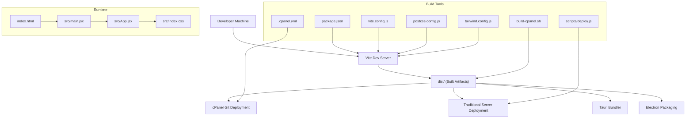
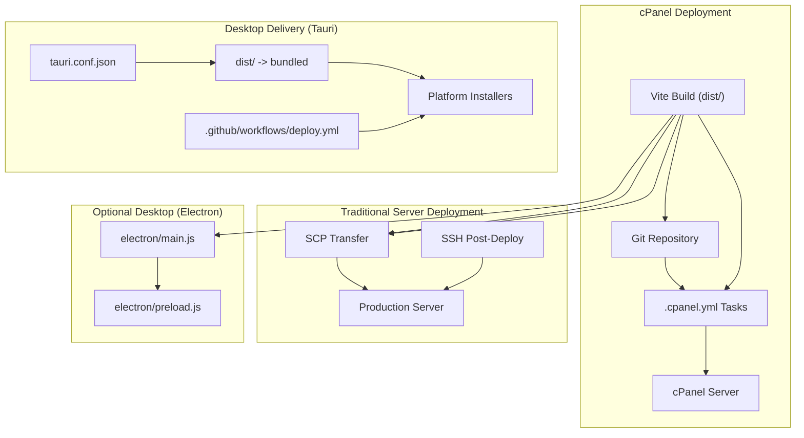
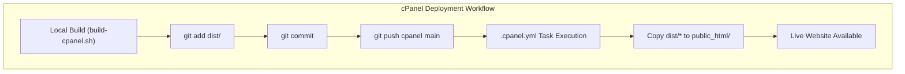
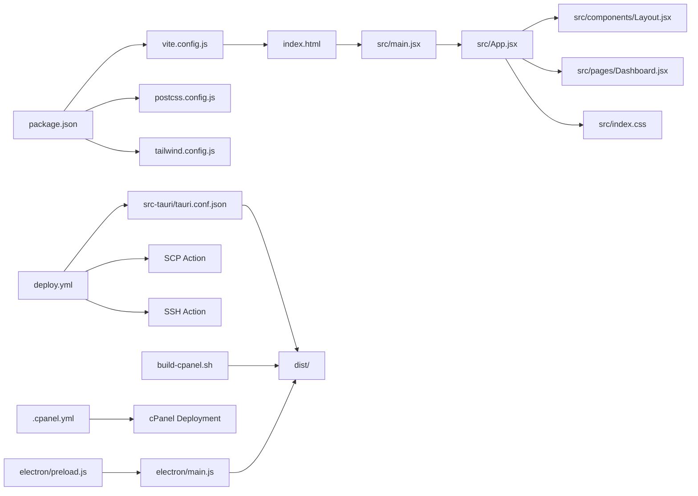

# Mobile & Web Deployment

<cite>
**Referenced Files in This Document**
- [package.json](file://package.json)
- [vite.config.js](file://vite.config.js)
- [index.html](file://index.html)
- [tailwind.config.js](file://tailwind.config.js)
- [postcss.config.js](file://postcss.config.js)
- [src/main.jsx](file://src/main.jsx)
- [src/App.jsx](file://src/App.jsx)
- [src/index.css](file://src/index.css)
- [src/components/Layout.jsx](file://src/components/Layout.jsx)
- [src/pages/Dashboard.jsx](file://src/pages/Dashboard.jsx)
- [src-tauri/tauri.conf.json](file://src-tauri/tauri.conf.json)
- [.github/workflows/deploy.yml](file://.github/workflows/deploy.yml)
- [scripts/deploy.js](file://scripts/deploy.js)
- [CPANEL_DEPLOYMENT.md](file://CPANEL_DEPLOYMENT.md)
- [build-cpanel.sh](file://build-cpanel.sh)
- [.cpanel.yml](file://.cpanel.yml)
- [DEPLOYMENT.md](file://DEPLOYMENT.md)
- [ELECTRON_BUILD.md](file://ELECTRON_BUILD.md)
- [electron/main.js](file://electron/main.js)
- [electron/preload.js](file://electron/preload.js)
</cite>

## Update Summary
**Changes Made**
- Updated deployment architecture to reflect cPanel Git-based deployment system
- Added comprehensive cPanel deployment guide and automated build process
- Replaced GitHub Pages deployment with Git-based cPanel deployment workflow
- Enhanced development tooling with new build scripts and deployment automation
- Updated deployment pipeline documentation to include both cPanel and traditional server deployment options

## Table of Contents
1. [Introduction](#introduction)
2. [Project Structure](#project-structure)
3. [Core Components](#core-components)
4. [Architecture Overview](#architecture-overview)
5. [Detailed Component Analysis](#detailed-component-analysis)
6. [Dependency Analysis](#dependency-analysis)
7. [Performance Considerations](#performance-considerations)
8. [Troubleshooting Guide](#troubleshooting-guide)
9. [Conclusion](#conclusion)
10. [Appendices](#appendices)

## Introduction
This document explains how to deploy the application as a modern web app and as native desktop apps, with a focus on Progressive Web App readiness, mobile responsiveness, cross-browser compatibility, build and asset optimization, CDN integration, and deployment pipelines. The project now supports both cPanel Git-based deployment and traditional server deployment methods, with comprehensive automated build processes and enhanced development tooling.

## Project Structure
The project is a React application built with Vite and styled with Tailwind CSS. It supports multiple deployment strategies:
- Web deployment via Vite build and static hosting (cPanel Git-based or traditional servers)
- Desktop packaging via Tauri (multi-target bundling)
- Optional Electron packaging for desktop distribution
- Automated deployment through GitHub Actions workflows

Key build and runtime entry points:
- Frontend build and dev server: Vite configuration and scripts
- Application bootstrap: React root and routing
- Styling: Tailwind CSS with PostCSS autoprefixing
- Desktop packaging: Tauri configuration and deployment automation
- cPanel deployment: Git-based deployment with automated build scripts

**Diagram sources**
- [vite.config.js:1-19](file://vite.config.js#L1-L19)
- [package.json:1-46](file://package.json#L1-L46)
- [postcss.config.js:1-7](file://postcss.config.js#L1-L7)
- [tailwind.config.js:1-27](file://tailwind.config.js#L1-L27)
- [index.html:1-14](file://index.html#L1-L14)
- [src/main.jsx:1-11](file://src/main.jsx#L1-L11)
- [src/App.jsx:1-37](file://src/App.jsx#L1-L37)
- [src/index.css:1-10](file://src/index.css#L1-L10)
- [build-cpanel.sh:1-23](file://build-cpanel.sh#L1-L23)
- [scripts/deploy.js:1-56](file://scripts/deploy.js#L1-L56)
- [.cpanel.yml:1-6](file://.cpanel.yml#L1-L6)

**Section sources**
- [package.json:1-46](file://package.json#L1-L46)
- [vite.config.js:1-19](file://vite.config.js#L1-L19)
- [index.html:1-14](file://index.html#L1-L14)
- [tailwind.config.js:1-27](file://tailwind.config.js#L1-L27)
- [postcss.config.js:1-7](file://postcss.config.js#L1-L7)
- [src/main.jsx:1-11](file://src/main.jsx#L1-L11)
- [src/App.jsx:1-37](file://src/App.jsx#L1-L37)
- [src/index.css:1-10](file://src/index.css#L1-L10)
- [build-cpanel.sh:1-23](file://build-cpanel.sh#L1-L23)
- [scripts/deploy.js:1-56](file://scripts/deploy.js#L1-L56)
- [.cpanel.yml:1-6](file://.cpanel.yml#L1-L6)

## Core Components
- Build and Scripts
  - Scripts for dev, build, preview, and Tauri/Electron builds are defined in the package manifest
  - Base path for assets is set to relative ("./") to support hosting under subpaths
  - New cPanel build script automates the entire build and preparation process
  - Deployment script handles both cPanel and traditional server deployment scenarios
- Routing and Layout
  - React Router routes define public and protected areas
  - A responsive layout adapts navigation and content areas for different screens
- Styling and Responsiveness
  - Tailwind CSS provides utility-first responsive classes
  - A base layer sets global styles and applies responsive breakpoints
- Desktop Packaging
  - Tauri configuration defines window sizing, CSP, bundling targets, and icons
  - GitHub Actions workflow automates multi-platform releases
- cPanel Deployment System
  - Git-based deployment with automated build and transfer process
  - YAML configuration for deployment tasks and file copying
  - Support for both automatic push and manual pull deployment methods

**Section sources**
- [package.json:7-15](file://package.json#L7-L15)
- [vite.config.js:6-12](file://vite.config.js#L6-L12)
- [src/App.jsx:1-37](file://src/App.jsx#L1-L37)
- [src/components/Layout.jsx:1-102](file://src/components/Layout.jsx#L1-L102)
- [src/index.css:1-10](file://src/index.css#L1-L10)
- [tailwind.config.js:1-27](file://tailwind.config.js#L1-L27)
- [src-tauri/tauri.conf.json:1-35](file://src-tauri/tauri.conf.json#L1-L35)
- [.github/workflows/deploy.yml:1-60](file://.github/workflows/deploy.yml#L1-L60)
- [build-cpanel.sh:1-23](file://build-cpanel.sh#L1-L23)
- [scripts/deploy.js:1-56](file://scripts/deploy.js#L1-L56)
- [.cpanel.yml:1-6](file://.cpanel.yml#L1-L6)

## Architecture Overview
The deployment architecture now supports multiple deployment strategies:
- cPanel Git-based deployment: Automated build and transfer via Git workflow
- Traditional server deployment: Direct SCP transfer with post-deployment automation
- Desktop delivery: Tauri bundles the web assets into native installers per platform
- Optional Electron packaging: Alternative desktop packaging with a preload bridge

**Diagram sources**
- [vite.config.js:1-19](file://vite.config.js#L1-L19)
- [.cpanel.yml:1-6](file://.cpanel.yml#L1-L6)
- [.github/workflows/deploy.yml:1-60](file://.github/workflows/deploy.yml#L1-L60)
- [electron/main.js:1-46](file://electron/main.js#L1-L46)
- [electron/preload.js:1-7](file://electron/preload.js#L1-L7)

## Detailed Component Analysis

### Progressive Web App (PWA) Configuration
Current state:
- No service worker is registered in the application shell
- No manifest file is present in the repository

Recommendations:
- Add a web app manifest to define app metadata, icons, and display mode
- Register a service worker to enable offline caching and background sync
- Configure cache strategies for static assets and API responses
- Ensure HTTPS delivery for service worker registration and secure features

Implementation outline:
- Create a manifest file and link it from the HTML head
- Implement a build step to inject manifest and generate icons
- Register a service worker during app initialization
- Use a caching strategy such as Stale-While-Revalidate for dynamic content and Cache First for static assets

### Mobile Responsiveness Features
Current state:
- Responsive layout uses Tailwind's breakpoint utilities and flex/grid classes
- Navigation adapts with conditional rendering and responsive spacing
- Dashboard cards scale across small to large screens

Evidence:
- Layout uses responsive widths and stacking behavior for sidebar and header
- Dashboard grid adjusts columns across breakpoints
- Header content hides on smaller screens using responsive display utilities

**Section sources**
- [src/components/Layout.jsx:33-99](file://src/components/Layout.jsx#L33-L99)
- [src/pages/Dashboard.jsx:46-86](file://src/pages/Dashboard.jsx#L46-L86)

### Cross-Browser Compatibility Testing and Optimization
Current state:
- Tailwind CSS and PostCSS are configured for autoprefixing
- No explicit browserlist or polyfill configuration is present

Recommendations:
- Define a browserlist in package.json or a dedicated config to match supported browsers
- Add core-js and regenerator-runtime polyfills if targeting older environments
- Test on major mobile and desktop browsers using automated or manual testing strategies
- Validate CSS Grid and Flexbox fallbacks where necessary

**Section sources**
- [postcss.config.js:1-7](file://postcss.config.js#L1-L7)
- [tailwind.config.js:1-27](file://tailwind.config.js#L1-L27)

### Build Process for Web Deployment
Current state:
- Vite builds static assets into dist/
- Base path is set to "." for relative asset resolution
- Tailwind scans HTML and components for unused CSS
- New cPanel build script automates the complete build and preparation process

Evidence:
- Vite plugin chain includes React and base path configuration
- Tailwind content globs include index and component paths
- Build script handles dependency installation, building, and CNAME file copying

**Section sources**
- [vite.config.js:1-19](file://vite.config.js#L1-L19)
- [tailwind.config.js:3-6](file://tailwind.config.js#L3-L6)
- [build-cpanel.sh:1-23](file://build-cpanel.sh#L1-L23)

### Asset Optimization and CDN Integration
Current state:
- No explicit asset optimization or CDN configuration is present

Recommendations:
- Enable Vite's built-in minification and asset hashing
- Integrate a CDN to serve dist/ assets with caching headers
- Use image optimization and compression (e.g., AVIF/WebP) via Vite plugins
- Set long-lived caching for immutable assets and short-lived caching for HTML

**Section sources**
- [vite.config.js:1-19](file://vite.config.js#L1-L19)

### Mobile App Manifest Configuration and Installation
Current state:
- No manifest file is included in the repository

Recommendations:
- Create a manifest file with application name, short_name, icons, start_url, display, background_color, and theme_color
- Link the manifest in index.html
- For Tauri desktop, the manifest is not required; however, for PWA installation on mobile browsers, a manifest is essential
- Ensure HTTPS and a service worker for install prompts and offline behavior

**Section sources**
- [index.html:1-14](file://index.html#L1-L14)

### Performance Optimization Techniques
Current state:
- No explicit code splitting or lazy loading is implemented
- No caching strategies are configured

Recommendations:
- Use React.lazy and Suspense for route-level code splitting
- Split vendor and application chunks via Vite configuration
- Implement service worker caching strategies and HTTP cache headers
- Optimize images and fonts; defer non-critical resources

Evidence:
- Routes are defined statically; introducing lazy-loaded routes would improve initial load
- Tailwind utilities are used extensively; consider purging unused styles

**Section sources**
- [src/App.jsx:1-37](file://src/App.jsx#L1-L37)
- [tailwind.config.js:1-27](file://tailwind.config.js#L1-L27)

### Responsive Design Implementation and Mobile-Specific UI Adaptations
Current state:
- Responsive breakpoints are applied via Tailwind utilities
- Navigation items adapt to active states and reduced space
- Dashboard cards stack and resize across breakpoints

Evidence:
- Layout uses responsive widths and conditional visibility
- Dashboard grid uses responsive column counts

**Section sources**
- [src/components/Layout.jsx:33-99](file://src/components/Layout.jsx#L33-L99)
- [src/pages/Dashboard.jsx:46-86](file://src/pages/Dashboard.jsx#L46-L86)

### Testing Procedures for Devices and Screen Sizes
Current state:
- No device or browser testing configuration is present

Recommendations:
- Use browser developer tools to simulate various devices and orientations
- Automate testing with Playwright or Cypress against real browsers
- Validate critical flows on common mobile screen sizes (e.g., iPhone SE, Galaxy S5, iPad)
- Test navigation, form inputs, and touch interactions

**Section sources**
- [src/components/Layout.jsx:1-102](file://src/components/Layout.jsx#L1-L102)
- [src/pages/Dashboard.jsx:1-90](file://src/pages/Dashboard.jsx#L1-L90)

### cPanel Deployment Pipeline for Web Hosting
**Updated** Added comprehensive cPanel Git-based deployment system with automated build process

The project now supports cPanel Git-based deployment as the primary web deployment method:

- **Automated Build Process**: The `build-cpanel.sh` script handles complete build automation including dependency installation, compilation, and CNAME file preparation
- **Git-Based Deployment**: Uses cPanel's Git Version Control to automatically deploy changes via `.cpanel.yml` configuration
- **Flexible Deployment Methods**: Supports both automatic push deployment and manual pull deployment
- **File Structure Management**: Automatically copies built files to the correct cPanel public_html directory

**Diagram sources**
- [build-cpanel.sh:1-23](file://build-cpanel.sh#L1-L23)
- [CPANEL_DEPLOYMENT.md:15-41](file://CPANEL_DEPLOYMENT.md#L15-L41)
- [.cpanel.yml:1-6](file://.cpanel.yml#L1-L6)

**Section sources**
- [build-cpanel.sh:1-23](file://build-cpanel.sh#L1-L23)
- [CPANEL_DEPLOYMENT.md:1-306](file://CPANEL_DEPLOYMENT.md#L1-L306)
- [.cpanel.yml:1-6](file://.cpanel.yml#L1-L6)

### Traditional Server Deployment Pipeline
**Updated** Enhanced deployment script supports both cPanel and traditional server deployment

The project maintains support for traditional server deployment through GitHub Actions:

- **SCP Transfer**: Securely transfers built files to production servers
- **SSH Automation**: Executes post-deployment scripts for server restarts
- **Environment Variables**: Supports production environment configuration
- **Rollback Capability**: Creates backups before deployment for easy rollback

**Section sources**
- [.github/workflows/deploy.yml:1-60](file://.github/workflows/deploy.yml#L1-L60)
- [scripts/deploy.js:1-56](file://scripts/deploy.js#L1-L56)
- [DEPLOYMENT.md:1-125](file://DEPLOYMENT.md#L1-L125)

### Desktop Packaging and Distribution
Current state:
- Tauri configuration defines bundling targets and icons
- GitHub Actions packages desktop installers per platform
- Optional Electron packaging exists with a preload bridge

Evidence:
- Tauri build and dev URLs are configured
- Workflow installs Rust and platform-specific dependencies
- Electron main window loads dev or production HTML

**Section sources**
- [src-tauri/tauri.conf.json:1-35](file://src-tauri/tauri.conf.json#L1-L35)
- [.github/workflows/deploy.yml:26-36](file://.github/workflows/deploy.yml#L26-L36)
- [electron/main.js:1-46](file://electron/main.js#L1-L46)
- [electron/preload.js:1-7](file://electron/preload.js#L1-L7)

## Dependency Analysis
The build and runtime dependencies are primarily managed by Vite and React. Desktop packaging relies on Tauri and platform toolchains. The cPanel deployment system adds new dependencies for automated deployment. The following diagram shows key relationships:

**Diagram sources**
- [package.json:1-46](file://package.json#L1-L46)
- [vite.config.js:1-19](file://vite.config.js#L1-L19)
- [postcss.config.js:1-7](file://postcss.config.js#L1-L7)
- [tailwind.config.js:1-27](file://tailwind.config.js#L1-L27)
- [index.html:1-14](file://index.html#L1-L14)
- [src/main.jsx:1-11](file://src/main.jsx#L1-L11)
- [src/App.jsx:1-37](file://src/App.jsx#L1-L37)
- [src/components/Layout.jsx:1-102](file://src/components/Layout.jsx#L1-L102)
- [src/pages/Dashboard.jsx:1-90](file://src/pages/Dashboard.jsx#L1-L90)
- [src/index.css:1-10](file://src/index.css#L1-L10)
- [src-tauri/tauri.conf.json:1-35](file://src-tauri/tauri.conf.json#L1-L35)
- [.github/workflows/deploy.yml:1-60](file://.github/workflows/deploy.yml#L1-L60)
- [build-cpanel.sh:1-23](file://build-cpanel.sh#L1-L23)
- [.cpanel.yml:1-6](file://.cpanel.yml#L1-L6)
- [electron/main.js:1-46](file://electron/main.js#L1-L46)
- [electron/preload.js:1-7](file://electron/preload.js#L1-L7)

**Section sources**
- [package.json:1-46](file://package.json#L1-L46)
- [vite.config.js:1-19](file://vite.config.js#L1-L19)
- [src/App.jsx:1-37](file://src/App.jsx#L1-L37)
- [src-tauri/tauri.conf.json:1-35](file://src-tauri/tauri.conf.json#L1-L35)
- [.github/workflows/deploy.yml:1-60](file://.github/workflows/deploy.yml#L1-L60)
- [build-cpanel.sh:1-23](file://build-cpanel.sh#L1-L23)
- [electron/main.js:1-46](file://electron/main.js#L1-L46)

## Performance Considerations
- Code splitting: Split routes and heavy components to reduce initial bundle size
- Lazy loading: Use dynamic imports for non-critical views
- Caching: Implement HTTP cache headers and service worker strategies
- Asset optimization: Compress images, enable gzip/brotli, and use modern formats
- Bundle analysis: Monitor bundle composition to prevent bloat
- cPanel optimization: Use relative paths and optimized asset directories for efficient cPanel hosting

## Troubleshooting Guide
**Updated** Added cPanel-specific troubleshooting and deployment verification procedures

Common issues and resolutions:
- **cPanel Deployment Issues**:
  - Ensure `.cpanel.yml` is present in repository root
  - Verify Git repository is properly configured in cPanel
  - Check that `dist/` folder contains built files before deployment
  - Confirm cPanel Git repository path matches `.cpanel.yml` deployment path
- **Relative asset paths**: Ensure base path is "." for cPanel compatibility
- **CNAME file placement**: Verify CNAME file is copied to `dist/` directory
- **SCP deployment failures**: Check SSH key permissions and server connectivity
- **Environment variables**: Ensure production environment variables are properly configured
- **CSP conflicts**: Tauri disables CSP; verify security policies for web vs. desktop
- **Desktop window sizing**: Adjust window dimensions in Tauri configuration for different platforms
- **Electron dev/prod modes**: Confirm dev server URL and production HTML path resolution
- **GitHub Actions failures**: Verify Rust toolchain and platform dependencies installation

**Section sources**
- [CPANEL_DEPLOYMENT.md:169-197](file://CPANEL_DEPLOYMENT.md#L169-L197)
- [vite.config.js:6-8](file://vite.config.js#L6-L8)
- [src-tauri/tauri.conf.json:20-22](file://src-tauri/tauri.conf.json#L20-L22)
- [src-tauri/tauri.conf.json:11-19](file://src-tauri/tauri.conf.json#L11-L19)
- [electron/main.js:18-22](file://electron/main.js#L18-L22)
- [.github/workflows/deploy.yml:26-36](file://.github/workflows/deploy.yml#L26-L36)

## Conclusion
The project now supports multiple deployment strategies with enhanced automation and flexibility. To achieve robust mobile and web deployment:
- Use the cPanel Git-based deployment system for streamlined, automated deployments
- Add a PWA manifest and service worker for installability and offline behavior
- Implement code splitting, lazy loading, and caching strategies
- Integrate CDN and optimize assets for performance
- Extend the CI/CD pipeline to support both cPanel and traditional server deployments
- Validate cross-browser and device compatibility using automated and manual testing
- Leverage the new build scripts and deployment automation for consistent, reliable deployments

## Appendices
- **cPanel Deployment**: Complete Git-based deployment system with automated build scripts and YAML configuration
- **Traditional Server Deployment**: GitHub Actions workflow for SCP transfer and SSH automation
- **Build commands and scripts**: Both cPanel-specific and general deployment scripts are available
- **Vite configuration**: Sets the base path and enables the React plugin for optimal cPanel hosting
- **Tauri configuration**: Defines bundling, icons, and window properties for desktop distribution
- **GitHub Actions workflow**: Automates multi-platform desktop releases and server deployments
- **Electron packaging**: Alternative desktop packaging with preload bridge for cross-platform distribution

**Section sources**
- [build-cpanel.sh:1-23](file://build-cpanel.sh#L1-L23)
- [CPANEL_DEPLOYMENT.md:1-306](file://CPANEL_DEPLOYMENT.md#L1-L306)
- [package.json:7-15](file://package.json#L7-L15)
- [vite.config.js:5-12](file://vite.config.js#L5-L12)
- [src-tauri/tauri.conf.json:6-9](file://src-tauri/tauri.conf.json#L6-L9)
- [.github/workflows/deploy.yml:8-60](file://.github/workflows/deploy.yml#L8-L60)
- [electron/main.js:1-46](file://electron/main.js#L1-L46)
- [electron/preload.js:1-7](file://electron/preload.js#L1-L7)