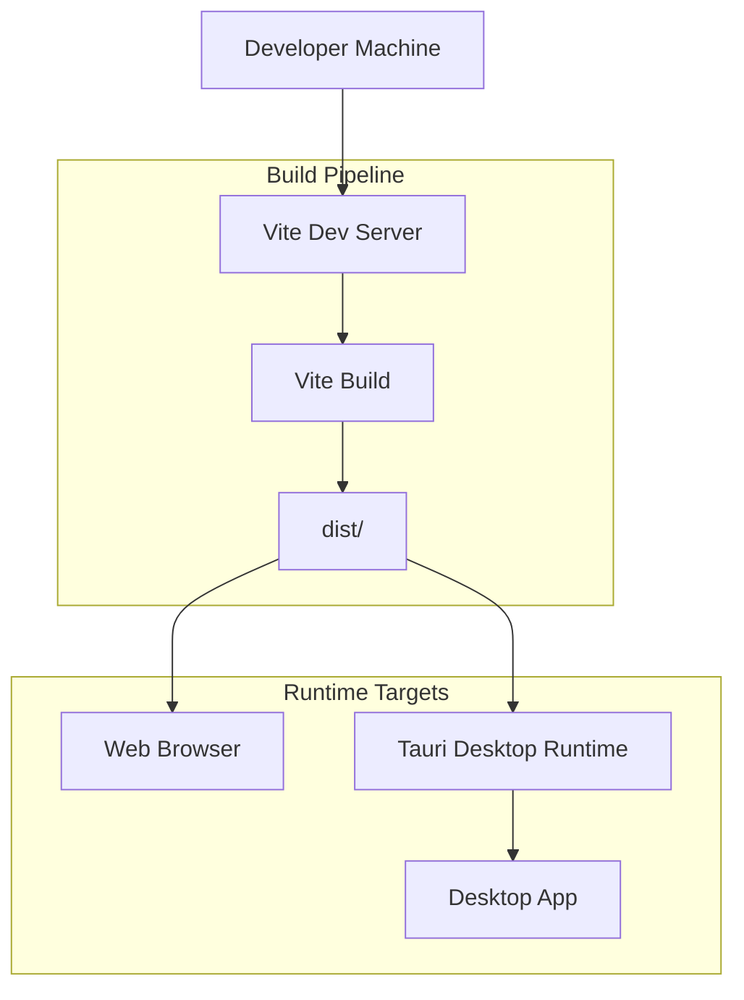
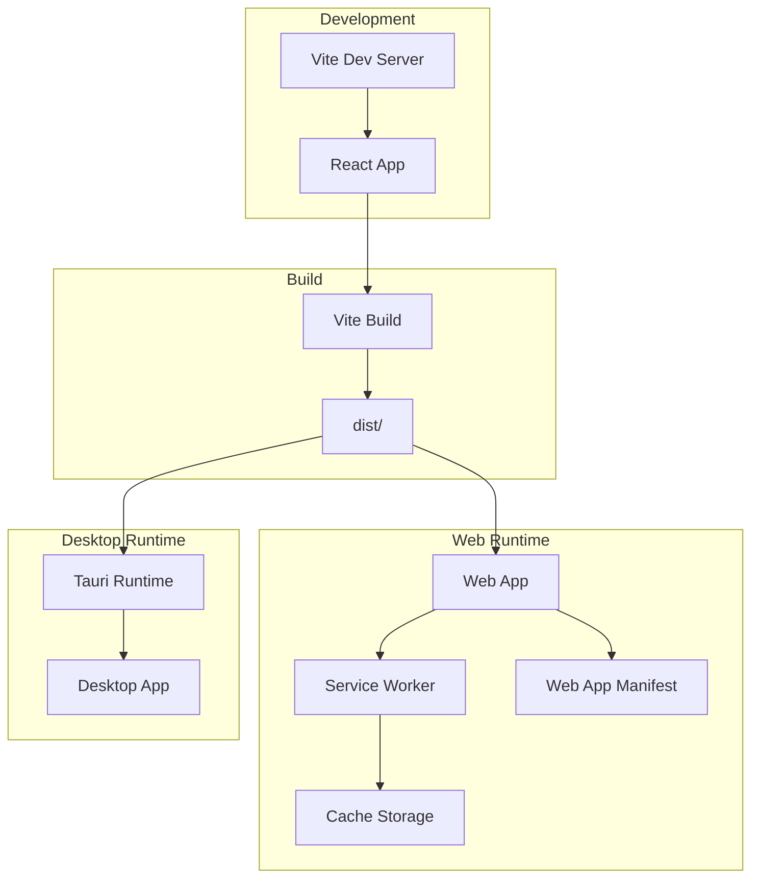
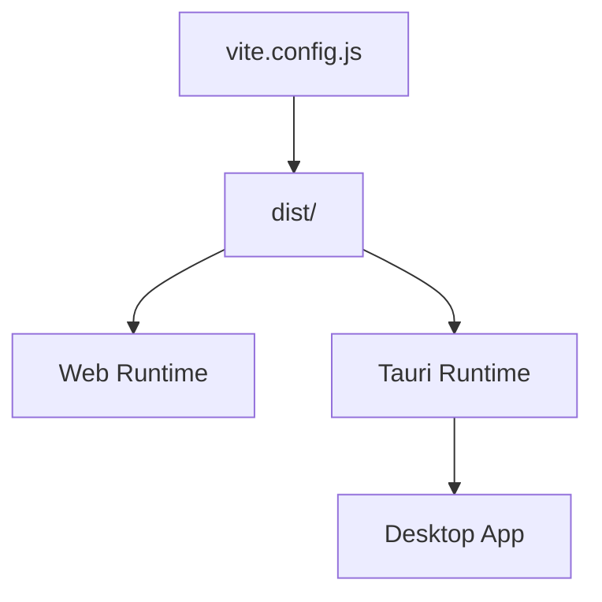

# Progressive Web App Configuration

<cite>
**Referenced Files in This Document**
- [package.json](file://package.json)
- [vite.config.js](file://vite.config.js)
- [index.html](file://index.html)
- [dist/index.html](file://dist/index.html)
- [src-tauri/tauri.conf.json](file://src-tauri/tauri.conf.json)
- [electron/main.js](file://electron/main.js)
- [electron/preload.js](file://electron/preload.js)
</cite>

## Table of Contents
1. [Introduction](#introduction)
2. [Project Structure](#project-structure)
3. [Core Components](#core-components)
4. [Architecture Overview](#architecture-overview)
5. [Detailed Component Analysis](#detailed-component-analysis)
6. [Dependency Analysis](#dependency-analysis)
7. [Performance Considerations](#performance-considerations)
8. [Troubleshooting Guide](#troubleshooting-guide)
9. [Conclusion](#conclusion)

## Introduction
This document explains how Progressive Web App (PWA) features are configured and deployed in RosterFlow. It covers the current build configuration, static asset delivery via Vite, and the bundling pipeline used by Tauri. It also documents how to prepare the application for PWA-like behavior, including offline-first strategies, service worker integration, and installation flows for desktop and mobile environments.

Important note: As currently configured, RosterFlow does not include a PWA manifest, a service worker, or explicit offline caching strategies. The guidance below describes how to add these features and how to deploy them effectively using the existing build and bundling infrastructure.

## Project Structure
RosterFlow uses Vite for development and build, and Tauri for desktop bundling. The frontend is built into the dist directory and served statically. Tauri is configured to package the dist output as a desktop application.

**Diagram sources**
- [vite.config.js](file://vite.config.js#L1-L10)
- [dist/index.html](file://dist/index.html#L1-L15)
- [src-tauri/tauri.conf.json](file://src-tauri/tauri.conf.json#L6-L9)

**Section sources**
- [vite.config.js](file://vite.config.js#L1-L10)
- [dist/index.html](file://dist/index.html#L1-L15)
- [src-tauri/tauri.conf.json](file://src-tauri/tauri.conf.json#L6-L9)

## Core Components
- Vite configuration controls base path and plugin setup for React.
- The HTML entry points define the app shell and favicon link.
- Tauri configuration defines the frontend distribution path and desktop packaging.

Key observations:
- The base path is set to "./" to support both web server and relative routing scenarios.
- The HTML head includes a favicon link pointing to a static SVG.
- Tauri is configured to serve the dist directory as the frontend distribution.

**Section sources**
- [vite.config.js](file://vite.config.js#L7-L8)
- [index.html](file://index.html#L4-L6)
- [dist/index.html](file://dist/index.html#L5-L6)
- [src-tauri/tauri.conf.json](file://src-tauri/tauri.conf.json#L6-L9)

## Architecture Overview
The runtime architecture for PWA-like behavior can be layered on top of the existing build and bundling pipeline:

**Diagram sources**
- [vite.config.js](file://vite.config.js#L1-L10)
- [dist/index.html](file://dist/index.html#L1-L15)
- [src-tauri/tauri.conf.json](file://src-tauri/tauri.conf.json#L6-L9)

## Detailed Component Analysis

### Vite Build Configuration
- Base path is "./" to ensure assets resolve correctly under subpaths.
- Plugins include React support via Vite’s React plugin.
- No PWA-specific plugin is present in the current configuration.

Recommendations:
- Add a PWA plugin (for example, a Vite-compatible PWA plugin) to generate a manifest and inject service worker registration automatically.
- Configure asset hashing and precache strategies for offline readiness.

**Section sources**
- [vite.config.js](file://vite.config.js#L5-L8)

### HTML Entry Points
- The development index.html sets the viewport and links a favicon.
- The production dist/index.html includes hashed asset references and a favicon link.

Recommendations:
- Add a web app manifest link in the HTML head to declare PWA metadata.
- Ensure the manifest URL resolves correctly in both development and production builds.

**Section sources**
- [index.html](file://index.html#L3-L7)
- [dist/index.html](file://dist/index.html#L3-L9)

### Tauri Desktop Packaging
- Tauri is configured to use the dist directory as the frontend distribution.
- The dev URL points to the Vite dev server during development.

Recommendations:
- For desktop distribution, ensure the app loads from the dist directory and that any service worker registration is disabled or adapted for desktop contexts.
- Consider adding a desktop-specific manifest or metadata if distributing outside the web.

**Section sources**
- [src-tauri/tauri.conf.json](file://src-tauri/tauri.conf.json#L6-L9)

### Service Worker Implementation
Current state: Not present.

Recommended approach:
- Integrate a service worker that:
  - Precaches critical assets and the HTML shell.
  - Handles navigation requests and returns the shell for single-page navigation.
  - Implements a network-first or stale-while-revalidate strategy for dynamic resources.
  - Manages updates via a background sync or periodic checks.

Integration steps:
- Add the service worker file to the public directory or include it in the build output.
- Register the service worker in the app initialization code.
- Configure the PWA plugin to inject the registration script and manifest link.

[No sources needed since this section proposes implementation steps not yet present in the codebase]

### Offline Functionality
Current state: Not implemented.

Recommended approach:
- Use the service worker to cache:
  - Static assets (CSS, JS, images).
  - The HTML shell for offline-first navigation.
  - API responses with appropriate cache keys.
- Implement fallback routes for offline scenarios (for example, a splash screen or cached dashboard view).

[No sources needed since this section proposes implementation steps not yet present in the codebase]

### Asset Caching Strategies
Current state: Standard Vite asset emission with hashed filenames.

Recommended approach:
- Leverage the service worker to:
  - Cache hashed assets for long-term storage.
  - Invalidate caches on version changes using cache versioning.
  - Apply cache-busting via asset hashes and a manifest-driven precache list.

[No sources needed since this section proposes implementation steps not yet present in the codebase]

### Update Mechanisms
Current state: Not implemented.

Recommended approach:
- Use the service worker lifecycle to:
  - Detect updates in the background.
  - Trigger a refresh prompt or silent update after a period.
  - Clear old caches to prevent accumulation.

[No sources needed since this section proposes implementation steps not yet present in the codebase]

### Installation Process
Current state: Not implemented.

Recommended approach:
- Add a web app manifest with:
  - App name, short name, and display mode.
  - Icons for multiple densities.
  - Orientation and background color.
- Provide an install prompt in the UI (for example, after user interaction).
- On mobile, ensure the app is served over HTTPS and includes a manifest link.

[No sources needed since this section proposes implementation steps not yet present in the codebase]

### Configuration Options
Current state: Minimal.

Recommended additions:
- Manifest fields: name, short_name, start_url, display, background_color, theme_color, icons.
- Icons: sizes covering 192x192 and 512x512 for home screen and splash screens.
- Theme color: align with the app’s primary color.

[No sources needed since this section proposes implementation steps not yet present in the codebase]

### Testing Procedures and Browser Compatibility
Current state: Not implemented.

Recommended approach:
- Test in:
  - Chromium-based browsers (Chrome, Edge, Brave).
  - Firefox and Safari (desktop and mobile).
  - Desktop apps via Tauri.
- Verify:
  - Installability (mobile).
  - Offline behavior (service worker activation and cache hits).
  - Update mechanism (background updates and cache invalidation).
  - HTTPS and secure context requirements.

[No sources needed since this section proposes implementation steps not yet present in the codebase]

## Dependency Analysis
The current dependency graph focuses on the build and runtime pipeline:

**Diagram sources**
- [vite.config.js](file://vite.config.js#L1-L10)
- [dist/index.html](file://dist/index.html#L1-L15)
- [src-tauri/tauri.conf.json](file://src-tauri/tauri.conf.json#L6-L9)

**Section sources**
- [vite.config.js](file://vite.config.js#L1-L10)
- [dist/index.html](file://dist/index.html#L1-L15)
- [src-tauri/tauri.conf.json](file://src-tauri/taauri.conf.json#L6-L9)

## Performance Considerations
- Keep the initial payload small by lazy-loading non-critical features.
- Use efficient caching strategies to minimize bandwidth usage and improve load times.
- Ensure the service worker precaches only essential assets to reduce storage overhead.
- Monitor cache growth and implement periodic cleanup routines.

[No sources needed since this section provides general guidance]

## Troubleshooting Guide
Common issues and resolutions:
- Assets not loading in production:
  - Verify base path is "./" and that the server serves from the correct subpath.
  - Confirm hashed asset references in dist/index.html match generated files.
- Service worker not registering:
  - Ensure HTTPS is used in production.
  - Check console for registration errors and verify the service worker file location.
- Tauri app not loading assets:
  - Confirm tauri.conf.json frontendDist points to the dist directory.
  - Validate that the dev URL is reachable during development.

**Section sources**
- [vite.config.js](file://vite.config.js#L7-L8)
- [dist/index.html](file://dist/index.html#L8-L9)
- [src-tauri/tauri.conf.json](file://src-tauri/tauri.conf.json#L6-L9)

## Conclusion
RosterFlow currently relies on Vite for building and Tauri for desktop packaging. To enable a full PWA experience, integrate a service worker, a web app manifest, and robust offline caching strategies. Align the build pipeline to generate and register these assets, and validate behavior across browsers and platforms. Once implemented, the existing dist-based architecture will support both web and desktop deployments with consistent PWA semantics.