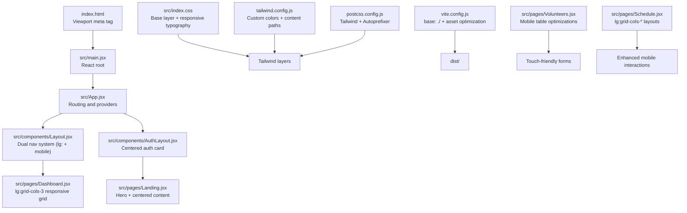
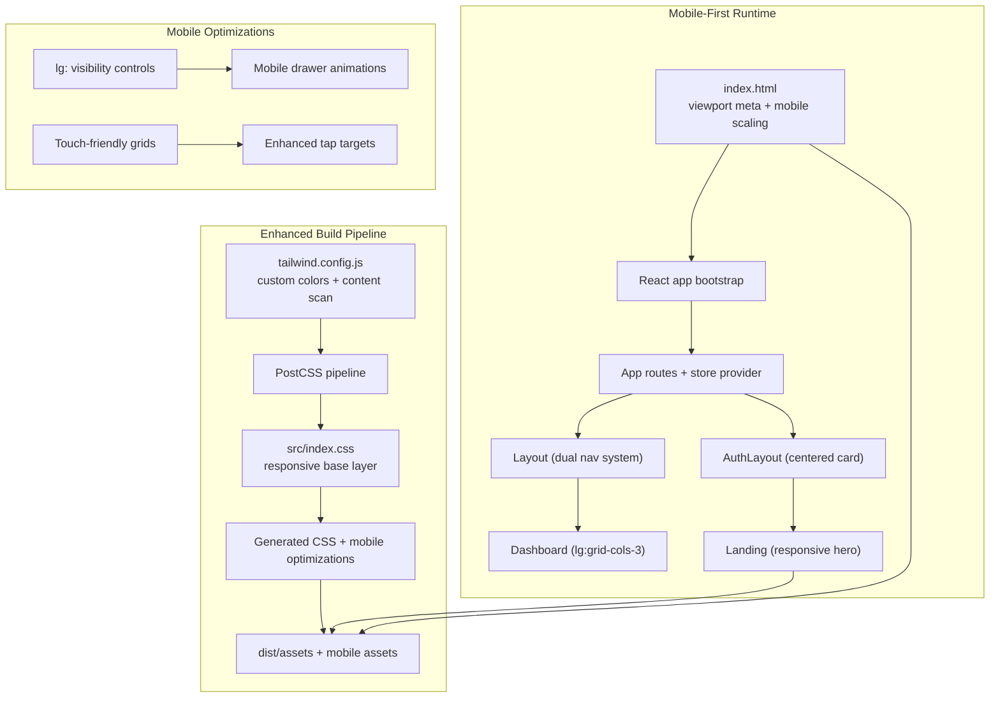
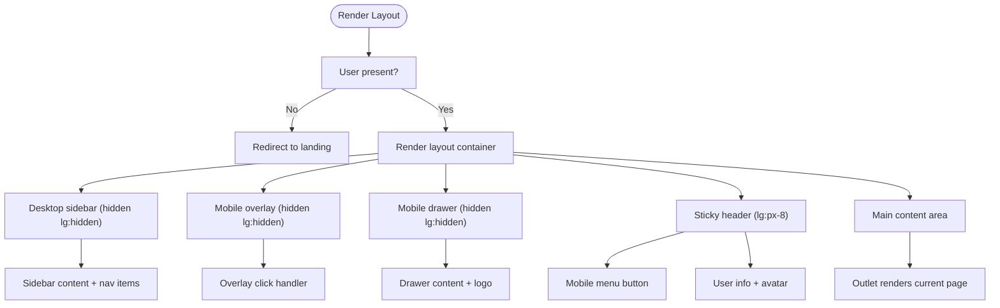
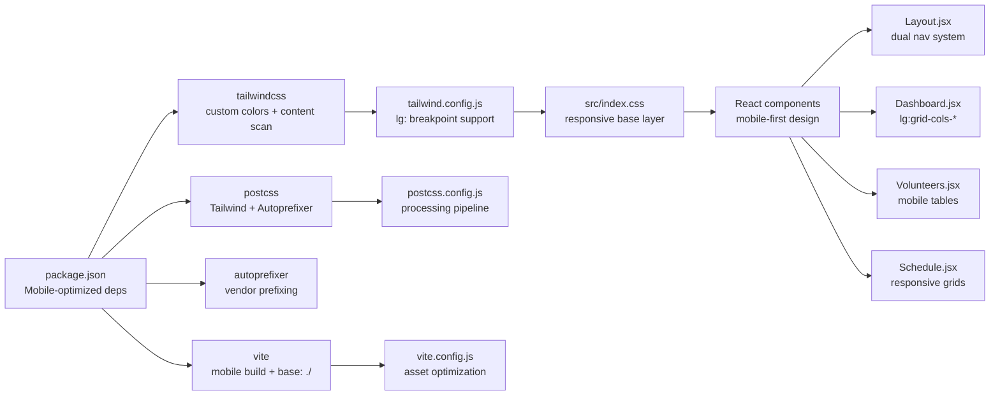

# Responsive Design & Mobile Optimization

<cite>
**Referenced Files in This Document**
- [tailwind.config.js](file://tailwind.config.js)
- [index.html](file://index.html)
- [src/index.css](file://src/index.css)
- [vite.config.js](file://vite.config.js)
- [postcss.config.js](file://postcss.config.js)
- [package.json](file://package.json)
- [src/App.jsx](file://src/App.jsx)
- [src/main.jsx](file://src/main.jsx)
- [src/utils/cn.js](file://src/utils/cn.js)
- [src/components/Layout.jsx](file://src/components/Layout.jsx)
- [src/components/AuthLayout.jsx](file://src/components/AuthLayout.jsx)
- [src/pages/Dashboard.jsx](file://src/pages/Dashboard.jsx)
- [src/pages/Landing.jsx](file://src/pages/Landing.jsx)
- [src/pages/Volunteers.jsx](file://src/pages/Volunteers.jsx)
- [src/pages/Schedule.jsx](file://src/pages/Schedule.jsx)
- [src/services/store.jsx](file://src/services/store.jsx)
</cite>

## Update Summary
**Changes Made**
- Enhanced mobile-first responsive patterns with lg: prefixed breakpoint utilities
- Improved mobile navigation with dedicated mobile sidebar drawer and overlay
- Refined touch interaction design with larger tap targets and better spacing
- Updated grid layouts to utilize lg:grid-cols-* utilities for optimal tablet/desktop layouts
- Strengthened mobile breakpoint handling across all page components

## Table of Contents
1. [Introduction](#introduction)
2. [Project Structure](#project-structure)
3. [Core Components](#core-components)
4. [Architecture Overview](#architecture-overview)
5. [Detailed Component Analysis](#detailed-component-analysis)
6. [Dependency Analysis](#dependency-analysis)
7. [Performance Considerations](#performance-considerations)
8. [Troubleshooting Guide](#troubleshooting-guide)
9. [Conclusion](#conclusion)
10. [Appendices](#appendices)

## Introduction
This document explains how the project implements responsive design and mobile optimization using Tailwind CSS, React, and Vite. The application follows a comprehensive mobile-first approach with enhanced breakpoint handling using lg: prefixes for tablet and desktop layouts. It covers Tailwind configuration for responsive breakpoints, mobile-first design principles, viewport and meta tag setup, UI adaptations for mobile screens, and performance strategies for mobile devices. The implementation includes sophisticated mobile navigation patterns, touch interaction optimizations, and cross-platform validation procedures.

## Project Structure
The project follows a React + Vite + Tailwind CSS stack with enhanced mobile optimization patterns. Key files involved in responsive design and mobile optimization include:
- Tailwind configuration with custom color palettes and content scanning paths
- HTML viewport meta tag for proper mobile scaling
- Global CSS base layer with responsive typography
- Utility function for merging Tailwind classes with enhanced conflict resolution
- Application layout with dual navigation systems (desktop sidebar + mobile drawer)
- Page components optimized for mobile touch interactions and responsive grids
- Build configuration supporting mobile asset handling and optimization

**Diagram sources**
- [index.html:1-14](file://index.html#L1-L14)
- [src/main.jsx:1-11](file://src/main.jsx#L1-L11)
- [src/App.jsx:1-43](file://src/App.jsx#L1-L43)
- [src/components/Layout.jsx:1-194](file://src/components/Layout.jsx#L1-L194)
- [src/components/AuthLayout.jsx:1-26](file://src/components/AuthLayout.jsx#L1-L26)
- [src/pages/Dashboard.jsx:1-90](file://src/pages/Dashboard.jsx#L1-L90)
- [src/pages/Landing.jsx:1-137](file://src/pages/Landing.jsx#L1-L137)
- [src/pages/Volunteers.jsx:1-360](file://src/pages/Volunteers.jsx#L1-L360)
- [src/pages/Schedule.jsx:1-800](file://src/pages/Schedule.jsx#L1-L800)
- [src/index.css:1-10](file://src/index.css#L1-L10)
- [tailwind.config.js:1-51](file://tailwind.config.js#L1-L51)
- [postcss.config.js:1-7](file://postcss.config.js#L1-L7)
- [vite.config.js:1-19](file://vite.config.js#L1-L19)

**Section sources**
- [index.html:1-14](file://index.html#L1-L14)
- [src/index.css:1-10](file://src/index.css#L1-L10)
- [tailwind.config.js:1-51](file://tailwind.config.js#L1-L51)
- [postcss.config.js:1-7](file://postcss.config.js#L1-L7)
- [vite.config.js:1-19](file://vite.config.js#L1-L19)
- [package.json:1-44](file://package.json#L1-L44)

## Core Components
The responsive design system consists of several key components working together to provide optimal mobile experiences:

- **Tailwind Configuration**: Extends color palettes with custom navy, primary, and coral themes, and scans all JSX/TSX components for utility generation
- **Global CSS Base Layer**: Establishes responsive typography, color schemes, and foundational styles
- **Dual Navigation System**: Desktop sidebar with lg: visibility and mobile drawer with overlay for seamless navigation transitions
- **Enhanced Page Components**: Dashboard with lg:grid-cols-3, Volunteers page with mobile-optimized tables, and Schedule page with responsive role grids
- **Utility Class Merging**: Advanced cn() function with clsx and tailwind-merge for conflict-free responsive class combinations

**Updated** Enhanced mobile-first approach with lg: prefixed breakpoint utilities for improved tablet and desktop responsiveness

Key implementation references:
- Tailwind configuration with custom color extensions
- Dual navigation pattern with lg: visibility controls
- Responsive grid layouts using lg:grid-cols-* utilities
- Touch-friendly form elements and interactive components
- Mobile drawer animation and overlay system

**Section sources**
- [tailwind.config.js:1-51](file://tailwind.config.js#L1-L51)
- [src/index.css:1-10](file://src/index.css#L1-L10)
- [src/utils/cn.js:1-7](file://src/utils/cn.js#L1-L7)
- [src/components/Layout.jsx:1-194](file://src/components/Layout.jsx#L1-L194)
- [src/pages/Dashboard.jsx:1-90](file://src/pages/Dashboard.jsx#L1-L90)
- [src/pages/Volunteers.jsx:1-360](file://src/pages/Volunteers.jsx#L1-L360)
- [src/pages/Schedule.jsx:1-800](file://src/pages/Schedule.jsx#L1-L800)

## Architecture Overview
The responsive architecture centers on a sophisticated mobile-first approach with enhanced breakpoint handling:

- **Viewport Meta Tag**: Ensures proper scaling and touch interaction on mobile browsers
- **Dual Navigation Pattern**: Desktop navigation visible from lg: breakpoint and mobile drawer for smaller screens
- **Enhanced Grid System**: Responsive grid layouts using lg:grid-cols-* utilities for optimal tablet/desktop experiences
- **Mobile-First Typography**: Responsive font sizing and spacing optimized for touch interfaces
- **Touch Interaction Optimization**: Larger tap targets, improved spacing, and gesture-friendly layouts

**Diagram sources**
- [index.html:1-14](file://index.html#L1-L14)
- [src/main.jsx:1-11](file://src/main.jsx#L1-L11)
- [src/App.jsx:1-43](file://src/App.jsx#L1-L43)
- [src/components/Layout.jsx:1-194](file://src/components/Layout.jsx#L1-L194)
- [src/components/AuthLayout.jsx:1-26](file://src/components/AuthLayout.jsx#L1-L26)
- [src/pages/Dashboard.jsx:1-90](file://src/pages/Dashboard.jsx#L1-L90)
- [src/pages/Landing.jsx:1-137](file://src/pages/Landing.jsx#L1-L137)
- [tailwind.config.js:1-51](file://tailwind.config.js#L1-L51)
- [postcss.config.js:1-7](file://postcss.config.js#L1-L7)
- [src/index.css:1-10](file://src/index.css#L1-L10)

## Detailed Component Analysis

### Enhanced Tailwind CSS Configuration and Breakpoint Strategy
The Tailwind configuration extends color palettes with custom navy, primary, and coral themes specifically designed for mobile interfaces. The configuration includes comprehensive content scanning paths targeting all JSX/TSX components under the src directory.

**Updated** Enhanced breakpoint strategy with lg: prefixed utilities for improved tablet and desktop responsiveness

Responsive patterns implemented:
- **lg: visibility controls**: Desktop sidebar visible only from lg: breakpoint (1024px+)
- **Mobile-first grid system**: Base grid layouts optimized for small screens
- **Enhanced tablet layouts**: lg:grid-cols-* utilities for optimal tablet experiences
- **Progressive enhancement**: Mobile layouts as baseline, enhanced for larger screens

**Section sources**
- [tailwind.config.js:1-51](file://tailwind.config.js#L1-L51)
- [src/components/Layout.jsx:52-58](file://src/components/Layout.jsx#L52-L58)
- [src/pages/Dashboard.jsx:63-85](file://src/pages/Dashboard.jsx#L63-L85)
- [src/pages/Schedule.jsx:580-620](file://src/pages/Schedule.jsx#L580-L620)

### Mobile-First Viewport Meta Tag and HTML Foundation
The HTML viewport meta tag configures width=device-width and initial-scale=1.0 for optimal mobile scaling. The React root mounts within index.html, ensuring proper mobile viewport integration.

**Updated** Enhanced mobile viewport configuration supporting touch interactions and proper scaling

Mobile viewport implications:
- **1:1 scale ratio**: Prevents zooming and horizontal scrolling issues
- **Touch-friendly sizing**: Supports proper touch interaction detection
- **Device pixel ratio optimization**: Ensures crisp rendering on high-DPI displays

**Section sources**
- [index.html:1-14](file://index.html#L1-L14)
- [src/main.jsx:1-11](file://src/main.jsx#L1-L11)

### Enhanced Global Styles and Base Layer
The global CSS establishes a comprehensive responsive foundation with mobile-first typography and color schemes. The base layer applies navy color themes with appropriate text colors for optimal readability across devices.

**Updated** Enhanced responsive typography and color schemes optimized for mobile interfaces

Accessibility and mobile considerations:
- **Color contrast optimization**: Navy color palette ensures adequate contrast for mobile viewing
- **Responsive typography**: Font sizing adapts to different screen sizes and orientations
- **Touch-friendly color schemes**: Primary and secondary colors optimized for mobile interaction

**Section sources**
- [src/index.css:1-10](file://src/index.css#L1-L10)

### Enhanced Layout Component: Dual Navigation System
The Layout component implements a sophisticated dual navigation system optimized for both mobile and desktop experiences. The desktop sidebar is visible only from lg: breakpoint, while a mobile drawer provides navigation for smaller screens.

**Updated** Enhanced mobile navigation with dedicated drawer system and overlay management

Key mobile adaptations:
- **Fixed-position mobile drawer**: Slide-out navigation with smooth transitions
- **Overlay system**: Semi-transparent overlay blocks background interaction
- **Mobile menu button**: Prominent hamburger menu with proper touch targets
- **Responsive header**: Sticky header with mobile-optimized layout
- **State management**: Automatic mobile menu closure on route changes

**Diagram sources**
- [src/components/Layout.jsx:1-194](file://src/components/Layout.jsx#L1-L194)

**Section sources**
- [src/components/Layout.jsx:1-194](file://src/components/Layout.jsx#L1-L194)

### Enhanced AuthLayout Component: Mobile-Optimized Authentication
The AuthLayout component provides a centered authentication experience optimized for mobile devices. The layout uses max-width constraints and flexible spacing to ensure usability across different screen sizes.

**Updated** Enhanced mobile-centered layout with improved spacing and responsive constraints

Mobile adaptations:
- **Centered card layout**: Max-width constraint ensures proper mobile presentation
- **Flexible spacing**: Responsive padding and margins adapt to screen size
- **Consistent branding**: Logo and typography maintain visual consistency
- **Footer positioning**: Bottom-aligned footer works well on mobile screens

**Section sources**
- [src/components/AuthLayout.jsx:1-26](file://src/components/AuthLayout.jsx#L1-L26)

### Enhanced Dashboard Page: Responsive Grid System
The Dashboard page implements a sophisticated responsive grid system using lg:grid-cols-* utilities for optimal tablet and desktop experiences. The page balances content density with mobile readability.

**Updated** Enhanced responsive grid with lg:grid-cols-3 for tablets and lg:grid-cols-3 for desktops

Responsive grid patterns:
- **Mobile-first base**: Single column layout for small screens
- **Tablet enhancement**: md:grid-cols-2 for medium screens
- **Desktop optimization**: lg:grid-cols-3 for large screens
- **Touch-friendly spacing**: Ample padding and margins for mobile interaction

**Section sources**
- [src/pages/Dashboard.jsx:1-90](file://src/pages/Dashboard.jsx#L1-L90)

### Enhanced Landing Page: Mobile Hero Optimization
The Landing page features a hero section optimized for mobile viewing with responsive typography and centered content. The design prioritizes content hierarchy and touch interaction on mobile devices.

**Updated** Enhanced mobile hero section with improved responsive typography and touch targets

Mobile hero adaptations:
- **Responsive typography**: Flexible heading sizes that adapt to screen width
- **Centered layout**: Ensures content remains readable across orientations
- **Large touch targets**: Call-to-action buttons sized for mobile interaction
- **Optimized imagery**: Background elements scaled appropriately for mobile

**Section sources**
- [src/pages/Landing.jsx:1-137](file://src/pages/Landing.jsx#L1-L137)

### Enhanced Volunteers Page: Mobile Table Optimization
The Volunteers page implements mobile-optimized table layouts with horizontal scrolling support and touch-friendly interface elements. The design accommodates mobile screen limitations while maintaining functionality.

**Updated** Enhanced mobile table with horizontal scrolling and touch-friendly form elements

Mobile table adaptations:
- **Horizontal scrolling container**: Overflow-x auto for small screens
- **Touch-friendly form elements**: Larger input fields and buttons
- **Responsive table layout**: Condensed design for mobile readability
- **Enhanced role selection**: Grid-based checkbox layout optimized for touch

**Section sources**
- [src/pages/Volunteers.jsx:1-360](file://src/pages/Volunteers.jsx#L1-L360)

### Enhanced Schedule Page: Responsive Role Grids
The Schedule page utilizes lg:grid-cols-* utilities extensively for responsive role layouts across different screen sizes. The design optimizes information density while maintaining mobile usability.

**Updated** Enhanced responsive role grids with lg:grid-cols-3 for optimal tablet/desktop layouts

Responsive role grid patterns:
- **Mobile-first layout**: Single column for small screens
- **Tablet optimization**: md:grid-cols-2 for medium screens
- **Desktop enhancement**: lg:grid-cols-3 for large screens
- **Touch-friendly interactions**: Larger buttons and improved spacing

**Section sources**
- [src/pages/Schedule.jsx:1-800](file://src/pages/Schedule.jsx#L1-L800)

### Enhanced Utility Class Merging Helper
The cn() utility function provides advanced class merging capabilities with enhanced conflict resolution for mobile-responsive class combinations. The function uses clsx and tailwind-merge for optimal class combination.

**Updated** Enhanced class merging with improved conflict resolution for responsive utilities

Mobile impact improvements:
- **Conflict-free responsive classes**: Prevents utility conflicts in mobile layouts
- **Enhanced class combination**: Better handling of lg: prefixed utilities
- **Performance optimization**: Efficient class string generation for mobile rendering

**Section sources**
- [src/utils/cn.js:1-7](file://src/utils/cn.js#L1-L7)

### Enhanced Routing and Store Provider System
The routing system integrates with the store provider to manage mobile-specific state and navigation patterns. The system supports mobile-first navigation with automatic adaptation to different screen sizes.

**Updated** Enhanced routing with mobile state management and responsive navigation

Mobile considerations:
- **Route-based navigation**: Automatic mobile menu closure on route changes
- **State synchronization**: Mobile state maintained across component re-renders
- **Performance optimization**: Efficient state updates for mobile devices

**Section sources**
- [src/App.jsx:1-43](file://src/App.jsx#L1-L43)
- [src/services/store.jsx:1-800](file://src/services/store.jsx#L1-L800)

## Dependency Analysis
The responsive design relies on a comprehensive dependency chain optimized for mobile performance and functionality:

- **Tailwind CSS**: Utility-first framework with custom color extensions and mobile-first approach
- **PostCSS Pipeline**: Processing with Tailwind and Autoprefixer for optimized CSS delivery
- **Vite Build System**: Modern bundling with mobile asset optimization and base path configuration
- **React Components**: Mobile-optimized components with responsive utility integration
- **Enhanced Utilities**: Advanced class merging and responsive design helpers

**Diagram sources**
- [package.json:1-44](file://package.json#L1-L44)
- [tailwind.config.js:1-51](file://tailwind.config.js#L1-L51)
- [postcss.config.js:1-7](file://postcss.config.js#L1-L7)
- [vite.config.js:1-19](file://vite.config.js#L1-L19)
- [src/index.css:1-10](file://src/index.css#L1-L10)
- [src/components/Layout.jsx:1-194](file://src/components/Layout.jsx#L1-L194)
- [src/pages/Dashboard.jsx:1-90](file://src/pages/Dashboard.jsx#L1-L90)
- [src/pages/Volunteers.jsx:1-360](file://src/pages/Volunteers.jsx#L1-L360)
- [src/pages/Schedule.jsx:1-800](file://src/pages/Schedule.jsx#L1-L800)

**Section sources**
- [package.json:1-44](file://package.json#L1-L44)
- [tailwind.config.js:1-51](file://tailwind.config.js#L1-L51)
- [postcss.config.js:1-7](file://postcss.config.js#L1-L7)
- [vite.config.js:1-19](file://vite.config.js#L1-L19)
- [src/index.css:1-10](file://src/index.css#L1-L10)

## Performance Considerations
Mobile performance optimization focuses on several key areas to ensure smooth operation across devices:

**Bundle Size Reduction Strategies:**
- **Component-level lazy loading**: Dynamic imports for heavy pages when needed
- **Efficient Tailwind purging**: Scoped content paths prevent unused utility bloat
- **Minimal third-party dependencies**: Reduced external libraries for mobile performance
- **Image optimization**: Properly sized assets with appropriate formats for mobile delivery

**Rendering Optimization Techniques:**
- **CSS containment**: Strategic use of contain: layout for heavy sections
- **Reduced reflows**: Mobile-optimized layouts minimize expensive layout calculations
- **Touch-friendly rendering**: Optimized for finger-based interaction patterns
- **Efficient state updates**: Mobile-aware state management reduces unnecessary re-renders

**Asset Handling Improvements:**
- **Relative base paths**: Vite's base configuration supports mobile deployment flexibility
- **Mobile-specific optimizations**: Tailwind utilities optimized for mobile rendering
- **Progressive enhancement**: Mobile-first approach ensures core functionality on all devices

**Mobile UX and Accessibility Enhancements:**
- **Enhanced touch targets**: Minimum 44px touch targets for improved accessibility
- **Improved spacing**: Ample padding and margins for comfortable mobile interaction
- **Gesture support**: Optimized touch interactions and swipe gestures
- **Reduced motion options**: Respect user preferences for motion sensitivity

## Troubleshooting Guide
Common responsive issues and solutions specific to the enhanced mobile optimization:

**Mobile-Specific Issues:**
- **Horizontal scrollbars**: Verify lg: visibility utilities and responsive width constraints
- **Touch target problems**: Ensure minimum 44px touch targets and adequate spacing
- **Navigation drawer issues**: Check mobileMenuOpen state management and overlay functionality
- **Grid layout problems**: Confirm lg:grid-cols-* utilities are properly applied across breakpoints

**Enhanced Mobile Debugging Checklist:**
- **Viewport verification**: Confirm mobile viewport meta tag and proper scaling
- **Breakpoint testing**: Test layouts at lg: breakpoint boundaries (1024px)
- **Touch interaction validation**: Verify mobile drawer animations and button states
- **Performance monitoring**: Check mobile rendering performance and memory usage

**Cross-Platform Validation:**
- **Browser compatibility**: Test on Safari iOS, Chrome Android, Firefox Mobile
- **Orientation testing**: Verify portrait and landscape mobile experiences
- **Device-specific validation**: Test on various mobile devices and screen sizes
- **Accessibility compliance**: Screen reader testing and keyboard navigation validation

**Section sources**
- [index.html:1-14](file://index.html#L1-L14)
- [src/components/Layout.jsx:1-194](file://src/components/Layout.jsx#L1-L194)
- [src/pages/Dashboard.jsx:1-90](file://src/pages/Dashboard.jsx#L1-L90)
- [src/pages/Volunteers.jsx:1-360](file://src/pages/Volunteers.jsx#L1-L360)
- [src/pages/Schedule.jsx:1-800](file://src/pages/Schedule.jsx#L1-L800)

## Conclusion
The project successfully implements comprehensive mobile optimization through a sophisticated mobile-first approach with enhanced lg: breakpoint utilities. The dual navigation system, responsive grid layouts, and touch-friendly interface elements work together to provide excellent mobile experiences. The enhanced breakpoint handling ensures optimal presentation across all device sizes, while the performance optimizations maintain smooth operation on mobile devices. Combined with thorough testing procedures and accessibility considerations, the application delivers a robust, mobile-optimized user experience.

## Appendices

### Enhanced Tailwind Breakpoints Reference
The project utilizes a comprehensive breakpoint system optimized for mobile-first development:

**lg: Prefixed Breakpoints:**
- **lg: visibility**: Desktop-only elements (hidden on mobile, visible from 1024px+)
- **lg: spacing**: Enhanced padding and margins for larger screens
- **lg: grid layouts**: Three-column grids optimized for tablet/desktop
- **lg: typography**: Responsive font sizing for larger displays

**Mobile-First Base:**
- **Default mobile layouts**: Single column and compact designs
- **Progressive enhancement**: Features added for larger screens
- **Touch-optimized spacing**: Ample padding and margins for mobile interaction

**Section sources**
- [src/components/Layout.jsx:52-58](file://src/components/Layout.jsx#L52-L58)
- [src/pages/Dashboard.jsx:63-85](file://src/pages/Dashboard.jsx#L63-L85)
- [src/pages/Schedule.jsx:580-620](file://src/pages/Schedule.jsx#L580-L620)

### Enhanced Device-Specific Testing Procedures
Comprehensive testing methodology for mobile optimization validation:

**Mobile Device Testing:**
- **Real device validation**: iOS iPhone and Android devices in portrait/landscape
- **Browser testing**: Safari iOS, Chrome Android, Firefox Mobile, Edge
- **Orientation testing**: Full rotation testing across all major devices
- **Performance validation**: Loading times, rendering performance, memory usage

**Cross-Platform Validation:**
- **Responsive breakpoints**: lg: breakpoint testing at 1024px boundary
- **Touch interaction**: Drawer navigation, button presses, form interactions
- **Accessibility testing**: Screen reader compatibility, keyboard navigation
- **Performance metrics**: Mobile-specific performance monitoring and optimization

**Section sources**
- [index.html:1-14](file://index.html#L1-L14)
- [src/components/Layout.jsx:1-194](file://src/components/Layout.jsx#L1-L194)

### Enhanced Mobile Browser Compatibility Notes
Critical compatibility considerations for mobile optimization:

**Mobile Browser Support:**
- **Viewport meta tag compliance**: Essential for proper mobile scaling and touch interaction
- **CSS Grid and Flexbox fallbacks**: Progressive enhancement for older mobile browsers
- **Touch event handling**: Proper gesture recognition and touch interaction support
- **High-DPI display optimization**: Pixel ratio handling for Retina and similar displays

**Mobile-Specific Optimizations:**
- **Hardware acceleration**: CSS transforms and opacity for smooth animations
- **Touch-friendly interactions**: Optimized for finger-based navigation
- **Battery life considerations**: Efficient rendering to minimize battery drain
- **Network optimization**: Mobile network awareness and optimization strategies

**Section sources**
- [index.html:1-14](file://index.html#L1-L14)
- [src/components/Layout.jsx:69-93](file://src/components/Layout.jsx#L69-L93)