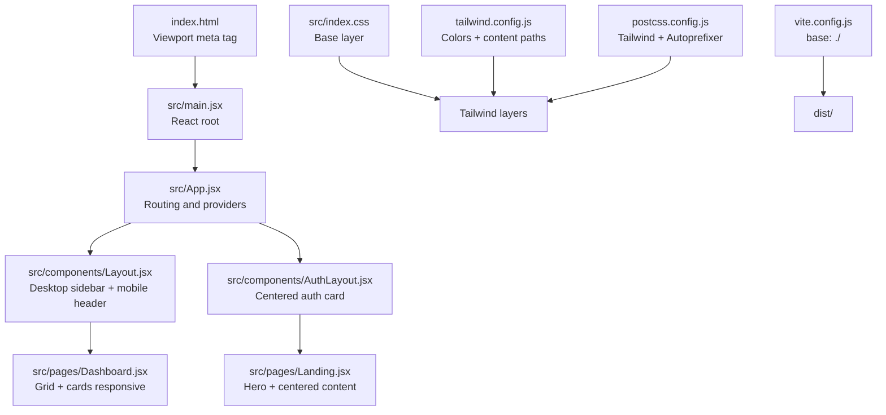
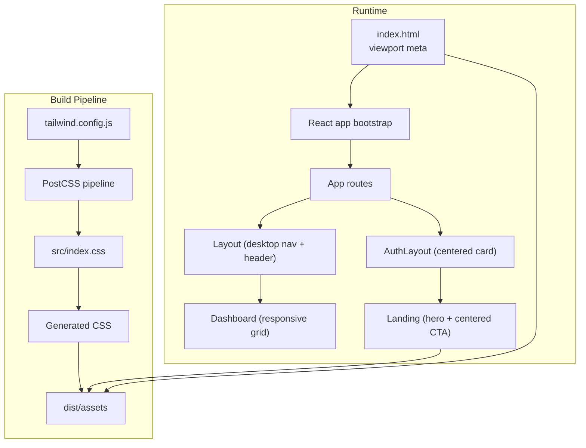
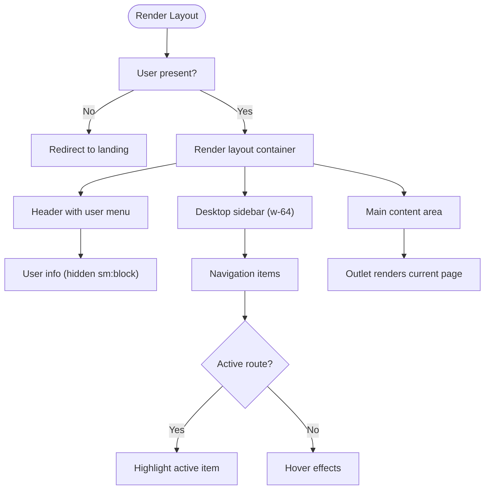
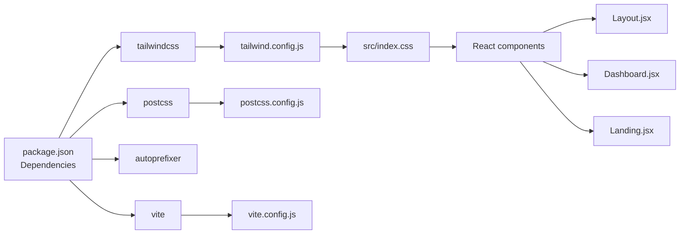

# Responsive Design & Mobile Optimization

<cite>
**Referenced Files in This Document**
- [tailwind.config.js](file://tailwind.config.js)
- [index.html](file://index.html)
- [src/index.css](file://src/index.css)
- [vite.config.js](file://vite.config.js)
- [postcss.config.js](file://postcss.config.js)
- [package.json](file://package.json)
- [src/App.jsx](file://src/App.jsx)
- [src/main.jsx](file://src/main.jsx)
- [src/utils/cn.js](file://src/utils/cn.js)
- [src/components/Layout.jsx](file://src/components/Layout.jsx)
- [src/components/AuthLayout.jsx](file://src/components/AuthLayout.jsx)
- [src/pages/Dashboard.jsx](file://src/pages/Dashboard.jsx)
- [src/pages/Landing.jsx](file://src/pages/Landing.jsx)
- [src/services/store.jsx](file://src/services/store.jsx)
</cite>

## Table of Contents
1. [Introduction](#introduction)
2. [Project Structure](#project-structure)
3. [Core Components](#core-components)
4. [Architecture Overview](#architecture-overview)
5. [Detailed Component Analysis](#detailed-component-analysis)
6. [Dependency Analysis](#dependency-analysis)
7. [Performance Considerations](#performance-considerations)
8. [Troubleshooting Guide](#troubleshooting-guide)
9. [Conclusion](#conclusion)
10. [Appendices](#appendices)

## Introduction
This document explains how the project implements responsive design and mobile optimization using Tailwind CSS, React, and Vite. It covers the Tailwind configuration for responsive breakpoints, mobile-first design principles, viewport and meta tag setup, UI adaptations for mobile screens, and performance strategies for mobile devices. It also outlines testing procedures and accessibility considerations for mobile platforms.

## Project Structure
The project follows a React + Vite + Tailwind CSS stack. Key files involved in responsive design and mobile optimization include:
- Tailwind configuration and PostCSS pipeline
- HTML viewport meta tag
- Global CSS base layer
- Utility function for merging Tailwind classes
- Application layout and page components that apply responsive utilities
- Build configuration for asset handling

**Diagram sources**
- [index.html](file://index.html#L1-L14)
- [src/main.jsx](file://src/main.jsx#L1-L11)
- [src/App.jsx](file://src/App.jsx#L1-L37)
- [src/components/Layout.jsx](file://src/components/Layout.jsx#L1-L108)
- [src/components/AuthLayout.jsx](file://src/components/AuthLayout.jsx#L1-L26)
- [src/pages/Dashboard.jsx](file://src/pages/Dashboard.jsx#L1-L90)
- [src/pages/Landing.jsx](file://src/pages/Landing.jsx#L1-L42)
- [src/index.css](file://src/index.css#L1-L10)
- [tailwind.config.js](file://tailwind.config.js#L1-L51)
- [postcss.config.js](file://postcss.config.js#L1-L7)
- [vite.config.js](file://vite.config.js#L1-L10)

**Section sources**
- [index.html](file://index.html#L1-L14)
- [src/index.css](file://src/index.css#L1-L10)
- [tailwind.config.js](file://tailwind.config.js#L1-L51)
- [postcss.config.js](file://postcss.config.js#L1-L7)
- [vite.config.js](file://vite.config.js#L1-L10)
- [package.json](file://package.json#L1-L44)

## Core Components
- Tailwind configuration defines color palettes and content scanning paths for utility generation.
- Global CSS establishes base styles and Tailwind layers.
- The layout system separates desktop navigation from mobile-friendly header content.
- Pages use responsive grid layouts and spacing utilities appropriate for small screens.
- A utility merges Tailwind classes safely to avoid conflicts.

Key implementation references:
- Tailwind configuration and color extensions
- Base layer and Tailwind layers
- Utility class merging helper
- Layout and page components applying responsive utilities

**Section sources**
- [tailwind.config.js](file://tailwind.config.js#L1-L51)
- [src/index.css](file://src/index.css#L1-L10)
- [src/utils/cn.js](file://src/utils/cn.js#L1-L7)
- [src/components/Layout.jsx](file://src/components/Layout.jsx#L1-L108)
- [src/pages/Dashboard.jsx](file://src/pages/Dashboard.jsx#L1-L90)
- [src/pages/Landing.jsx](file://src/pages/Landing.jsx#L1-L42)

## Architecture Overview
The responsive architecture centers on:
- Viewport meta tag ensuring proper scaling on mobile browsers
- Tailwind’s default breakpoints and utilities for responsive layouts
- Component-level responsive patterns (hidden/smooth transitions)
- Build-time asset handling for static resources

**Diagram sources**
- [index.html](file://index.html#L1-L14)
- [src/main.jsx](file://src/main.jsx#L1-L11)
- [src/App.jsx](file://src/App.jsx#L1-L37)
- [src/components/Layout.jsx](file://src/components/Layout.jsx#L1-L108)
- [src/components/AuthLayout.jsx](file://src/components/AuthLayout.jsx#L1-L26)
- [src/pages/Dashboard.jsx](file://src/pages/Dashboard.jsx#L1-L90)
- [src/pages/Landing.jsx](file://src/pages/Landing.jsx#L1-L42)
- [tailwind.config.js](file://tailwind.config.js#L1-L51)
- [postcss.config.js](file://postcss.config.js#L1-L7)
- [src/index.css](file://src/index.css#L1-L10)

## Detailed Component Analysis

### Tailwind CSS Configuration and Breakpoints
- The configuration extends color palettes and scans templates for utility generation.
- Default Tailwind breakpoints apply across components (e.g., hidden/sm:hidden, block/sm:block, grid-cols-1 vs. md:grid-cols-3).
- The content paths ensure utility generation for all JSX/TSX components under src.

Responsive patterns observed:
- Hidden text on small screens using sm:block and sm:hidden combinations.
- Grid layouts adapting from single column to multi-column based on breakpoint utilities.

**Section sources**
- [tailwind.config.js](file://tailwind.config.js#L1-L51)
- [src/components/Layout.jsx](file://src/components/Layout.jsx#L90-L98)
- [src/pages/Dashboard.jsx](file://src/pages/Dashboard.jsx#L46-L86)

### Viewport Meta Tag and HTML Foundation
- The HTML sets width=device-width and initial-scale=1.0 for mobile viewport control.
- The React root mounts inside index.html, ensuring the app runs within the configured viewport.

Mobile viewport implications:
- Ensures 1:1 scale on mobile devices.
- Prevents horizontal scrolling on narrow screens when combined with responsive utilities.

**Section sources**
- [index.html](file://index.html#L1-L14)
- [src/main.jsx](file://src/main.jsx#L1-L11)

### Global Styles and Base Layer
- Tailwind layers are included in global CSS.
- Base layer applies body background and text colors, establishing a consistent foundation for responsive typography and spacing.

Accessibility note:
- Using semantic headings and sufficient color contrast ensures readability across devices.

**Section sources**
- [src/index.css](file://src/index.css#L1-L10)

### Layout Component: Desktop Navigation + Mobile Header
Responsibilities:
- Enforces a fixed-height header with user info and actions.
- Uses responsive visibility utilities to show/hide desktop navigation on smaller screens.
- Provides a sticky header for easy navigation while scrolling.

Mobile adaptations:
- Header remains visible and usable on small screens.
- Navigation links adapt to smaller tap targets with padding and rounded corners.

**Diagram sources**
- [src/components/Layout.jsx](file://src/components/Layout.jsx#L1-L108)

**Section sources**
- [src/components/Layout.jsx](file://src/components/Layout.jsx#L1-L108)

### AuthLayout Component: Centered Card Pattern
Responsibilities:
- Provides a centered card container constrained by max-width for small screens.
- Keeps branding and footer consistent across devices.

Mobile adaptations:
- Flex centering and constrained width ensure usability on portrait and landscape orientations.

**Section sources**
- [src/components/AuthLayout.jsx](file://src/components/AuthLayout.jsx#L1-L26)

### Dashboard Page: Responsive Grid and Cards
Responsibilities:
- Displays a welcome banner, statistics cards, and quick action cards.
- Uses responsive grid utilities to adapt card layouts across screen sizes.

Patterns:
- Single column on extra-small screens, three columns on medium screens, and two columns on larger screens for quick action cards.
- Consistent padding and spacing for comfortable touch interaction.

**Section sources**
- [src/pages/Dashboard.jsx](file://src/pages/Dashboard.jsx#L1-L90)

### Landing Page: Hero and Centered Content
Responsibilities:
- Presents a hero section with centered text and call-to-action buttons.
- Uses responsive typography and spacing for readability on small screens.

Mobile adaptations:
- Large headline and button sizing improve tap targets.
- Centered layout prevents horizontal scrolling.

**Section sources**
- [src/pages/Landing.jsx](file://src/pages/Landing.jsx#L1-L42)

### Utility Class Merging Helper
Responsibilities:
- Safely merges Tailwind classes to prevent duplicates and conflicting utilities.
- Used across components to dynamically compute class strings.

Mobile impact:
- Ensures responsive variants coexist without conflicts, especially when toggling active states.

**Section sources**
- [src/utils/cn.js](file://src/utils/cn.js#L1-L7)

### Routing and Providers
Responsibilities:
- Centralizes routing and wraps the app with a store provider.
- Enables navigation between authenticated and unauthenticated views.

Mobile considerations:
- Route transitions and nested layouts remain consistent across devices.

**Section sources**
- [src/App.jsx](file://src/App.jsx#L1-L37)
- [src/services/store.jsx](file://src/services/store.jsx#L1-L472)

## Dependency Analysis
The responsive design relies on:
- Tailwind CSS for utility classes and responsive breakpoints
- PostCSS with Tailwind and Autoprefixer for CSS processing
- Vite for building and serving assets with base path configuration
- React components applying responsive utilities

**Diagram sources**
- [package.json](file://package.json#L1-L44)
- [tailwind.config.js](file://tailwind.config.js#L1-L51)
- [postcss.config.js](file://postcss.config.js#L1-L7)
- [vite.config.js](file://vite.config.js#L1-L10)
- [src/index.css](file://src/index.css#L1-L10)
- [src/components/Layout.jsx](file://src/components/Layout.jsx#L1-L108)
- [src/pages/Dashboard.jsx](file://src/pages/Dashboard.jsx#L1-L90)
- [src/pages/Landing.jsx](file://src/pages/Landing.jsx#L1-L42)

**Section sources**
- [package.json](file://package.json#L1-L44)
- [tailwind.config.js](file://tailwind.config.js#L1-L51)
- [postcss.config.js](file://postcss.config.js#L1-L7)
- [vite.config.js](file://vite.config.js#L1-L10)
- [src/index.css](file://src/index.css#L1-L10)

## Performance Considerations
Bundle size reduction:
- Prefer component-level lazy loading for heavy pages if needed.
- Keep Tailwind purging efficient by scoping content paths to actual components.
- Minimize third-party icons and utilities to reduce CSS payload.

Rendering optimization:
- Use CSS containment and contain: layout style for heavy sections.
- Avoid expensive reflows by limiting dynamic layout shifts on small screens.
- Ensure images and logos are appropriately sized for device pixel ratios.

Asset handling:
- Vite’s base configuration supports relative paths for distribution builds.
- Serve compressed assets and leverage browser caching headers.

Accessibility and UX:
- Maintain sufficient touch target sizes and spacing.
- Provide focus indicators and keyboard navigation support.
- Test with reduced motion preferences and screen readers.

[No sources needed since this section provides general guidance]

## Troubleshooting Guide
Common responsive issues and resolutions:
- Horizontal scrollbars on mobile: verify containers use responsive widths and avoid fixed widths exceeding viewport.
- Overlapping content on small screens: confirm responsive grid and spacing utilities are applied consistently.
- Tap targets too small: increase padding and ensure interactive elements meet minimum touch target size guidelines.
- Text cutoff or clipping: check responsive typography utilities and ensure adequate line heights.

Testing checklist:
- Verify viewport meta tag presence and correct scaling.
- Test layouts across common device widths (portrait and landscape).
- Validate navigation and interactive elements on actual devices.
- Confirm image and logo scaling without pixelation.

**Section sources**
- [index.html](file://index.html#L1-L14)
- [src/components/Layout.jsx](file://src/components/Layout.jsx#L1-L108)
- [src/pages/Dashboard.jsx](file://src/pages/Dashboard.jsx#L1-L90)
- [src/pages/Landing.jsx](file://src/pages/Landing.jsx#L1-L42)

## Conclusion
The project leverages Tailwind CSS utilities and a mobile-first mindset to deliver responsive layouts across devices. The viewport meta tag, global base styles, and component-level responsive patterns ensure usability on mobile. Combined with a streamlined build pipeline and thoughtful UX practices, the application maintains performance and accessibility on mobile platforms.

[No sources needed since this section summarizes without analyzing specific files]

## Appendices

### Tailwind Breakpoints Reference
- Default breakpoints apply in component classes:
  - sm: small screens and up
  - md: medium screens and up
  - lg: large screens and up
- Examples in code:
  - sm:block/sm:hidden toggles visibility on small screens
  - md:grid-cols-3 adjusts grid columns on medium screens

**Section sources**
- [src/components/Layout.jsx](file://src/components/Layout.jsx#L90-L98)
- [src/pages/Dashboard.jsx](file://src/pages/Dashboard.jsx#L46-L86)

### Device-Specific Testing Procedures
- Emulation: use browser DevTools device emulation for common phone/tablet sizes.
- Real devices: test on actual iOS and Android devices in portrait and landscape.
- Cross-browser validation: Safari iOS, Chrome Android, Firefox, Edge.
- Accessibility checks: screen reader testing, keyboard navigation, reduced motion.

[No sources needed since this section provides general guidance]

### Mobile Browser Compatibility Notes
- Ensure CSS Grid and Flexbox fallbacks where necessary.
- Validate viewport meta tag correctness.
- Test pinch-to-zoom and double-tap behaviors.

**Section sources**
- [index.html](file://index.html#L1-L14)