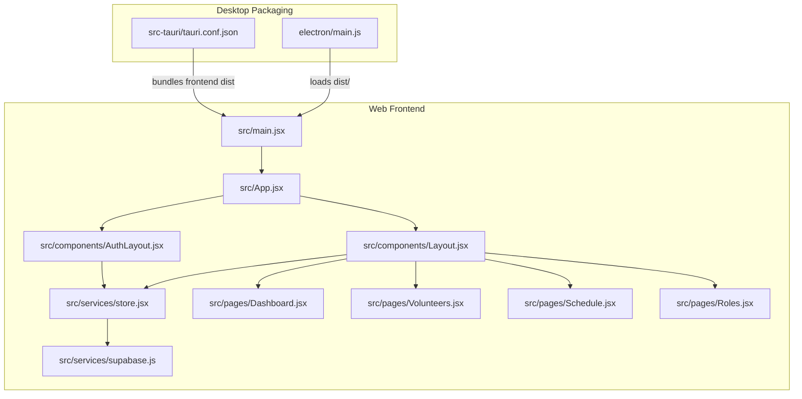
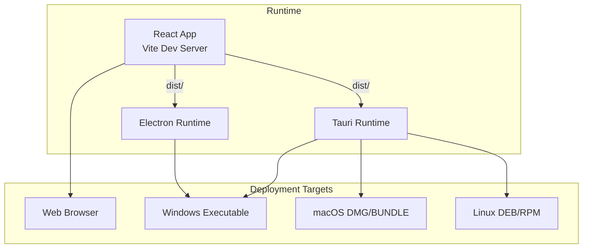
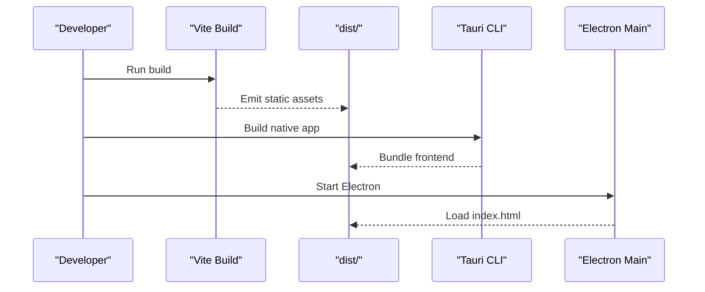
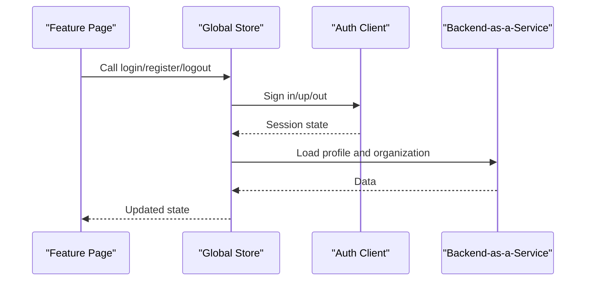
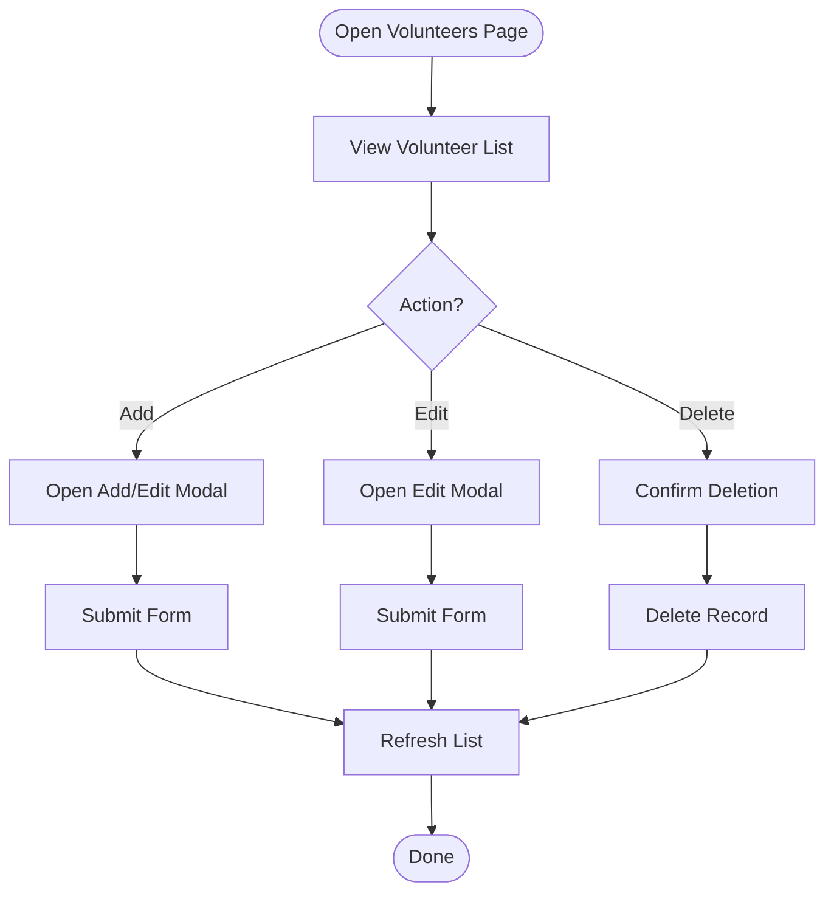
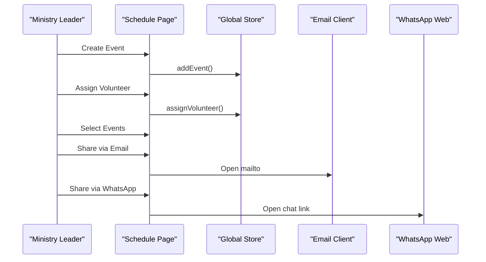
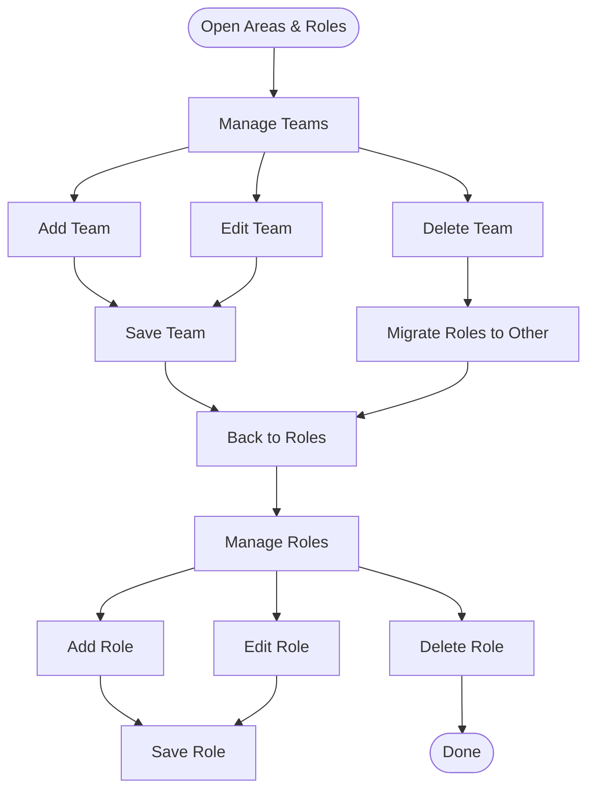
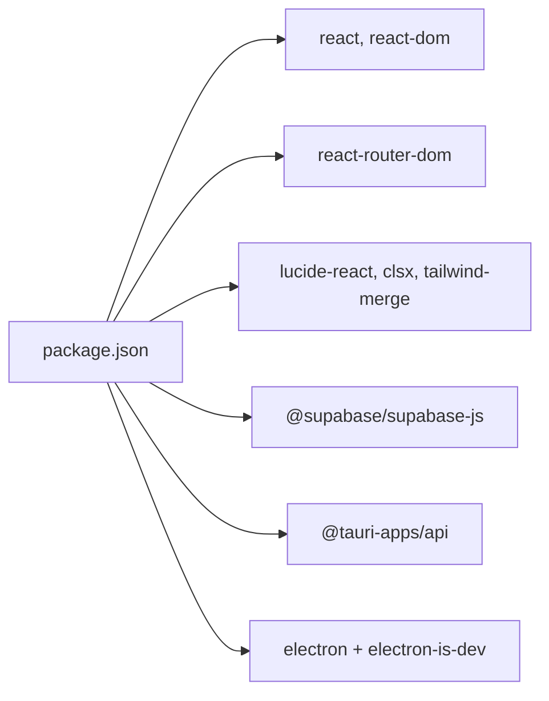

# Project Overview

<cite>
**Referenced Files in This Document**
- [README.md](file://README.md)
- [package.json](file://package.json)
- [vite.config.js](file://vite.config.js)
- [src/main.jsx](file://src/main.jsx)
- [src/App.jsx](file://src/App.jsx)
- [src/components/Layout.jsx](file://src/components/Layout.jsx)
- [src/components/AuthLayout.jsx](file://src/components/AuthLayout.jsx)
- [src/services/store.jsx](file://src/services/store.jsx)
- [src/services/supabase.js](file://src/services/supabase.js)
- [src/pages/Dashboard.jsx](file://src/pages/Dashboard.jsx)
- [src/pages/Volunteers.jsx](file://src/pages/Volunteers.jsx)
- [src/pages/Schedule.jsx](file://src/pages/Schedule.jsx)
- [src/pages/Roles.jsx](file://src/pages/Roles.jsx)
- [src-tauri/tauri.conf.json](file://src-tauri/tauri.conf.json)
- [electron/main.js](file://electron/main.js)
- [ELECTRON_BUILD.md](file://ELECTRON_BUILD.md)
</cite>

## Table of Contents
1. [Introduction](#introduction)
2. [Project Structure](#project-structure)
3. [Core Components](#core-components)
4. [Architecture Overview](#architecture-overview)
5. [Detailed Component Analysis](#detailed-component-analysis)
6. [Dependency Analysis](#dependency-analysis)
7. [Performance Considerations](#performance-considerations)
8. [Troubleshooting Guide](#troubleshooting-guide)
9. [Conclusion](#conclusion)

## Introduction
RosterFlow is a church volunteer management application designed to streamline operations and improve coordination for religious organizations. Its core value proposition lies in centralizing volunteer management, service scheduling, and ministry organization into a single platform that supports real-time collaboration across web, desktop, and mobile environments. The application targets church administrators, ministry leaders, and volunteers who need reliable tools to manage rosters, assign roles, and communicate schedules efficiently.

Key differentiators:
- Unified multi-platform deployment using modern web technologies and native packaging for desktop.
- Real-time synchronization powered by a backend-as-a-service for authentication and data persistence.
- Practical workflows for onboarding volunteers, organizing ministry teams, and coordinating weekly services.

## Project Structure
The project follows a frontend-first architecture with a React + Vite application, complemented by native packaging configurations for desktop and Tauri-based bundling. Authentication and data persistence are handled via a backend-as-a-service client library. The structure supports:
- Web deployment via Vite
- Desktop packaging via Electron
- Native desktop builds via Tauri

**Diagram sources**
- [src/main.jsx](file://src/main.jsx#L1-L11)
- [src/App.jsx](file://src/App.jsx#L1-L37)
- [src/components/Layout.jsx](file://src/components/Layout.jsx#L1-L102)
- [src/components/AuthLayout.jsx](file://src/components/AuthLayout.jsx#L1-L29)
- [src/services/store.jsx](file://src/services/store.jsx#L1-L472)
- [src/services/supabase.js](file://src/services/supabase.js#L1-L13)
- [src/pages/Dashboard.jsx](file://src/pages/Dashboard.jsx#L1-L90)
- [src/pages/Volunteers.jsx](file://src/pages/Volunteers.jsx#L1-L354)
- [src/pages/Schedule.jsx](file://src/pages/Schedule.jsx#L1-L731)
- [src/pages/Roles.jsx](file://src/pages/Roles.jsx#L1-L386)
- [electron/main.js](file://electron/main.js#L1-L46)
- [src-tauri/tauri.conf.json](file://src-tauri/tauri.conf.json#L1-L35)

**Section sources**
- [README.md](file://README.md#L1-L17)
- [package.json](file://package.json#L1-L44)
- [vite.config.js](file://vite.config.js#L1-L10)
- [src/main.jsx](file://src/main.jsx#L1-L11)
- [src/App.jsx](file://src/App.jsx#L1-L37)
- [src/components/Layout.jsx](file://src/components/Layout.jsx#L1-L102)
- [src/components/AuthLayout.jsx](file://src/components/AuthLayout.jsx#L1-L29)
- [src/services/store.jsx](file://src/services/store.jsx#L1-L472)
- [src/services/supabase.js](file://src/services/supabase.js#L1-L13)
- [src/pages/Dashboard.jsx](file://src/pages/Dashboard.jsx#L1-L90)
- [src/pages/Volunteers.jsx](file://src/pages/Volunteers.jsx#L1-L354)
- [src/pages/Schedule.jsx](file://src/pages/Schedule.jsx#L1-L731)
- [src/pages/Roles.jsx](file://src/pages/Roles.jsx#L1-L386)
- [electron/main.js](file://electron/main.js#L1-L46)
- [src-tauri/tauri.conf.json](file://src-tauri/tauri.conf.json#L1-L35)

## Core Components
- Application shell and routing: The root application initializes React Router and wraps routes with providers for global state and layout.
- Global state and data layer: A centralized store manages authentication state, organization context, and CRUD operations for groups, roles, volunteers, events, and assignments. It integrates with a backend-as-a-service client for persistence and real-time updates.
- Authentication and navigation: Authenticated routes are protected and redirect unauthenticated users to landing/authentication views. Navigation adapts to user sessions.
- Feature pages:
  - Dashboard: Quick stats and actions for common tasks.
  - Volunteers: CRUD for volunteers, role associations, and CSV import.
  - Schedule: Event creation, assignment management, and sharing via email, WhatsApp, or print.
  - Areas & Roles: Ministry team and role management with grouping support.

Practical workflows:
- Onboarding a new volunteer: Navigate to Volunteers, add contact info and roles, optionally import via CSV.
- Scheduling a service: Go to Schedule, create an event, assign volunteers to required slots, and share the schedule.
- Organizing ministries: Use Areas & Roles to define teams and roles, then assign volunteers accordingly.

**Section sources**
- [src/App.jsx](file://src/App.jsx#L1-L37)
- [src/services/store.jsx](file://src/services/store.jsx#L1-L472)
- [src/services/supabase.js](file://src/services/supabase.js#L1-L13)
- [src/components/Layout.jsx](file://src/components/Layout.jsx#L1-L102)
- [src/components/AuthLayout.jsx](file://src/components/AuthLayout.jsx#L1-L29)
- [src/pages/Dashboard.jsx](file://src/pages/Dashboard.jsx#L1-L90)
- [src/pages/Volunteers.jsx](file://src/pages/Volunteers.jsx#L1-L354)
- [src/pages/Schedule.jsx](file://src/pages/Schedule.jsx#L1-L731)
- [src/pages/Roles.jsx](file://src/pages/Roles.jsx#L1-L386)

## Architecture Overview
RosterFlow employs a multi-platform architecture:
- Web: Built with React and Vite, served statically.
- Desktop: Packaged via Electron for Windows development and distribution.
- Native desktop: Configured via Tauri for cross-platform native builds.

**Diagram sources**
- [vite.config.js](file://vite.config.js#L1-L10)
- [src-tauri/tauri.conf.json](file://src-tauri/tauri.conf.json#L1-L35)
- [electron/main.js](file://electron/main.js#L1-L46)

## Detailed Component Analysis

### Multi-Platform Deployment
- Web: Vite builds the React app to a static site. Base path is configured for relative asset resolution.
- Desktop (Electron): Loads the built app from the dist directory in development or production. Supports dev tools and window lifecycle.
- Native (Tauri): Bundles the frontend dist into a native application with platform-specific icons and build targets.

**Diagram sources**
- [vite.config.js](file://vite.config.js#L1-L10)
- [src-tauri/tauri.conf.json](file://src-tauri/tauri.conf.json#L1-L35)
- [electron/main.js](file://electron/main.js#L1-L46)

**Section sources**
- [vite.config.js](file://vite.config.js#L1-L10)
- [src-tauri/tauri.conf.json](file://src-tauri/tauri.conf.json#L1-L35)
- [electron/main.js](file://electron/main.js#L1-L46)
- [ELECTRON_BUILD.md](file://ELECTRON_BUILD.md#L1-L41)

### Authentication and Data Layer
- Authentication: Uses a backend-as-a-service client initialized from environment variables. Session state is tracked globally and used to gate authenticated routes.
- Data synchronization: The store loads organization context and related entities in parallel, exposes CRUD functions for each domain entity, and refreshes data after mutations.
- Real-time updates: Subscribes to authentication state changes to keep the UI synchronized.

**Diagram sources**
- [src/services/store.jsx](file://src/services/store.jsx#L1-L472)
- [src/services/supabase.js](file://src/services/supabase.js#L1-L13)

**Section sources**
- [src/services/store.jsx](file://src/services/store.jsx#L1-L472)
- [src/services/supabase.js](file://src/services/supabase.js#L1-L13)

### Volunteer Management Workflow
- Add/edit/remove volunteers and associate roles.
- Bulk import volunteers via CSV.
- Role assignment and filtering by role/group.

**Diagram sources**
- [src/pages/Volunteers.jsx](file://src/pages/Volunteers.jsx#L1-L354)
- [src/services/store.jsx](file://src/services/store.jsx#L161-L242)

**Section sources**
- [src/pages/Volunteers.jsx](file://src/pages/Volunteers.jsx#L1-L354)
- [src/services/store.jsx](file://src/services/store.jsx#L161-L242)

### Service Scheduling and Collaboration
- Create/update/delete events.
- Assign volunteers to required roles.
- Share schedules via email, WhatsApp, or print.

**Diagram sources**
- [src/pages/Schedule.jsx](file://src/pages/Schedule.jsx#L1-L731)
- [src/services/store.jsx](file://src/services/store.jsx#L244-L314)

**Section sources**
- [src/pages/Schedule.jsx](file://src/pages/Schedule.jsx#L1-L731)
- [src/services/store.jsx](file://src/services/store.jsx#L244-L314)

### Ministry Organization (Areas & Roles)
- Define ministry teams and roles, group roles by team, and manage orphaned roles.
- Assign roles to volunteers and maintain hierarchical organization.

**Diagram sources**
- [src/pages/Roles.jsx](file://src/pages/Roles.jsx#L1-L386)
- [src/services/store.jsx](file://src/services/store.jsx#L330-L422)

**Section sources**
- [src/pages/Roles.jsx](file://src/pages/Roles.jsx#L1-L386)
- [src/services/store.jsx](file://src/services/store.jsx#L330-L422)

### Conceptual Overview
RosterFlow’s mission is to reduce administrative overhead for churches by automating routine tasks around volunteer coordination. Administrators can quickly assemble teams, assign roles, and publish schedules, while volunteers receive timely communications and clear expectations.

[No sources needed since this section doesn't analyze specific files]

## Dependency Analysis
High-level dependencies:
- React ecosystem: React, React Router, Tailwind utilities.
- Backend integration: Backend-as-a-service client for auth and data.
- Desktop packaging: Electron for development and distribution; Tauri for native builds.
- Build tooling: Vite for fast development and optimized builds.

**Diagram sources**
- [package.json](file://package.json#L1-L44)

**Section sources**
- [package.json](file://package.json#L1-L44)

## Performance Considerations
- Parallel data loading: The store fetches related entities concurrently to minimize load time.
- Minimal re-renders: Centralized state reduces prop drilling and optimizes rendering.
- Static build: Vite produces optimized bundles suitable for web delivery.
- Desktop packaging: Electron and Tauri leverage prebuilt assets to speed up startup.

[No sources needed since this section provides general guidance]

## Troubleshooting Guide
Common issues and resolutions:
- Environment variables for backend integration are missing: Ensure required variables are present before running or building.
- Authentication redirects to landing page unexpectedly: Verify session state and network connectivity to the backend service.
- Desktop build artifacts not appearing: Confirm Vite build completes, then run the appropriate desktop build script.

**Section sources**
- [src/services/supabase.js](file://src/services/supabase.js#L1-L13)
- [src/components/Layout.jsx](file://src/components/Layout.jsx#L1-L102)
- [ELECTRON_BUILD.md](file://ELECTRON_BUILD.md#L1-L41)

## Conclusion
RosterFlow delivers a practical solution for church volunteer management with a clean, modular architecture that supports web, desktop, and native deployments. By focusing on essential workflows—volunteer onboarding, scheduling, and ministry organization—it enables religious organizations to coordinate more effectively and spend less time on administration.

[No sources needed since this section summarizes without analyzing specific files]