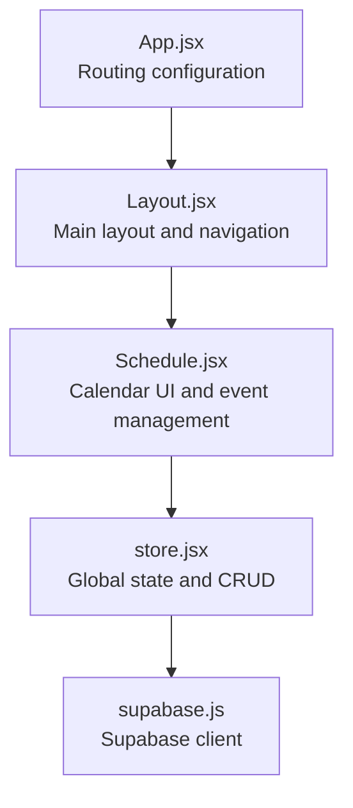
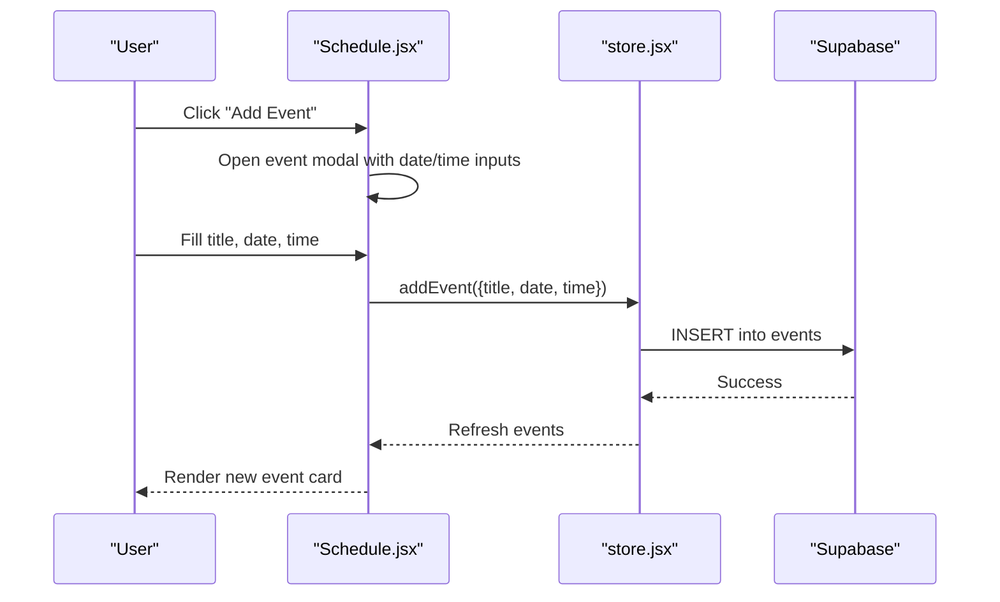
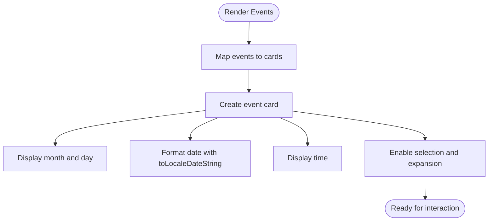
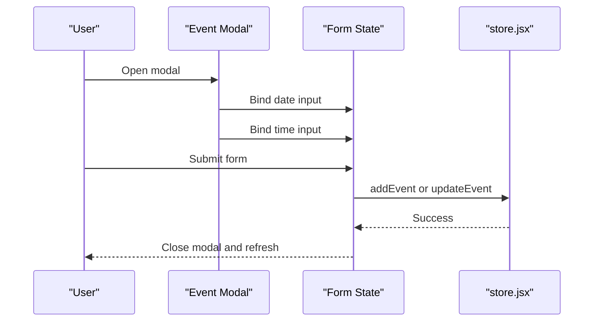
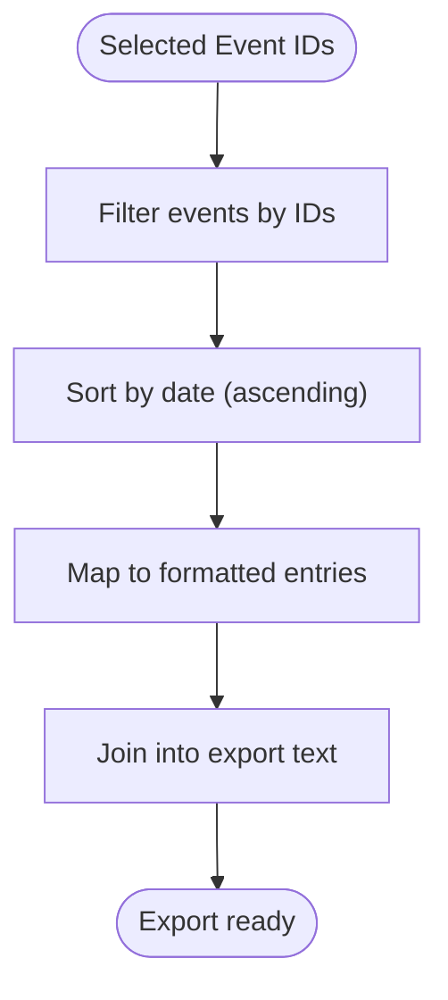
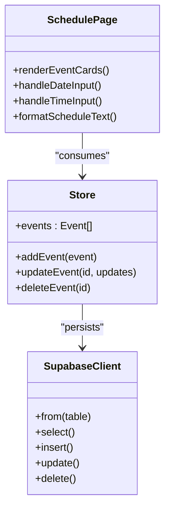
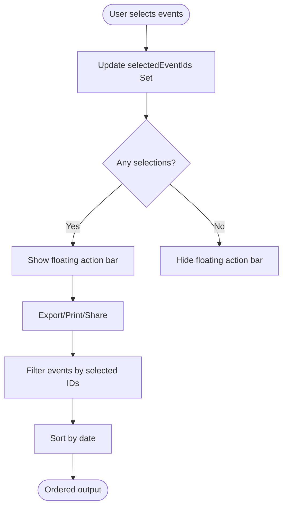
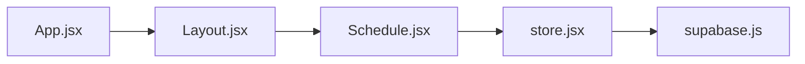

# Calendar Interface & Date Management

<cite>
**Referenced Files in This Document**
- [Schedule.jsx](file://src/pages/Schedule.jsx)
- [store.jsx](file://src/services/store.jsx)
- [supabase.js](file://src/services/supabase.js)
- [App.jsx](file://src/App.jsx)
- [Layout.jsx](file://src/components/Layout.jsx)
- [cn.js](file://src/utils/cn.js)
</cite>

## Table of Contents
1. [Introduction](#introduction)
2. [Project Structure](#project-structure)
3. [Core Components](#core-components)
4. [Architecture Overview](#architecture-overview)
5. [Detailed Component Analysis](#detailed-component-analysis)
6. [Dependency Analysis](#dependency-analysis)
7. [Performance Considerations](#performance-considerations)
8. [Troubleshooting Guide](#troubleshooting-guide)
9. [Conclusion](#conclusion)

## Introduction
This document explains the calendar interface and date/time management functionality in the application. It covers how events are visually represented with month and day formatting, how dates and times are parsed and formatted for display, the date/time picker implementation for creating and editing events, time input handling and validation, event sorting by date for chronological display, examples of date formatting patterns and locale-specific rendering, and the integration between calendar display and event data structures. It also documents the relationship between date selection and event filtering.

## Project Structure
The calendar and scheduling features are centered around the Schedule page, which integrates with a global store for data management and a Supabase client for persistence. The routing configuration exposes the Schedule route under the main application layout.

**Diagram sources**
- [App.jsx](file://src/App.jsx#L13-L34)
- [Layout.jsx](file://src/components/Layout.jsx#L14-L107)
- [Schedule.jsx](file://src/pages/Schedule.jsx#L7-L13)
- [store.jsx](file://src/services/store.jsx#L6-L467)
- [supabase.js](file://src/services/supabase.js#L1-L13)

**Section sources**
- [App.jsx](file://src/App.jsx#L13-L34)
- [Layout.jsx](file://src/components/Layout.jsx#L14-L107)
- [Schedule.jsx](file://src/pages/Schedule.jsx#L7-L13)
- [store.jsx](file://src/services/store.jsx#L6-L467)
- [supabase.js](file://src/services/supabase.js#L1-L13)

## Core Components
- Calendar display and event cards: The Schedule page renders events as interactive cards with a compact month/day visual and a detailed date/time display.
- Date/time picker: The event creation/editing modal uses HTML input[type="date"] and input[type="time"] for selecting dates and times.
- Sorting and filtering: Events are filtered by selection and sorted chronologically by date for export/printing and WhatsApp/email sharing.
- Formatting utilities: JavaScript Date APIs and toLocaleDateString are used for human-readable date formatting.
- Data integration: The store manages events and CRUD operations, while Supabase persists data.

**Section sources**
- [Schedule.jsx](file://src/pages/Schedule.jsx#L327-L481)
- [Schedule.jsx](file://src/pages/Schedule.jsx#L530-L548)
- [Schedule.jsx](file://src/pages/Schedule.jsx#L193-L216)
- [Schedule.jsx](file://src/pages/Schedule.jsx#L256-L257)
- [store.jsx](file://src/services/store.jsx#L244-L292)
- [supabase.js](file://src/services/supabase.js#L1-L13)

## Architecture Overview
The calendar interface is a React component that consumes a global store. The store loads data from Supabase and exposes functions to add, update, and delete events. The Schedule page displays events, handles user interactions (selection, expansion), and formats dates/times for display and export.

**Diagram sources**
- [Schedule.jsx](file://src/pages/Schedule.jsx#L511-L566)
- [Schedule.jsx](file://src/pages/Schedule.jsx#L158-L177)
- [store.jsx](file://src/services/store.jsx#L244-L264)
- [supabase.js](file://src/services/supabase.js#L1-L13)

## Detailed Component Analysis

### Calendar Display and Event Cards
- Visual representation: Each event card shows a vertical block with an uppercase month abbreviation and the numeric day, followed by title and formatted date/time.
- Date formatting: The detailed date uses toLocaleDateString with weekday, year, month, and day options for readability.
- Selection and expansion: Users can select events (checkbox) and expand cards to manage assignments.

**Diagram sources**
- [Schedule.jsx](file://src/pages/Schedule.jsx#L327-L481)
- [Schedule.jsx](file://src/pages/Schedule.jsx#L355-L373)
- [Schedule.jsx](file://src/pages/Schedule.jsx#L364-L366)

**Section sources**
- [Schedule.jsx](file://src/pages/Schedule.jsx#L327-L481)
- [Schedule.jsx](file://src/pages/Schedule.jsx#L355-L373)
- [Schedule.jsx](file://src/pages/Schedule.jsx#L364-L366)

### Date Picker Implementation (Event Creation and Editing)
- Inputs: The modal uses input[type="date"] for the event date and input[type="time"] for the event time.
- Validation: Submission checks that title, date, and time are present before proceeding.
- State binding: Form state updates on change and is submitted to addEvent or updateEvent depending on edit mode.

**Diagram sources**
- [Schedule.jsx](file://src/pages/Schedule.jsx#L511-L566)
- [Schedule.jsx](file://src/pages/Schedule.jsx#L158-L177)
- [store.jsx](file://src/services/store.jsx#L244-L292)

**Section sources**
- [Schedule.jsx](file://src/pages/Schedule.jsx#L511-L566)
- [Schedule.jsx](file://src/pages/Schedule.jsx#L158-L177)
- [store.jsx](file://src/services/store.jsx#L244-L292)

### Time Input Handling and Validation
- Input types: HTML5 date and time inputs provide native validation and UX affordances.
- Frontend validation: The submit handler ensures required fields are present before dispatching store actions.
- Persistence: Dates and times are stored as provided by the inputs and rendered back to the UI.

**Section sources**
- [Schedule.jsx](file://src/pages/Schedule.jsx#L530-L548)
- [Schedule.jsx](file://src/pages/Schedule.jsx#L158-L160)

### Event Sorting by Date (Chronological Display)
- Sorting logic: Selected events are filtered and sorted by date using a comparator that converts date strings to Date objects.
- Use cases: Exported WhatsApp/email text and printed schedules rely on chronological ordering.

**Diagram sources**
- [Schedule.jsx](file://src/pages/Schedule.jsx#L193-L216)
- [Schedule.jsx](file://src/pages/Schedule.jsx#L256-L257)

**Section sources**
- [Schedule.jsx](file://src/pages/Schedule.jsx#L193-L216)
- [Schedule.jsx](file://src/pages/Schedule.jsx#L256-L257)

### Date Formatting Patterns and Locale-Specific Rendering
- Long date pattern: weekday, year, month, day are shown using toLocaleDateString with options.
- Numeric day extraction: The day number is extracted separately for the visual card header.
- Locale behavior: The long date format respects the browser's locale by default.

Examples of formatting patterns used:
- Long date: weekday + year + month + day
- Day number: numeric day of the month

**Section sources**
- [Schedule.jsx](file://src/pages/Schedule.jsx#L364-L366)
- [Schedule.jsx](file://src/pages/Schedule.jsx#L357-L358)

### Integration Between Calendar Display and Event Data Structures
- Data source: The store exposes an events array loaded from Supabase.
- UI rendering: The Schedule page maps events to cards, extracting assignments and roles for expanded views.
- Updates: Adding or editing events triggers store functions that persist to Supabase and refresh the UI.

**Diagram sources**
- [store.jsx](file://src/services/store.jsx#L13-L18)
- [store.jsx](file://src/services/store.jsx#L244-L292)
- [supabase.js](file://src/services/supabase.js#L1-L13)
- [Schedule.jsx](file://src/pages/Schedule.jsx#L7-L13)

**Section sources**
- [store.jsx](file://src/services/store.jsx#L13-L18)
- [store.jsx](file://src/services/store.jsx#L244-L292)
- [supabase.js](file://src/services/supabase.js#L1-L13)
- [Schedule.jsx](file://src/pages/Schedule.jsx#L7-L13)

### Relationship Between Date Selection and Event Filtering
- Selection state: A Set tracks selected event IDs.
- Filtering: Selected IDs filter the events array for export/printing.
- Sorting: The filtered subset is sorted by date to maintain chronological order.

**Diagram sources**
- [Schedule.jsx](file://src/pages/Schedule.jsx#L179-L191)
- [Schedule.jsx](file://src/pages/Schedule.jsx#L484-L508)
- [Schedule.jsx](file://src/pages/Schedule.jsx#L193-L216)

**Section sources**
- [Schedule.jsx](file://src/pages/Schedule.jsx#L179-L191)
- [Schedule.jsx](file://src/pages/Schedule.jsx#L484-L508)
- [Schedule.jsx](file://src/pages/Schedule.jsx#L193-L216)

## Dependency Analysis
- Schedule depends on the store for events and CRUD operations.
- The store depends on Supabase for data persistence.
- Routing exposes the Schedule page under the main layout.

**Diagram sources**
- [App.jsx](file://src/App.jsx#L13-L34)
- [Layout.jsx](file://src/components/Layout.jsx#L14-L107)
- [Schedule.jsx](file://src/pages/Schedule.jsx#L7-L13)
- [store.jsx](file://src/services/store.jsx#L6-L467)
- [supabase.js](file://src/services/supabase.js#L1-L13)

**Section sources**
- [App.jsx](file://src/App.jsx#L13-L34)
- [Layout.jsx](file://src/components/Layout.jsx#L14-L107)
- [Schedule.jsx](file://src/pages/Schedule.jsx#L7-L13)
- [store.jsx](file://src/services/store.jsx#L6-L467)
- [supabase.js](file://src/services/supabase.js#L1-L13)

## Performance Considerations
- Rendering cost: Mapping large event lists can be expensive; consider virtualization if the list grows substantially.
- Sorting cost: Sorting by date is O(n log n); keep the selection set small for export operations.
- Re-renders: Using a Set for selection minimizes re-render churn compared to toggling flags on each event object.
- Date parsing: Converting strings to Date is lightweight but repeated conversions can be avoided by memoizing where appropriate.

## Troubleshooting Guide
- Date/time inputs not updating: Ensure the modal’s input bindings update the form state and that submission calls the correct store function.
- Incorrect sorting order: Verify the comparator uses Date conversion consistently and that the sort occurs after filtering.
- Locale date differences: toLocaleDateString reflects the user’s locale; if a fixed format is required, normalize the output.
- Missing events after save: Confirm the store’s refresh logic runs after add/update/delete and that Supabase credentials are configured.

**Section sources**
- [Schedule.jsx](file://src/pages/Schedule.jsx#L530-L548)
- [Schedule.jsx](file://src/pages/Schedule.jsx#L158-L177)
- [Schedule.jsx](file://src/pages/Schedule.jsx#L193-L216)
- [store.jsx](file://src/services/store.jsx#L244-L292)
- [supabase.js](file://src/services/supabase.js#L6-L8)

## Conclusion
The calendar interface integrates a clean visual representation of events with robust date/time handling, a straightforward date/time picker, and reliable sorting and filtering for exports. The design leverages React state, a centralized store, and Supabase persistence to deliver a cohesive scheduling experience. Future enhancements could include advanced date pickers, stricter validation, and performance optimizations for larger datasets.