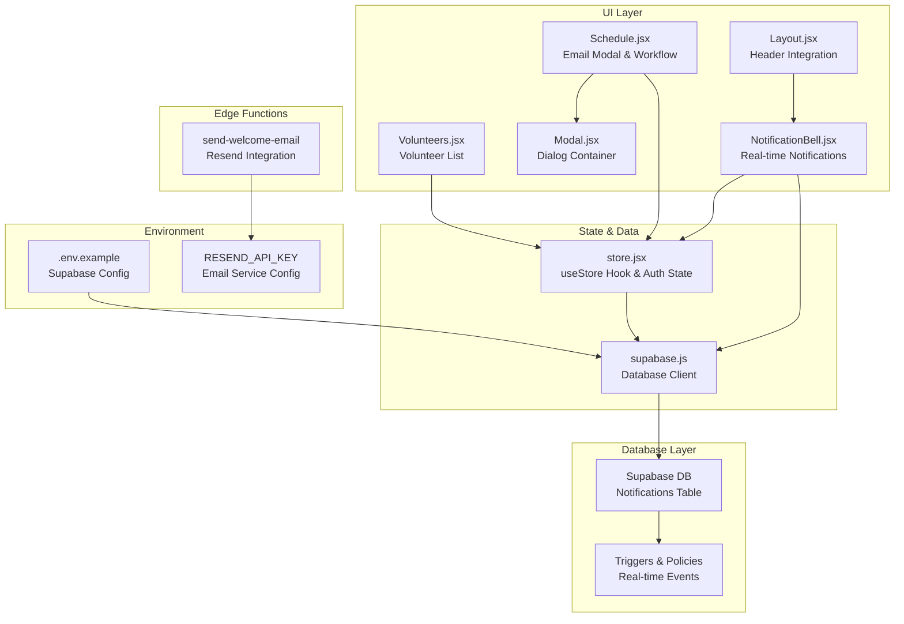
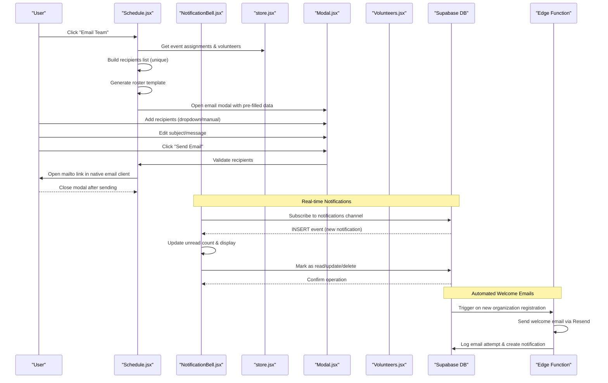
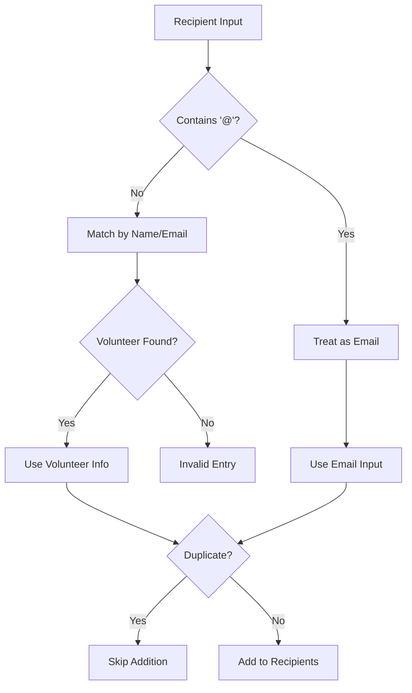
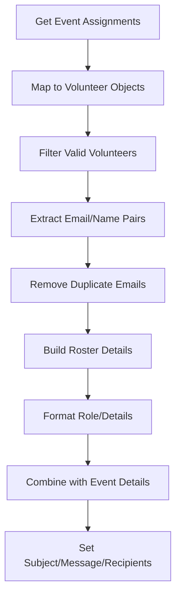
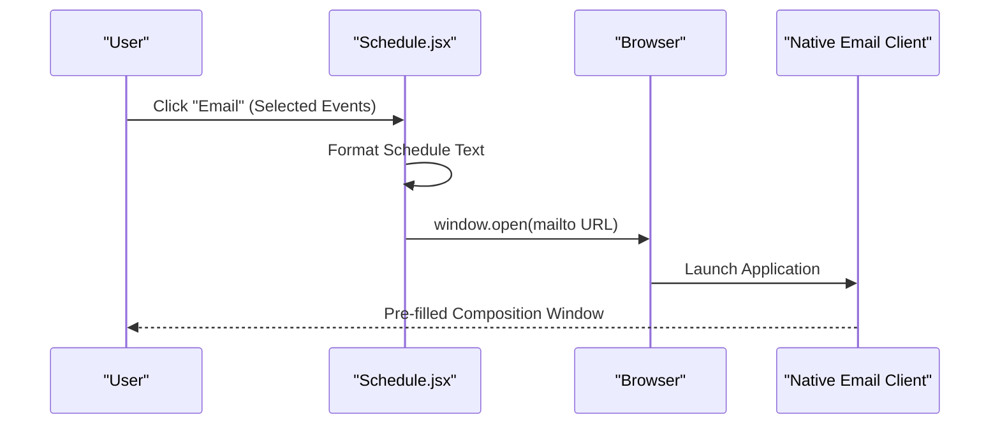
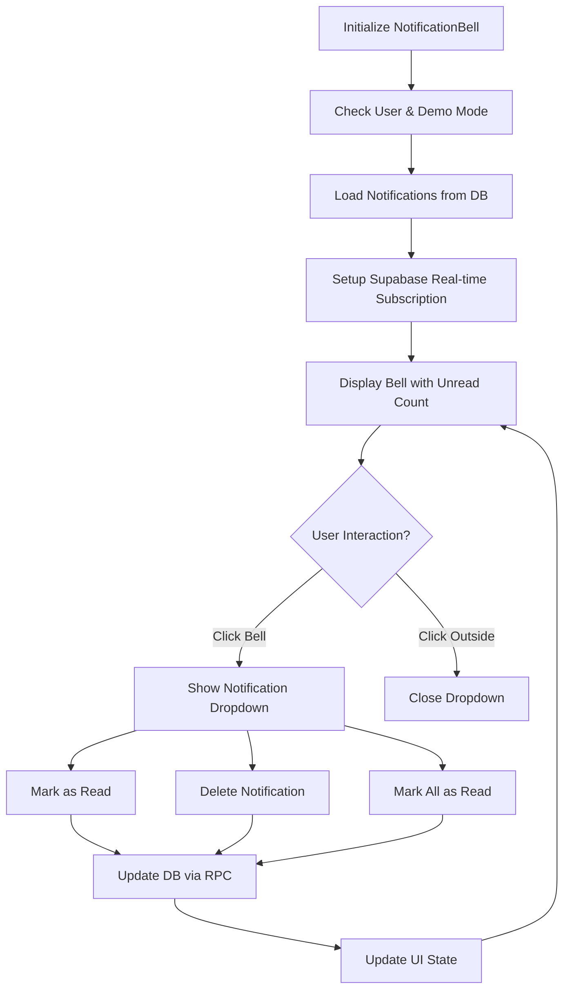
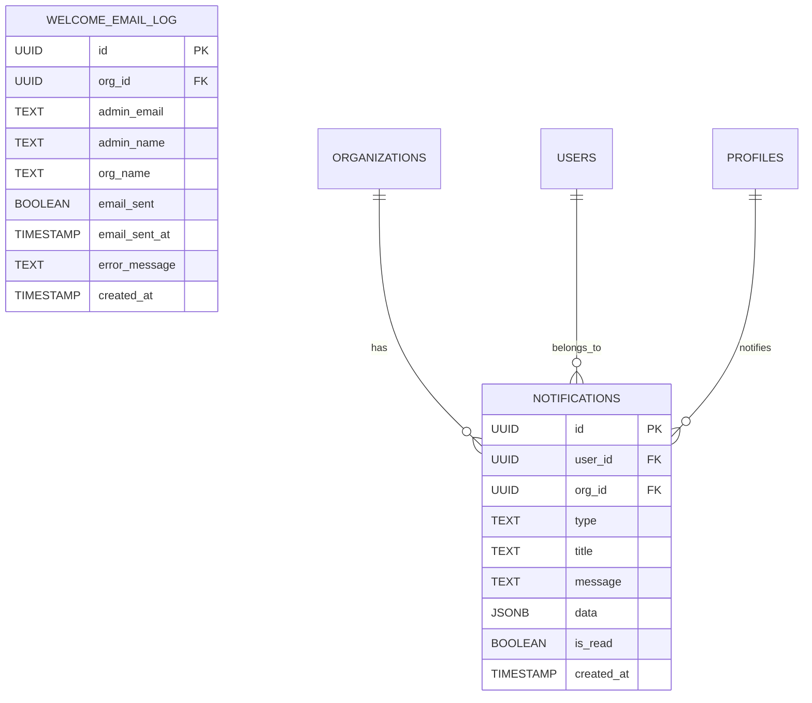
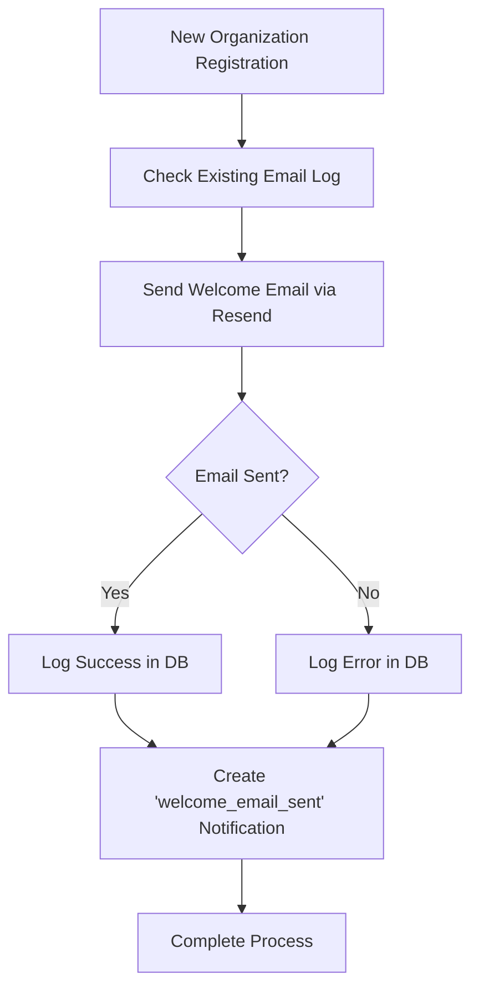
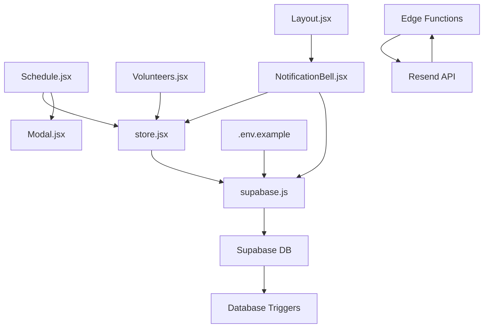

# Email Notification Integration

<cite>
**Referenced Files in This Document**
- [Schedule.jsx](file://src/pages/Schedule.jsx)
- [Volunteers.jsx](file://src/pages/Volunteers.jsx)
- [Modal.jsx](file://src/components/Modal.jsx)
- [NotificationBell.jsx](file://src/components/NotificationBell.jsx)
- [store.jsx](file://src/services/store.jsx)
- [supabase.js](file://src/services/supabase.js)
- [Layout.jsx](file://src/components/Layout.jsx)
- [supabase-notifications.sql](file://supabase-notifications.sql)
- [send-welcome-email/index.ts](file://supabase/functions/send-welcome-email/index.ts)
- [.env.example](file://.env.example)
</cite>

## Update Summary
**Changes Made**
- Added comprehensive real-time notification system with NotificationBell component
- Integrated database-driven notification management with Supabase real-time capabilities
- Enhanced welcome email automation with Supabase Edge Functions
- Added automated notification triggers for new registrations and member requests
- Updated architecture to support both email integration and real-time notifications

## Table of Contents
1. [Introduction](#introduction)
2. [Project Structure](#project-structure)
3. [Core Components](#core-components)
4. [Architecture Overview](#architecture-overview)
5. [Detailed Component Analysis](#detailed-component-analysis)
6. [Real-Time Notification System](#real-time-notification-system)
7. [Automated Welcome Email System](#automated-welcome-email-system)
8. [Dependency Analysis](#dependency-analysis)
9. [Performance Considerations](#performance-considerations)
10. [Troubleshooting Guide](#troubleshooting-guide)
11. [Conclusion](#conclusion)

## Introduction
This document explains the comprehensive notification system that enables both traditional email functionality and modern real-time notifications for team communication. The system now features a dual notification approach: the existing email modal interface for generating roster details and sending emails to assigned volunteers, alongside a sophisticated real-time notification bell with Supabase real-time capabilities. Additionally, it includes automated welcome emails triggered by new organization registrations and member requests, providing a complete communication ecosystem for volunteer coordination.

## Project Structure
The notification system spans multiple interconnected components:
- Schedule page: orchestrates email generation, modal display, recipient management, and sending workflow
- Volunteers page: displays volunteer contact information used for recipient selection
- Modal component: reusable dialog container for the email interface
- NotificationBell component: real-time notification system with Supabase integration
- Store service: provides access to volunteers, events, assignments data and authentication state
- Supabase service: connects to the backend database for data persistence and real-time subscriptions
- Database schema: comprehensive notifications table with triggers and policies
- Edge Functions: automated welcome email system with Resend integration
- Environment configuration: defines Supabase connection settings and email service credentials

**Diagram sources**
- [Schedule.jsx:1-935](file://src/pages/Schedule.jsx#L1-L935)
- [Volunteers.jsx:1-360](file://src/pages/Volunteers.jsx#L1-L360)
- [Modal.jsx:1-50](file://src/components/Modal.jsx#L1-L50)
- [NotificationBell.jsx:1-292](file://src/components/NotificationBell.jsx#L1-L292)
- [Layout.jsx:1-198](file://src/components/Layout.jsx#L1-L198)
- [store.jsx:1-1307](file://src/services/store.jsx#L1-L1307)
- [supabase.js:1-37](file://src/services/supabase.js#L1-L37)
- [supabase-notifications.sql:1-186](file://supabase-notifications.sql#L1-L186)
- [send-welcome-email/index.ts:1-349](file://supabase/functions/send-welcome-email/index.ts#L1-L349)
- [.env.example:1-5](file://.env.example#L1-L5)

**Section sources**
- [Schedule.jsx:1-935](file://src/pages/Schedule.jsx#L1-L935)
- [Volunteers.jsx:1-360](file://src/pages/Volunteers.jsx#L1-L360)
- [Modal.jsx:1-50](file://src/components/Modal.jsx#L1-L50)
- [NotificationBell.jsx:1-292](file://src/components/NotificationBell.jsx#L1-L292)
- [Layout.jsx:1-198](file://src/components/Layout.jsx#L1-L198)
- [store.jsx:1-1307](file://src/services/store.jsx#L1-L1307)
- [supabase.js:1-37](file://src/services/supabase.js#L1-L37)
- [supabase-notifications.sql:1-186](file://supabase-notifications.sql#L1-L186)
- [send-welcome-email/index.ts:1-349](file://supabase/functions/send-welcome-email/index.ts#L1-L349)
- [.env.example:1-5](file://.env.example#L1-L5)

## Core Components
- **Email Modal Interface**: Provides recipient selection, manual input, subject/message editing, and send confirmation
- **Recipient Management**: Adds/removes recipients via dropdown or manual input with duplicate prevention
- **Template Generation**: Builds event-specific roster details and message content
- **Native Email Client Integration**: Uses mailto links to open the user's default email client
- **Real-time Notification Bell**: Comprehensive notification system with Supabase real-time capabilities
- **Database-driven Notifications**: Automated notification triggers for new registrations and member requests
- **Automated Welcome Emails**: Edge Function-based welcome email system with Resend integration
- **Volunteer Contact Information**: Retrieves volunteer names and emails from the store for recipient population

**Section sources**
- [Schedule.jsx:19-142](file://src/pages/Schedule.jsx#L19-L142)
- [Volunteers.jsx:197-206](file://src/pages/Volunteers.jsx#L197-L206)
- [store.jsx:14-18](file://src/services/store.jsx#L14-L18)
- [NotificationBell.jsx:1-292](file://src/components/NotificationBell.jsx#L1-L292)
- [supabase-notifications.sql:1-186](file://supabase-notifications.sql#L1-L186)
- [send-welcome-email/index.ts:1-349](file://supabase/functions/send-welcome-email/index.ts#L1-L349)

## Architecture Overview
The notification system follows a hybrid architecture combining traditional email workflows with modern real-time notifications:
- User triggers email generation from the schedule view
- System builds a recipient list from event assignments
- Template content is generated with event details and roster formatting
- Email modal opens with pre-filled subject and message
- Users manage recipients via dropdown or manual input
- On send, the system validates recipients and opens the native email client
- Real-time notifications are delivered instantly via Supabase Postgres changes
- Automated welcome emails are processed through Supabase Edge Functions
- Database triggers ensure notifications are created for system events

**Diagram sources**
- [Schedule.jsx:62-95](file://src/pages/Schedule.jsx#L62-L95)
- [Schedule.jsx:97-142](file://src/pages/Schedule.jsx#L97-L142)
- [NotificationBell.jsx:20-37](file://src/components/NotificationBell.jsx#L20-L37)
- [NotificationBell.jsx:73-106](file://src/components/NotificationBell.jsx#L73-L106)
- [supabase-notifications.sql:96-128](file://supabase-notifications.sql#L96-L128)
- [send-welcome-email/index.ts:12-349](file://supabase/functions/send-welcome-email/index.ts#L12-L349)

## Detailed Component Analysis

### Email Modal Interface
The email modal provides a structured interface for composing and sending emails:
- Recipient selection via a dropdown populated from volunteers
- Manual recipient input with Enter key support
- Visual tag display for added recipients with remove controls
- Subject and message fields for customization
- Send button that validates recipients and opens the native email client

```mermaid
flowchart TD
Start(["Open Email Modal"]) --> RecipientInput["Manual Input Field"]
RecipientInput --> AddBtn["Add Button"]
AddBtn --> ValidateInput["Validate Input"]
ValidateInput --> InputValid{"Valid?"}
InputValid --> |No| ShowError["Show Error Message"]
InputValid --> |Yes| AddToTags["Add to Recipients Tags"]
AddToTags --> ResetInput["Reset Input Field"]
Start --> VolunteerDropdown["Volunteer Dropdown"]
VolunteerDropdown --> SelectVolunteer["Select Volunteer"]
SelectVolunteer --> PreventDup{"Duplicate?"}
PreventDup --> |Yes| Skip["Skip Addition"]
PreventDup --> |No| AddToTags
RecipientsTags["Recipients Tags"] --> RemoveTag["Remove Individual Tag"]
RemoveTag --> UpdateList["Update Recipients List"]
UpdateList --> ReadyToSend["Ready to Send"]
ReadyToSend --> SendButton["Send Email Button"]
SendButton --> ValidateRecipients["Validate Recipients Count"]
ValidateRecipients --> HasRecipients{"Any Recipients?"}
HasRecipients --> |No| AlertNoRecipients["Alert: Add Recipients"]
HasRecipients --> |Yes| OpenMailto["Open Native Email Client"]
```

**Diagram sources**
- [Schedule.jsx:610-727](file://src/pages/Schedule.jsx#L610-L727)
- [Schedule.jsx:97-142](file://src/pages/Schedule.jsx#L97-L142)

**Section sources**
- [Schedule.jsx:610-727](file://src/pages/Schedule.jsx#L610-L727)

### Recipient Validation and Duplicate Prevention
The system implements robust validation and deduplication:
- Input validation accepts either a volunteer name/email or a raw email address
- Duplicate prevention checks against existing recipients before adding
- Volunteer dropdown prevents adding duplicates by checking email presence
- Manual input validation ensures only valid entries are accepted

**Diagram sources**
- [Schedule.jsx:97-124](file://src/pages/Schedule.jsx#L97-L124)
- [Schedule.jsx:623-636](file://src/pages/Schedule.jsx#L623-L636)

**Section sources**
- [Schedule.jsx:97-124](file://src/pages/Schedule.jsx#L97-L124)
- [Schedule.jsx:623-636](file://src/pages/Schedule.jsx#L623-L636)

### Email Template Generation
Template generation creates structured content with event details and formatted roster information:
- Subject line includes event title and date
- Message body includes event title, date, time, and roster details
- Roster formatting lists roles, volunteers, and associated details
- Unique recipient extraction removes duplicates from assignments

**Diagram sources**
- [Schedule.jsx:62-95](file://src/pages/Schedule.jsx#L62-L95)
- [Schedule.jsx:74-87](file://src/pages/Schedule.jsx#L74-L87)

**Section sources**
- [Schedule.jsx:62-95](file://src/pages/Schedule.jsx#L62-L95)
- [Schedule.jsx:74-87](file://src/pages/Schedule.jsx#L74-L87)

### Native Email Client Integration
The system integrates with native email clients using mailto links:
- Composes mailto URLs with encoded subject and body
- Opens the default email client for user interaction
- Supports sharing selected events via WhatsApp and printing schedules

**Diagram sources**
- [Schedule.jsx:224-229](file://src/pages/Schedule.jsx#L224-L229)

**Section sources**
- [Schedule.jsx:224-229](file://src/pages/Schedule.jsx#L224-L229)

### Volunteer Contact Information Integration
Volunteer contact information is central to the email system:
- Volunteer list displays names and contact details
- Email modal uses volunteer data for dropdown selection
- Recipient management leverages volunteer email addresses
- Data persistence handled through Supabase integration

**Section sources**
- [Volunteers.jsx:197-206](file://src/pages/Volunteers.jsx#L197-L206)
- [store.jsx:14-18](file://src/services/store.jsx#L14-L18)
- [supabase.js:1-13](file://src/services/supabase.js#L1-L13)

## Real-Time Notification System

### NotificationBell Component Architecture
The NotificationBell component provides a comprehensive real-time notification system:
- Real-time subscription to Supabase PostgreSQL changes
- Automatic notification loading and display
- Interactive notification management (mark as read, delete)
- Unread count tracking and badge display
- Demo mode support with simulated notifications

**Diagram sources**
- [NotificationBell.jsx:16-37](file://src/components/NotificationBell.jsx#L16-L37)
- [NotificationBell.jsx:73-106](file://src/components/NotificationBell.jsx#L73-L106)
- [NotificationBell.jsx:159-176](file://src/components/NotificationBell.jsx#L159-L176)

### Database-Driven Notification Management
The notification system is powered by a comprehensive database schema:
- Notifications table with user and organization relationships
- Row-level security policies for data isolation
- Triggers for automatic notification creation
- Indexes for optimal query performance
- JSONB data field for flexible notification content

**Diagram sources**
- [supabase-notifications.sql:7-17](file://supabase-notifications.sql#L7-L17)
- [supabase-notifications.sql:46-56](file://supabase-notifications.sql#L46-L56)

**Section sources**
- [NotificationBell.jsx:1-292](file://src/components/NotificationBell.jsx#L1-L292)
- [supabase-notifications.sql:1-186](file://supabase-notifications.sql#L1-L186)

## Automated Welcome Email System

### Edge Function Implementation
The welcome email system is implemented as a Supabase Edge Function:
- Automated processing of new organization registrations
- Integration with Resend email service
- Comprehensive error handling and logging
- Database logging of email attempts
- Notification creation upon successful email delivery

**Diagram sources**
- [send-welcome-email/index.ts:41-54](file://supabase/functions/send-welcome-email/index.ts#L41-L54)
- [send-welcome-email/index.ts:297-310](file://supabase/functions/send-welcome-email/index.ts#L297-L310)
- [send-welcome-email/index.ts:316-328](file://supabase/functions/send-welcome-email/index.ts#L316-L328)

### Database Integration and Triggers
The system integrates with database triggers for automatic notification creation:
- Trigger on new organization registration
- Trigger on new member requests
- Automatic notification creation for admins
- Data enrichment with organization and user information
- JSONB payload for flexible notification content

**Section sources**
- [send-welcome-email/index.ts:1-349](file://supabase/functions/send-welcome-email/index.ts#L1-L349)
- [supabase-notifications.sql:96-177](file://supabase-notifications.sql#L96-L177)

## Dependency Analysis
The notification system relies on several interconnected components:
- Schedule page depends on store hooks for data access
- Modal component provides reusable dialog infrastructure
- NotificationBell component handles real-time subscriptions and state management
- Store service manages authentication, user profiles, and data access
- Supabase service handles database connectivity and real-time subscriptions
- Database schema provides notification infrastructure and triggers
- Edge Functions handle external service integrations
- Environment configuration supplies backend credentials and service keys

**Diagram sources**
- [Schedule.jsx:1-935](file://src/pages/Schedule.jsx#L1-L935)
- [Volunteers.jsx:1-360](file://src/pages/Volunteers.jsx#L1-L360)
- [Modal.jsx:1-50](file://src/components/Modal.jsx#L1-L50)
- [NotificationBell.jsx:1-292](file://src/components/NotificationBell.jsx#L1-L292)
- [Layout.jsx:1-198](file://src/components/Layout.jsx#L1-L198)
- [store.jsx:1-1307](file://src/services/store.jsx#L1-L1307)
- [supabase.js:1-37](file://src/services/supabase.js#L1-L37)
- [supabase-notifications.sql:1-186](file://supabase-notifications.sql#L1-L186)
- [send-welcome-email/index.ts:1-349](file://supabase/functions/send-welcome-email/index.ts#L1-L349)
- [.env.example:1-5](file://.env.example#L1-L5)

**Section sources**
- [Schedule.jsx:1-935](file://src/pages/Schedule.jsx#L1-L935)
- [NotificationBell.jsx:1-292](file://src/components/NotificationBell.jsx#L1-L292)
- [Layout.jsx:1-198](file://src/components/Layout.jsx#L1-L198)
- [store.jsx:1-1307](file://src/services/store.jsx#L1-L1307)
- [supabase.js:1-37](file://src/services/supabase.js#L1-L37)
- [supabase-notifications.sql:1-186](file://supabase-notifications.sql#L1-L186)
- [send-welcome-email/index.ts:1-349](file://supabase/functions/send-welcome-email/index.ts#L1-L349)
- [.env.example:1-5](file://.env.example#L1-L5)

## Performance Considerations
- Recipient deduplication uses a Map-based approach for O(n) uniqueness filtering
- Template generation processes assignments efficiently with mapping and filtering
- Modal rendering uses controlled components to minimize re-renders
- Data fetching occurs via parallel promises in the store for optimal loading
- Real-time notifications use Supabase's efficient PostgreSQL change streams
- Database indexes optimize notification queries and sorting
- Edge Functions provide scalable email processing without server overhead
- Caching strategies prevent redundant database queries for notification counts

## Troubleshooting Guide
Common issues and resolutions:
- Missing environment variables: Ensure Supabase URL and anonymous key are configured in environment
- Empty recipient list: Verify that event assignments exist and volunteers are properly linked
- Duplicate recipients: The system prevents duplicates; check for case sensitivity in email addresses
- Invalid email input: Manual input validation requires '@' character for raw email entries
- Native email client not opening: Confirm browser allows pop-ups and default email app is set
- Real-time notifications not updating: Check Supabase connection and PostgreSQL change stream permissions
- Welcome email failures: Verify Resend API key configuration and email service credentials
- Database trigger issues: Ensure proper row-level security policies and trigger permissions
- Notification bell not displaying: Verify user authentication and organization membership

**Section sources**
- [.env.example:1-5](file://.env.example#L1-L5)
- [Schedule.jsx:97-142](file://src/pages/Schedule.jsx#L97-L142)
- [Schedule.jsx:224-229](file://src/pages/Schedule.jsx#L224-L229)
- [NotificationBell.jsx:16-37](file://src/components/NotificationBell.jsx#L16-L37)
- [send-welcome-email/index.ts:56-64](file://supabase/functions/send-welcome-email/index.ts#L56-L64)

## Conclusion
The enhanced notification system provides a comprehensive solution for modern team communication. It combines the familiar email notification workflow with cutting-edge real-time notifications, creating a seamless multi-channel communication experience. The addition of automated welcome emails and database-driven notification triggers ensures timely and relevant information delivery. The modular architecture maintains flexibility while delivering a robust, scalable notification infrastructure that supports both traditional email workflows and modern real-time communication patterns. This dual approach ensures effective communication across different user preferences and scenarios while maintaining system reliability and performance.