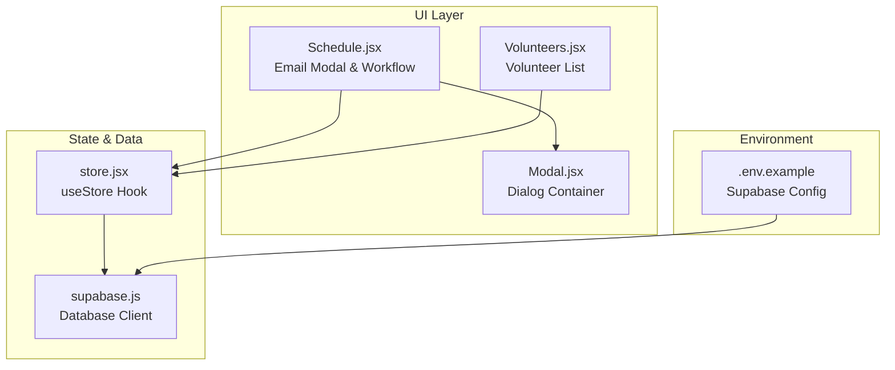
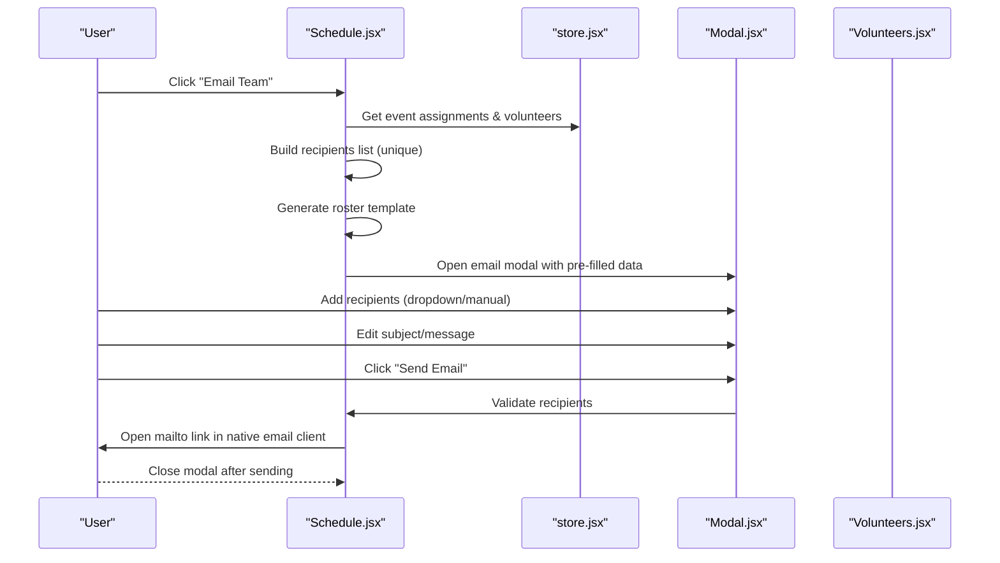
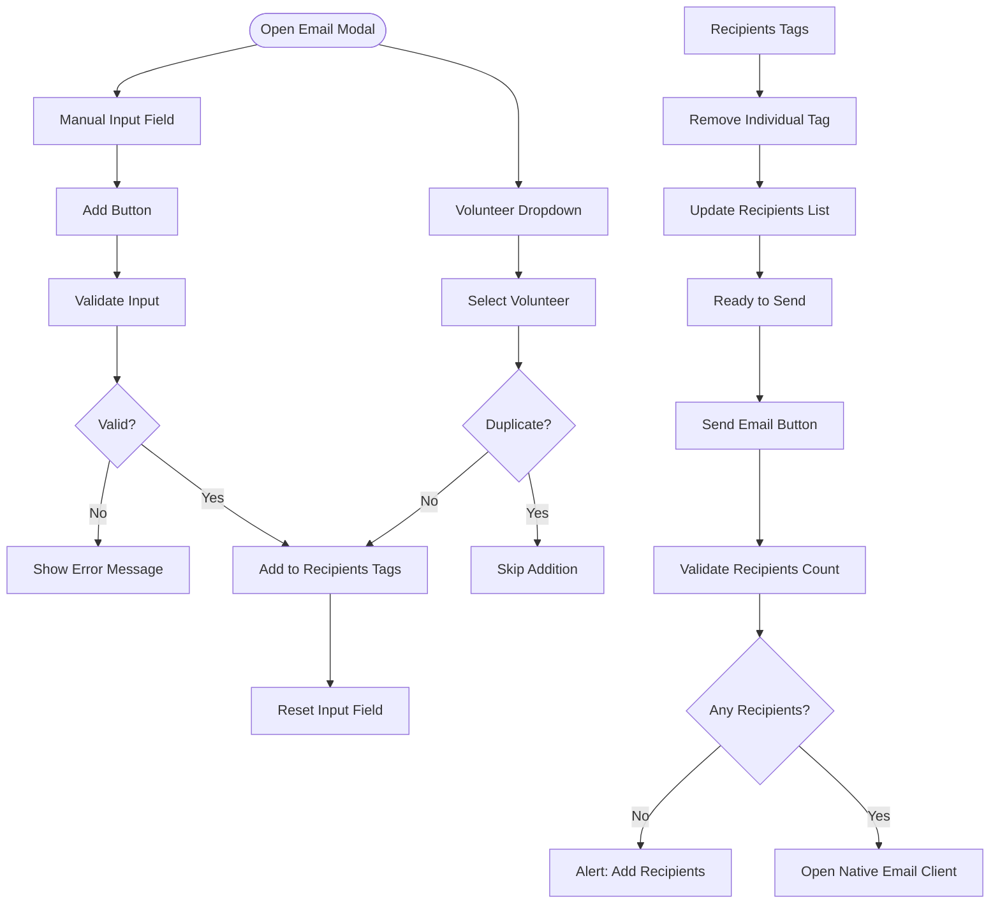
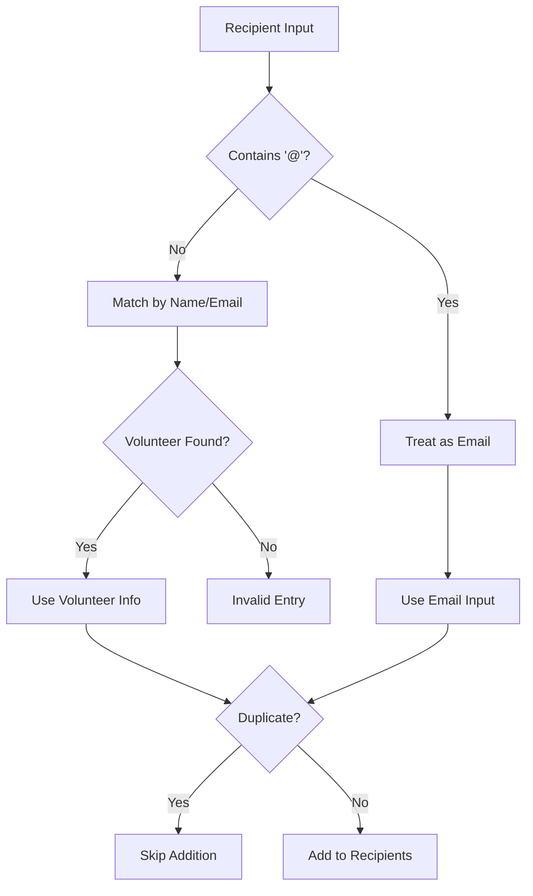
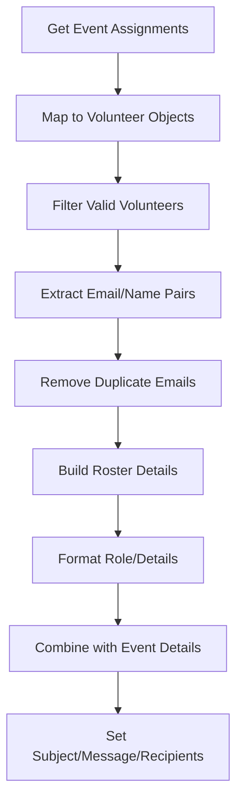
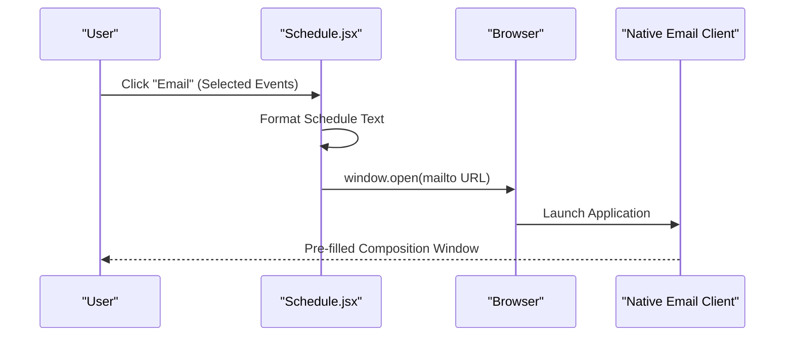
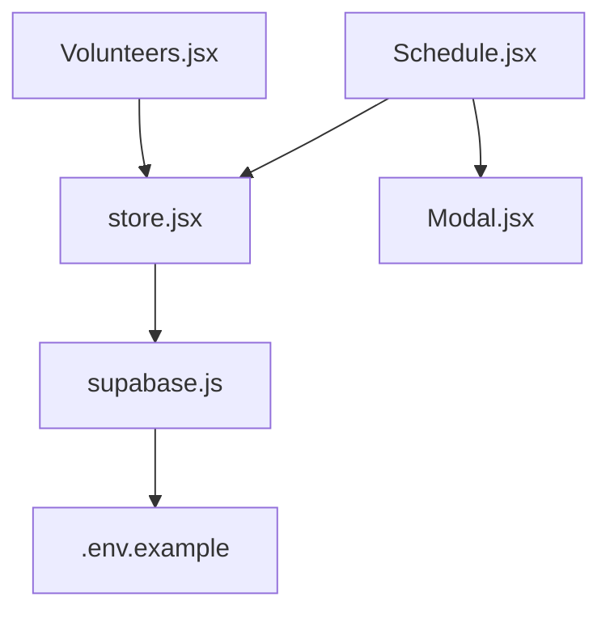

# Email Notification Integration

<cite>
**Referenced Files in This Document**
- [Schedule.jsx](file://src/pages/Schedule.jsx)
- [Volunteers.jsx](file://src/pages/Volunteers.jsx)
- [Modal.jsx](file://src/components/Modal.jsx)
- [store.jsx](file://src/services/store.jsx)
- [supabase.js](file://src/services/supabase.js)
- [.env.example](file://.env.example)
</cite>

## Table of Contents
1. [Introduction](#introduction)
2. [Project Structure](#project-structure)
3. [Core Components](#core-components)
4. [Architecture Overview](#architecture-overview)
5. [Detailed Component Analysis](#detailed-component-analysis)
6. [Dependency Analysis](#dependency-analysis)
7. [Performance Considerations](#performance-considerations)
8. [Troubleshooting Guide](#troubleshooting-guide)
9. [Conclusion](#conclusion)

## Introduction
This document explains the email notification integration system that enables team email functionality for generating roster details and sending emails to assigned volunteers. It covers the email modal interface with recipient management, validation and duplicate prevention logic, template generation with event details, and the integration with native email clients via mailto links. The system leverages volunteer contact information stored in the database and provides a user-friendly interface for composing and sending notifications.

## Project Structure
The email integration spans several key files:
- Schedule page: orchestrates email generation, modal display, recipient management, and sending workflow
- Volunteers page: displays volunteer contact information used for recipient selection
- Modal component: reusable dialog container for the email interface
- Store service: provides access to volunteers, events, and assignments data
- Supabase service: connects to the backend database for data persistence
- Environment configuration: defines Supabase connection settings

**Diagram sources**
- [Schedule.jsx](file://src/pages/Schedule.jsx#L1-L731)
- [Volunteers.jsx](file://src/pages/Volunteers.jsx#L1-L354)
- [Modal.jsx](file://src/components/Modal.jsx#L1-L50)
- [store.jsx](file://src/services/store.jsx#L1-L472)
- [supabase.js](file://src/services/supabase.js#L1-L13)
- [.env.example](file://.env.example#L1-L5)

**Section sources**
- [Schedule.jsx](file://src/pages/Schedule.jsx#L1-L731)
- [Volunteers.jsx](file://src/pages/Volunteers.jsx#L1-L354)
- [Modal.jsx](file://src/components/Modal.jsx#L1-L50)
- [store.jsx](file://src/services/store.jsx#L1-L472)
- [supabase.js](file://src/services/supabase.js#L1-L13)
- [.env.example](file://.env.example#L1-L5)

## Core Components
- Email Modal Interface: Provides recipient selection, manual input, subject/message editing, and send confirmation
- Recipient Management: Adds/removes recipients via dropdown or manual input with duplicate prevention
- Template Generation: Builds event-specific roster details and message content
- Native Email Client Integration: Uses mailto links to open the user's default email client
- Volunteer Contact Information: Retrieves volunteer names and emails from the store for recipient population

**Section sources**
- [Schedule.jsx](file://src/pages/Schedule.jsx#L19-L142)
- [Volunteers.jsx](file://src/pages/Volunteers.jsx#L197-L206)
- [store.jsx](file://src/services/store.jsx#L14-L18)

## Architecture Overview
The email integration follows a reactive pattern:
- User triggers email generation from the schedule view
- System builds a recipient list from event assignments
- Template content is generated with event details and roster formatting
- Email modal opens with pre-filled subject and message
- Users manage recipients via dropdown or manual input
- On send, the system validates recipients and opens the native email client

**Diagram sources**
- [Schedule.jsx](file://src/pages/Schedule.jsx#L62-L95)
- [Schedule.jsx](file://src/pages/Schedule.jsx#L97-L142)
- [store.jsx](file://src/services/store.jsx#L14-L18)
- [Modal.jsx](file://src/components/Modal.jsx#L1-L50)
- [Volunteers.jsx](file://src/pages/Volunteers.jsx#L197-L206)

## Detailed Component Analysis

### Email Modal Interface
The email modal provides a structured interface for composing and sending emails:
- Recipient selection via a dropdown populated from volunteers
- Manual recipient input with Enter key support
- Visual tag display for added recipients with remove controls
- Subject and message fields for customization
- Send button that validates recipients and opens the native email client

**Diagram sources**
- [Schedule.jsx](file://src/pages/Schedule.jsx#L610-L727)
- [Schedule.jsx](file://src/pages/Schedule.jsx#L97-L142)

**Section sources**
- [Schedule.jsx](file://src/pages/Schedule.jsx#L610-L727)

### Recipient Validation and Duplicate Prevention
The system implements robust validation and deduplication:
- Input validation accepts either a volunteer name/email or a raw email address
- Duplicate prevention checks against existing recipients before adding
- Volunteer dropdown prevents adding duplicates by checking email presence
- Manual input validation ensures only valid entries are accepted

**Diagram sources**
- [Schedule.jsx](file://src/pages/Schedule.jsx#L97-L124)
- [Schedule.jsx](file://src/pages/Schedule.jsx#L623-L636)

**Section sources**
- [Schedule.jsx](file://src/pages/Schedule.jsx#L97-L124)
- [Schedule.jsx](file://src/pages/Schedule.jsx#L623-L636)

### Email Template Generation
Template generation creates structured content with event details and formatted roster information:
- Subject line includes event title and date
- Message body includes event title, date, time, and roster details
- Roster formatting lists roles, volunteers, and associated details
- Unique recipient extraction removes duplicates from assignments

**Diagram sources**
- [Schedule.jsx](file://src/pages/Schedule.jsx#L62-L95)
- [Schedule.jsx](file://src/pages/Schedule.jsx#L74-L87)

**Section sources**
- [Schedule.jsx](file://src/pages/Schedule.jsx#L62-L95)
- [Schedule.jsx](file://src/pages/Schedule.jsx#L74-L87)

### Native Email Client Integration
The system integrates with native email clients using mailto links:
- Composes mailto URLs with encoded subject and body
- Opens the default email client for user interaction
- Supports sharing selected events via WhatsApp and printing schedules

**Diagram sources**
- [Schedule.jsx](file://src/pages/Schedule.jsx#L224-L229)

**Section sources**
- [Schedule.jsx](file://src/pages/Schedule.jsx#L224-L229)

### Volunteer Contact Information Integration
Volunteer contact information is central to the email system:
- Volunteer list displays names and contact details
- Email modal uses volunteer data for dropdown selection
- Recipient management leverages volunteer email addresses
- Data persistence handled through Supabase integration

**Section sources**
- [Volunteers.jsx](file://src/pages/Volunteers.jsx#L197-L206)
- [store.jsx](file://src/services/store.jsx#L14-L18)
- [supabase.js](file://src/services/supabase.js#L1-L13)

## Dependency Analysis
The email integration relies on several interconnected components:
- Schedule page depends on store hooks for data access
- Modal component provides reusable dialog infrastructure
- Store service manages volunteer, event, and assignment data
- Supabase service handles database connectivity
- Environment configuration supplies backend credentials

**Diagram sources**
- [Schedule.jsx](file://src/pages/Schedule.jsx#L1-L731)
- [Volunteers.jsx](file://src/pages/Volunteers.jsx#L1-L354)
- [Modal.jsx](file://src/components/Modal.jsx#L1-L50)
- [store.jsx](file://src/services/store.jsx#L1-L472)
- [supabase.js](file://src/services/supabase.js#L1-L13)
- [.env.example](file://.env.example#L1-L5)

**Section sources**
- [Schedule.jsx](file://src/pages/Schedule.jsx#L1-L731)
- [store.jsx](file://src/services/store.jsx#L1-L472)
- [supabase.js](file://src/services/supabase.js#L1-L13)
- [.env.example](file://.env.example#L1-L5)

## Performance Considerations
- Recipient deduplication uses a Map-based approach for O(n) uniqueness filtering
- Template generation processes assignments efficiently with mapping and filtering
- Modal rendering uses controlled components to minimize re-renders
- Data fetching occurs via parallel promises in the store for optimal loading

## Troubleshooting Guide
Common issues and resolutions:
- Missing environment variables: Ensure Supabase URL and anonymous key are configured in environment
- Empty recipient list: Verify that event assignments exist and volunteers are properly linked
- Duplicate recipients: The system prevents duplicates; check for case sensitivity in email addresses
- Invalid email input: Manual input validation requires '@' character for raw email entries
- Native email client not opening: Confirm browser allows pop-ups and default email app is set

**Section sources**
- [.env.example](file://.env.example#L1-L5)
- [Schedule.jsx](file://src/pages/Schedule.jsx#L97-L142)
- [Schedule.jsx](file://src/pages/Schedule.jsx#L224-L229)

## Conclusion
The email notification integration provides a comprehensive solution for team communication. It combines efficient recipient management, robust validation, dynamic template generation, and seamless native email client integration. The modular architecture ensures maintainability while delivering a smooth user experience for volunteer coordination and scheduling communication.