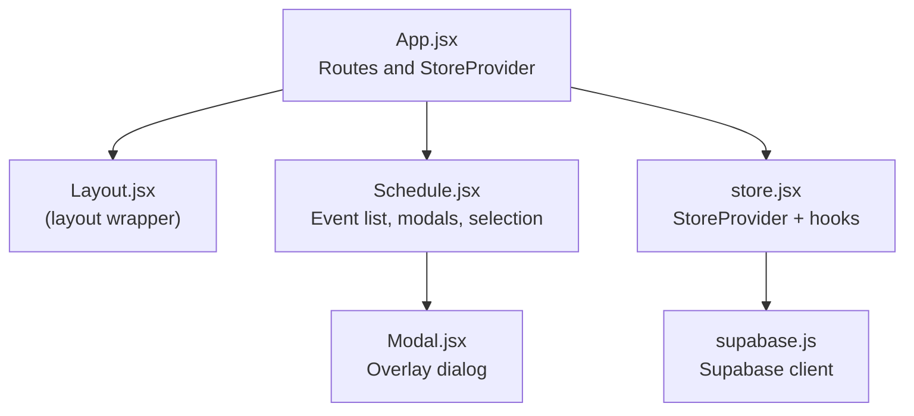
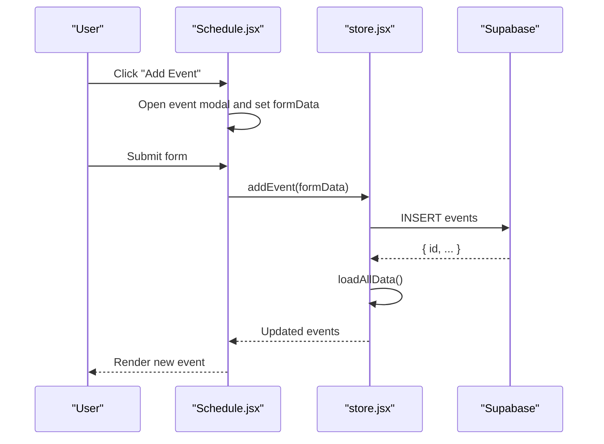
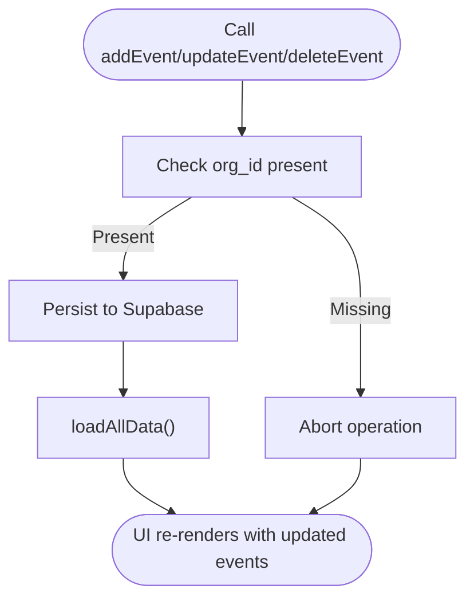
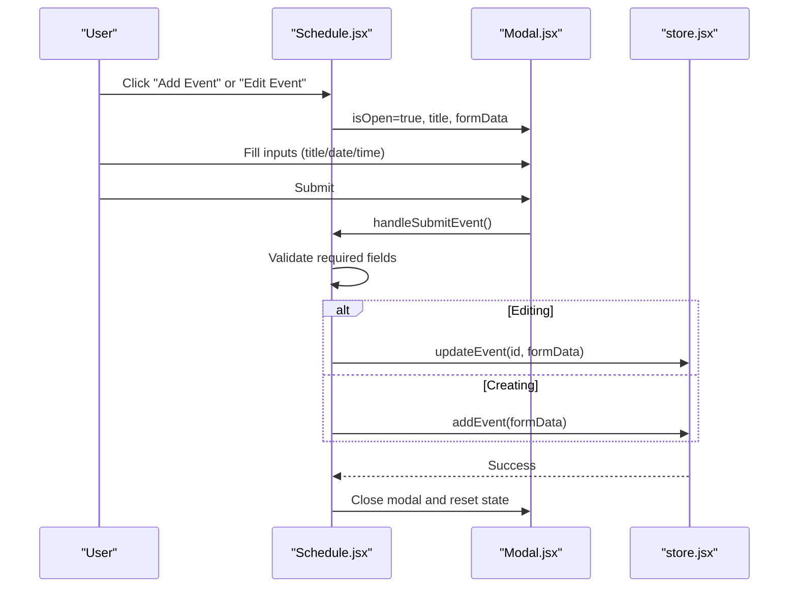
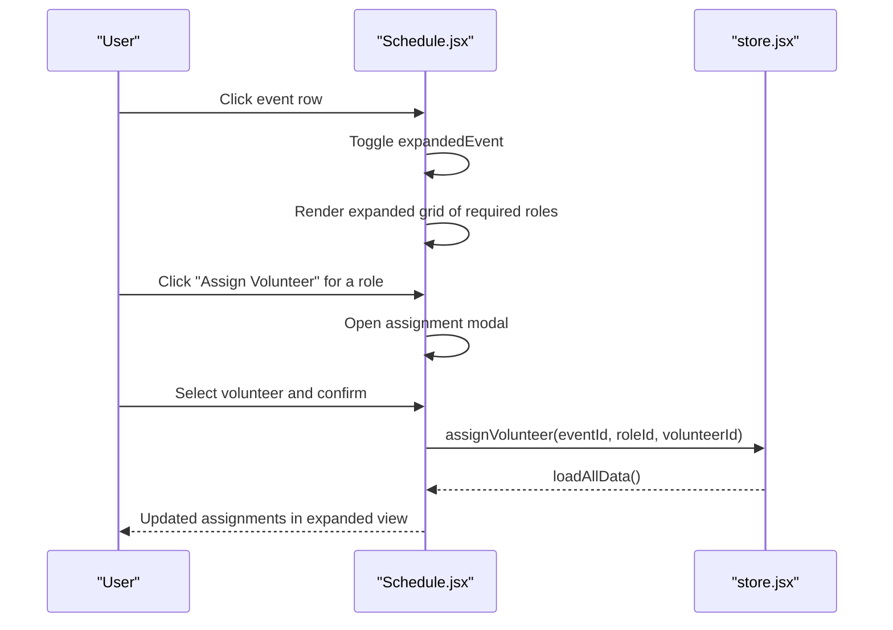
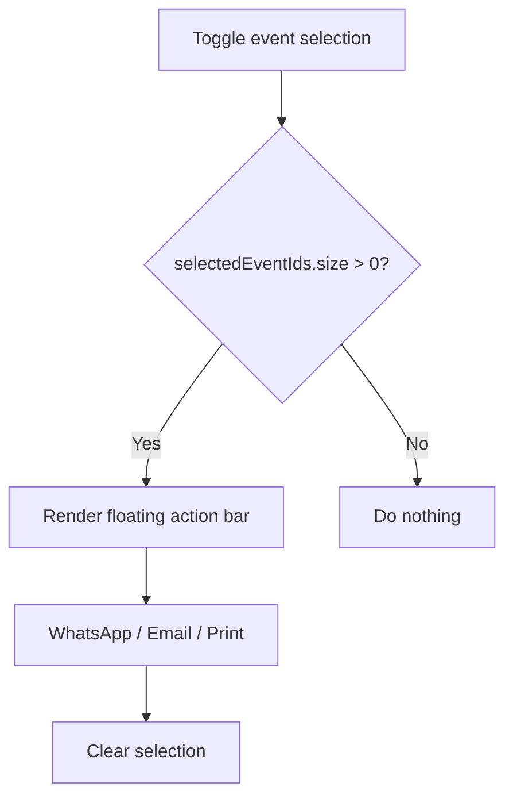
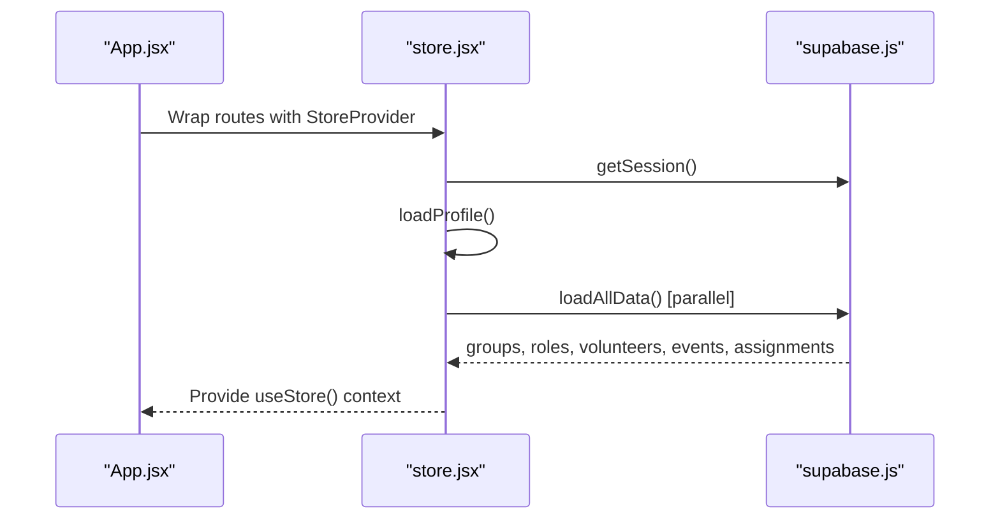
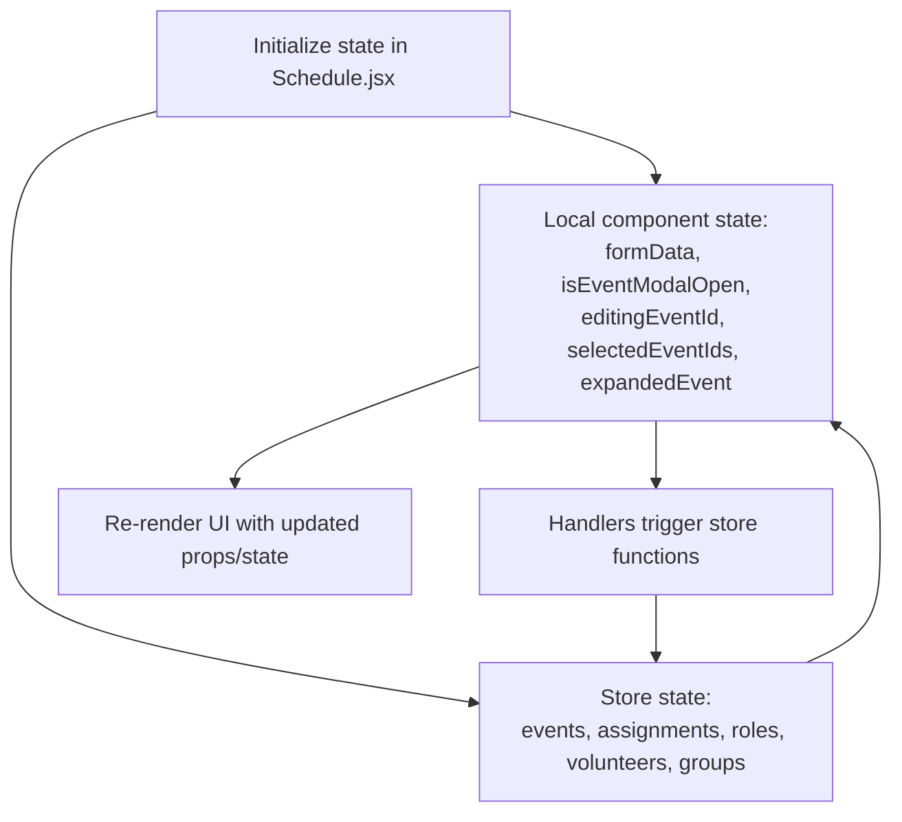
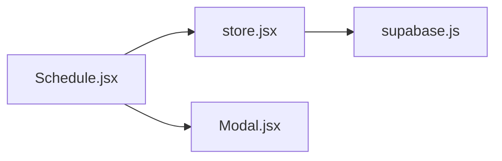

# Event Management System

<cite>
**Referenced Files in This Document**
- [App.jsx](file://src/App.jsx)
- [store.jsx](file://src/services/store.jsx)
- [supabase.js](file://src/services/supabase.js)
- [Schedule.jsx](file://src/pages/Schedule.jsx)
- [Modal.jsx](file://src/components/Modal.jsx)
</cite>

## Table of Contents
1. [Introduction](#introduction)
2. [Project Structure](#project-structure)
3. [Core Components](#core-components)
4. [Architecture Overview](#architecture-overview)
5. [Detailed Component Analysis](#detailed-component-analysis)
6. [Dependency Analysis](#dependency-analysis)
7. [Performance Considerations](#performance-considerations)
8. [Troubleshooting Guide](#troubleshooting-guide)
9. [Conclusion](#conclusion)

## Introduction
This document explains the event management system within the application, focusing on the creation, modification, and deletion of service events. It covers form validation and data persistence, event CRUD operations with detailed examples of addEvent, updateEvent, and deleteEvent functions, the event modal interface for adding new events with title, date, and time inputs, event expansion functionality for detailed assignment views, and the floating action bar for batch operations on multiple selected events. It also documents event selection mechanisms, state management patterns, and integration with the store provider.

## Project Structure
The event management system spans several layers:
- Application bootstrap wires the store provider at the top level.
- The Schedule page composes UI, state, and event actions.
- The store provider encapsulates Supabase integration and exposes CRUD functions.
- The Modal component provides reusable overlay UI.

**Diagram sources**
- [App.jsx](file://src/App.jsx#L13-L34)
- [Schedule.jsx](file://src/pages/Schedule.jsx#L1-L731)
- [store.jsx](file://src/services/store.jsx#L1-L472)
- [supabase.js](file://src/services/supabase.js#L1-L13)
- [Modal.jsx](file://src/components/Modal.jsx#L1-L50)

**Section sources**
- [App.jsx](file://src/App.jsx#L1-L37)
- [Schedule.jsx](file://src/pages/Schedule.jsx#L1-L731)
- [store.jsx](file://src/services/store.jsx#L1-L472)
- [supabase.js](file://src/services/supabase.js#L1-L13)
- [Modal.jsx](file://src/components/Modal.jsx#L1-L50)

## Core Components
- Store Provider: Centralizes data loading, authentication state, and CRUD operations for events and related entities. Exposes addEvent, updateEvent, and deleteEvent functions consumed by the Schedule page.
- Schedule Page: Implements the event list UI, event modal, assignment expansion, selection toggles, and floating action bar for batch operations.
- Modal Component: Provides a reusable overlay container with escape-to-close behavior and scrollable content area.

**Section sources**
- [store.jsx](file://src/services/store.jsx#L244-L292)
- [Schedule.jsx](file://src/pages/Schedule.jsx#L1-L731)
- [Modal.jsx](file://src/components/Modal.jsx#L1-L50)

## Architecture Overview
The event management architecture follows a unidirectional data flow:
- UI triggers actions via handlers in the Schedule page.
- Handlers call store-provided functions (addEvent, updateEvent, deleteEvent).
- Store functions persist changes to Supabase and refresh local state.
- UI re-renders with updated data.

**Diagram sources**
- [Schedule.jsx](file://src/pages/Schedule.jsx#L158-L177)
- [store.jsx](file://src/services/store.jsx#L244-L264)
- [supabase.js](file://src/services/supabase.js#L1-L13)

## Detailed Component Analysis

### Event CRUD Operations
- addEvent: Inserts a new event record with org_id, title, date, and time, then refreshes data.
- updateEvent: Updates an existing event’s fields by ID and refreshes data.
- deleteEvent: Removes an event by ID and refreshes data.

**Diagram sources**
- [store.jsx](file://src/services/store.jsx#L244-L292)
- [store.jsx](file://src/services/store.jsx#L78-L111)

**Section sources**
- [store.jsx](file://src/services/store.jsx#L244-L292)

### Event Modal Interface
The event modal supports:
- Title input with required validation.
- Date input with required validation.
- Time input with required validation.
- Conditional title text ("Create New Event" vs "Edit Event").
- Submission handler that validates inputs and calls addEvent or updateEvent.

**Diagram sources**
- [Schedule.jsx](file://src/pages/Schedule.jsx#L510-L566)
- [Schedule.jsx](file://src/pages/Schedule.jsx#L158-L177)
- [Modal.jsx](file://src/components/Modal.jsx#L1-L50)
- [store.jsx](file://src/services/store.jsx#L244-L292)

**Section sources**
- [Schedule.jsx](file://src/pages/Schedule.jsx#L510-L566)
- [Schedule.jsx](file://src/pages/Schedule.jsx#L158-L177)
- [Modal.jsx](file://src/components/Modal.jsx#L1-L50)

### Event Expansion and Assignment Views
The event card expands to show role-specific assignment slots:
- Displays required roles and current assignments.
- Shows volunteer details when assigned.
- Provides dropdowns to select area and designated role for each assignment.
- Supports assignment creation via an assignment modal.

**Diagram sources**
- [Schedule.jsx](file://src/pages/Schedule.jsx#L326-L478)
- [Schedule.jsx](file://src/pages/Schedule.jsx#L568-L607)
- [store.jsx](file://src/services/store.jsx#L294-L314)

**Section sources**
- [Schedule.jsx](file://src/pages/Schedule.jsx#L326-L478)
- [Schedule.jsx](file://src/pages/Schedule.jsx#L568-L607)
- [store.jsx](file://src/services/store.jsx#L294-L314)

### Floating Action Bar for Batch Operations
When one or more events are selected:
- A floating action bar appears at the bottom center.
- Provides batch actions: WhatsApp share, Email share, Print.
- Allows clearing selection.

**Diagram sources**
- [Schedule.jsx](file://src/pages/Schedule.jsx#L180-L191)
- [Schedule.jsx](file://src/pages/Schedule.jsx#L483-L508)

**Section sources**
- [Schedule.jsx](file://src/pages/Schedule.jsx#L180-L191)
- [Schedule.jsx](file://src/pages/Schedule.jsx#L483-L508)

### Event Lifecycle Management and Store Integration
- Initialization: The store provider loads session, profile, and organization, then fetches groups, roles, volunteers, events, and assignments in parallel.
- Persistence: CRUD functions insert, update, or delete records and then refresh data to keep the UI synchronized.
- Cleanup: On logout or session change, data is cleared.

**Diagram sources**
- [App.jsx](file://src/App.jsx#L13-L34)
- [store.jsx](file://src/services/store.jsx#L20-L111)
- [supabase.js](file://src/services/supabase.js#L1-L13)

**Section sources**
- [store.jsx](file://src/services/store.jsx#L20-L111)
- [App.jsx](file://src/App.jsx#L13-L34)

### State Management Patterns
- Local component state: Form state (formData), modal visibility (isEventModalOpen), editing mode (editingEventId), selection (selectedEventIds as a Set), and expansion (expandedEvent).
- Store state: Centralized events, assignments, roles, volunteers, groups, and derived user/profile data.
- Event selection pattern: Toggle selection by mutating a Set and re-rendering dependent UI.

**Diagram sources**
- [Schedule.jsx](file://src/pages/Schedule.jsx#L7-L25)
- [store.jsx](file://src/services/store.jsx#L13-L18)

**Section sources**
- [Schedule.jsx](file://src/pages/Schedule.jsx#L7-L25)
- [store.jsx](file://src/services/store.jsx#L13-L18)

## Dependency Analysis
- Schedule depends on useStore for events and CRUD functions.
- Store depends on Supabase client for persistence.
- Modal is a presentation-only component used by Schedule.

**Diagram sources**
- [Schedule.jsx](file://src/pages/Schedule.jsx#L1-L731)
- [store.jsx](file://src/services/store.jsx#L1-L472)
- [supabase.js](file://src/services/supabase.js#L1-L13)
- [Modal.jsx](file://src/components/Modal.jsx#L1-L50)

**Section sources**
- [Schedule.jsx](file://src/pages/Schedule.jsx#L1-L731)
- [store.jsx](file://src/services/store.jsx#L1-L472)
- [supabase.js](file://src/services/supabase.js#L1-L13)
- [Modal.jsx](file://src/components/Modal.jsx#L1-L50)

## Performance Considerations
- Parallel data loading: The store loads groups, roles, volunteers, events, and assignments concurrently to minimize initialization latency.
- Minimal re-renders: Local state updates (selection, modal, expansion) are scoped to the Schedule component to avoid unnecessary re-renders of unrelated components.
- Batch operations: The floating action bar enables efficient sharing/printing of multiple selected events without per-event navigation.

[No sources needed since this section provides general guidance]

## Troubleshooting Guide
- Validation failures: The event form requires title, date, and time. If missing, submission is aborted. Verify that required fields are populated before submitting.
- Confirmation prompts: Deleting an event requires confirmation. Ensure the confirmation dialog is acknowledged to proceed.
- Modal behavior: The modal prevents scrolling behind it and closes on Escape. If the modal does not close, check for event propagation issues in handlers.
- Data refresh: After CRUD operations, the store refreshes all data. If changes do not appear, verify network connectivity and Supabase credentials.

**Section sources**
- [Schedule.jsx](file://src/pages/Schedule.jsx#L158-L177)
- [Schedule.jsx](file://src/pages/Schedule.jsx#L144-L150)
- [Modal.jsx](file://src/components/Modal.jsx#L6-L20)
- [store.jsx](file://src/services/store.jsx#L78-L111)

## Conclusion
The event management system integrates a clean separation of concerns: the Schedule page manages UI and user interactions, the store provider handles data synchronization and persistence, and the Modal component standardizes overlays. The system supports robust CRUD workflows, validation, selection-driven batch operations, and responsive UI updates through a centralized store.