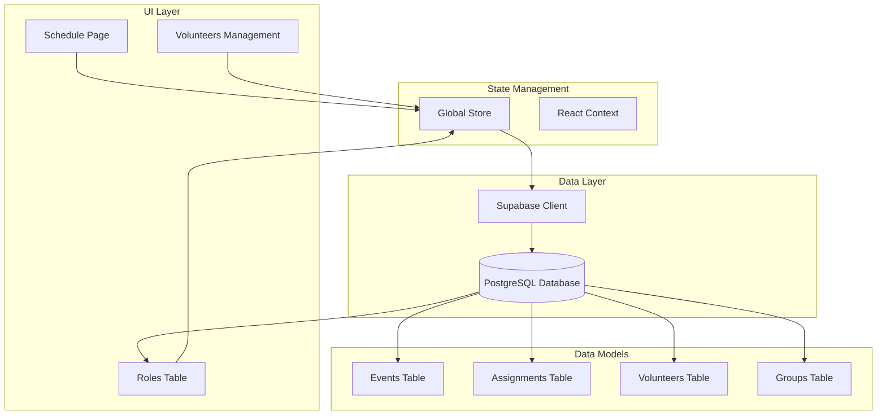
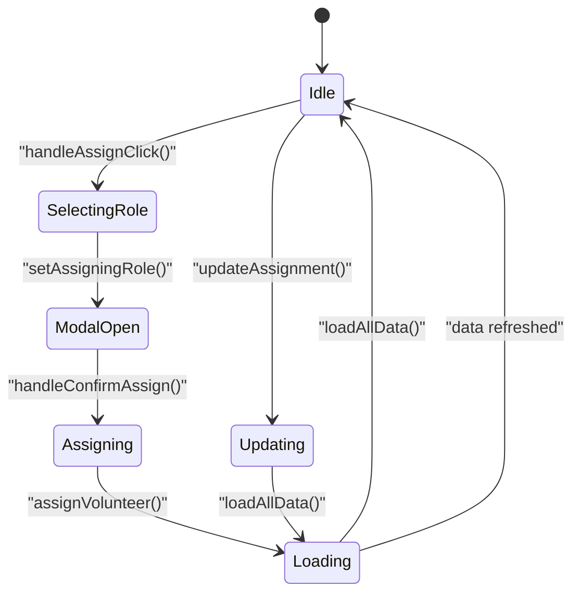
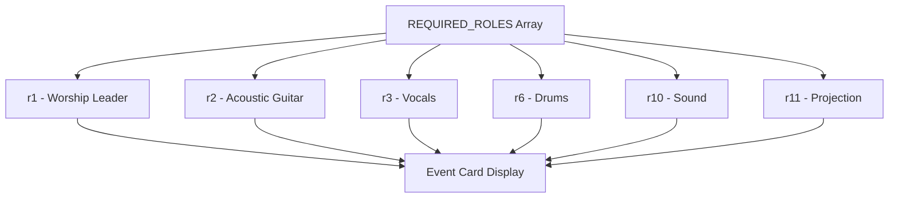
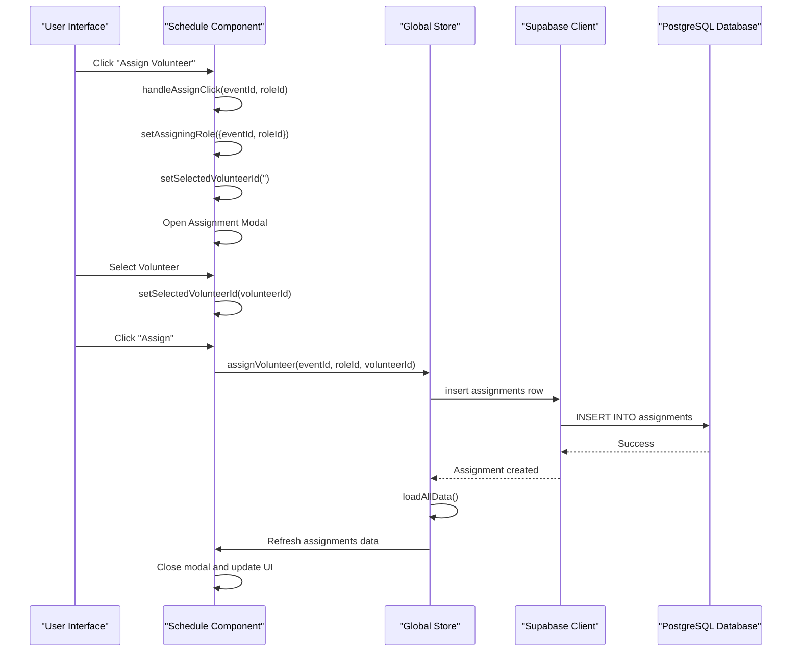
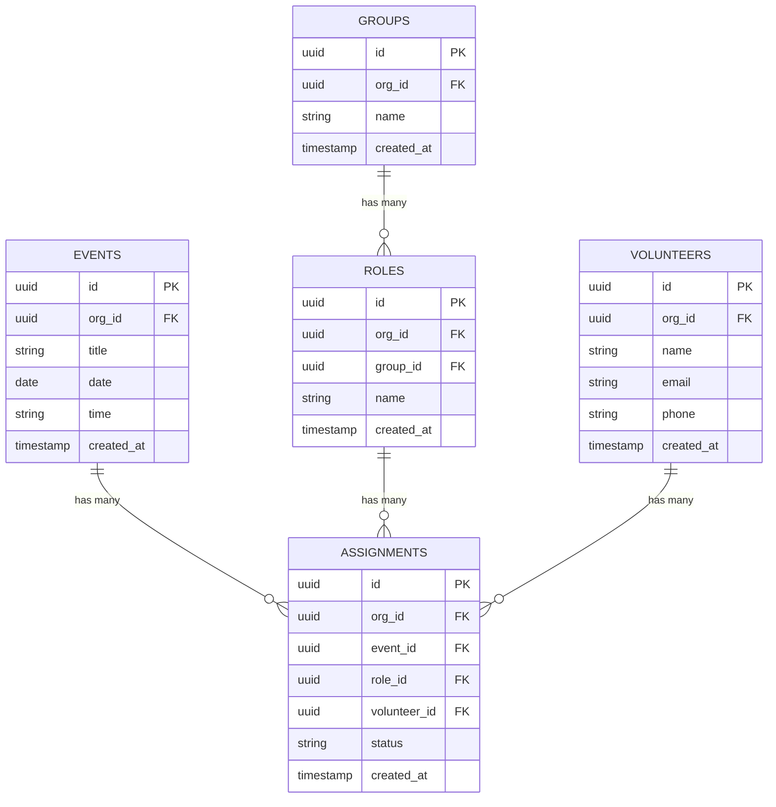
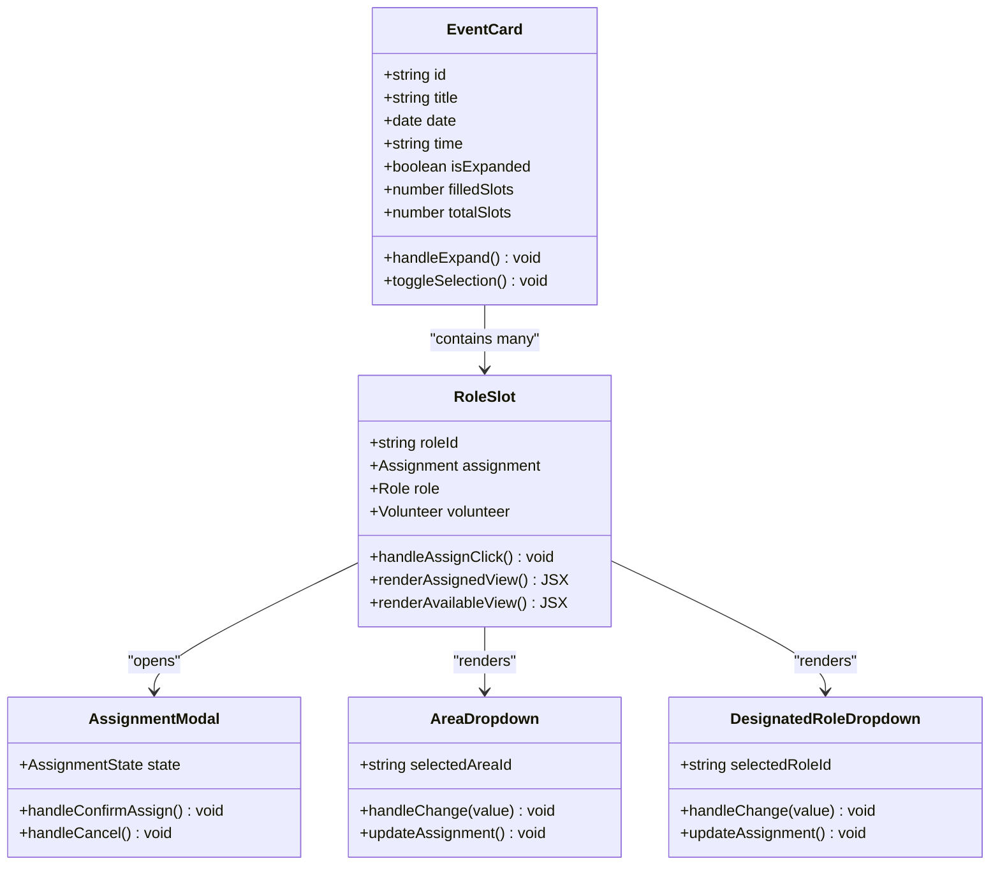
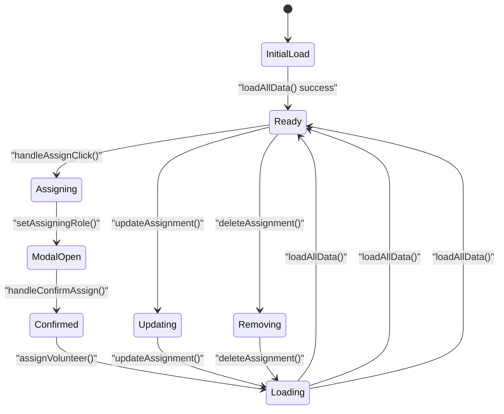
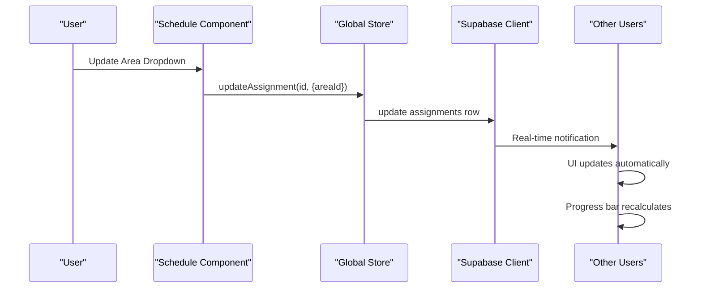
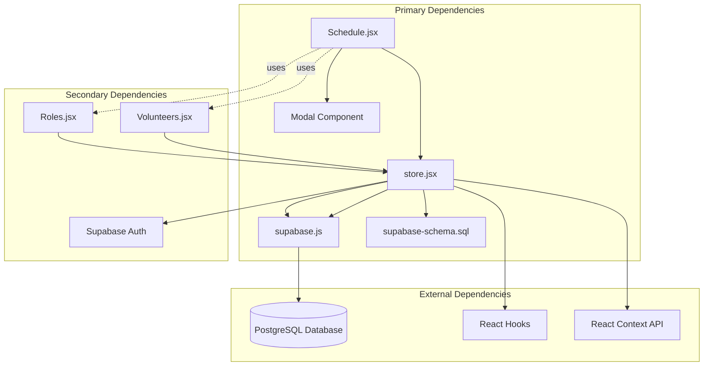
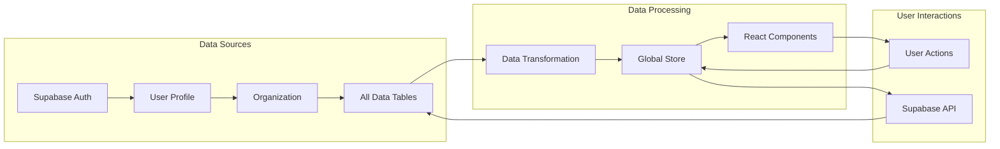

# Role Assignment System

<cite>
**Referenced Files in This Document**
- [Schedule.jsx](file://src/pages/Schedule.jsx)
- [store.jsx](file://src/services/store.jsx)
- [supabase.js](file://src/services/supabase.js)
- [supabase-schema.sql](file://supabase-schema.sql)
- [Roles.jsx](file://src/pages/Roles.jsx)
- [Volunteers.jsx](file://src/pages/Volunteers.jsx)
</cite>

## Table of Contents
1. [Introduction](#introduction)
2. [Project Structure](#project-structure)
3. [Core Components](#core-components)
4. [Architecture Overview](#architecture-overview)
5. [Detailed Component Analysis](#detailed-component-analysis)
6. [Dependency Analysis](#dependency-analysis)
7. [Performance Considerations](#performance-considerations)
8. [Troubleshooting Guide](#troubleshooting-guide)
9. [Conclusion](#conclusion)

## Introduction
The Role Assignment System enables administrators to assign volunteers to specific roles during events. The system provides a comprehensive workflow for managing volunteer assignments, including role selection, volunteer assignment, area designation, and real-time updates. This documentation covers the complete implementation of the assignment system, from data modeling to user interface interactions.

## Project Structure
The role assignment system spans multiple components within the application architecture:



**Diagram sources**
- [Schedule.jsx](file://src/pages/Schedule.jsx#L1-L731)
- [store.jsx](file://src/services/store.jsx#L1-L472)
- [supabase.js](file://src/services/supabase.js#L1-L13)

**Section sources**
- [Schedule.jsx](file://src/pages/Schedule.jsx#L1-L731)
- [store.jsx](file://src/services/store.jsx#L1-L472)

## Core Components

### Assignment State Management
The system maintains assignment state through React hooks and global state management:



**Diagram sources**
- [Schedule.jsx](file://src/pages/Schedule.jsx#L15-L49)
- [store.jsx](file://src/services/store.jsx#L294-L328)

The assignment state consists of two primary pieces of information:
- `assigningRole`: Tracks the current role being assigned with `{eventId, roleId}`
- `selectedVolunteerId`: Stores the currently selected volunteer ID

**Section sources**
- [Schedule.jsx](file://src/pages/Schedule.jsx#L15-L49)
- [store.jsx](file://src/services/store.jsx#L294-L328)

### Required Roles Array
The system defines a hardcoded array of required roles for demonstration purposes:



**Diagram sources**
- [Schedule.jsx](file://src/pages/Schedule.jsx#L34-L35)

**Section sources**
- [Schedule.jsx](file://src/pages/Schedule.jsx#L34-L35)

## Architecture Overview

### Data Flow Architecture
The role assignment system follows a unidirectional data flow pattern:



**Diagram sources**
- [Schedule.jsx](file://src/pages/Schedule.jsx#L37-L49)
- [store.jsx](file://src/services/store.jsx#L294-L314)

### Assignment Data Model
The assignment system uses a normalized relational database design:



**Diagram sources**
- [supabase-schema.sql](file://supabase-schema.sql#L57-L76)
- [supabase-schema.sql](file://supabase-schema.sql#L23-L38)

**Section sources**
- [supabase-schema.sql](file://supabase-schema.sql#L67-L76)
- [store.jsx](file://src/services/store.jsx#L294-L328)

## Detailed Component Analysis

### Assignment Modal Workflow
The assignment modal provides a streamlined workflow for volunteer assignment:

```mermaid
flowchart TD
Start([User clicks "Assign Volunteer"]) --> ModalOpen["Open Assignment Modal"]
ModalOpen --> SelectVolunteer["Select Volunteer from Dropdown"]
SelectVolunteer --> ValidateSelection{"Volunteer Selected?"}
ValidateSelection --> |No| KeepModalOpen["Keep Modal Open"]
ValidateSelection --> |Yes| ConfirmAssignment["Click 'Assign' Button"]
ConfirmAssignment --> CallAPI["Call assignVolunteer()"]
CallAPI --> UpdateUI["Update UI and Close Modal"]
KeepModalOpen --> ModalOpen
UpdateUI --> RefreshData["Refresh All Data"]
RefreshData --> End([Assignment Complete])
```

**Diagram sources**
- [Schedule.jsx](file://src/pages/Schedule.jsx#L568-L607)

The modal workflow includes:
- Volunteer selection dropdown populated from the volunteer database
- Form validation to ensure volunteer selection
- Confirmation process with error handling
- Automatic modal closure upon successful assignment

**Section sources**
- [Schedule.jsx](file://src/pages/Schedule.jsx#L568-L607)

### Role Assignment UI Implementation
The role assignment UI displays role slots within expandable event cards:



**Diagram sources**
- [Schedule.jsx](file://src/pages/Schedule.jsx#L415-L477)
- [Schedule.jsx](file://src/pages/Schedule.jsx#L438-L461)

**Section sources**
- [Schedule.jsx](file://src/pages/Schedule.jsx#L415-L477)

### Assignment State Management
The system manages assignment state through React hooks with persistence:



**Diagram sources**
- [Schedule.jsx](file://src/pages/Schedule.jsx#L15-L49)
- [store.jsx](file://src/services/store.jsx#L294-L328)

**Section sources**
- [Schedule.jsx](file://src/pages/Schedule.jsx#L15-L49)
- [store.jsx](file://src/services/store.jsx#L294-L328)

### Real-time Assignment Updates
The system provides real-time updates through Supabase's real-time capabilities:



**Diagram sources**
- [Schedule.jsx](file://src/pages/Schedule.jsx#L442-L443)
- [store.jsx](file://src/services/store.jsx#L316-L328)

**Section sources**
- [Schedule.jsx](file://src/pages/Schedule.jsx#L442-L443)
- [store.jsx](file://src/services/store.jsx#L316-L328)

## Dependency Analysis

### Component Dependencies
The role assignment system has the following dependency relationships:



**Diagram sources**
- [Schedule.jsx](file://src/pages/Schedule.jsx#L1-L731)
- [store.jsx](file://src/services/store.jsx#L1-L472)
- [supabase.js](file://src/services/supabase.js#L1-L13)

### Data Flow Dependencies
The assignment system follows a strict data flow pattern:



**Diagram sources**
- [store.jsx](file://src/services/store.jsx#L78-L111)
- [store.jsx](file://src/services/store.jsx#L432-L460)

**Section sources**
- [store.jsx](file://src/services/store.jsx#L78-L111)
- [store.jsx](file://src/services/store.jsx#L432-L460)

## Performance Considerations

### Data Loading Optimization
The system implements several performance optimizations:

1. **Parallel Data Loading**: All data tables are loaded simultaneously using Promise.all
2. **Efficient Filtering**: Role assignments are filtered client-side for display
3. **Memoization**: React.memo could be implemented for expensive computations
4. **Virtual Scrolling**: Large lists could benefit from virtualization

### Assignment Operations
Assignment operations are optimized through:
- Single database transactions for assignment creation
- Batch updates for multiple role assignments
- Efficient state updates using immutable patterns

## Troubleshooting Guide

### Common Issues and Solutions

#### Assignment Creation Failures
**Problem**: Assignment fails to create
**Solution**: Check network connectivity and Supabase credentials
**Debug Steps**:
1. Verify Supabase URL and API key are configured
2. Check browser console for error messages
3. Ensure user has proper authentication

#### Volunteer Selection Issues
**Problem**: Volunteer dropdown appears empty
**Solution**: Verify volunteer data is loaded correctly
**Debug Steps**:
1. Check volunteer table data in Supabase
2. Verify organization filtering
3. Ensure volunteer roles are properly linked

#### Real-time Update Problems
**Problem**: Changes don't appear immediately
**Solution**: Check Supabase real-time subscriptions
**Debug Steps**:
1. Verify Supabase connection status
2. Check for real-time subscription errors
3. Ensure proper cleanup of subscriptions

**Section sources**
- [store.jsx](file://src/services/store.jsx#L54-L111)
- [supabase.js](file://src/services/supabase.js#L6-L8)

## Conclusion

The Role Assignment System provides a comprehensive solution for managing volunteer assignments during events. The system combines a clean React architecture with robust data management through Supabase, enabling real-time collaboration and efficient assignment workflows.

Key strengths of the implementation include:
- **Modular Architecture**: Clear separation of concerns between UI, state management, and data access
- **Real-time Updates**: Seamless synchronization across multiple users
- **Flexible Assignment**: Support for area designation and role customization
- **Scalable Design**: Normalized database schema supporting growth

The system successfully addresses the core requirements for role assignment management while maintaining performance and user experience standards. Future enhancements could include advanced filtering, bulk assignment operations, and enhanced reporting capabilities.