# Service Scheduling Platform

<cite>
**Referenced Files in This Document**
- [README.md](file://README.md)
- [package.json](file://package.json)
- [src/App.jsx](file://src/App.jsx)
- [src/main.jsx](file://src/main.jsx)
- [src/services/supabase.js](file://src/services/supabase.js)
- [src/services/store.jsx](file://src/services/store.jsx)
- [src/components/Layout.jsx](file://src/components/Layout.jsx)
- [src/components/AuthLayout.jsx](file://src/components/AuthLayout.jsx)
- [src/components/Modal.jsx](file://src/components/Modal.jsx)
- [src/components/FileUpload.jsx](file://src/components/FileUpload.jsx)
- [src/components/MusicPlaylist.jsx](file://src/components/MusicPlaylist.jsx)
- [src/pages/Dashboard.jsx](file://src/pages/Dashboard.jsx)
- [src/pages/Landing.jsx](file://src/pages/Landing.jsx)
- [src/pages/Login.jsx](file://src/pages/Login.jsx)
- [src/pages/Register.jsx](file://src/pages/Register.jsx)
- [src/pages/ManageMembers.jsx](file://src/pages/ManageMembers.jsx)
- [src/pages/Volunteers.jsx](file://src/pages/Volunteers.jsx)
- [src/pages/Schedule.jsx](file://src/pages/Schedule.jsx)
- [src/pages/Roles.jsx](file://src/pages/Roles.jsx)
- [src/utils/cn.js](file://src/utils/cn.js)
- [src/services/storage.js](file://src/services/storage.js)
- [supabase-schema.sql](file://supabase-schema.sql)
- [supabase-role-policies.sql](file://supabase-role-policies.sql)
- [src-tauri/tauri.conf.json](file://src-tauri/tauri.conf.json)
</cite>

## Update Summary
**Changes Made**
- Implemented comprehensive role-based access control system with admin/member roles
- Added conditional UI rendering based on user permissions for event management features
- Enhanced navigation with role-aware menu items and member management access
- Integrated database-level RLS policies enforcing organization-scoped data isolation
- Added member approval workflow with pending status management
- Updated all CRUD operations to respect role-based permissions

## Table of Contents
1. [Introduction](#introduction)
2. [Project Structure](#project-structure)
3. [Core Components](#core-components)
4. [Architecture Overview](#architecture-overview)
5. [Detailed Component Analysis](#detailed-component-analysis)
6. [Role-Based Access Control System](#role-based-access-control-system)
7. [Dependency Analysis](#dependency-analysis)
8. [Performance Considerations](#performance-considerations)
9. [Troubleshooting Guide](#troubleshooting-guide)
10. [Conclusion](#conclusion)
11. [Appendices](#appendices)

## Introduction
This document describes the Service Scheduling Platform built with React, Vite, Supabase, and Tauri. It focuses on the event management lifecycle (creation, modification, cancellation), calendar and date/time handling, role assignment for volunteers, status tracking, email notifications, print roster functionality, mobile scheduling access, recurring event patterns, resource allocation, capacity management, external calendar integration, conflict resolution, and administrative oversight.

**Updated** The platform now features a comprehensive role-based access control system that enforces organization-scoped permissions, with admin users having full CRUD access while regular members have limited view-only access. The system includes member approval workflows, conditional UI rendering based on permissions, and database-level Row Level Security policies.

## Project Structure
The application is a single-page React app with routing, a centralized store for state and data persistence, and a Supabase backend with role-based access control. It also supports desktop bundling via Tauri.

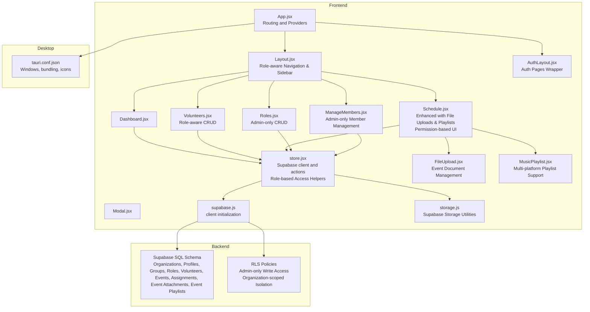

**Diagram sources**
- [src/App.jsx:1-37](file://src/App.jsx#L1-L37)
- [src/components/Layout.jsx:1-129](file://src/components/Layout.jsx#L1-L129)
- [src/components/AuthLayout.jsx:1-29](file://src/components/AuthLayout.jsx#L1-L29)
- [src/pages/Dashboard.jsx:1-90](file://src/pages/Dashboard.jsx#L1-L90)
- [src/pages/Volunteers.jsx:1-354](file://src/pages/Volunteers.jsx#L1-L354)
- [src/pages/Schedule.jsx:1-935](file://src/pages/Schedule.jsx#L1-L935)
- [src/pages/Roles.jsx:1-386](file://src/pages/Roles.jsx#L1-L386)
- [src/pages/ManageMembers.jsx:1-133](file://src/pages/ManageMembers.jsx#L1-L133)
- [src/components/Modal.jsx:1-50](file://src/components/Modal.jsx#L1-L50)
- [src/services/store.jsx:1-1279](file://src/services/store.jsx#L1-L1279)
- [src/services/supabase.js:1-13](file://src/services/supabase.js#L1-L13)
- [src/components/FileUpload.jsx:1-212](file://src/components/FileUpload.jsx#L1-L212)
- [src/components/MusicPlaylist.jsx:1-249](file://src/components/MusicPlaylist.jsx#L1-L249)
- [src/services/storage.js:1-59](file://src/services/storage.js#L1-L59)
- [supabase-schema.sql:1-286](file://supabase-schema.sql#L1-L286)
- [supabase-role-policies.sql:1-269](file://supabase-role-policies.sql#L1-L269)
- [src-tauri/tauri.conf.json:1-35](file://src-tauri/tauri.conf.json#L1-L35)

**Section sources**
- [src/App.jsx:1-37](file://src/App.jsx#L1-L37)
- [src/main.jsx:1-11](file://src/main.jsx#L1-L11)
- [package.json:1-44](file://package.json#L1-L44)
- [README.md:1-17](file://README.md#L1-L17)

## Core Components
- Centralized Store: Provides authentication state, organization/profile data, and CRUD actions for groups, roles, volunteers, events, assignments, file attachments, and event playlists. It includes role-based access helpers (isAdmin, isTeamMember, canEdit) and initializes the Supabase client with organization-scoped data loading.
- Supabase Client: Initializes the Supabase client using environment variables and guards missing configuration.
- UI Pages:
  - Dashboard: Overview cards and quick actions with role-aware content.
  - Volunteers: CRUD for volunteers with role-aware visibility and member management.
  - Schedule: Enhanced event listing with file attachments, music playlists, assignment management, email composition, print roster, selection sharing, and multi-event operations. Features conditional UI rendering based on user permissions.
  - Roles: Manage teams/groups and roles with admin-only access.
  - ManageMembers: Member approval workflow with pending status management and admin-only access.
- Layout and Modals: Navigation sidebar with role-aware menu items, authentication wrapper, and modal dialogs.
- Specialized Components:
  - FileUpload: Drag-and-drop file upload with support for PDF, DOC, MP3, images, and audio files.
  - MusicPlaylist: Multi-platform playlist management for YouTube, Spotify, Apple Music, and SoundCloud.

**Updated** The platform now implements comprehensive role-based access control with conditional UI rendering, member approval workflows, and database-level security enforcement.

**Section sources**
- [src/services/store.jsx:1-1279](file://src/services/store.jsx#L1-L1279)
- [src/services/supabase.js:1-13](file://src/services/supabase.js#L1-L13)
- [src/pages/Dashboard.jsx:1-90](file://src/pages/Dashboard.jsx#L1-L90)
- [src/pages/Volunteers.jsx:1-354](file://src/pages/Volunteers.jsx#L1-L354)
- [src/pages/Schedule.jsx:1-935](file://src/pages/Schedule.jsx#L1-L935)
- [src/pages/Roles.jsx:1-386](file://src/pages/Roles.jsx#L1-L386)
- [src/pages/ManageMembers.jsx:1-133](file://src/pages/ManageMembers.jsx#L1-L133)
- [src/components/Layout.jsx:1-129](file://src/components/Layout.jsx#L1-L129)
- [src/components/Modal.jsx:1-50](file://src/components/Modal.jsx#L1-L50)
- [src/components/FileUpload.jsx:1-212](file://src/components/FileUpload.jsx#L1-L212)
- [src/components/MusicPlaylist.jsx:1-249](file://src/components/MusicPlaylist.jsx#L1-L249)

## Architecture Overview
The frontend uses React with React Router for navigation and a custom store provider to manage global state with role-based access control. Data is persisted and synchronized via Supabase with organization-scoped Row Level Security policies. Authentication is handled by Supabase Auth, and the store listens to auth state changes. Desktop packaging is configured via Tauri.

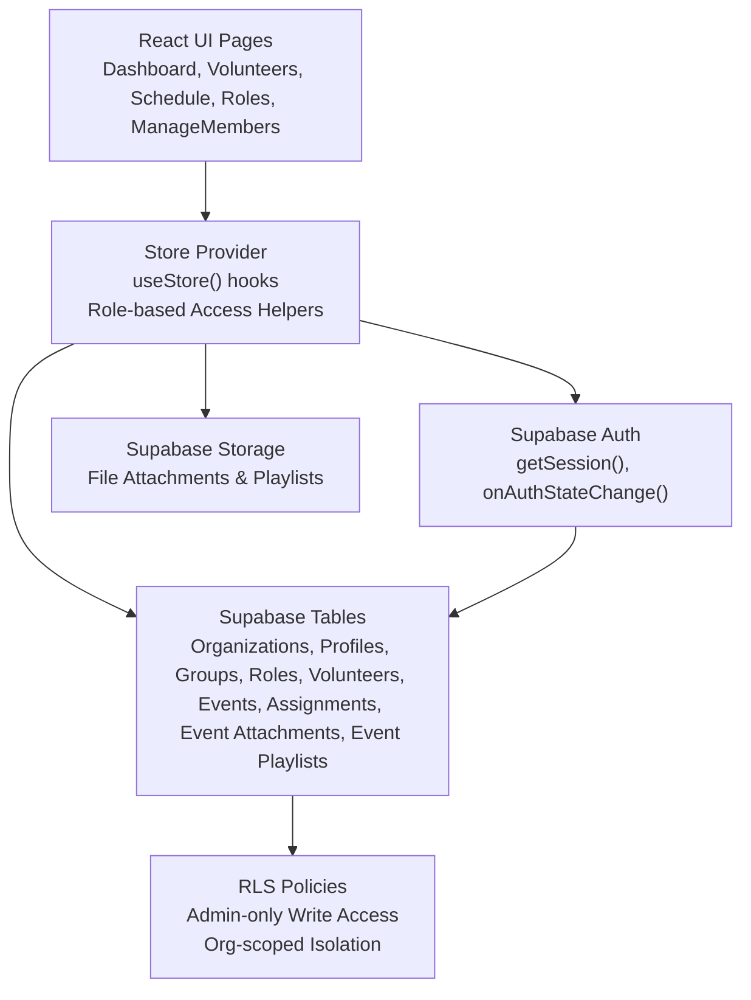

**Diagram sources**
- [src/services/store.jsx:1-1279](file://src/services/store.jsx#L1-L1279)
- [src/services/supabase.js:1-13](file://src/services/supabase.js#L1-L13)
- [supabase-schema.sql:1-286](file://supabase-schema.sql#L1-L286)
- [supabase-role-policies.sql:1-269](file://supabase-role-policies.sql#L1-L269)

## Detailed Component Analysis

### Enhanced Event Management System
- Creation: The Schedule page exposes a form to add events with title, date, and time. The store's addEvent persists the event under the current organization with admin-only access control.
- Modification: Editing an event updates title, date, and time via updateEvent with admin-only permission checks.
- Cancellation: Deleting an event removes it and cascades related assignments with admin-only permission enforcement.
- **Updated** Enhanced with file attachment and playlist management for comprehensive event preparation, all protected by role-based access control.

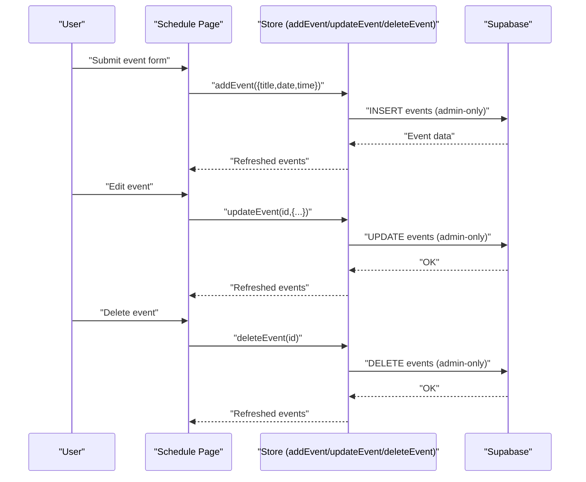

**Diagram sources**
- [src/pages/Schedule.jsx:206-225](file://src/pages/Schedule.jsx#L206-L225)
- [src/services/store.jsx:584-652](file://src/services/store.jsx#L584-L652)

**Section sources**
- [src/pages/Schedule.jsx:206-225](file://src/pages/Schedule.jsx#L206-L225)
- [src/services/store.jsx:584-652](file://src/services/store.jsx#L584-L652)

### Calendar Interface and Date/Time Management
- The calendar view displays events with month/day rendering and localized date formatting.
- Date/time inputs are HTML5 date and time pickers, ensuring browser-native validation and UX.
- Sorting and selection support allows grouping events by date for printing and sharing.
- **Updated** Enhanced with multi-event selection for bulk operations and improved floating action bar with permission-aware visibility.

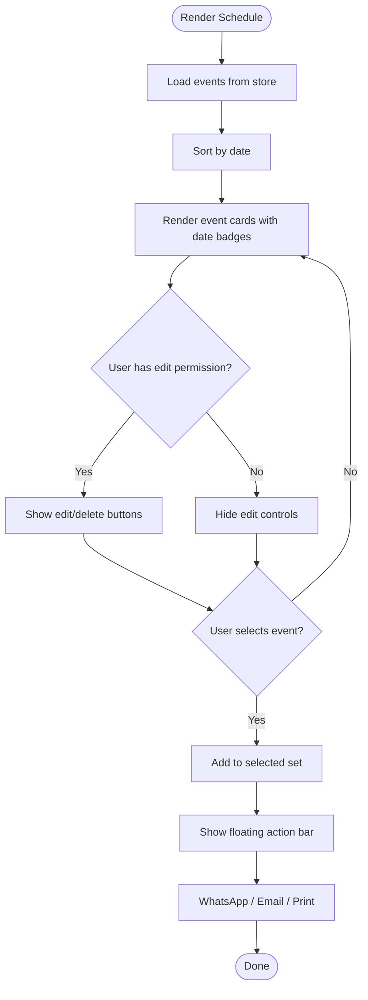

**Diagram sources**
- [src/pages/Schedule.jsx:427-666](file://src/pages/Schedule.jsx#L427-L666)
- [src/pages/Schedule.jsx:227-239](file://src/pages/Schedule.jsx#L227-L239)

**Section sources**
- [src/pages/Schedule.jsx:427-666](file://src/pages/Schedule.jsx#L427-L666)
- [src/pages/Schedule.jsx:227-239](file://src/pages/Schedule.jsx#L227-L239)

### Role Assignment System
- Required roles are pre-defined for a standard service and displayed as slots per event.
- Assigning a volunteer to a role creates an assignment record with status defaults to confirmed.
- Administrators can update area and designated role per assignment.
- **Updated** Enhanced assignment workflow with improved UI and better volunteer management, all protected by role-based access control.

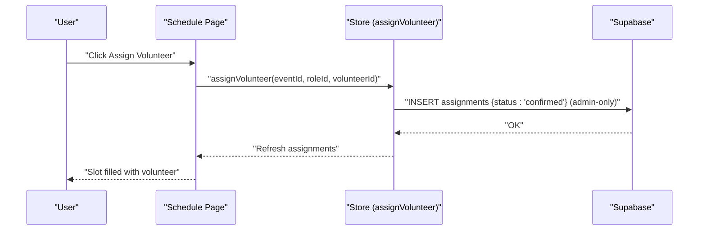

**Diagram sources**
- [src/pages/Schedule.jsx:78-97](file://src/pages/Schedule.jsx#L78-L97)
- [src/pages/Schedule.jsx:418-474](file://src/pages/Schedule.jsx#L418-L474)
- [src/services/store.jsx:655-729](file://src/services/store.jsx#L655-L729)

**Section sources**
- [src/pages/Schedule.jsx:78-97](file://src/pages/Schedule.jsx#L78-L97)
- [src/pages/Schedule.jsx:418-474](file://src/pages/Schedule.jsx#L418-L474)
- [src/services/store.jsx:655-729](file://src/services/store.jsx#L655-L729)

### Status Tracking System
- Assignment status is maintained in the assignments table with confirmed, pending, declined options.
- The Schedule page surfaces assignment details and allows changing area and designated role.
- **Updated** Status management is protected by role-based access control with admin-only write permissions.

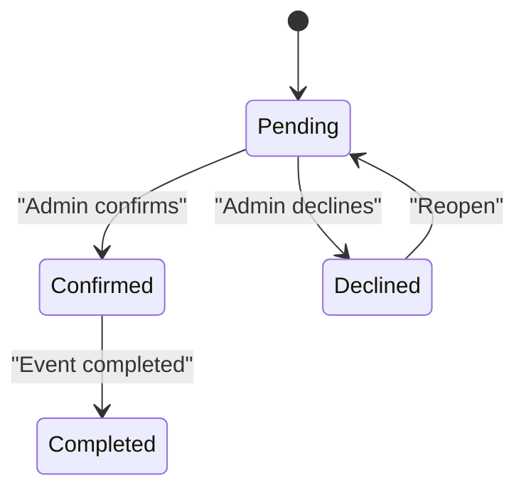

**Diagram sources**
- [supabase-schema.sql:75-84](file://supabase-schema.sql#L75-L84)
- [src/pages/Schedule.jsx:439-461](file://src/pages/Schedule.jsx#L439-L461)

**Section sources**
- [supabase-schema.sql:75-84](file://supabase-schema.sql#L75-L84)
- [src/pages/Schedule.jsx:439-461](file://src/pages/Schedule.jsx#L439-L461)

### Enhanced Communication and Sharing System
- **New** Multi-event selection enables bulk operations across multiple events.
- **New** WhatsApp sharing functionality for quick distribution of schedules.
- **New** Professional printing capabilities with formatted HTML output.
- **New** Integrated email composition tools with recipient management and duplicate prevention.
- **New** File attachment system for event-related documents.
- **New** Music playlist management with multi-platform support.
- **Updated** All communication features respect role-based access control with conditional UI rendering.

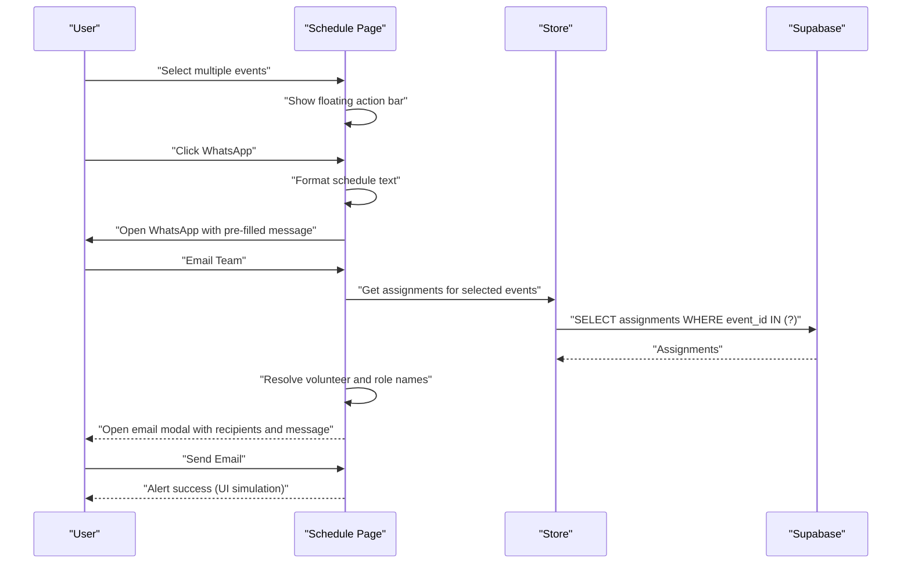

**Diagram sources**
- [src/pages/Schedule.jsx:227-239](file://src/pages/Schedule.jsx#L227-L239)
- [src/pages/Schedule.jsx:273-308](file://src/pages/Schedule.jsx#L273-L308)
- [src/pages/Schedule.jsx:110-143](file://src/pages/Schedule.jsx#L110-L143)

**Section sources**
- [src/pages/Schedule.jsx:227-239](file://src/pages/Schedule.jsx#L227-L239)
- [src/pages/Schedule.jsx:273-308](file://src/pages/Schedule.jsx#L273-L308)
- [src/pages/Schedule.jsx:110-143](file://src/pages/Schedule.jsx#L110-L143)

### File Attachment and Music Playlist Management
- **New** Comprehensive file attachment system supporting PDF, DOC, DOCX, MP3, JPG, PNG, GIF, and WEBP formats.
- **New** Drag-and-drop upload interface with progress indication.
- **New** Multi-platform music playlist support including YouTube, Spotify, Apple Music, and SoundCloud.
- **New** Playlist validation and URL verification for reliable integration.
- **New** Event-specific document and playlist management with organization-level security.
- **Updated** All file and playlist operations are protected by role-based access control with admin-only write permissions.

**Diagram sources**
- [src/pages/Schedule.jsx:527-558](file://src/pages/Schedule.jsx#L527-L558)
- [src/components/FileUpload.jsx:24-56](file://src/components/FileUpload.jsx#L24-L56)
- [src/components/MusicPlaylist.jsx:24-58](file://src/components/MusicPlaylist.jsx#L24-L58)

**Section sources**
- [src/pages/Schedule.jsx:527-558](file://src/pages/Schedule.jsx#L527-L558)
- [src/components/FileUpload.jsx:1-212](file://src/components/FileUpload.jsx#L1-L212)
- [src/components/MusicPlaylist.jsx:1-249](file://src/components/MusicPlaylist.jsx#L1-L249)

### Print Roster Functionality
- The Schedule page generates printable schedules for selected events.
- It builds a styled HTML document with comprehensive event details, assignments, file attachments, and music playlists.
- Professional formatting with role-specific styling and organization branding.
- **Updated** Print functionality respects user permissions and organization boundaries.

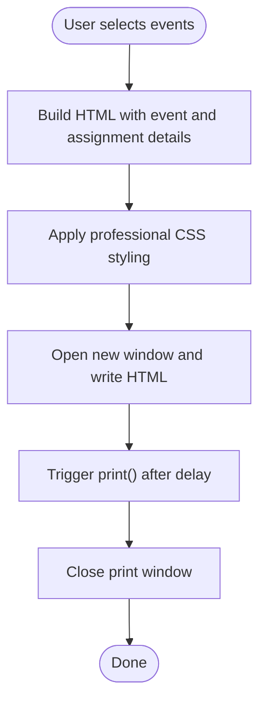

**Diagram sources**
- [src/pages/Schedule.jsx:310-403](file://src/pages/Schedule.jsx#L310-L403)

**Section sources**
- [src/pages/Schedule.jsx:310-403](file://src/pages/Schedule.jsx#L310-L403)

### Mobile Scheduling Access
- The layout and modals adapt to smaller screens; the floating action bar appears when events are selected.
- Sharing options (WhatsApp, Email) leverage native URLs for quick distribution.
- **Updated** Enhanced mobile experience with improved touch targets and responsive design, with permission-aware UI elements.

**Section sources**
- [src/components/Layout.jsx:1-129](file://src/components/Layout.jsx#L1-L129)
- [src/components/Modal.jsx:1-50](file://src/components/Modal.jsx#L1-L50)
- [src/pages/Schedule.jsx:669-694](file://src/pages/Schedule.jsx#L669-L694)

### Recurring Events, Resource Allocation, and Capacity Management
- Recurrence: The current schema does not include a recurrence pattern field. Implementing recurring events would require extending the events table with a recurrence rule and generating instances during creation or via a background job.
- Resource allocation: Assignments link events, roles, and volunteers; administrators can adjust area and designated role per slot.
- Capacity management: The UI highlights required role slots and progress; administrators can enforce minimum fill rates by preventing event publication until thresholds are met.
- **Updated** All resource allocation features respect role-based access control with admin-only write permissions.

### External Calendar Integration and Conflict Resolution
- External calendar sync: Not implemented in the current codebase. Integration would require exposing calendar APIs or exporting iCal/CSV feeds from the Schedule page.
- Conflict resolution: The assignments table links volunteers to specific roles at specific times. Conflicts can be detected by querying overlapping assignments for the same volunteer within a time window.
- **Updated** Conflict detection respects organization boundaries and user permissions.

### Administrative Oversight Features
- Organization-scoped data: All entities carry org_id and RLS policies ensure isolation.
- Admin role: Profiles include a role field; the UI currently treats the signed-in user as admin.
- Bulk actions: Selection of multiple events enables shared export/print.
- **Updated** Enhanced oversight with file attachment and playlist management for comprehensive event preparation tracking, all protected by role-based access control.

**Section sources**
- [supabase-schema.sql:7-286](file://supabase-schema.sql#L7-L286)
- [src/pages/Dashboard.jsx:21-28](file://src/pages/Dashboard.jsx#L21-L28)
- [src/pages/Schedule.jsx:227-239](file://src/pages/Schedule.jsx#L227-L239)

## Role-Based Access Control System

The platform implements a comprehensive role-based access control system that enforces organization-scoped permissions and protects sensitive operations.

### User Roles and Permissions
- **Admin Users**: Full CRUD access to all entities (events, assignments, volunteers, roles, groups)
- **Team Members**: Read-only access to organization data, cannot create/edit/delete records
- **Pending Members**: Cannot access the system until approved by an administrator

### Permission Implementation

#### Frontend Role Checks
The store provides role-based access helpers:
- `isAdmin`: True for admin users or demo mode
- `isTeamMember`: True for member/team_member roles
- `canEdit`: True only for admin users (controls UI visibility and feature access)

#### Database-Level Security
Row Level Security policies ensure data isolation:
- All tables enable RLS with organization-scoped access
- Admin-only write operations (INSERT/UPDATE/DELETE) enforced
- Read operations accessible to all users within organization
- Helper functions `is_admin()` and `get_user_org_id()` provide policy enforcement

#### Conditional UI Rendering
Components conditionally render features based on user permissions:
- Event creation/edit/delete buttons only visible to admins
- Assignment buttons hidden for non-admin users
- Member management navigation only shown to admins
- Role management features restricted to admin access

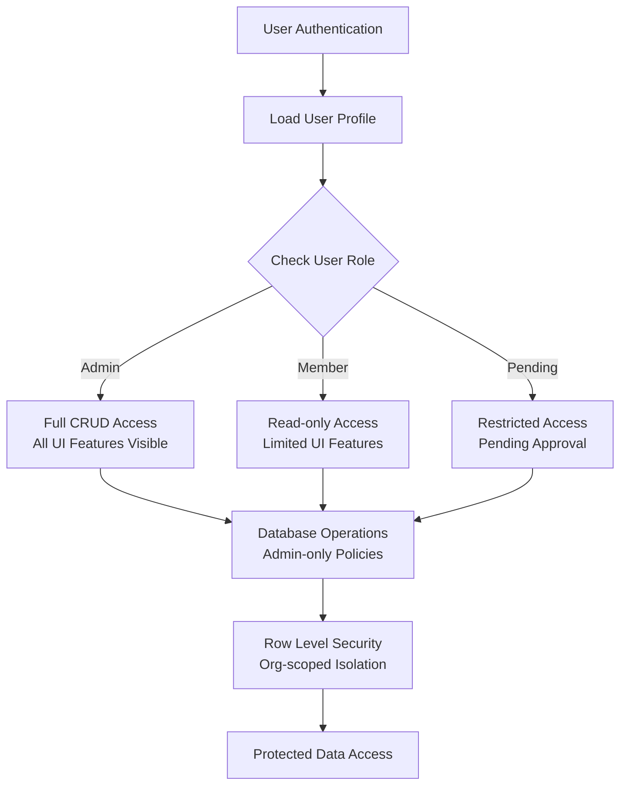

**Diagram sources**
- [src/services/store.jsx:1213-1217](file://src/services/store.jsx#L1213-L1217)
- [supabase-role-policies.sql:4-27](file://supabase-role-policies.sql#L4-L27)
- [src/components/Layout.jsx:18-19](file://src/components/Layout.jsx#L18-L19)

**Section sources**
- [src/services/store.jsx:1213-1217](file://src/services/store.jsx#L1213-L1217)
- [src/services/store.jsx:360-380](file://src/services/store.jsx#L360-L380)
- [src/services/store.jsx:397-450](file://src/services/store.jsx#L397-L450)
- [supabase-role-policies.sql:4-27](file://supabase-role-policies.sql#L4-L27)
- [src/components/Layout.jsx:18-19](file://src/components/Layout.jsx#L18-L19)
- [src/pages/ManageMembers.jsx:9-24](file://src/pages/ManageMembers.jsx#L9-L24)

## Dependency Analysis
- Frontend dependencies include React, React Router, Tailwind utilities, Lucide icons, and Supabase JS client.
- The store depends on the Supabase client and exposes CRUD actions for domain entities with role-based access helpers.
- Tauri configuration defines the desktop app metadata and bundling targets.
- **Updated** Additional dependencies for role-based access control and enhanced security features.

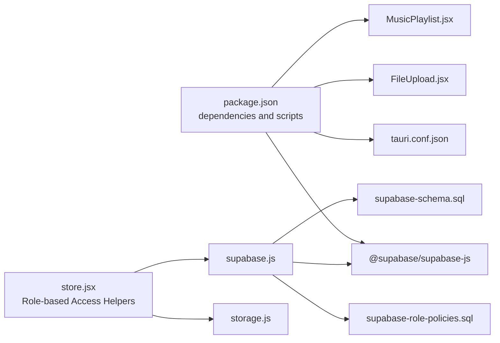

**Diagram sources**
- [package.json:15-24](file://package.json#L15-L24)
- [src/services/store.jsx:1-4](file://src/services/store.jsx#L1-L4)
- [src/services/supabase.js:1-13](file://src/services/supabase.js#L1-L13)
- [src-tauri/tauri.conf.json:1-35](file://src-tauri/tauri.conf.json#L1-L35)
- [src/components/FileUpload.jsx:1-212](file://src/components/FileUpload.jsx#L1-L212)
- [src/components/MusicPlaylist.jsx:1-249](file://src/components/MusicPlaylist.jsx#L1-L249)
- [src/services/storage.js:1-59](file://src/services/storage.js#L1-L59)
- [supabase-role-policies.sql:1-269](file://supabase-role-policies.sql#L1-L269)
- [supabase-schema.sql:1-286](file://supabase-schema.sql#L1-L286)

**Section sources**
- [package.json:15-24](file://package.json#L15-L24)
- [src/services/store.jsx:1-4](file://src/services/store.jsx#L1-L4)
- [src/services/supabase.js:1-13](file://src/services/supabase.js#L1-L13)
- [src-tauri/tauri.conf.json:1-35](file://src-tauri/tauri.conf.json#L1-L35)

## Performance Considerations
- Parallel data loading: The store fetches groups, roles, volunteers, events, assignments, and playlists concurrently to reduce initial load time.
- Memoization: Prefer derived computations (e.g., required roles) at render time; cache results if lists grow large.
- Virtualization: For very large event lists, consider virtualizing the schedule grid.
- Debounced search: The volunteer filter is immediate; for large datasets, debounce input to reduce re-renders.
- **Updated** Optimized data loading with lazy loading for file attachments and playlists to improve performance, with role-based filtering reducing unnecessary data processing.
- **Updated** Role-based access control adds minimal overhead as permission checks are computed once per store initialization and cached.

**Section sources**
- [src/services/store.jsx:158-213](file://src/services/store.jsx#L158-L213)

## Troubleshooting Guide
- Missing Supabase environment variables: The client warns if URL or anon key are missing. Ensure .env is populated and reloaded.
- Authentication redirects: The layout navigates unauthenticated users to landing.
- Modal focus and escape: Modals trap focus and close on Escape; ensure no other overlays interfere.
- Print window: Some browsers block pop-ups; instruct users to allow pop-ups for the site.
- **Updated** Role-based access issues: Check user profile role in database; ensure `profiles.role` is set correctly ('admin' or 'member').
- **Updated** Permission denied errors: Verify RLS policies are enabled and user belongs to correct organization; check `profiles.org_id` matches data records.
- **Updated** Member approval problems: Ensure pending members have `status = 'pending'` and wait for admin approval; check database migration for status column support.
- **Updated** File upload issues: Check browser console for CORS errors and ensure Supabase Storage is properly configured with admin-only write policies.
- **Updated** Playlist validation: Invalid URLs or unsupported platforms will trigger error messages; verify platform URLs and supported platforms.

**Section sources**
- [src/services/supabase.js:6-8](file://src/services/supabase.js#L6-L8)
- [src/components/Layout.jsx:19-23](file://src/components/Layout.jsx#L19-L23)
- [src/components/Modal.jsx:6-20](file://src/components/Modal.jsx#L6-L20)
- [src/pages/Schedule.jsx:310-403](file://src/pages/Schedule.jsx#L310-L403)
- [src/pages/ManageMembers.jsx:28-53](file://src/pages/ManageMembers.jsx#L28-L53)

## Conclusion
The Service Scheduling Platform provides a robust foundation for managing events, volunteers, and assignments with Supabase-backed data and a responsive React UI. Core features include event lifecycle management, role assignment, status tracking, email composition, and print rosters. **Updated** The platform now offers comprehensive role-based access control with organization-scoped data isolation, member approval workflows, and database-level security enforcement. The system protects sensitive operations while providing a seamless experience for different user roles. Extending the platform with recurring events, external calendar sync, and advanced conflict detection will further enhance operational efficiency while maintaining strict access control boundaries.

## Appendices

### Database Model
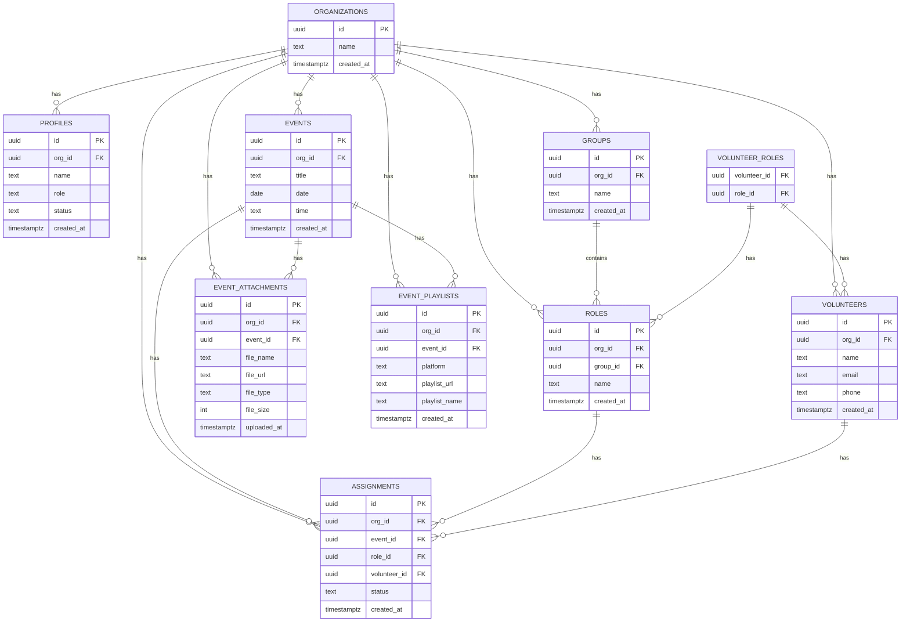

**Diagram sources**
- [supabase-schema.sql:1-286](file://supabase-schema.sql#L1-L286)

### Role-Based Access Control Implementation

The platform implements comprehensive role-based access control through multiple layers:

#### Frontend Access Control
- Role helpers in store: `isAdmin`, `isTeamMember`, `canEdit`
- Conditional UI rendering based on user permissions
- Navigation items filtered by role (admin-only 'Manage Members')

#### Database Security
- Row Level Security enabled on all tables
- Admin-only write policies for sensitive operations
- Organization-scoped data isolation
- Helper functions for role checking and org boundary enforcement

#### Member Management Workflow
- Pending member registration with approval process
- Admin-only member status management
- Role-based access to member management features

**Section sources**
- [src/services/store.jsx:1213-1217](file://src/services/store.jsx#L1213-L1217)
- [src/components/Layout.jsx:18-19](file://src/components/Layout.jsx#L18-L19)
- [src/pages/ManageMembers.jsx:9-24](file://src/pages/ManageMembers.jsx#L9-L24)
- [supabase-role-policies.sql:4-27](file://supabase-role-policies.sql#L4-L27)
- [supabase-schema.sql:14-22](file://supabase-schema.sql#L14-L22)

### New Database Tables for Enhanced Features
The platform now includes two new database tables to support enhanced functionality:

**Event Attachments Table**
- Stores file metadata for event-related documents
- Supports PDF, DOC, DOCX, MP3, JPG, PNG, GIF, and WEBP formats
- Includes file size validation (max 10MB) and type restrictions
- Links attachments to specific events with organization-level security

**Event Playlists Table**
- Manages music playlists for events
- Supports multiple platforms: YouTube, Spotify, Apple Music, SoundCloud
- Validates playlist URLs and platform types
- Stores playlist metadata including names and descriptions

**Section sources**
- [src/services/store.jsx:921-1044](file://src/services/store.jsx#L921-L1044)
- [src/services/store.jsx:1046-1180](file://src/services/store.jsx#L1046-L1180)
- [src/services/storage.js:1-59](file://src/services/storage.js#L1-L59)
- [supabase-schema.sql:1-286](file://supabase-schema.sql#L1-L286)