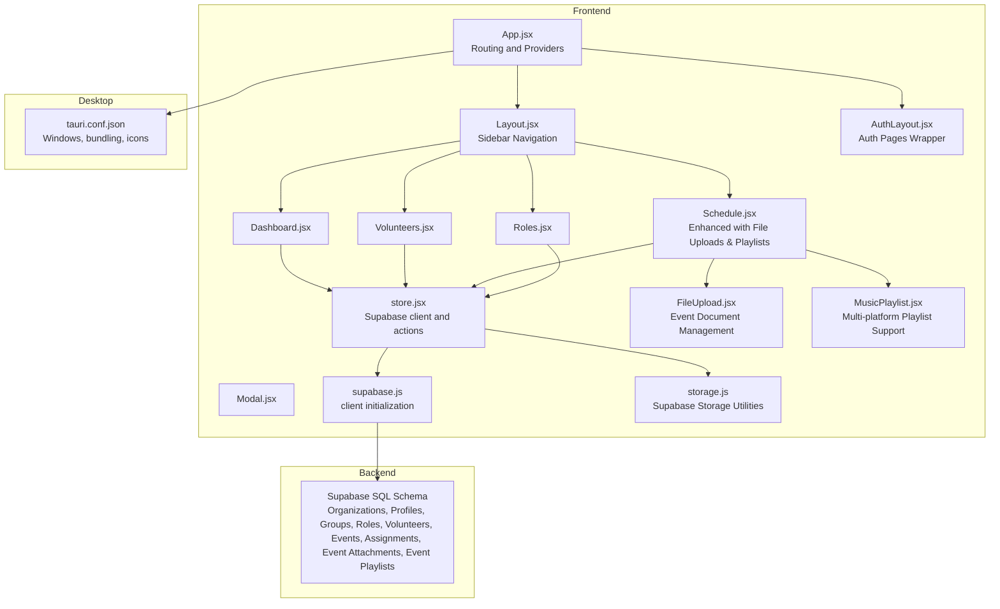
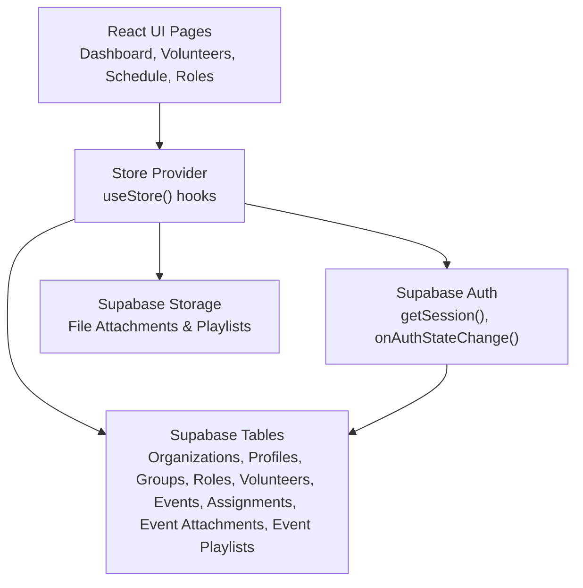
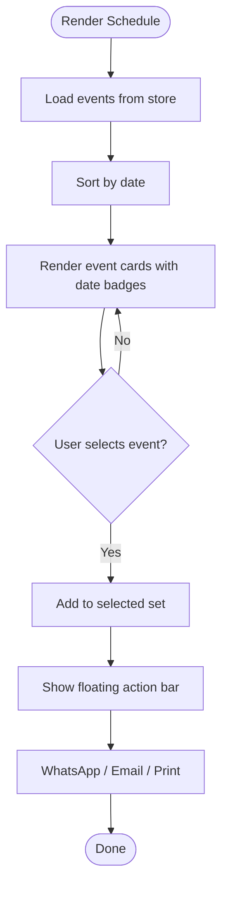
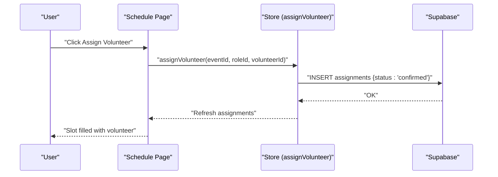
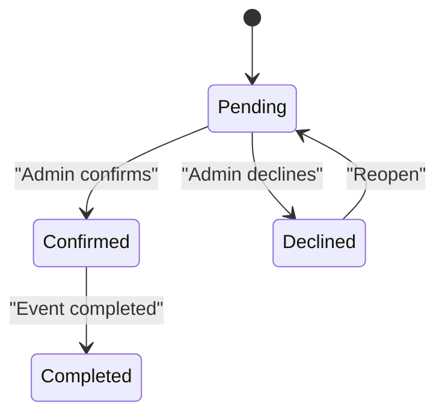
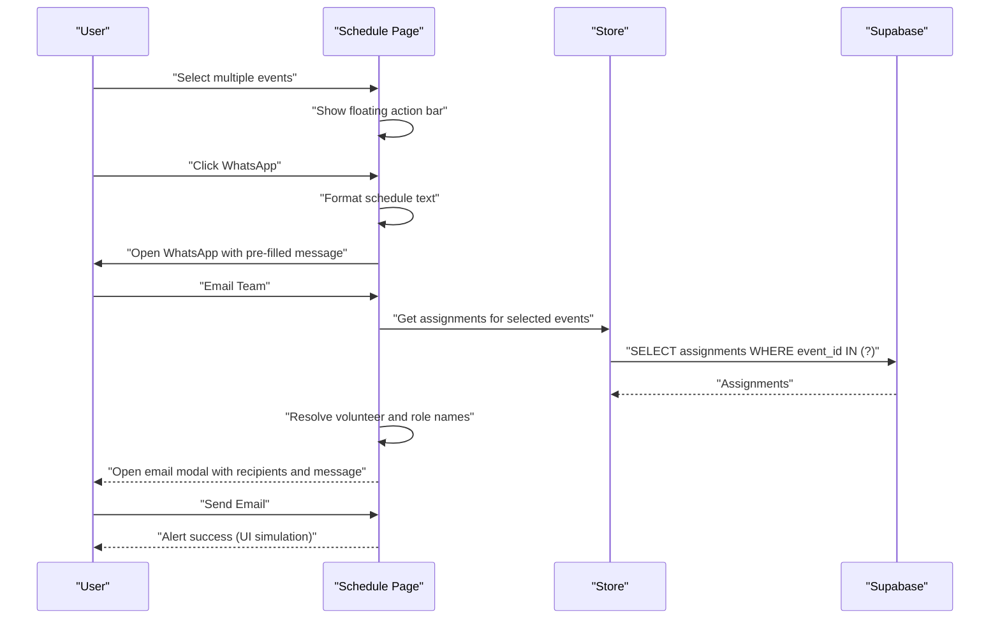
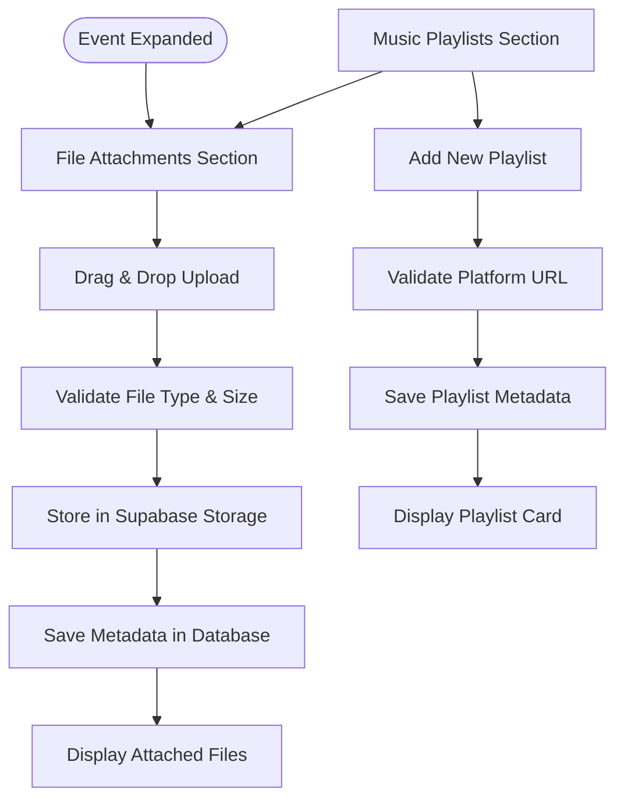
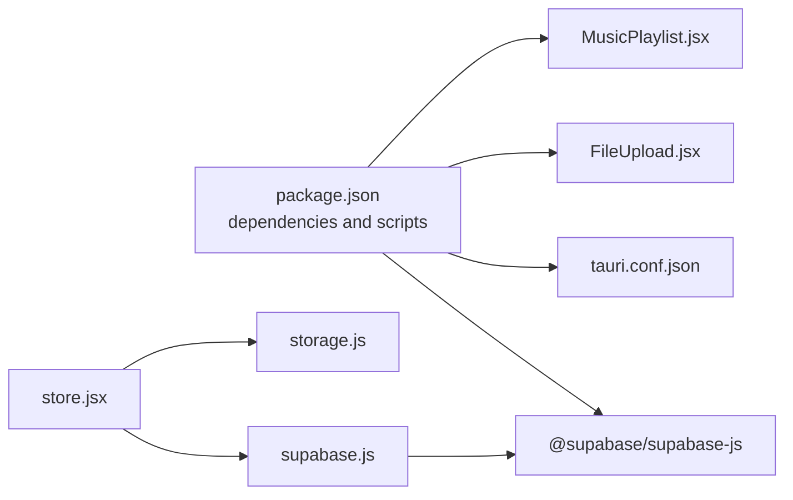
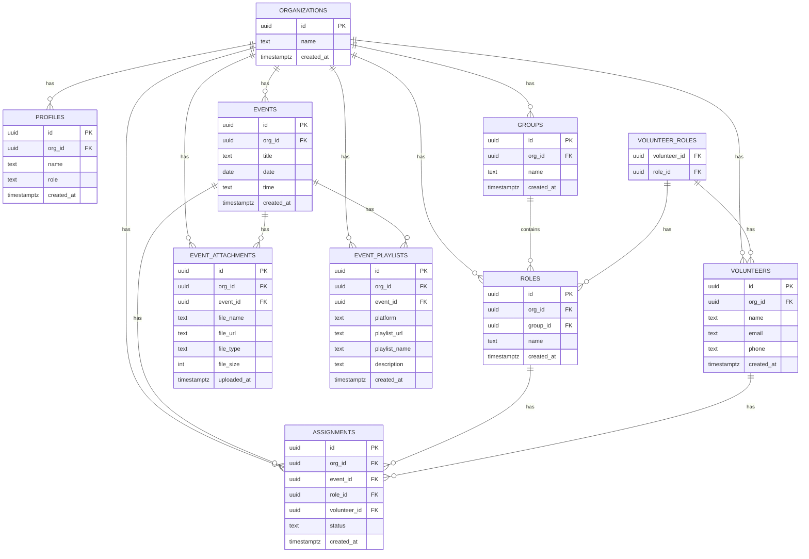

# Service Scheduling Platform

<cite>
**Referenced Files in This Document**
- [README.md](file://README.md)
- [package.json](file://package.json)
- [src/App.jsx](file://src/App.jsx)
- [src/main.jsx](file://src/main.jsx)
- [src/services/supabase.js](file://src/services/supabase.js)
- [src/services/store.jsx](file://src/services/store.jsx)
- [src/components/Layout.jsx](file://src/components/Layout.jsx)
- [src/components/AuthLayout.jsx](file://src/components/AuthLayout.jsx)
- [src/components/Modal.jsx](file://src/components/Modal.jsx)
- [src/components/FileUpload.jsx](file://src/components/FileUpload.jsx)
- [src/components/MusicPlaylist.jsx](file://src/components/MusicPlaylist.jsx)
- [src/pages/Dashboard.jsx](file://src/pages/Dashboard.jsx)
- [src/pages/Landing.jsx](file://src/pages/Landing.jsx)
- [src/pages/Login.jsx](file://src/pages/Login.jsx)
- [src/pages/Register.jsx](file://src/pages/Register.jsx)
- [src/pages/Volunteers.jsx](file://src/pages/Volunteers.jsx)
- [src/pages/Schedule.jsx](file://src/pages/Schedule.jsx)
- [src/pages/Roles.jsx](file://src/pages/Roles.jsx)
- [src/utils/cn.js](file://src/utils/cn.js)
- [src/services/storage.js](file://src/services/storage.js)
- [supabase-schema.sql](file://supabase-schema.sql)
- [src-tauri/tauri.conf.json](file://src-tauri/tauri.conf.json)
</cite>

## Update Summary
**Changes Made**
- Major enhancement to Schedule page (from 161 to 917 lines) with advanced event management capabilities
- Added comprehensive file attachment system for events with drag-and-drop upload and validation
- Integrated music playlist management with multi-platform support (YouTube, Spotify, Apple Music, SoundCloud)
- Enhanced multi-event selection for bulk sharing operations via WhatsApp, Email, and Print
- Added professional printing capabilities with formatted schedules
- Implemented integrated email composition tools with recipient management and duplicate prevention
- Enhanced assignment workflows with improved user experience and organization-level security
- Added new database tables for event attachments and playlists with proper RLS policies

## Table of Contents
1. [Introduction](#introduction)
2. [Project Structure](#project-structure)
3. [Core Components](#core-components)
4. [Architecture Overview](#architecture-overview)
5. [Detailed Component Analysis](#detailed-component-analysis)
6. [Dependency Analysis](#dependency-analysis)
7. [Performance Considerations](#performance-considerations)
8. [Troubleshooting Guide](#troubleshooting-guide)
9. [Conclusion](#conclusion)
10. [Appendices](#appendices)

## Introduction
This document describes the Service Scheduling Platform built with React, Vite, Supabase, and Tauri. It focuses on the event management lifecycle (creation, modification, cancellation), calendar and date/time handling, role assignment for volunteers, status tracking, email notifications, print roster functionality, mobile scheduling access, recurring event patterns, resource allocation, capacity management, external calendar integration, conflict resolution, and administrative oversight.

**Updated** The platform now features advanced event management capabilities including comprehensive file attachments, music playlist integration, multi-event selection for bulk operations, professional printing, and enhanced communication tools. The system supports sophisticated scheduling scenarios with organization-scoped data isolation and role-based access control.

## Project Structure
The application is a single-page React app with routing, a centralized store for state and data persistence, and a Supabase backend. It also supports desktop bundling via Tauri.

**Diagram sources**
- [src/App.jsx:1-37](file://src/App.jsx#L1-L37)
- [src/components/Layout.jsx:1-102](file://src/components/Layout.jsx#L1-L102)
- [src/components/AuthLayout.jsx:1-29](file://src/components/AuthLayout.jsx#L1-L29)
- [src/pages/Dashboard.jsx:1-90](file://src/pages/Dashboard.jsx#L1-L90)
- [src/pages/Volunteers.jsx:1-354](file://src/pages/Volunteers.jsx#L1-L354)
- [src/pages/Schedule.jsx:1-917](file://src/pages/Schedule.jsx#L1-L917)
- [src/pages/Roles.jsx:1-386](file://src/pages/Roles.jsx#L1-L386)
- [src/components/Modal.jsx:1-50](file://src/components/Modal.jsx#L1-L50)
- [src/services/store.jsx:1-1252](file://src/services/store.jsx#L1-L1252)
- [src/services/supabase.js:1-13](file://src/services/supabase.js#L1-L13)
- [src/components/FileUpload.jsx:1-212](file://src/components/FileUpload.jsx#L1-L212)
- [src/components/MusicPlaylist.jsx:1-249](file://src/components/MusicPlaylist.jsx#L1-L249)
- [src/services/storage.js:1-59](file://src/services/storage.js#L1-L59)
- [supabase-schema.sql:1-286](file://supabase-schema.sql#L1-L286)
- [src-tauri/tauri.conf.json:1-35](file://src-tauri/tauri.conf.json#L1-L35)

**Section sources**
- [src/App.jsx:1-37](file://src/App.jsx#L1-L37)
- [src/main.jsx:1-11](file://src/main.jsx#L1-L11)
- [package.json:1-44](file://package.json#L1-L44)
- [README.md:1-17](file://README.md#L1-L17)

## Core Components
- Centralized Store: Provides authentication state, organization/profile data, and CRUD actions for groups, roles, volunteers, events, assignments, file attachments, and event playlists. It initializes the Supabase client and loads data in parallel.
- Supabase Client: Initializes the Supabase client using environment variables and guards missing configuration.
- UI Pages:
  - Dashboard: Overview cards and quick actions.
  - Volunteers: CRUD for volunteers, role assignment, CSV import.
  - Schedule: Enhanced event listing with file attachments, music playlists, assignment management, email composition, print roster, selection sharing, and multi-event operations.
  - Roles: Manage teams/groups and roles.
- Layout and Modals: Navigation sidebar, authentication wrapper, and modal dialogs.
- Specialized Components:
  - FileUpload: Drag-and-drop file upload with support for PDF, DOC, MP3, images, and audio files.
  - MusicPlaylist: Multi-platform playlist management for YouTube, Spotify, Apple Music, and SoundCloud.

**Updated** The Schedule page now includes comprehensive file attachment and playlist management capabilities, significantly enhancing event preparation and communication workflows.

**Section sources**
- [src/services/store.jsx:1-1252](file://src/services/store.jsx#L1-L1252)
- [src/services/supabase.js:1-13](file://src/services/supabase.js#L1-L13)
- [src/pages/Dashboard.jsx:1-90](file://src/pages/Dashboard.jsx#L1-L90)
- [src/pages/Volunteers.jsx:1-354](file://src/pages/Volunteers.jsx#L1-L354)
- [src/pages/Schedule.jsx:1-917](file://src/pages/Schedule.jsx#L1-L917)
- [src/pages/Roles.jsx:1-386](file://src/pages/Roles.jsx#L1-L386)
- [src/components/Layout.jsx:1-102](file://src/components/Layout.jsx#L1-L102)
- [src/components/Modal.jsx:1-50](file://src/components/Modal.jsx#L1-L50)
- [src/components/FileUpload.jsx:1-212](file://src/components/FileUpload.jsx#L1-L212)
- [src/components/MusicPlaylist.jsx:1-249](file://src/components/MusicPlaylist.jsx#L1-L249)

## Architecture Overview
The frontend uses React with React Router for navigation and a custom store provider to manage global state. Data is persisted and synchronized via Supabase. Authentication is handled by Supabase Auth, and the store listens to auth state changes. Desktop packaging is configured via Tauri.

**Diagram sources**
- [src/services/store.jsx:1-1252](file://src/services/store.jsx#L1-L1252)
- [src/services/supabase.js:1-13](file://src/services/supabase.js#L1-L13)
- [supabase-schema.sql:1-286](file://supabase-schema.sql#L1-L286)

## Detailed Component Analysis

### Enhanced Event Management System
- Creation: The Schedule page exposes a form to add events with title, date, and time. The store's addEvent persists the event under the current organization.
- Modification: Editing an event updates title, date, and time via updateEvent.
- Cancellation: Deleting an event removes it and cascades related assignments.
- **Updated** Enhanced with file attachment and playlist management for comprehensive event preparation.

**Diagram sources**
- [src/pages/Schedule.jsx:206-225](file://src/pages/Schedule.jsx#L206-L225)
- [src/services/store.jsx:584-652](file://src/services/store.jsx#L584-L652)

**Section sources**
- [src/pages/Schedule.jsx:206-225](file://src/pages/Schedule.jsx#L206-L225)
- [src/services/store.jsx:584-652](file://src/services/store.jsx#L584-L652)

### Calendar Interface and Date/Time Management
- The calendar view displays events with month/day rendering and localized date formatting.
- Date/time inputs are HTML5 date and time pickers, ensuring browser-native validation and UX.
- Sorting and selection support allows grouping events by date for printing and sharing.
- **Updated** Enhanced with multi-event selection for bulk operations and improved floating action bar.

**Diagram sources**
- [src/pages/Schedule.jsx:427-666](file://src/pages/Schedule.jsx#L427-L666)
- [src/pages/Schedule.jsx:227-239](file://src/pages/Schedule.jsx#L227-L239)

**Section sources**
- [src/pages/Schedule.jsx:427-666](file://src/pages/Schedule.jsx#L427-L666)
- [src/pages/Schedule.jsx:227-239](file://src/pages/Schedule.jsx#L227-L239)

### Role Assignment System
- Required roles are pre-defined for a standard service and displayed as slots per event.
- Assigning a volunteer to a role creates an assignment record with status defaults to confirmed.
- Administrators can update area and designated role per assignment.
- **Updated** Enhanced assignment workflow with improved UI and better volunteer management.

**Diagram sources**
- [src/pages/Schedule.jsx:78-97](file://src/pages/Schedule.jsx#L78-L97)
- [src/pages/Schedule.jsx:418-474](file://src/pages/Schedule.jsx#L418-L474)
- [src/services/store.jsx:655-729](file://src/services/store.jsx#L655-L729)

**Section sources**
- [src/pages/Schedule.jsx:78-97](file://src/pages/Schedule.jsx#L78-L97)
- [src/pages/Schedule.jsx:418-474](file://src/pages/Schedule.jsx#L418-L474)
- [src/services/store.jsx:655-729](file://src/services/store.jsx#L655-L729)

### Status Tracking System
- Assignment status is maintained in the assignments table with confirmed, pending, declined options.
- The Schedule page surfaces assignment details and allows changing area and designated role.

**Diagram sources**
- [supabase-schema.sql:75-84](file://supabase-schema.sql#L75-L84)
- [src/pages/Schedule.jsx:439-461](file://src/pages/Schedule.jsx#L439-L461)

**Section sources**
- [supabase-schema.sql:75-84](file://supabase-schema.sql#L75-L84)
- [src/pages/Schedule.jsx:439-461](file://src/pages/Schedule.jsx#L439-L461)

### Enhanced Communication and Sharing System
- **New** Multi-event selection enables bulk operations across multiple events.
- **New** WhatsApp sharing functionality for quick distribution of schedules.
- **New** Professional printing capabilities with formatted HTML output.
- **New** Integrated email composition tools with recipient management and duplicate prevention.
- **New** File attachment system for event-related documents.
- **New** Music playlist management with multi-platform support.

**Diagram sources**
- [src/pages/Schedule.jsx:227-239](file://src/pages/Schedule.jsx#L227-L239)
- [src/pages/Schedule.jsx:273-308](file://src/pages/Schedule.jsx#L273-L308)
- [src/pages/Schedule.jsx:110-143](file://src/pages/Schedule.jsx#L110-L143)

**Section sources**
- [src/pages/Schedule.jsx:227-239](file://src/pages/Schedule.jsx#L227-L239)
- [src/pages/Schedule.jsx:273-308](file://src/pages/Schedule.jsx#L273-L308)
- [src/pages/Schedule.jsx:110-143](file://src/pages/Schedule.jsx#L110-L143)

### File Attachment and Music Playlist Management
- **New** Comprehensive file attachment system supporting PDF, DOC, DOCX, MP3, JPG, PNG, GIF, and WEBP formats.
- **New** Drag-and-drop upload interface with progress indication.
- **New** Multi-platform music playlist support including YouTube, Spotify, Apple Music, and SoundCloud.
- **New** Playlist validation and URL verification for reliable integration.
- **New** Event-specific document and playlist management with organization-level security.

**Diagram sources**
- [src/pages/Schedule.jsx:527-558](file://src/pages/Schedule.jsx#L527-L558)
- [src/components/FileUpload.jsx:24-56](file://src/components/FileUpload.jsx#L24-L56)
- [src/components/MusicPlaylist.jsx:24-58](file://src/components/MusicPlaylist.jsx#L24-L58)

**Section sources**
- [src/pages/Schedule.jsx:527-558](file://src/pages/Schedule.jsx#L527-L558)
- [src/components/FileUpload.jsx:1-212](file://src/components/FileUpload.jsx#L1-L212)
- [src/components/MusicPlaylist.jsx:1-249](file://src/components/MusicPlaylist.jsx#L1-L249)

### Print Roster Functionality
- The Schedule page generates printable schedules for selected events.
- It builds a styled HTML document with comprehensive event details, assignments, file attachments, and music playlists.
- Professional formatting with role-specific styling and organization branding.

**Diagram sources**
- [src/pages/Schedule.jsx:310-403](file://src/pages/Schedule.jsx#L310-L403)

**Section sources**
- [src/pages/Schedule.jsx:310-403](file://src/pages/Schedule.jsx#L310-L403)

### Mobile Scheduling Access
- The layout and modals adapt to smaller screens; the floating action bar appears when events are selected.
- Sharing options (WhatsApp, Email) leverage native URLs for quick distribution.
- **Updated** Enhanced mobile experience with improved touch targets and responsive design.

**Section sources**
- [src/components/Layout.jsx:1-102](file://src/components/Layout.jsx#L1-L102)
- [src/components/Modal.jsx:1-50](file://src/components/Modal.jsx#L1-L50)
- [src/pages/Schedule.jsx:669-694](file://src/pages/Schedule.jsx#L669-L694)

### Recurring Events, Resource Allocation, and Capacity Management
- Recurrence: The current schema does not include a recurrence pattern field. Implementing recurring events would require extending the events table with a recurrence rule and generating instances during creation or via a background job.
- Resource allocation: Assignments link events, roles, and volunteers; administrators can adjust area and designated role per slot.
- Capacity management: The UI highlights required role slots and progress; administrators can enforce minimum fill rates by preventing event publication until thresholds are met.

### External Calendar Integration and Conflict Resolution
- External calendar sync: Not implemented in the current codebase. Integration would require exposing calendar APIs or exporting iCal/CSV feeds from the Schedule page.
- Conflict resolution: The assignments table links volunteers to specific roles at specific times. Conflicts can be detected by querying overlapping assignments for the same volunteer within a time window.

### Administrative Oversight Features
- Organization-scoped data: All entities carry org_id and RLS policies ensure isolation.
- Admin role: Profiles include a role field; the UI currently treats the signed-in user as admin.
- Bulk actions: Selection of multiple events enables shared export/print.
- **Updated** Enhanced oversight with file attachment and playlist management for comprehensive event preparation tracking.

**Section sources**
- [supabase-schema.sql:7-286](file://supabase-schema.sql#L7-L286)
- [src/pages/Dashboard.jsx:21-28](file://src/pages/Dashboard.jsx#L21-L28)
- [src/pages/Schedule.jsx:227-239](file://src/pages/Schedule.jsx#L227-L239)

## Dependency Analysis
- Frontend dependencies include React, React Router, Tailwind utilities, Lucide icons, and Supabase JS client.
- The store depends on the Supabase client and exposes CRUD actions for domain entities.
- Tauri configuration defines the desktop app metadata and bundling targets.
- **Updated** Additional dependencies for file upload and playlist management functionality.

**Diagram sources**
- [package.json:15-24](file://package.json#L15-L24)
- [src/services/store.jsx:1-4](file://src/services/store.jsx#L1-L4)
- [src/services/supabase.js:1-13](file://src/services/supabase.js#L1-L13)
- [src-tauri/tauri.conf.json:1-35](file://src-tauri/tauri.conf.json#L1-L35)
- [src/components/FileUpload.jsx:1-212](file://src/components/FileUpload.jsx#L1-L212)
- [src/components/MusicPlaylist.jsx:1-249](file://src/components/MusicPlaylist.jsx#L1-L249)
- [src/services/storage.js:1-59](file://src/services/storage.js#L1-L59)

**Section sources**
- [package.json:15-24](file://package.json#L15-L24)
- [src/services/store.jsx:1-4](file://src/services/store.jsx#L1-L4)
- [src/services/supabase.js:1-13](file://src/services/supabase.js#L1-L13)
- [src-tauri/tauri.conf.json:1-35](file://src-tauri/tauri.conf.json#L1-L35)

## Performance Considerations
- Parallel data loading: The store fetches groups, roles, volunteers, events, assignments, and playlists concurrently to reduce initial load time.
- Memoization: Prefer derived computations (e.g., required roles) at render time; cache results if lists grow large.
- Virtualization: For very large event lists, consider virtualizing the schedule grid.
- Debounced search: The volunteer filter is immediate; for large datasets, debounce input to reduce re-renders.
- **Updated** Optimized data loading with lazy loading for file attachments and playlists to improve performance.

**Section sources**
- [src/services/store.jsx:158-213](file://src/services/store.jsx#L158-L213)

## Troubleshooting Guide
- Missing Supabase environment variables: The client warns if URL or anon key are missing. Ensure .env is populated and reloaded.
- Authentication redirects: The layout navigates unauthenticated users to landing.
- Modal focus and escape: Modals trap focus and close on Escape; ensure no other overlays interfere.
- Print window: Some browsers block pop-ups; instruct users to allow pop-ups for the site.
- **Updated** File upload issues: Check browser console for CORS errors and ensure Supabase Storage is properly configured.
- **Updated** Playlist validation: Invalid URLs or unsupported platforms will trigger error messages; verify platform URLs and supported platforms.

**Section sources**
- [src/services/supabase.js:6-8](file://src/services/supabase.js#L6-L8)
- [src/components/Layout.jsx:19-23](file://src/components/Layout.jsx#L19-L23)
- [src/components/Modal.jsx:6-20](file://src/components/Modal.jsx#L6-L20)
- [src/pages/Schedule.jsx:310-403](file://src/pages/Schedule.jsx#L310-L403)

## Conclusion
The Service Scheduling Platform provides a robust foundation for managing events, volunteers, and assignments with Supabase-backed data and a responsive React UI. Core features include event lifecycle management, role assignment, status tracking, email composition, and print rosters. **Updated** The platform now offers comprehensive file attachment and music playlist management, multi-event selection for bulk operations, professional printing capabilities, and enhanced communication tools. Extending the platform with recurring events, external calendar sync, and advanced conflict detection will further enhance operational efficiency.

## Appendices

### Database Model

**Diagram sources**
- [supabase-schema.sql:1-286](file://supabase-schema.sql#L1-L286)

### New Database Tables for Enhanced Features
The platform now includes two new database tables to support enhanced functionality:

**Event Attachments Table**
- Stores file metadata for event-related documents
- Supports PDF, DOC, DOCX, MP3, JPG, PNG, GIF, and WEBP formats
- Includes file size validation (max 10MB) and type restrictions
- Links attachments to specific events with organization-level security

**Event Playlists Table**
- Manages music playlists for events
- Supports multiple platforms: YouTube, Spotify, Apple Music, SoundCloud
- Validates playlist URLs and platform types
- Stores playlist metadata including names and descriptions

**Section sources**
- [src/services/store.jsx:921-1044](file://src/services/store.jsx#L921-L1044)
- [src/services/store.jsx:1046-1180](file://src/services/store.jsx#L1046-L1180)
- [src/services/storage.js:1-59](file://src/services/storage.js#L1-L59)
- [supabase-schema.sql:1-286](file://supabase-schema.sql#L1-L286)