# Sharing & Communication Tools

<cite>
**Referenced Files in This Document**
- [README.md](file://README.md)
- [package.json](file://package.json)
- [src/pages/Schedule.jsx](file://src/pages/Schedule.jsx)
- [src/components/Modal.jsx](file://src/components/Modal.jsx)
- [src/services/store.jsx](file://src/services/store.jsx)
- [src-tauri/tauri.conf.json](file://src-tauri/tauri.conf.json)
</cite>

## Table of Contents
1. [Introduction](#introduction)
2. [Project Structure](#project-structure)
3. [Core Components](#core-components)
4. [Architecture Overview](#architecture-overview)
5. [Detailed Component Analysis](#detailed-component-analysis)
6. [Dependency Analysis](#dependency-analysis)
7. [Performance Considerations](#performance-considerations)
8. [Troubleshooting Guide](#troubleshooting-guide)
9. [Conclusion](#conclusion)

## Introduction
This document explains the sharing and communication tools built into the Schedule page. It covers:
- Multi-platform sharing via WhatsApp and email
- Markdown-style formatting for shared content
- Print roster functionality with HTML generation and browser printing integration
- A floating action bar that appears when events are selected
- Batch operations for multiple events
- Integration with external applications through URL schemes
- Platform-specific formatting differences and example workflows

## Project Structure
The sharing tools live primarily in the Schedule page component, with supporting utilities and state management in the store. Modals encapsulate email composition and team-email actions. Tauri configuration defines the desktop app identity and build targets.

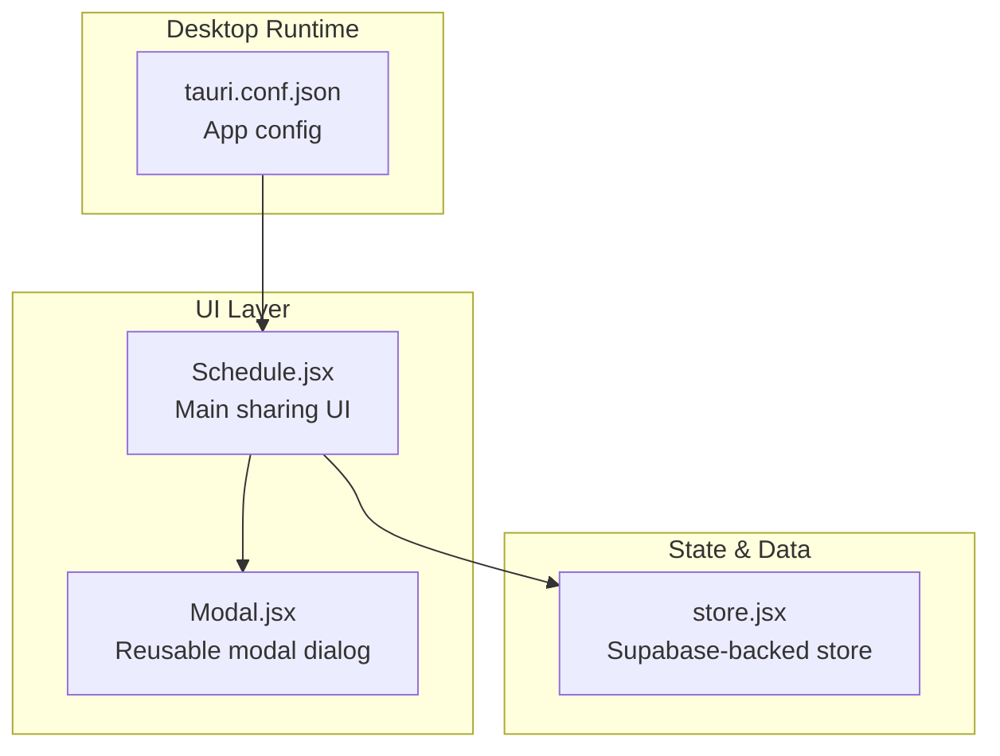

**Diagram sources**
- [src/pages/Schedule.jsx](file://src/pages/Schedule.jsx#L1-L731)
- [src/components/Modal.jsx](file://src/components/Modal.jsx#L1-L50)
- [src/services/store.jsx](file://src/services/store.jsx#L1-L472)
- [src-tauri/tauri.conf.json](file://src-tauri/tauri.conf.json#L1-L35)

**Section sources**
- [README.md](file://README.md#L1-L17)
- [package.json](file://package.json#L1-L44)

## Core Components
- Schedule page: Implements event selection, batch operations, WhatsApp/email sharing, and print roster generation.
- Modal component: Provides reusable overlay dialogs for email composition and team-email actions.
- Store: Supplies events, assignments, roles, volunteers, and groups used to format shared content.
- Tauri config: Defines the desktop app identity and packaging targets.

Key responsibilities:
- Selection mechanism: Maintains a Set of selected event IDs and toggles selection per event.
- Formatting: Generates platform-specific text for WhatsApp and email.
- Printing: Builds an HTML document and triggers browser print.
- External integrations: Uses URL schemes (whatsapp:// and mailto:) to open native apps.

**Section sources**
- [src/pages/Schedule.jsx](file://src/pages/Schedule.jsx#L179-L216)
- [src/components/Modal.jsx](file://src/components/Modal.jsx#L1-L50)
- [src/services/store.jsx](file://src/services/store.jsx#L14-L18)
- [src-tauri/tauri.conf.json](file://src-tauri/tauri.conf.json#L1-L35)

## Architecture Overview
The sharing tools are implemented as client-side UI actions that:
- Format selected events into text
- Open external applications via URL schemes
- Generate HTML for printing and trigger browser print

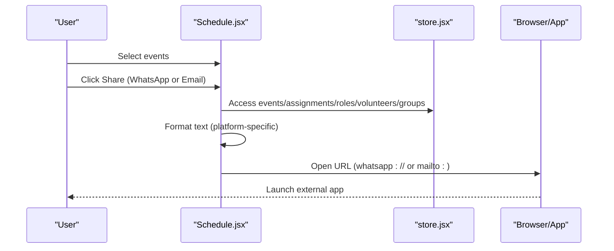

**Diagram sources**
- [src/pages/Schedule.jsx](file://src/pages/Schedule.jsx#L193-L229)
- [src/services/store.jsx](file://src/services/store.jsx#L14-L18)

## Detailed Component Analysis

### Event Selection and Floating Action Bar
- Selection state: A Set tracks selected event IDs.
- Toggle behavior: Clicking the checkbox toggles selection for a single event.
- Floating action bar: Appears when one or more events are selected, offering quick actions for WhatsApp, Email, and Print.

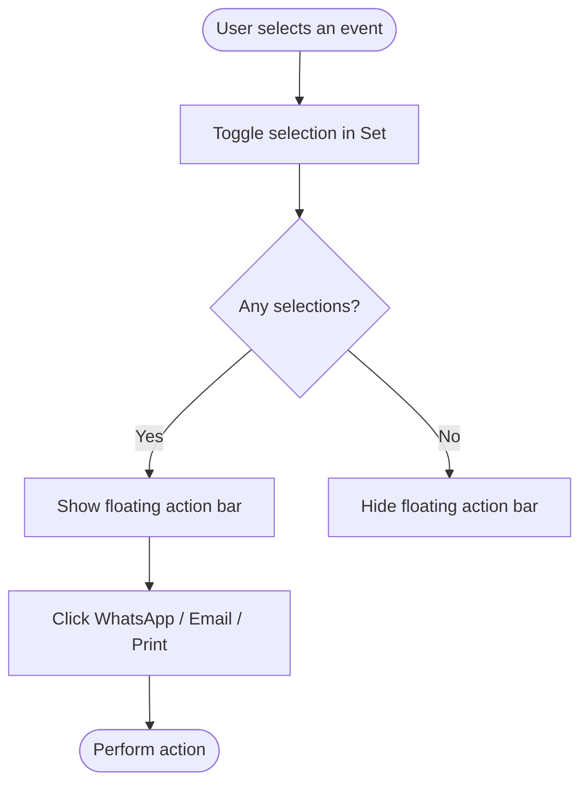

**Diagram sources**
- [src/pages/Schedule.jsx](file://src/pages/Schedule.jsx#L179-L191)
- [src/pages/Schedule.jsx](file://src/pages/Schedule.jsx#L483-L508)

**Section sources**
- [src/pages/Schedule.jsx](file://src/pages/Schedule.jsx#L179-L191)
- [src/pages/Schedule.jsx](file://src/pages/Schedule.jsx#L483-L508)

### WhatsApp Integration (Direct Messaging)
- Formatting: The formatter builds a block for each selected event with title, date/time, and a bullet list of assignments. Assignments include role, volunteer, and optional group/designated role details.
- URL scheme: Opens the external WhatsApp app with pre-filled text using the web-based scheme.

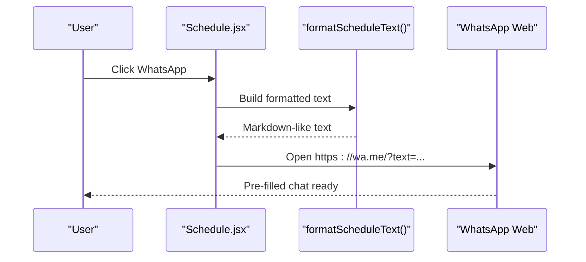

**Diagram sources**
- [src/pages/Schedule.jsx](file://src/pages/Schedule.jsx#L193-L222)

**Section sources**
- [src/pages/Schedule.jsx](file://src/pages/Schedule.jsx#L193-L222)

### Email Sharing via mailto Links
- Formatting: Same markdown-style structure as WhatsApp.
- URL scheme: Opens the default mail client with subject and body populated via mailto.
- Additional UI: An email modal supports composing messages, selecting recipients from volunteers, manual input, and sending.

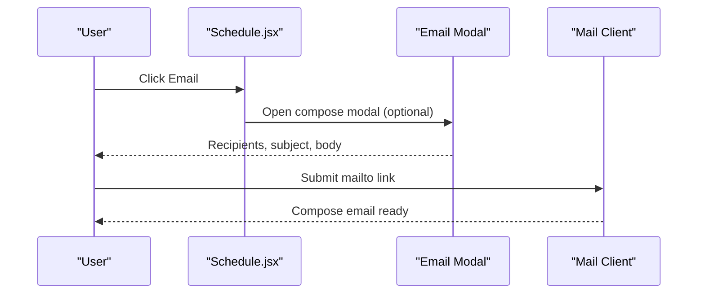

**Diagram sources**
- [src/pages/Schedule.jsx](file://src/pages/Schedule.jsx#L224-L229)
- [src/pages/Schedule.jsx](file://src/pages/Schedule.jsx#L609-L727)

**Section sources**
- [src/pages/Schedule.jsx](file://src/pages/Schedule.jsx#L224-L229)
- [src/pages/Schedule.jsx](file://src/pages/Schedule.jsx#L609-L727)

### Print Roster Functionality
- HTML generation: Creates a temporary HTML document containing a styled summary of selected events and assignments.
- Browser printing: Opens a new window, writes the HTML, waits briefly, then triggers print and closes the window.
- Smart role resolution: Uses role names, designated roles, and a fallback mapping to avoid missing labels.

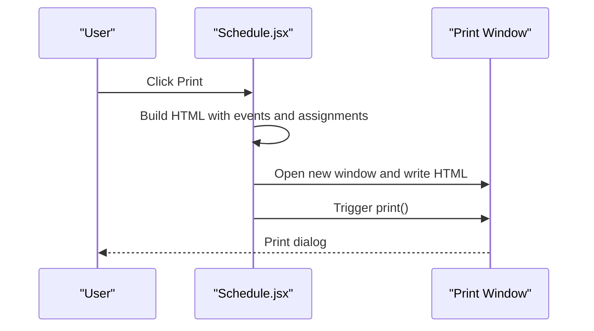

**Diagram sources**
- [src/pages/Schedule.jsx](file://src/pages/Schedule.jsx#L231-L303)

**Section sources**
- [src/pages/Schedule.jsx](file://src/pages/Schedule.jsx#L231-L303)

### Selection Mechanism and Batch Operations
- Selection toggling: Each event’s checkbox toggles membership in the selection Set.
- Sorting: Selected events are sorted chronologically before formatting.
- Batch actions: WhatsApp, Email, and Print operate on the entire selection.

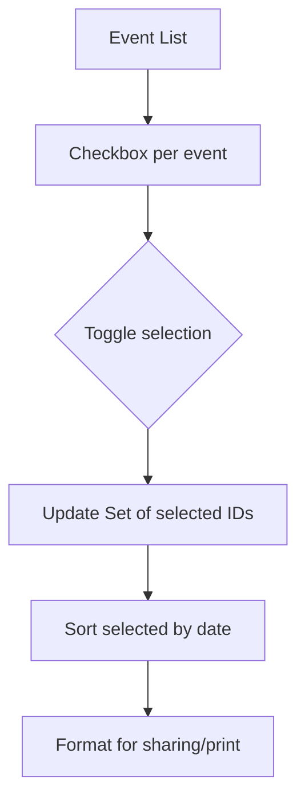

**Diagram sources**
- [src/pages/Schedule.jsx](file://src/pages/Schedule.jsx#L179-L191)
- [src/pages/Schedule.jsx](file://src/pages/Schedule.jsx#L193-L196)

**Section sources**
- [src/pages/Schedule.jsx](file://src/pages/Schedule.jsx#L179-L196)

### Email Composition Modal
- Recipient management: Choose from volunteers, add custom emails, remove recipients.
- Subject/body customization: Pre-populated with schedule details; user can edit.
- Submission: Validates recipients and alerts success.

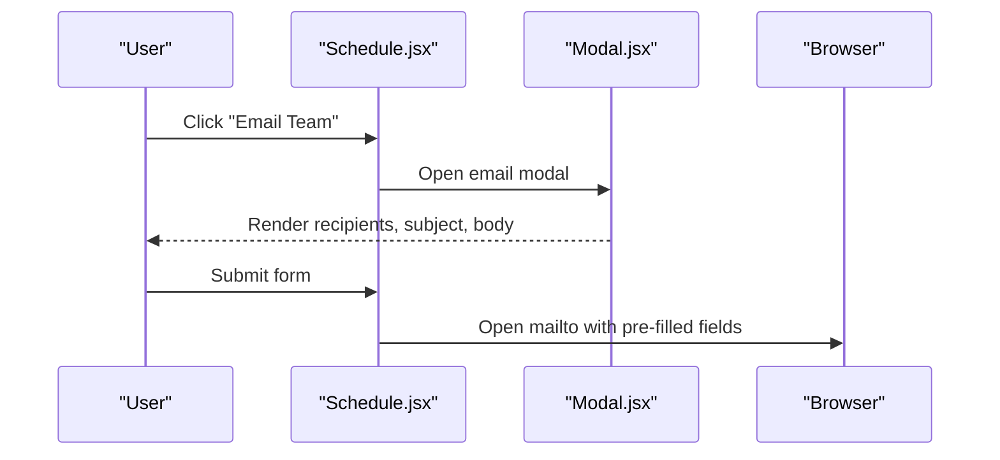

**Diagram sources**
- [src/pages/Schedule.jsx](file://src/pages/Schedule.jsx#L609-L727)
- [src/components/Modal.jsx](file://src/components/Modal.jsx#L1-L50)

**Section sources**
- [src/pages/Schedule.jsx](file://src/pages/Schedule.jsx#L609-L727)
- [src/components/Modal.jsx](file://src/components/Modal.jsx#L1-L50)

### Platform-Specific Formatting Differences
- WhatsApp: Uses a markdown-like structure with bold headings and bullet lists. Dates/times are human-friendly.
- Email: Same structure but sent via mailto, allowing the user’s default client to render.
- Printed format: HTML with semantic headings, meta info, and assignment blocks; designed for readability and print.

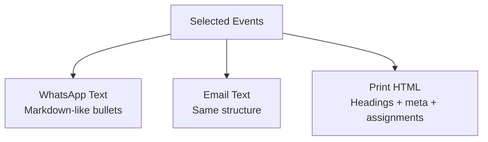

**Diagram sources**
- [src/pages/Schedule.jsx](file://src/pages/Schedule.jsx#L193-L216)
- [src/pages/Schedule.jsx](file://src/pages/Schedule.jsx#L231-L289)

**Section sources**
- [src/pages/Schedule.jsx](file://src/pages/Schedule.jsx#L193-L216)
- [src/pages/Schedule.jsx](file://src/pages/Schedule.jsx#L231-L289)

### External Application Integration via URL Schemes
- WhatsApp: web-based scheme opens the native app if installed.
- Email: mailto scheme opens the default mail client.
- Desktop packaging: Tauri configuration defines the app identity and build targets; URL schemes are handled by the OS/browser.

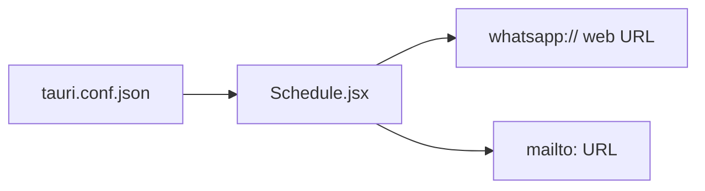

**Diagram sources**
- [src/pages/Schedule.jsx](file://src/pages/Schedule.jsx#L218-L229)
- [src-tauri/tauri.conf.json](file://src-tauri/tauri.conf.json#L1-L35)

**Section sources**
- [src/pages/Schedule.jsx](file://src/pages/Schedule.jsx#L218-L229)
- [src-tauri/tauri.conf.json](file://src-tauri/tauri.conf.json#L1-L35)

## Dependency Analysis
- UI depends on:
  - Modal component for email composition
  - Store for events, assignments, roles, volunteers, and groups
- External integrations depend on:
  - Browser/runtime support for URL schemes
  - OS availability of WhatsApp and mail clients

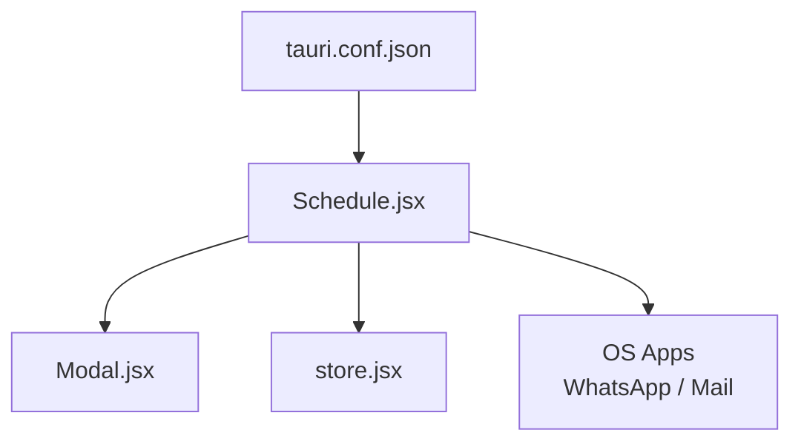

**Diagram sources**
- [src/pages/Schedule.jsx](file://src/pages/Schedule.jsx#L1-L731)
- [src/components/Modal.jsx](file://src/components/Modal.jsx#L1-L50)
- [src/services/store.jsx](file://src/services/store.jsx#L1-L472)
- [src-tauri/tauri.conf.json](file://src-tauri/tauri.conf.json#L1-L35)

**Section sources**
- [src/pages/Schedule.jsx](file://src/pages/Schedule.jsx#L1-L731)
- [src/components/Modal.jsx](file://src/components/Modal.jsx#L1-L50)
- [src/services/store.jsx](file://src/services/store.jsx#L1-L472)
- [src-tauri/tauri.conf.json](file://src-tauri/tauri.conf.json#L1-L35)

## Performance Considerations
- Formatting cost: Sorting and mapping selected events is O(n log n) plus per-event transformations; acceptable for typical schedules.
- Printing: Generating HTML and opening a new window is lightweight; delay before print avoids timing issues.
- Rendering: The floating action bar and modals are conditionally rendered, minimizing overhead when inactive.

## Troubleshooting Guide
- WhatsApp link does nothing:
  - Ensure the device has the WhatsApp app installed and supports the web scheme.
  - Verify the formatted text length is within URL limits.
- Email link does nothing:
  - Confirm the default mail client is configured on the device.
  - Check that subject/body are properly encoded.
- Print dialog does not appear:
  - Some browsers block pop-ups; allow pop-ups for the site.
  - Ensure the print window is not blocked by ad blockers.
- Recipients not added:
  - Manual input must include an @ symbol or match a volunteer name/email.
  - Duplicate recipients are prevented automatically.

**Section sources**
- [src/pages/Schedule.jsx](file://src/pages/Schedule.jsx#L218-L229)
- [src/pages/Schedule.jsx](file://src/pages/Schedule.jsx#L231-L303)
- [src/pages/Schedule.jsx](file://src/pages/Schedule.jsx#L97-L124)

## Conclusion
The sharing and communication tools provide a cohesive, multi-platform experience:
- Select multiple events, then quickly share via WhatsApp, email, or print.
- Content formatting is consistent across platforms while respecting platform constraints.
- The UI remains responsive and accessible, with clear feedback and error prevention.