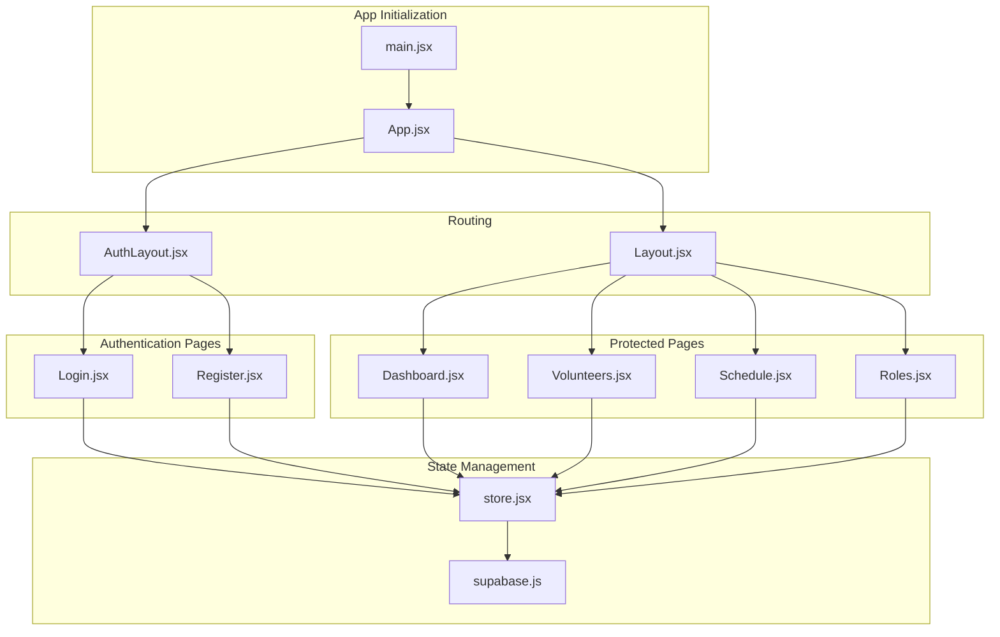
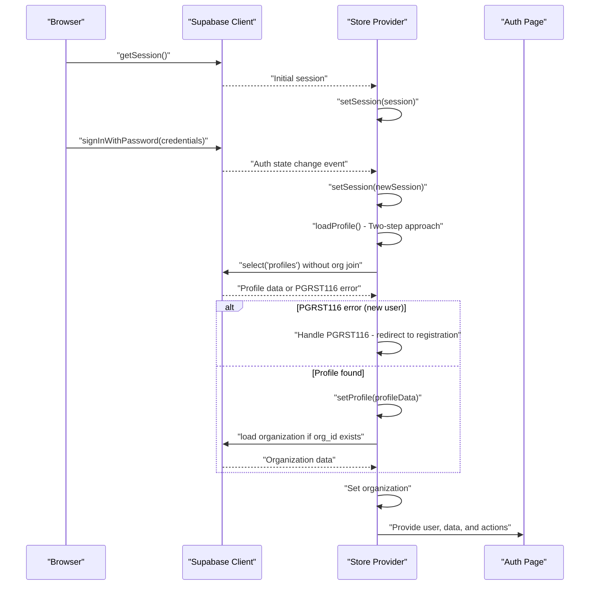
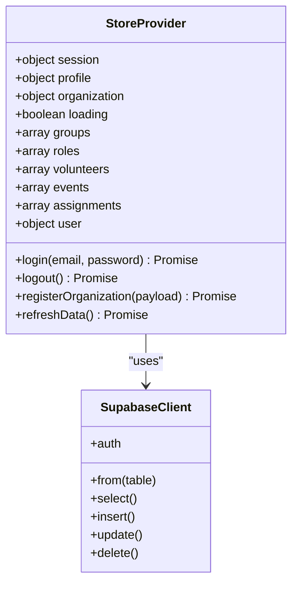
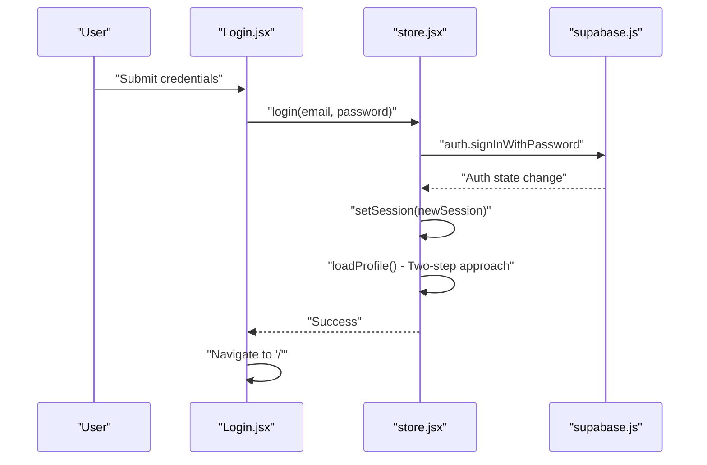
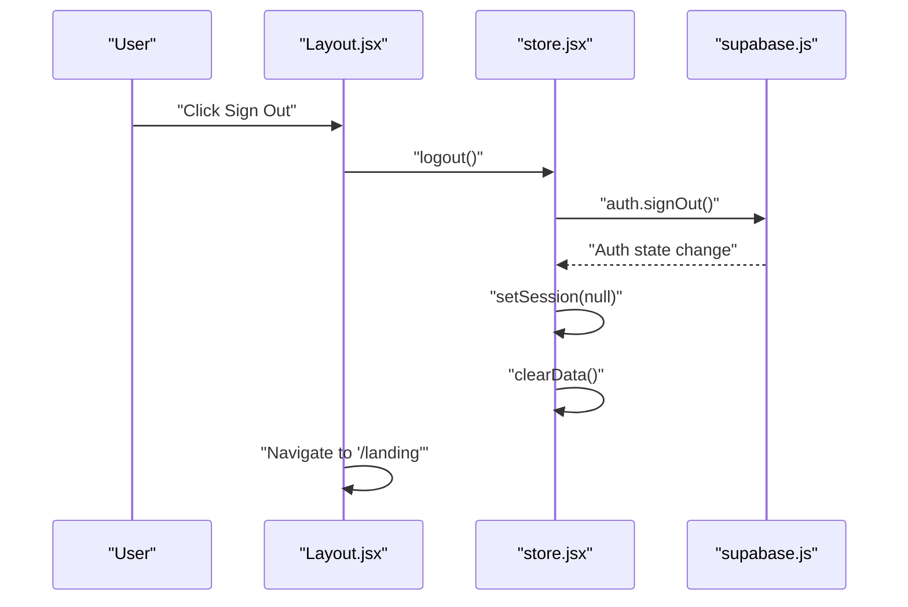
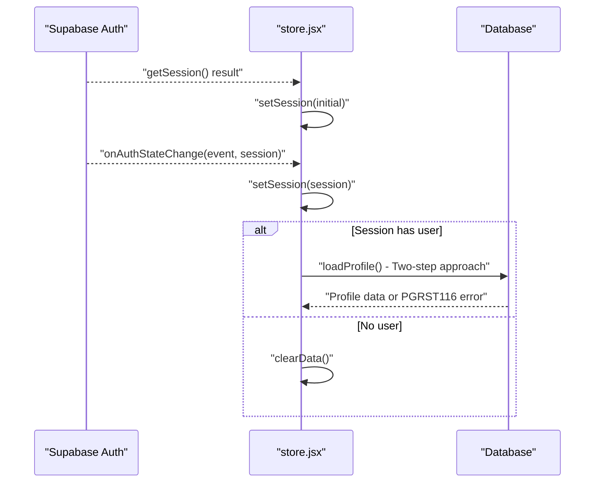
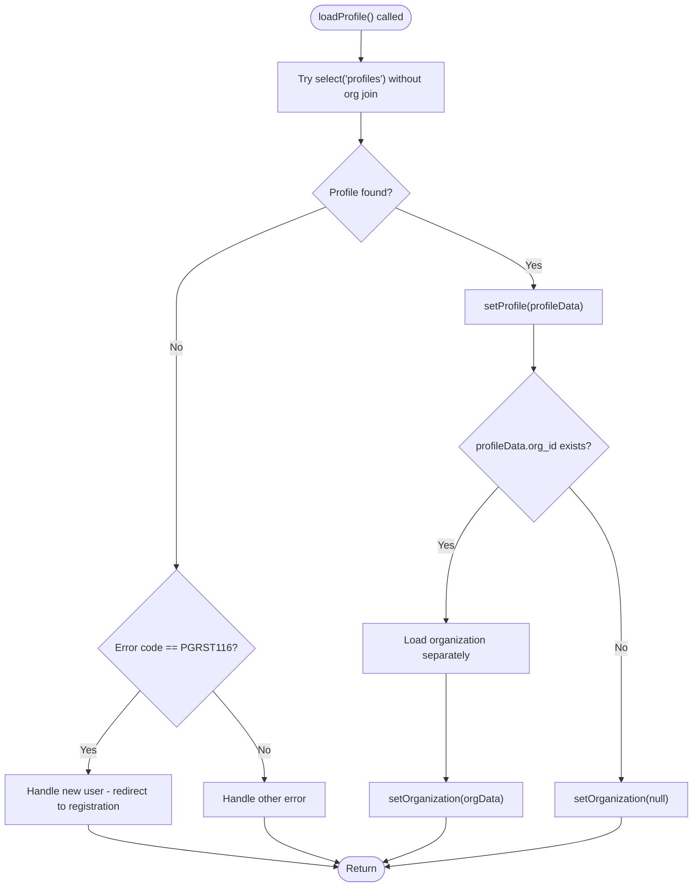
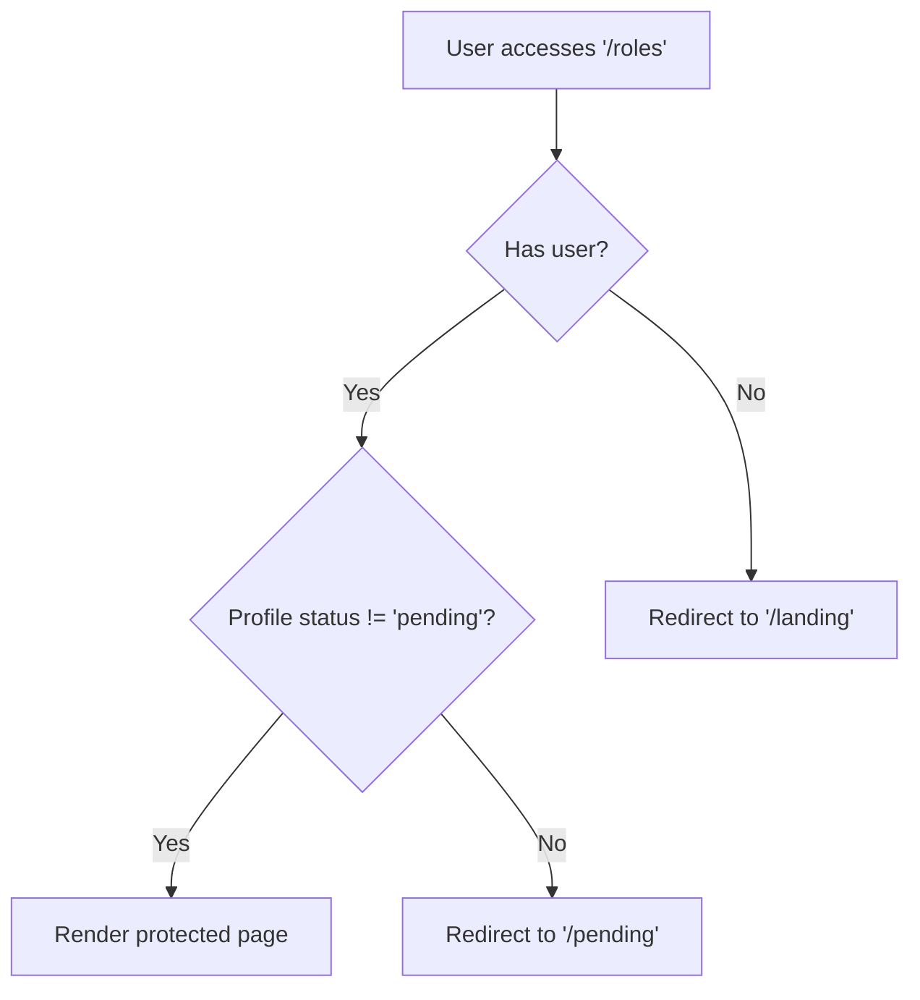
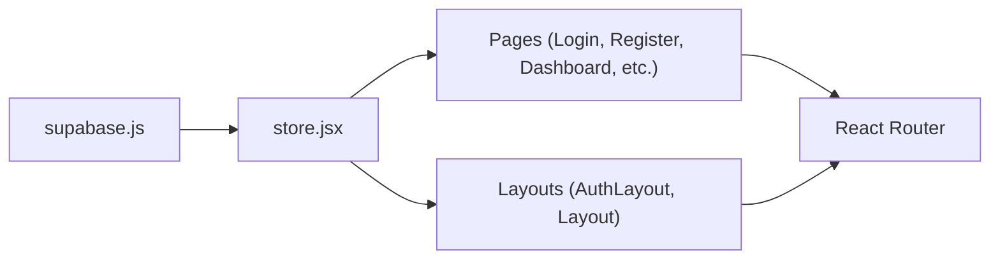

# Authentication State Management

<cite>
**Referenced Files in This Document**
- [store.jsx](file://src/services/store.jsx)
- [supabase.js](file://src/services/supabase.js)
- [Login.jsx](file://src/pages/Login.jsx)
- [Register.jsx](file://src/pages/Register.jsx)
- [App.jsx](file://src/App.jsx)
- [Layout.jsx](file://src/components/Layout.jsx)
- [AuthLayout.jsx](file://src/components/AuthLayout.jsx)
- [Dashboard.jsx](file://src/pages/Dashboard.jsx)
- [Volunteers.jsx](file://src/pages/Volunteers.jsx)
- [Schedule.jsx](file://src/pages/Schedule.jsx)
- [Roles.jsx](file://src/pages/Roles.jsx)
- [main.jsx](file://src/main.jsx)
- [.env.example](file://.env.example)
</cite>

## Update Summary
**Changes Made**
- Updated profile loading logic section to reflect the new two-step approach with improved error handling
- Enhanced PGRST116 error handling documentation for better user experience
- Added documentation for enhanced organization loading conditional logic
- Updated authentication flow diagrams to show the improved profile loading sequence
- Added troubleshooting guidance for PGRST116 error scenarios

## Table of Contents
1. [Introduction](#introduction)
2. [Project Structure](#project-structure)
3. [Core Components](#core-components)
4. [Architecture Overview](#architecture-overview)
5. [Detailed Component Analysis](#detailed-component-analysis)
6. [Dependency Analysis](#dependency-analysis)
7. [Performance Considerations](#performance-considerations)
8. [Troubleshooting Guide](#troubleshooting-guide)
9. [Conclusion](#conclusion)

## Introduction
This document explains RosterFlow's authentication state management system, focusing on the integration between Supabase Auth and the application's store. It covers session-based authentication flows for login, logout, and registration, details the multi-step organization registration process, describes auth state change listeners and automatic data reloading, documents the user object transformation for backward compatibility, and provides examples of authentication guards, protected routes, and session persistence patterns. Security considerations and error handling for authentication operations are also addressed.

**Updated** Recent improvements include enhanced profile loading logic with a two-step approach, better PGRST116 error handling for new users, and improved organization loading conditional logic.

## Project Structure
RosterFlow organizes authentication and state management around a central provider that wraps the entire app. Supabase client initialization is isolated in a dedicated module, while authentication-aware pages and layouts coordinate routing and navigation based on auth state.

**Diagram sources**
- [main.jsx:6-10](file://src/main.jsx#L6-L10)
- [App.jsx:13-34](file://src/App.jsx#L13-L34)
- [AuthLayout.jsx:4-25](file://src/components/AuthLayout.jsx#L4-L25)
- [Layout.jsx:14-107](file://src/components/Layout.jsx#L14-L107)
- [Login.jsx:5-79](file://src/pages/Login.jsx#L5-L79)
- [Register.jsx:5-100](file://src/pages/Register.jsx#L5-L100)
- [store.jsx:6-467](file://src/services/store.jsx#L6-L467)
- [supabase.js:1-13](file://src/services/supabase.js#L1-L13)
- [Dashboard.jsx:21-89](file://src/pages/Dashboard.jsx#L21-L89)
- [Volunteers.jsx:7-353](file://src/pages/Volunteers.jsx#L7-L353)
- [Schedule.jsx:7-730](file://src/pages/Schedule.jsx#L7-L730)
- [Roles.jsx:6-385](file://src/pages/Roles.jsx#L6-L385)

**Section sources**
- [main.jsx:6-10](file://src/main.jsx#L6-L10)
- [App.jsx:13-34](file://src/App.jsx#L13-L34)
- [store.jsx:6-467](file://src/services/store.jsx#L6-L467)
- [supabase.js:1-13](file://src/services/supabase.js#L1-L13)

## Core Components
- Supabase client initialization and environment configuration
- Central store provider managing auth session, profile, organization, and derived user object
- Auth state change listener for real-time session updates
- Authentication flows: login, logout, and multi-step registration
- Protected route guard using auth-aware layout
- Automatic data reload when auth state changes

Key implementation references:
- Supabase client creation and environment checks
- Store initialization, session retrieval, and auth listener
- Profile and organization loading on session change with improved error handling
- Derived user object for backward compatibility
- Auth functions: login, logout, registerOrganization
- Protected route guard in Layout component

**Updated** Enhanced profile loading with two-step approach and PGRST116 error handling for new users.

**Section sources**
- [supabase.js:1-13](file://src/services/supabase.js#L1-L13)
- [store.jsx:6-467](file://src/services/store.jsx#L6-L467)

## Architecture Overview
The authentication architecture integrates Supabase Auth with a React context provider. The provider initializes the session, subscribes to auth state changes, loads user profile and organization data with improved error handling, and exposes a derived user object and CRUD functions for application data.

**Updated** The sequence now shows the improved two-step profile loading approach with PGRST116 error handling.

**Diagram sources**
- [store.jsx:21-45](file://src/services/store.jsx#L21-L45)
- [store.jsx:54-68](file://src/services/store.jsx#L54-L68)
- [store.jsx:121-164](file://src/services/store.jsx#L121-L164)
- [Login.jsx:14-25](file://src/pages/Login.jsx#L14-L25)

**Section sources**
- [store.jsx:21-68](file://src/services/store.jsx#L21-L68)
- [store.jsx:121-164](file://src/services/store.jsx#L121-L164)
- [Login.jsx:14-25](file://src/pages/Login.jsx#L14-L25)

## Detailed Component Analysis

### Supabase Client and Environment
- Creates a Supabase client using Vite environment variables.
- Validates presence of URL and anonymous key, logging a warning if missing.
- Exports a singleton client for use across the app.

Security and configuration notes:
- Environment variables are loaded via Vite's import.meta.env.
- Missing variables trigger a console warning; ensure .env is configured.

**Section sources**
- [supabase.js:1-13](file://src/services/supabase.js#L1-L13)
- [.env.example:1-5](file://.env.example#L1-L5)

### Store Provider and Auth State Management
Responsibilities:
- Initialize session state and loading flag
- Retrieve initial session on mount
- Subscribe to auth state changes and update session
- Load profile and organization when a session exists with improved error handling
- Clear data and reset state on logout
- Derive a compact user object for backward compatibility
- Provide CRUD functions for application data

Auth state lifecycle:
- Initial session fetch on provider mount
- Real-time auth listener updates session
- On session change, load profile with two-step approach and handle PGRST116 errors
- On logout, clear profile, organization, and application data

Data loading strategy:
- Parallel loading of groups, roles, volunteers, events, and assignments
- Volunteer roles normalized to a flat array for compatibility

**Updated** Enhanced profile loading with two-step approach and PGRST116 error handling for new users.

**Section sources**
- [store.jsx:6-467](file://src/services/store.jsx#L6-L467)

#### Class Diagram: Store Provider and Derived Objects

**Diagram sources**
- [store.jsx:6-467](file://src/services/store.jsx#L6-L467)
- [supabase.js:1-13](file://src/services/supabase.js#L1-L13)

### Login Flow
- Form captures email and password
- Calls store.login which delegates to Supabase sign-in
- On success, navigates to the dashboard
- On error, displays an alert with the error message

**Diagram sources**
- [Login.jsx:14-25](file://src/pages/Login.jsx#L14-L25)
- [store.jsx:251-275](file://src/services/store.jsx#L251-L275)
- [store.jsx:121-164](file://src/services/store.jsx#L121-L164)

**Section sources**
- [Login.jsx:14-25](file://src/pages/Login.jsx#L14-L25)
- [store.jsx:251-275](file://src/services/store.jsx#L251-L275)
- [store.jsx:121-164](file://src/services/store.jsx#L121-L164)

### Logout Flow
- Calls store.logout which signs out via Supabase
- Clears profile, organization, and application data
- Navigates to landing page

**Diagram sources**
- [Layout.jsx:36-39](file://src/components/Layout.jsx#L36-L39)
- [store.jsx:277-288](file://src/services/store.jsx#L277-L288)

**Section sources**
- [Layout.jsx:36-39](file://src/components/Layout.jsx#L36-L39)
- [store.jsx:277-288](file://src/services/store.jsx#L277-L288)

### Registration Flow: registerOrganization
Multi-step process:
1. Create auth user via Supabase sign-up
2. Create organization record
3. Create profile record linking user to organization
4. Auto-login by loading profile and data

**Diagram sources**
- [store.jsx:290-395](file://src/services/store.jsx#L290-L395)

**Section sources**
- [store.jsx:290-395](file://src/services/store.jsx#L290-L395)

### Auth State Change Listener and Automatic Data Reloading
- Initializes session on mount
- Subscribes to auth state changes
- Updates session and triggers profile/organization loading with improved error handling
- Clears data and resets state when logged out
- Loads all application data in parallel when profile is available

**Updated** The sequence now shows the improved profile loading with PGRST116 error handling.

**Diagram sources**
- [store.jsx:58-88](file://src/services/store.jsx#L58-L88)
- [store.jsx:90-111](file://src/services/store.jsx#L90-L111)
- [store.jsx:121-164](file://src/services/store.jsx#L121-L164)

**Section sources**
- [store.jsx:58-88](file://src/services/store.jsx#L58-L88)
- [store.jsx:90-111](file://src/services/store.jsx#L90-L111)
- [store.jsx:121-164](file://src/services/store.jsx#L121-L164)

### Enhanced Profile Loading Logic with Two-Step Approach
**Updated** The profile loading system now uses a sophisticated two-step approach to handle various scenarios:

1. **First Step**: Attempt to load profile data without organization joins to avoid 406 errors
2. **Error Handling**: Specifically handle PGRST116 error code which indicates "no rows returned" - this is expected for new users who haven't created a profile yet
3. **Conditional Organization Loading**: Only attempt to load organization data if the profile has an `org_id`
4. **Graceful Degradation**: Set organization to null if organization data is not available

**Diagram sources**
- [store.jsx:121-164](file://src/services/store.jsx#L121-L164)

**Section sources**
- [store.jsx:121-164](file://src/services/store.jsx#L121-L164)

### PGRST116 Error Handling for New Users
**Updated** The system now includes specific handling for PGRST116 errors, which indicate "no rows returned" from database queries. This is particularly important for new users who have authenticated but haven't yet created their profile:

- **Detection**: The system specifically checks for `profileError.code === 'PGRST116'`
- **Response**: Instead of failing, it sets profile and organization to null and returns gracefully
- **User Experience**: This allows the system to redirect new users to the registration page
- **Logging**: Provides clear console logs indicating the expected scenario

**Section sources**
- [store.jsx:130-141](file://src/services/store.jsx#L130-L141)

### Enhanced Organization Loading Conditional Logic
**Updated** The organization loading logic has been enhanced to be more conditional and robust:

- **Conditional Loading**: Organization is only loaded if `profileData.org_id` exists
- **Separate Query**: Organization data is loaded in a separate query to avoid complex joins
- **Error Recovery**: If organization loading fails, the system sets organization to null gracefully
- **Backward Compatibility**: Maintains existing functionality while improving reliability

**Section sources**
- [store.jsx:145-160](file://src/services/store.jsx#L145-L160)

### User Object Transformation for Backward Compatibility
- The store derives a compact user object containing id, email, name, and orgId
- This simplifies downstream components that previously expected a flattened user shape
- Maintains compatibility with existing components while leveraging Supabase session and profile data

**Section sources**
- [store.jsx:1198-1211](file://src/services/store.jsx#L1198-L1211)

### Authentication Guards and Protected Routes
- AuthLayout renders authentication pages (landing, login, register)
- Layout renders protected pages (dashboard, volunteers, schedule, roles)
- Layout enforces authentication by redirecting to landing if user is absent
- Logout clears state and redirects to landing

**Updated** The flow now includes pending status checking for profile approval.

**Diagram sources**
- [Layout.jsx:20-29](file://src/components/Layout.jsx#L20-L29)

**Section sources**
- [Layout.jsx:20-29](file://src/components/Layout.jsx#L20-L29)

### Session Persistence Patterns
- Supabase handles session persistence automatically
- The store subscribes to auth state changes to keep local state synchronized
- Initial session is fetched on provider mount to hydrate state immediately

**Section sources**
- [store.jsx:58-88](file://src/services/store.jsx#L58-L88)

### Examples of Authentication Guards and Protected Route Handling
- Protected route pattern: wrap protected pages with Layout; check user presence and redirect if missing
- Authentication pages: wrap with AuthLayout; render login/register forms
- Navigation: use navigate after successful login/logout

**Section sources**
- [Layout.jsx:15-39](file://src/components/Layout.jsx#L15-L39)
- [AuthLayout.jsx:4-25](file://src/components/AuthLayout.jsx#L4-L25)
- [Login.jsx:18-25](file://src/pages/Login.jsx#L18-L25)
- [Layout.jsx:36-39](file://src/components/Layout.jsx#L36-L39)

## Dependency Analysis
The authentication system exhibits clear separation of concerns:
- Supabase client encapsulates backend communication
- Store provider manages state and orchestrates data loading with improved error handling
- Pages depend on the store for auth actions and data
- Layout components enforce route protection

**Diagram sources**
- [supabase.js:1-13](file://src/services/supabase.js#L1-L13)
- [store.jsx:6-467](file://src/services/store.jsx#L6-L467)
- [App.jsx:13-34](file://src/App.jsx#L13-L34)

**Section sources**
- [supabase.js:1-13](file://src/services/supabase.js#L1-L13)
- [store.jsx:6-467](file://src/services/store.jsx#L6-L467)
- [App.jsx:13-34](file://src/App.jsx#L13-L34)

## Performance Considerations
- Parallel data loading reduces round trips when initializing application data after login
- Minimal re-renders by updating state atomically on auth changes
- Avoid unnecessary queries by checking for org_id before loading data
- Consider caching strategies for frequently accessed lists (roles, groups) if data volume grows

**Updated** The two-step profile loading approach reduces the likelihood of complex database joins and improves performance for new users.

## Troubleshooting Guide
Common issues and resolutions:
- Missing environment variables: ensure VITE_SUPABASE_URL and VITE_SUPABASE_ANON_KEY are set; the client logs a warning if missing
- Login failures: errors are thrown and surfaced to the UI; check network connectivity and Supabase project status
- Logout does not clear data: verify the logout function is called and auth listener updates session to null
- Protected route not enforced: confirm Layout checks user presence and redirects appropriately
- Registration errors: inspect each step (auth, org, profile) for errors and ensure proper error propagation
- **PGRST116 errors**: These are expected for new users without profiles; the system handles them gracefully by redirecting to registration
- **Profile loading issues**: The two-step approach should resolve most profile loading problems; check database permissions and table structure

**Updated** Added troubleshooting guidance for PGRST116 errors and enhanced profile loading scenarios.

**Section sources**
- [supabase.js:15-21](file://src/services/supabase.js#L15-L21)
- [store.jsx:251-275](file://src/services/store.jsx#L251-L275)
- [store.jsx:277-288](file://src/services/store.jsx#L277-L288)
- [Layout.jsx:20-29](file://src/components/Layout.jsx#L20-L29)
- [store.jsx:290-395](file://src/services/store.jsx#L290-L395)
- [store.jsx:130-141](file://src/services/store.jsx#L130-L141)

## Conclusion
RosterFlow's authentication system integrates Supabase Auth with a centralized store provider to deliver a seamless session-based experience. The provider listens for auth state changes, loads user profiles and organization data with improved error handling, and exposes a compact user object for backward compatibility. The routing layer enforces authentication guards, while the store's auth functions support login, logout, and multi-step registration. 

**Updated** Recent improvements include a sophisticated two-step profile loading approach that handles PGRST116 errors gracefully, enhanced organization loading conditional logic, and better error recovery mechanisms. The architecture balances simplicity, maintainability, performance, and user experience, with clear separation between client initialization, state management, and UI components while providing robust error handling for edge cases.