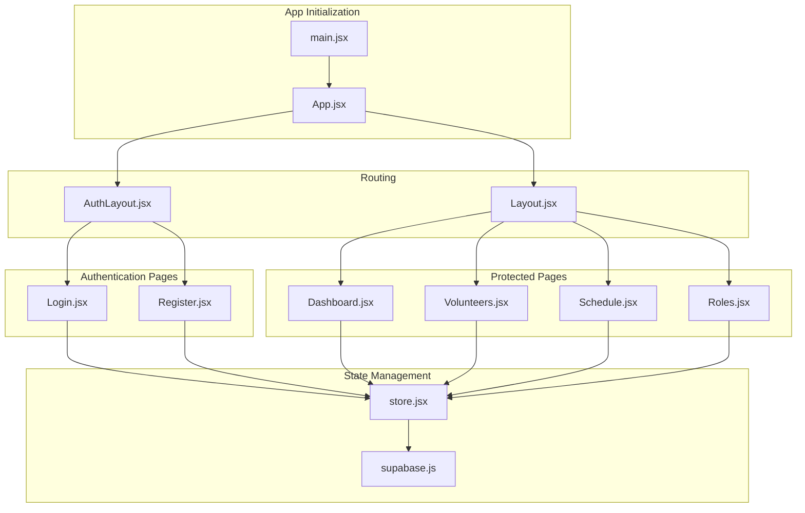
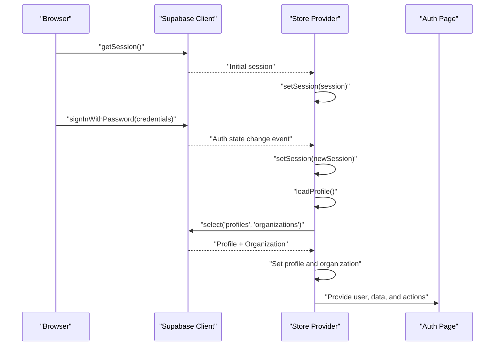
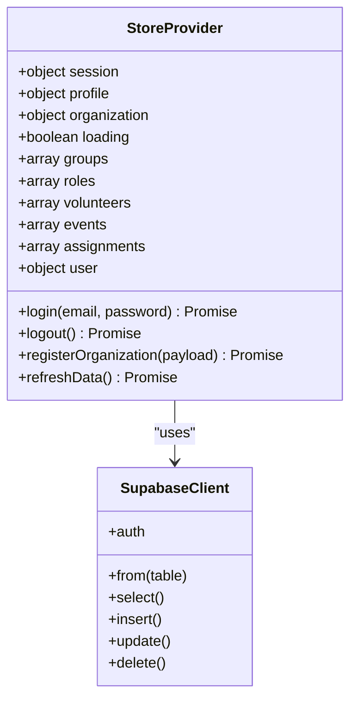
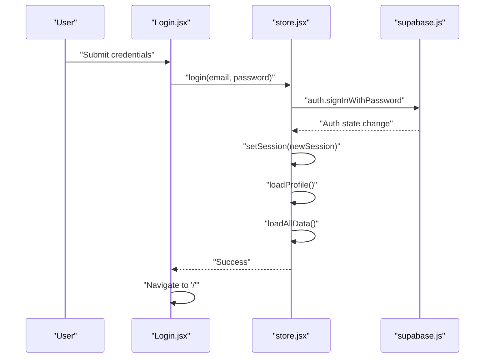
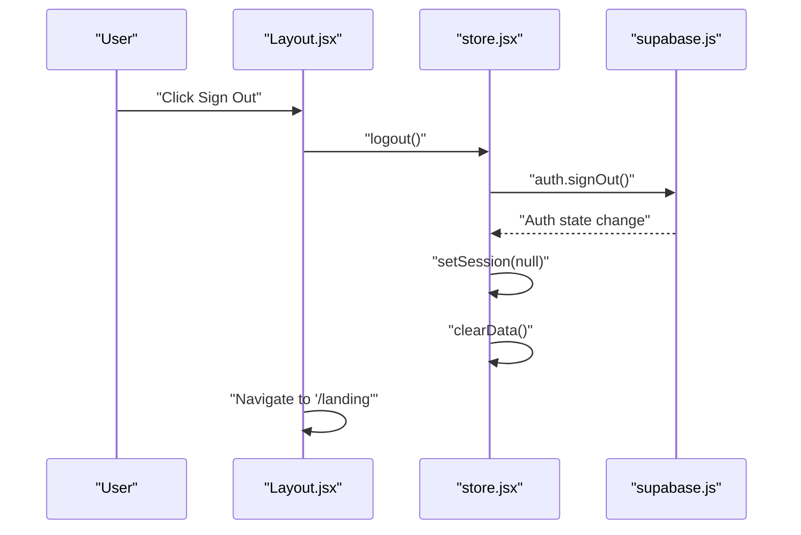
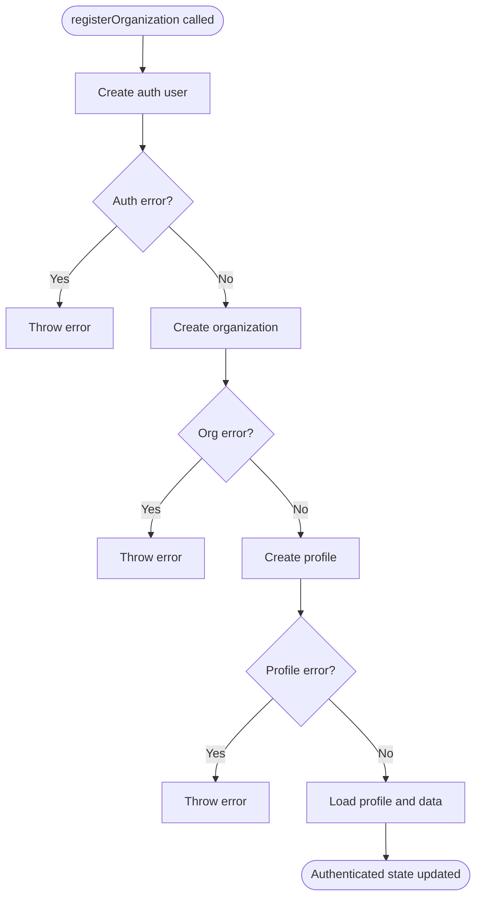
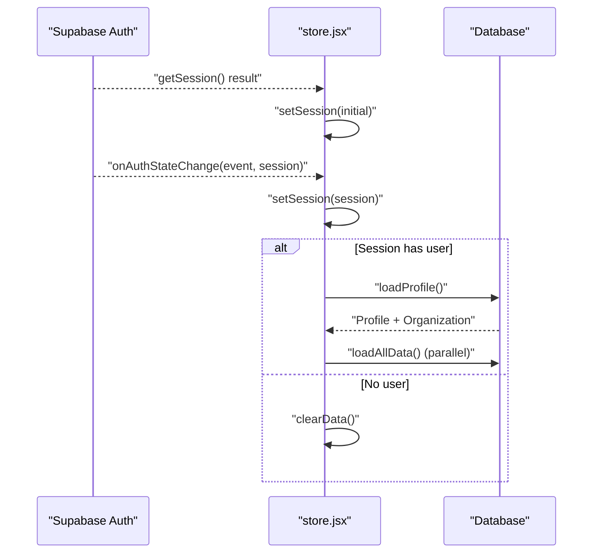
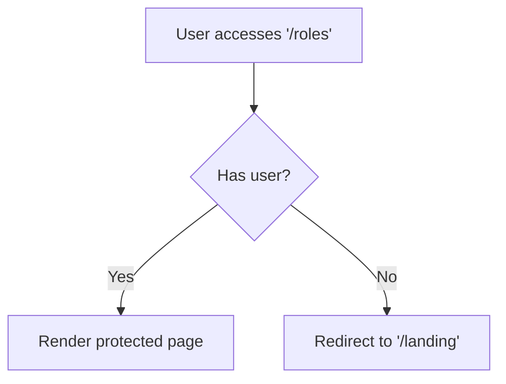
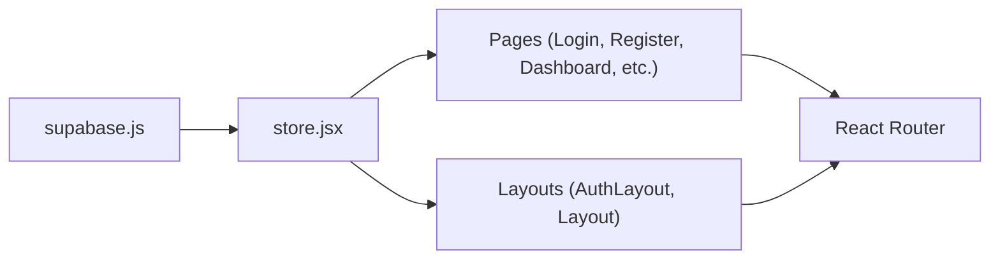

# Authentication State Management

<cite>
**Referenced Files in This Document**
- [store.jsx](file://src/services/store.jsx)
- [supabase.js](file://src/services/supabase.js)
- [Login.jsx](file://src/pages/Login.jsx)
- [Register.jsx](file://src/pages/Register.jsx)
- [App.jsx](file://src/App.jsx)
- [Layout.jsx](file://src/components/Layout.jsx)
- [AuthLayout.jsx](file://src/components/AuthLayout.jsx)
- [Dashboard.jsx](file://src/pages/Dashboard.jsx)
- [Volunteers.jsx](file://src/pages/Volunteers.jsx)
- [Schedule.jsx](file://src/pages/Schedule.jsx)
- [Roles.jsx](file://src/pages/Roles.jsx)
- [main.jsx](file://src/main.jsx)
- [.env.example](file://.env.example)
</cite>

## Table of Contents
1. [Introduction](#introduction)
2. [Project Structure](#project-structure)
3. [Core Components](#core-components)
4. [Architecture Overview](#architecture-overview)
5. [Detailed Component Analysis](#detailed-component-analysis)
6. [Dependency Analysis](#dependency-analysis)
7. [Performance Considerations](#performance-considerations)
8. [Troubleshooting Guide](#troubleshooting-guide)
9. [Conclusion](#conclusion)

## Introduction
This document explains RosterFlow’s authentication state management system, focusing on the integration between Supabase Auth and the application’s store. It covers session-based authentication flows for login, logout, and registration, details the multi-step organization registration process, describes auth state change listeners and automatic data reloading, documents the user object transformation for backward compatibility, and provides examples of authentication guards, protected routes, and session persistence patterns. Security considerations and error handling for authentication operations are also addressed.

## Project Structure
RosterFlow organizes authentication and state management around a central provider that wraps the entire app. Supabase client initialization is isolated in a dedicated module, while authentication-aware pages and layouts coordinate routing and navigation based on auth state.

**Diagram sources**
- [main.jsx](file://src/main.jsx#L6-L10)
- [App.jsx](file://src/App.jsx#L13-L34)
- [AuthLayout.jsx](file://src/components/AuthLayout.jsx#L4-L25)
- [Layout.jsx](file://src/components/Layout.jsx#L14-L107)
- [Login.jsx](file://src/pages/Login.jsx#L5-L79)
- [Register.jsx](file://src/pages/Register.jsx#L5-L100)
- [store.jsx](file://src/services/store.jsx#L6-L467)
- [supabase.js](file://src/services/supabase.js#L1-L13)
- [Dashboard.jsx](file://src/pages/Dashboard.jsx#L21-L89)
- [Volunteers.jsx](file://src/pages/Volunteers.jsx#L7-L353)
- [Schedule.jsx](file://src/pages/Schedule.jsx#L7-L730)
- [Roles.jsx](file://src/pages/Roles.jsx#L6-L385)

**Section sources**
- [main.jsx](file://src/main.jsx#L6-L10)
- [App.jsx](file://src/App.jsx#L13-L34)
- [store.jsx](file://src/services/store.jsx#L6-L467)
- [supabase.js](file://src/services/supabase.js#L1-L13)

## Core Components
- Supabase client initialization and environment configuration
- Central store provider managing auth session, profile, organization, and derived user object
- Auth state change listener for real-time session updates
- Authentication flows: login, logout, and multi-step registration
- Protected route guard using auth-aware layout
- Automatic data reload when auth state changes

Key implementation references:
- Supabase client creation and environment checks
- Store initialization, session retrieval, and auth listener
- Profile and organization loading on session change
- Derived user object for backward compatibility
- Auth functions: login, logout, registerOrganization
- Protected route guard in Layout component

**Section sources**
- [supabase.js](file://src/services/supabase.js#L1-L13)
- [store.jsx](file://src/services/store.jsx#L6-L467)

## Architecture Overview
The authentication architecture integrates Supabase Auth with a React context provider. The provider initializes the session, subscribes to auth state changes, loads user profile and organization data, and exposes a derived user object and CRUD functions for application data.

**Diagram sources**
- [store.jsx](file://src/services/store.jsx#L21-L45)
- [store.jsx](file://src/services/store.jsx#L54-L68)
- [Login.jsx](file://src/pages/Login.jsx#L14-L25)

**Section sources**
- [store.jsx](file://src/services/store.jsx#L21-L68)
- [Login.jsx](file://src/pages/Login.jsx#L14-L25)

## Detailed Component Analysis

### Supabase Client and Environment
- Creates a Supabase client using Vite environment variables.
- Validates presence of URL and anonymous key, logging a warning if missing.
- Exports a singleton client for use across the app.

Security and configuration notes:
- Environment variables are loaded via Vite’s import.meta.env.
- Missing variables trigger a console warning; ensure .env is configured.

**Section sources**
- [supabase.js](file://src/services/supabase.js#L1-L13)
- [.env.example](file://.env.example#L1-L5)

### Store Provider and Auth State Management
Responsibilities:
- Initialize session state and loading flag
- Retrieve initial session on mount
- Subscribe to auth state changes and update session
- Load profile and organization when a session exists
- Clear data and reset state on logout
- Derive a compact user object for backward compatibility
- Provide CRUD functions for application data

Auth state lifecycle:
- Initial session fetch on provider mount
- Real-time auth listener updates session
- On session change, load profile and organization
- On logout, clear profile, organization, and application data

Data loading strategy:
- Parallel loading of groups, roles, volunteers, events, and assignments
- Volunteer roles normalized to a flat array for compatibility

**Section sources**
- [store.jsx](file://src/services/store.jsx#L6-L467)

#### Class Diagram: Store Provider and Derived Objects

**Diagram sources**
- [store.jsx](file://src/services/store.jsx#L6-L467)
- [supabase.js](file://src/services/supabase.js#L1-L13)

### Login Flow
- Form captures email and password
- Calls store.login which delegates to Supabase sign-in
- On success, navigates to the dashboard
- On error, displays an alert with the error message

**Diagram sources**
- [Login.jsx](file://src/pages/Login.jsx#L14-L25)
- [store.jsx](file://src/services/store.jsx#L114-L124)
- [store.jsx](file://src/services/store.jsx#L37-L52)
- [store.jsx](file://src/services/store.jsx#L54-L111)

**Section sources**
- [Login.jsx](file://src/pages/Login.jsx#L14-L25)
- [store.jsx](file://src/services/store.jsx#L114-L124)
- [store.jsx](file://src/services/store.jsx#L37-L111)

### Logout Flow
- Calls store.logout which signs out via Supabase
- Clears profile, organization, and application data
- Navigates to landing page

**Diagram sources**
- [Layout.jsx](file://src/components/Layout.jsx#L27-L30)
- [store.jsx](file://src/services/store.jsx#L119-L124)

**Section sources**
- [Layout.jsx](file://src/components/Layout.jsx#L27-L30)
- [store.jsx](file://src/services/store.jsx#L119-L124)

### Registration Flow: registerOrganization
Multi-step process:
1. Create auth user via Supabase sign-up
2. Create organization record
3. Create profile record linking user to organization
4. Auto-login by loading profile and data

**Diagram sources**
- [store.jsx](file://src/services/store.jsx#L126-L159)

**Section sources**
- [store.jsx](file://src/services/store.jsx#L126-L159)

### Auth State Change Listener and Automatic Data Reloading
- Initializes session on mount
- Subscribes to auth state changes
- Updates session and triggers profile/organization loading
- Clears data and resets state when logged out
- Loads all application data in parallel when profile is available

**Diagram sources**
- [store.jsx](file://src/services/store.jsx#L21-L52)
- [store.jsx](file://src/services/store.jsx#L54-L111)

**Section sources**
- [store.jsx](file://src/services/store.jsx#L21-L52)
- [store.jsx](file://src/services/store.jsx#L54-L111)

### User Object Transformation for Backward Compatibility
- The store derives a compact user object containing id, email, name, and orgId
- This simplifies downstream components that previously expected a flattened user shape
- Maintains compatibility with existing components while leveraging Supabase session and profile data

**Section sources**
- [store.jsx](file://src/services/store.jsx#L424-L430)

### Authentication Guards and Protected Routes
- AuthLayout renders authentication pages (landing, login, register)
- Layout renders protected pages (dashboard, volunteers, schedule, roles)
- Layout enforces authentication by redirecting to landing if user is absent
- Logout clears state and redirects to landing

**Diagram sources**
- [App.jsx](file://src/App.jsx#L18-L29)
- [Layout.jsx](file://src/components/Layout.jsx#L19-L23)

**Section sources**
- [App.jsx](file://src/App.jsx#L18-L29)
- [Layout.jsx](file://src/components/Layout.jsx#L19-L23)

### Session Persistence Patterns
- Supabase handles session persistence automatically
- The store subscribes to auth state changes to keep local state synchronized
- Initial session is fetched on provider mount to hydrate state immediately

**Section sources**
- [store.jsx](file://src/services/store.jsx#L21-L34)

### Examples of Authentication Guards and Protected Route Handling
- Protected route pattern: wrap protected pages with Layout; check user presence and redirect if missing
- Authentication pages: wrap with AuthLayout; render login/register forms
- Navigation: use navigate after successful login/logout

**Section sources**
- [Layout.jsx](file://src/components/Layout.jsx#L19-L30)
- [AuthLayout.jsx](file://src/components/AuthLayout.jsx#L4-L25)
- [Login.jsx](file://src/pages/Login.jsx#L18-L24)
- [Layout.jsx](file://src/components/Layout.jsx#L27-L30)

## Dependency Analysis
The authentication system exhibits clear separation of concerns:
- Supabase client encapsulates backend communication
- Store provider manages state and orchestrates data loading
- Pages depend on the store for auth actions and data
- Layout components enforce route protection

**Diagram sources**
- [supabase.js](file://src/services/supabase.js#L1-L13)
- [store.jsx](file://src/services/store.jsx#L6-L467)
- [App.jsx](file://src/App.jsx#L13-L34)

**Section sources**
- [supabase.js](file://src/services/supabase.js#L1-L13)
- [store.jsx](file://src/services/store.jsx#L6-L467)
- [App.jsx](file://src/App.jsx#L13-L34)

## Performance Considerations
- Parallel data loading reduces round trips when initializing application data after login
- Minimal re-renders by updating state atomically on auth changes
- Avoid unnecessary queries by checking for org_id before loading data
- Consider caching strategies for frequently accessed lists (roles, groups) if data volume grows

[No sources needed since this section provides general guidance]

## Troubleshooting Guide
Common issues and resolutions:
- Missing environment variables: ensure VITE_SUPABASE_URL and VITE_SUPABASE_ANON_KEY are set; the client logs a warning if missing
- Login failures: errors are thrown and surfaced to the UI; check network connectivity and Supabase project status
- Logout does not clear data: verify the logout function is called and auth listener updates session to null
- Protected route not enforced: confirm Layout checks user presence and redirects appropriately
- Registration errors: inspect each step (auth, org, profile) for errors and ensure proper error propagation

**Section sources**
- [supabase.js](file://src/services/supabase.js#L6-L8)
- [store.jsx](file://src/services/store.jsx#L114-L124)
- [store.jsx](file://src/services/store.jsx#L119-L124)
- [Layout.jsx](file://src/components/Layout.jsx#L19-L23)
- [store.jsx](file://src/services/store.jsx#L126-L159)

## Conclusion
RosterFlow’s authentication system integrates Supabase Auth with a centralized store provider to deliver a seamless session-based experience. The provider listens for auth state changes, loads user profiles and organization data, and exposes a compact user object for backward compatibility. The routing layer enforces authentication guards, while the store’s auth functions support login, logout, and multi-step registration. The architecture balances simplicity, maintainability, and performance, with clear separation between client initialization, state management, and UI components.