# CRUD Operations Implementation

<cite>
**Referenced Files in This Document**
- [store.jsx](file://src/services/store.jsx)
- [supabase.js](file://src/services/supabase.js)
- [supabase-schema.sql](file://supabase-schema.sql)
- [Volunteers.jsx](file://src/pages/Volunteers.jsx)
- [Roles.jsx](file://src/pages/Roles.jsx)
- [Schedule.jsx](file://src/pages/Schedule.jsx)
- [App.jsx](file://src/App.jsx)
- [main.jsx](file://src/main.jsx)
- [Modal.jsx](file://src/components/Modal.jsx)
</cite>

## Table of Contents
1. [Introduction](#introduction)
2. [Project Structure](#project-structure)
3. [Core Components](#core-components)
4. [Architecture Overview](#architecture-overview)
5. [Detailed Component Analysis](#detailed-component-analysis)
6. [Dependency Analysis](#dependency-analysis)
7. [Performance Considerations](#performance-considerations)
8. [Troubleshooting Guide](#troubleshooting-guide)
9. [Conclusion](#conclusion)

## Introduction
This document explains how RosterFlow implements CRUD operations within its centralized store. It covers standardized patterns for volunteers, events, assignments, roles, and groups, along with transactional behavior, error handling, data consistency, organization-scoped filtering, tenant isolation, optimistic updates, data transformations, and the refreshData mechanism. It also documents complex operations such as volunteer role updates, event assignment creation, and bulk data imports, and provides performance and validation guidance.

## Project Structure
RosterFlow follows a React-based frontend architecture with a single store provider that manages application-wide state and integrates with Supabase for persistence and real-time synchronization. The store exposes CRUD methods for all entities and orchestrates data refresh after mutations.

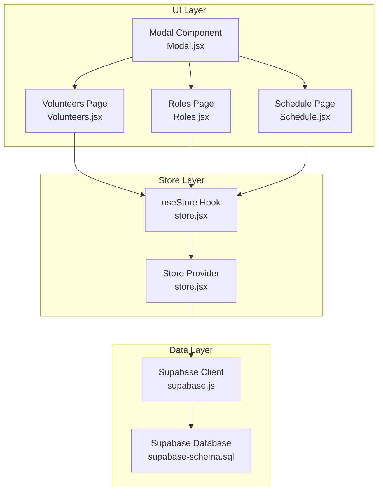

**Diagram sources**
- [store.jsx](file://src/services/store.jsx#L1-L472)
- [supabase.js](file://src/services/supabase.js#L1-L13)
- [supabase-schema.sql](file://supabase-schema.sql#L1-L251)
- [Volunteers.jsx](file://src/pages/Volunteers.jsx#L1-L354)
- [Roles.jsx](file://src/pages/Roles.jsx#L1-L386)
- [Schedule.jsx](file://src/pages/Schedule.jsx#L1-L731)
- [Modal.jsx](file://src/components/Modal.jsx#L1-L50)

**Section sources**
- [store.jsx](file://src/services/store.jsx#L1-L472)
- [supabase.js](file://src/services/supabase.js#L1-L13)
- [supabase-schema.sql](file://supabase-schema.sql#L1-L251)
- [Volunteers.jsx](file://src/pages/Volunteers.jsx#L1-L354)
- [Roles.jsx](file://src/pages/Roles.jsx#L1-L386)
- [Schedule.jsx](file://src/pages/Schedule.jsx#L1-L731)
- [App.jsx](file://src/App.jsx#L1-L37)
- [main.jsx](file://src/main.jsx#L1-L11)
- [Modal.jsx](file://src/components/Modal.jsx#L1-L50)

## Core Components
- Store Provider: Centralizes authentication state, organization context, and all entity collections. Exposes CRUD methods and a refreshData function.
- Supabase Client: Provides typed database access and RLS enforcement.
- Entity Collections: groups, roles, volunteers, events, assignments.
- UI Pages: Consumers of the store that drive CRUD operations and present derived data.

Key store responsibilities:
- Authentication lifecycle and profile loading
- Organization-scoped data loading and filtering
- Optimistic UI updates followed by refreshData
- Error propagation via thrown errors
- Many-to-many volunteer-role management via volunteer_roles

**Section sources**
- [store.jsx](file://src/services/store.jsx#L1-L472)
- [supabase.js](file://src/services/supabase.js#L1-L13)

## Architecture Overview
The store loads all organization-scoped data in parallel, transforms volunteer records to flatten role associations, and exposes mutation methods that update the database and then refresh the entire dataset. UI pages subscribe to the store and call mutation functions, which propagate errors and trigger re-fetches.

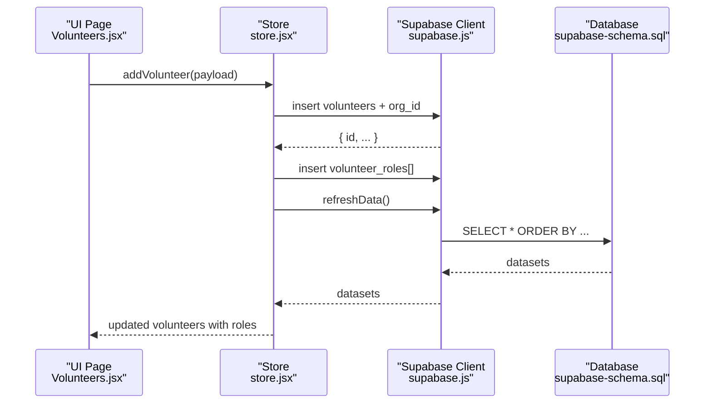

**Diagram sources**
- [store.jsx](file://src/services/store.jsx#L162-L194)
- [supabase.js](file://src/services/supabase.js#L1-L13)
- [supabase-schema.sql](file://supabase-schema.sql#L40-L76)
- [Volunteers.jsx](file://src/pages/Volunteers.jsx#L45-L66)

**Section sources**
- [store.jsx](file://src/services/store.jsx#L78-L111)
- [Volunteers.jsx](file://src/pages/Volunteers.jsx#L45-L66)

## Detailed Component Analysis

### Store Provider and Data Loading
- Loads profile and organization on auth session change.
- On profile availability, loads groups, roles, volunteers, events, and assignments in parallel.
- Transforms volunteers to include a flattened roles array derived from volunteer_roles.
- Provides refreshData to reload all datasets.

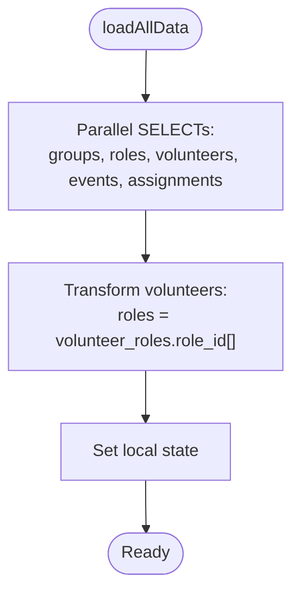

**Diagram sources**
- [store.jsx](file://src/services/store.jsx#L78-L111)
- [store.jsx](file://src/services/store.jsx#L96-L104)

**Section sources**
- [store.jsx](file://src/services/store.jsx#L48-L111)

### Volunteer CRUD and Many-to-Many Management
- Creation: Inserts volunteer with org_id, then inserts volunteer_roles rows for provided role IDs.
- Update: Updates volunteer metadata; replaces volunteer_roles with provided role IDs by deleting existing and inserting new rows.
- Deletion: Removes volunteer; cascade deletion removes dependent volunteer_roles entries.
- Data transformation: Volunteers returned to UI have roles flattened from volunteer_roles.

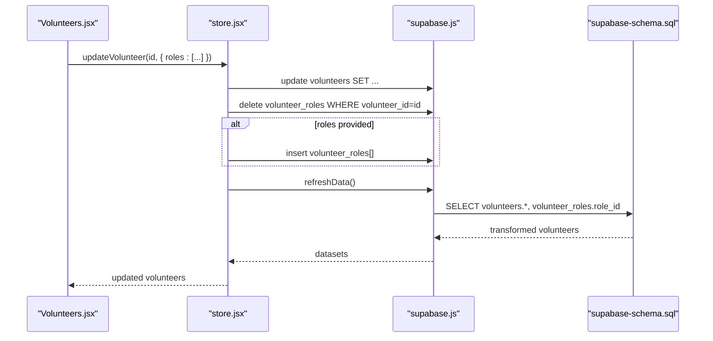

**Diagram sources**
- [store.jsx](file://src/services/store.jsx#L196-L228)
- [store.jsx](file://src/services/store.jsx#L182-L191)
- [Volunteers.jsx](file://src/pages/Volunteers.jsx#L49-L65)

**Section sources**
- [store.jsx](file://src/services/store.jsx#L162-L242)
- [Volunteers.jsx](file://src/pages/Volunteers.jsx#L49-L75)

### Event CRUD
- Creation: Inserts event with org_id.
- Update: Updates event fields.
- Deletion: Removes event; cascading deletes assignments.

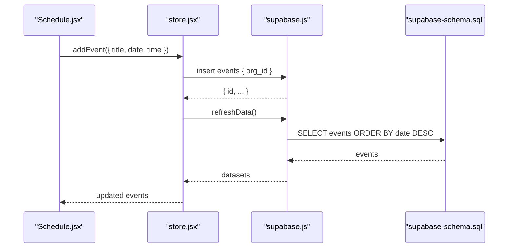

**Diagram sources**
- [store.jsx](file://src/services/store.jsx#L245-L292)
- [Schedule.jsx](file://src/pages/Schedule.jsx#L158-L177)

**Section sources**
- [store.jsx](file://src/services/store.jsx#L244-L292)
- [Schedule.jsx](file://src/pages/Schedule.jsx#L158-L177)

### Assignment CRUD and Event Assignment Creation
- Creation: Inserts assignment with org_id, event_id, role_id, volunteer_id, and status.
- Update: Updates assignment fields (e.g., areaId, designatedRoleId).
- Deletion: Not exposed in UI; database-level cascade handles cleanup.

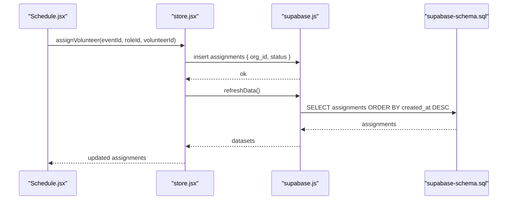

**Diagram sources**
- [store.jsx](file://src/services/store.jsx#L295-L328)
- [Schedule.jsx](file://src/pages/Schedule.jsx#L42-L49)

**Section sources**
- [store.jsx](file://src/services/store.jsx#L294-L328)
- [Schedule.jsx](file://src/pages/Schedule.jsx#L37-L49)

### Role and Group CRUD
- Roles: Supports create, update, delete with org_id enforcement.
- Groups: Supports create, update, delete with org_id enforcement.
- UI pages manage role-group relationships and display grouped roles.

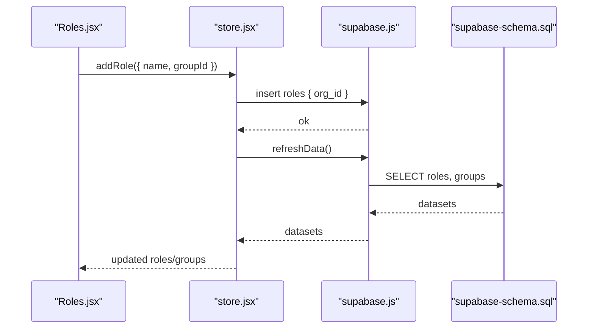

**Diagram sources**
- [store.jsx](file://src/services/store.jsx#L331-L375)
- [Roles.jsx](file://src/pages/Roles.jsx#L62-L78)

**Section sources**
- [store.jsx](file://src/services/store.jsx#L331-L422)
- [Roles.jsx](file://src/pages/Roles.jsx#L62-L111)

### Organization-Scoped Filtering and Tenant Isolation
- All entities include org_id and enforce RLS policies scoped to the current user’s organization.
- The store sets org_id on inserts where applicable and filters queries by org_id.
- The helper function get_user_org_id ensures policies operate against the authenticated user’s org.

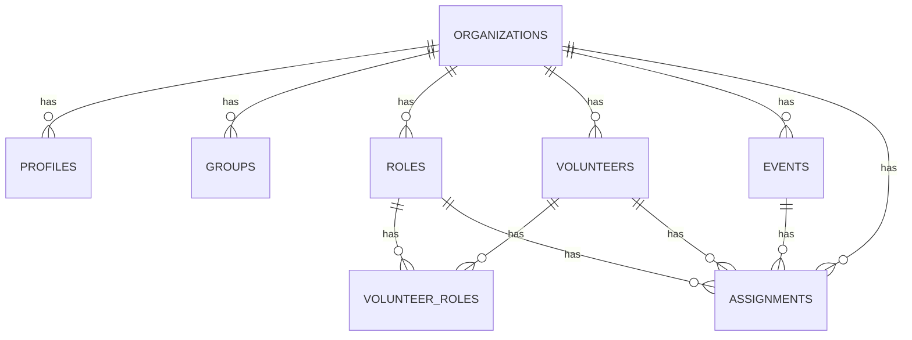

**Diagram sources**
- [supabase-schema.sql](file://supabase-schema.sql#L7-L76)

**Section sources**
- [supabase-schema.sql](file://supabase-schema.sql#L78-L251)
- [store.jsx](file://src/services/store.jsx#L165-L173)
- [store.jsx](file://src/services/store.jsx#L251-L253)
- [store.jsx](file://src/services/store.jsx#L304-L306)

### Transactional Nature and Error Handling
- Mutations are not wrapped in database transactions; each operation is a separate Supabase call.
- Errors are caught, logged, and re-thrown so UI components can surface them.
- After successful mutations, refreshData is invoked to reconcile client state with the database.

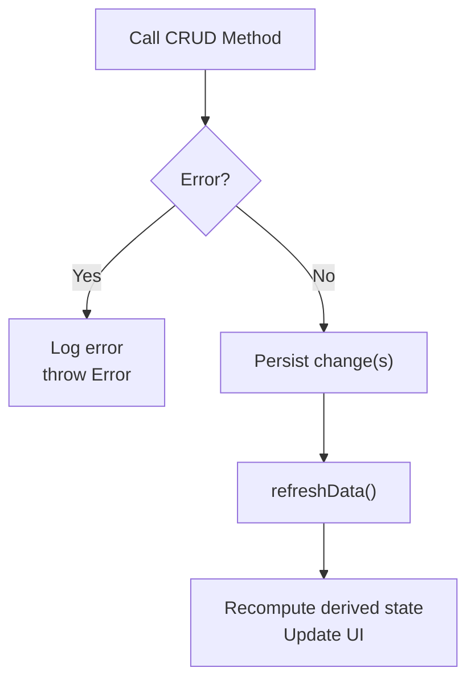

**Diagram sources**
- [store.jsx](file://src/services/store.jsx#L176-L179)
- [store.jsx](file://src/services/store.jsx#L204-L207)
- [store.jsx](file://src/services/store.jsx#L272-L275)
- [store.jsx](file://src/services/store.jsx#L341-L344)

**Section sources**
- [store.jsx](file://src/services/store.jsx#L114-L124)
- [store.jsx](file://src/services/store.jsx#L176-L179)
- [store.jsx](file://src/services/store.jsx#L204-L207)
- [store.jsx](file://src/services/store.jsx#L272-L275)
- [store.jsx](file://src/services/store.jsx#L341-L344)

### Optimistic Updates and refreshData Mechanism
- UI triggers mutations immediately; the store fetches fresh data afterward.
- Volunteers page demonstrates immediate UI updates during form submission, followed by refreshData to ensure consistency.
- The refreshData function performs parallel reads and transforms, ensuring arrays like roles are normalized.

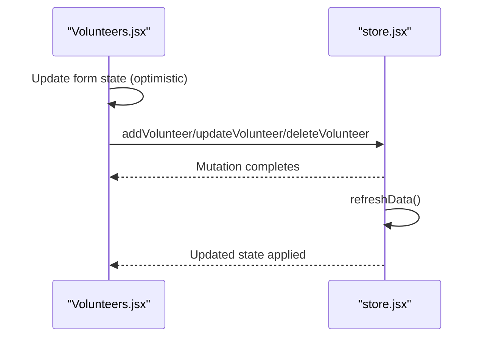

**Diagram sources**
- [store.jsx](file://src/services/store.jsx#L193-L194)
- [store.jsx](file://src/services/store.jsx#L227-L228)
- [store.jsx](file://src/services/store.jsx#L241-L242)
- [store.jsx](file://src/services/store.jsx#L459-L460)
- [Volunteers.jsx](file://src/pages/Volunteers.jsx#L45-L66)

**Section sources**
- [store.jsx](file://src/services/store.jsx#L459-L460)
- [Volunteers.jsx](file://src/pages/Volunteers.jsx#L45-L66)

### Data Transformation Patterns
- Volunteer normalization: volunteer_roles is joined and mapped to a roles array for UI compatibility.
- UI pages rely on this flattened structure for rendering role checkboxes and badges.

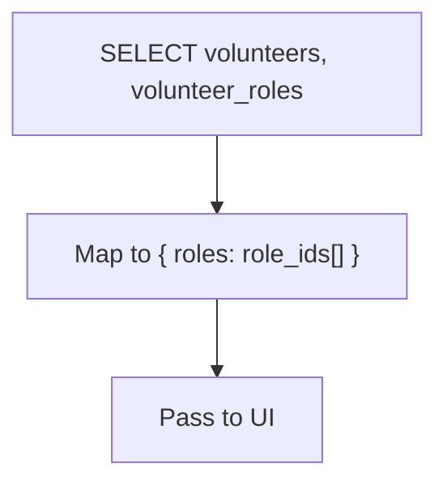

**Diagram sources**
- [store.jsx](file://src/services/store.jsx#L82-L88)
- [store.jsx](file://src/services/store.jsx#L96-L104)

**Section sources**
- [store.jsx](file://src/services/store.jsx#L96-L104)

### Complex Operations Examples

#### Volunteer Role Updates
- Replace all roles for a volunteer by deleting existing volunteer_roles rows and inserting new ones based on the provided role IDs.

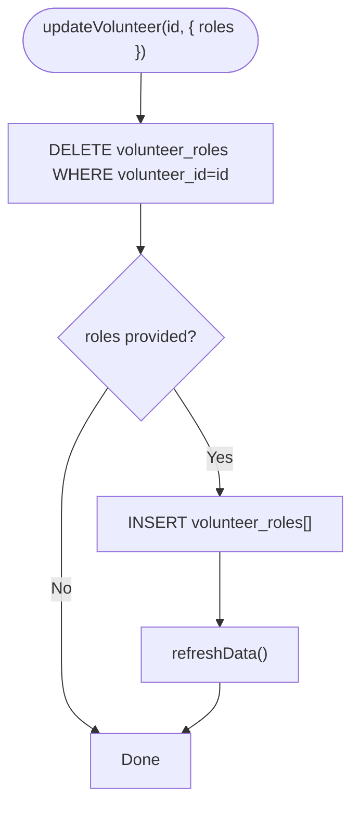

**Diagram sources**
- [store.jsx](file://src/services/store.jsx#L209-L225)

**Section sources**
- [store.jsx](file://src/services/store.jsx#L196-L228)

#### Event Assignment Creation
- Create an assignment linking a volunteer to a role for a specific event with status and org_id.

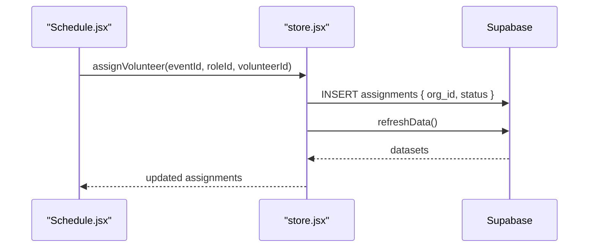

**Diagram sources**
- [store.jsx](file://src/services/store.jsx#L295-L314)
- [Schedule.jsx](file://src/pages/Schedule.jsx#L42-L49)

**Section sources**
- [store.jsx](file://src/services/store.jsx#L294-L314)
- [Schedule.jsx](file://src/pages/Schedule.jsx#L37-L49)

#### Bulk Data Operations (CSV Import)
- Volunteers page supports importing volunteers from CSV and calling addVolunteer for each valid row.

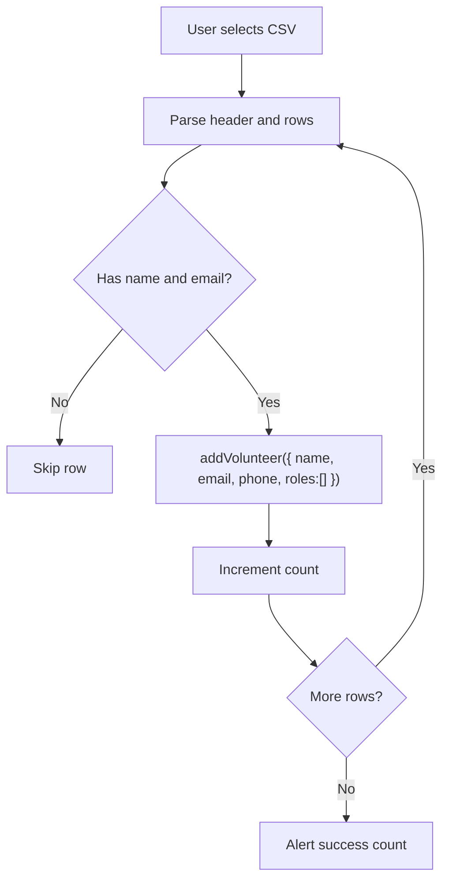

**Diagram sources**
- [Volunteers.jsx](file://src/pages/Volunteers.jsx#L77-L121)

**Section sources**
- [Volunteers.jsx](file://src/pages/Volunteers.jsx#L77-L121)

### Validation Patterns
- Frontend validation: Required fields and basic presence checks before calling mutations.
- Backend validation: Supabase RLS and NOT NULL constraints enforce data integrity at rest.
- Example validations:
  - Volunteers require name and email.
  - Events require title, date, and time.
  - Roles require name (and optionally group association).

**Section sources**
- [Volunteers.jsx](file://src/pages/Volunteers.jsx#L47-L47)
- [Schedule.jsx](file://src/pages/Schedule.jsx#L160-L160)
- [Roles.jsx](file://src/pages/Roles.jsx#L64-L64)
- [supabase-schema.sql](file://supabase-schema.sql#L40-L65)

## Dependency Analysis
The store depends on Supabase for persistence and RLS enforcement. UI pages depend on the store via the useStore hook. The modal component is shared across pages to manage forms.

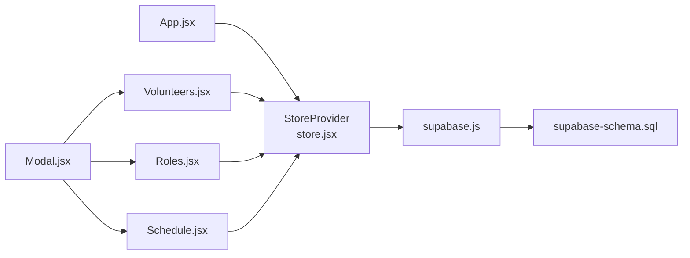

**Diagram sources**
- [App.jsx](file://src/App.jsx#L10-L32)
- [store.jsx](file://src/services/store.jsx#L1-L472)
- [supabase.js](file://src/services/supabase.js#L1-L13)
- [supabase-schema.sql](file://supabase-schema.sql#L1-L251)
- [Volunteers.jsx](file://src/pages/Volunteers.jsx#L1-L354)
- [Roles.jsx](file://src/pages/Roles.jsx#L1-L386)
- [Schedule.jsx](file://src/pages/Schedule.jsx#L1-L731)
- [Modal.jsx](file://src/components/Modal.jsx#L1-L50)

**Section sources**
- [App.jsx](file://src/App.jsx#L10-L32)
- [main.jsx](file://src/main.jsx#L1-L11)

## Performance Considerations
- Parallel loading: The store loads all datasets concurrently to minimize initial render latency.
- Local transformations: Normalizing volunteer roles in memory reduces UI complexity.
- Refresh granularity: refreshData reloads all entities; consider targeted updates if performance becomes a concern.
- RLS overhead: Database-level filtering adds minimal overhead but ensures correctness.
- UI responsiveness: Optimistic updates improve perceived performance; refreshData ensures eventual consistency.

[No sources needed since this section provides general guidance]

## Troubleshooting Guide
Common issues and resolutions:
- Missing environment variables: Ensure VITE_SUPABASE_URL and VITE_SUPABASE_ANON_KEY are configured; the client warns if missing.
- Authentication failures: Login/register functions throw errors surfaced to UI.
- Data not appearing: Verify organization context is loaded and org_id is set on inserts.
- Role updates not persisting: Confirm the roles array is passed to updateVolunteer; the store deletes and re-inserts volunteer_roles accordingly.
- CSV import errors: Ensure CSV contains required headers and valid rows.

**Section sources**
- [supabase.js](file://src/services/supabase.js#L6-L8)
- [store.jsx](file://src/services/store.jsx#L114-L124)
- [store.jsx](file://src/services/store.jsx#L165-L173)
- [store.jsx](file://src/services/store.jsx#L209-L225)
- [Volunteers.jsx](file://src/pages/Volunteers.jsx#L91-L94)

## Conclusion
RosterFlow’s store implements a clean, standardized CRUD pattern across volunteers, events, assignments, roles, and groups. It leverages Supabase RLS for tenant isolation, applies optimistic UI updates followed by refreshData, and normalizes many-to-many relationships for efficient rendering. While individual mutations are not wrapped in database transactions, the refreshData mechanism maintains consistency. The provided examples and patterns enable robust development of complex operations such as role updates and bulk imports.