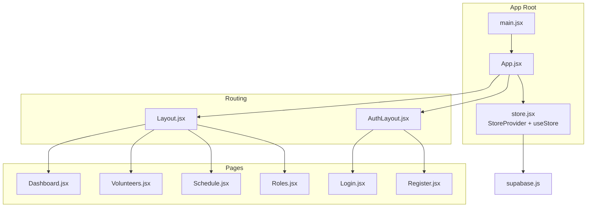
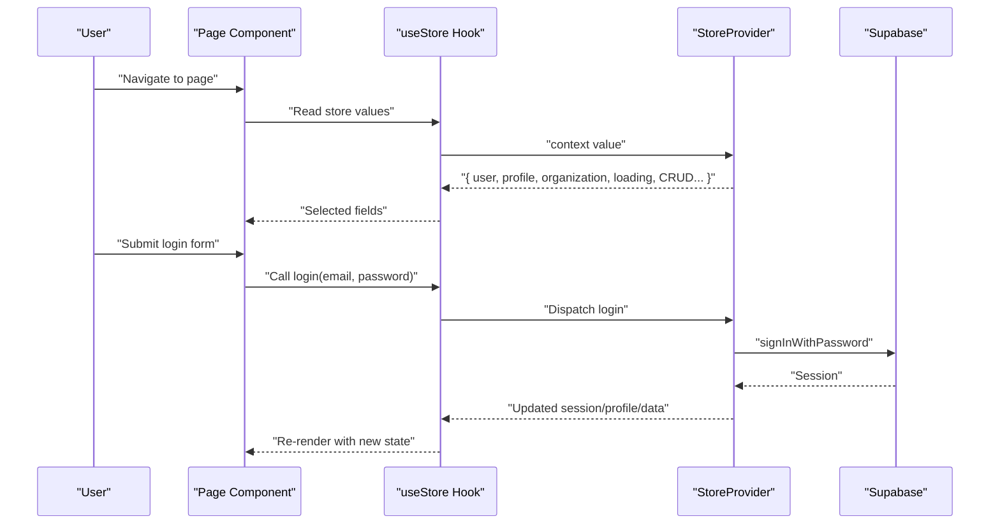
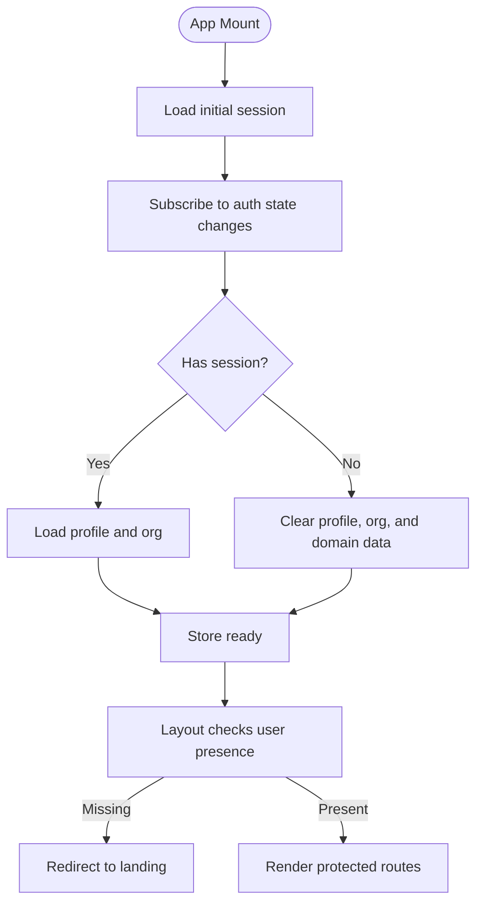
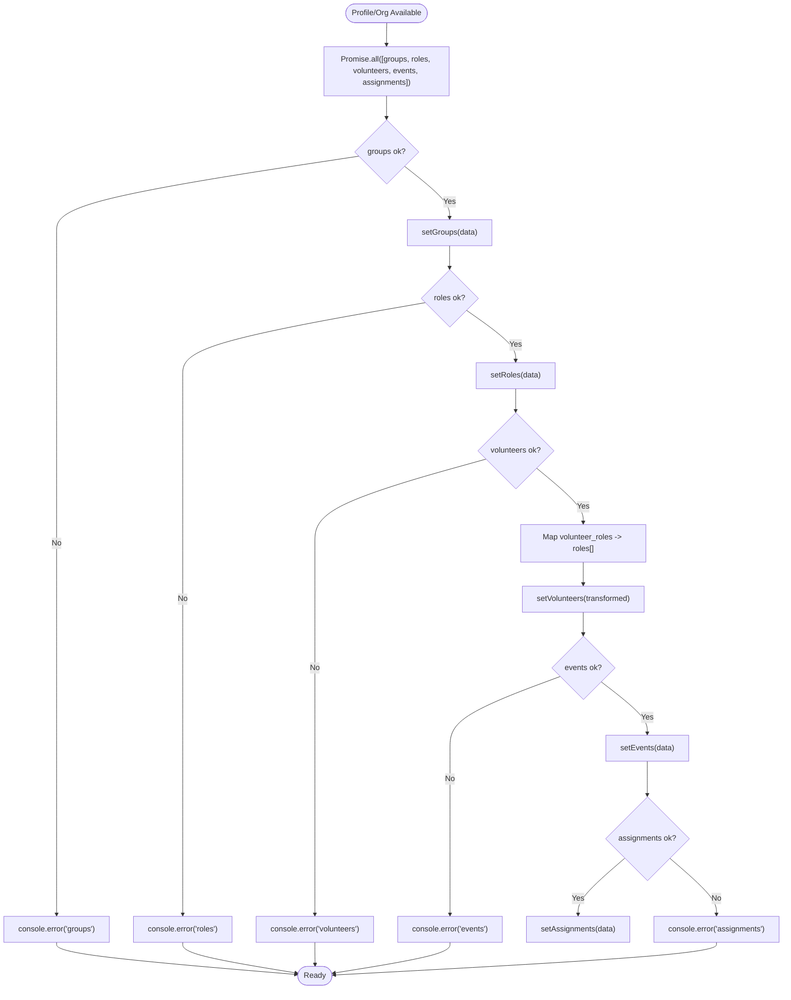

# Custom Hooks Pattern

<cite>
**Referenced Files in This Document**
- [store.jsx](file://src/services/store.jsx)
- [supabase.js](file://src/services/supabase.js)
- [App.jsx](file://src/App.jsx)
- [main.jsx](file://src/main.jsx)
- [Layout.jsx](file://src/components/Layout.jsx)
- [AuthLayout.jsx](file://src/components/AuthLayout.jsx)
- [Dashboard.jsx](file://src/pages/Dashboard.jsx)
- [Volunteers.jsx](file://src/pages/Volunteers.jsx)
- [Schedule.jsx](file://src/pages/Schedule.jsx)
- [Roles.jsx](file://src/pages/Roles.jsx)
- [Login.jsx](file://src/pages/Login.jsx)
- [Register.jsx](file://src/pages/Register.jsx)
</cite>

## Table of Contents
1. [Introduction](#introduction)
2. [Project Structure](#project-structure)
3. [Core Components](#core-components)
4. [Architecture Overview](#architecture-overview)
5. [Detailed Component Analysis](#detailed-component-analysis)
6. [Dependency Analysis](#dependency-analysis)
7. [Performance Considerations](#performance-considerations)
8. [Troubleshooting Guide](#troubleshooting-guide)
9. [Conclusion](#conclusion)
10. [Appendices](#appendices)

## Introduction
This document explains RosterFlow’s custom hooks pattern implementation centered around a single store provider and a simple hook that exposes typed store functionality to all components. It covers how the useStore hook design provides typed access to authentication state, user data, and CRUD operations across the application. It also documents naming conventions, usage patterns, composition strategies, error handling, and best practices for testing and debugging.

## Project Structure
RosterFlow organizes the store and hooks under a dedicated services module, with pages and components consuming the store via the useStore hook. The application bootstraps the store provider at the root level so that all routed pages and layouts can access the shared state.

**Diagram sources**
- [main.jsx](file://src/main.jsx#L1-L11)
- [App.jsx](file://src/App.jsx#L1-L37)
- [store.jsx](file://src/services/store.jsx#L1-L472)
- [supabase.js](file://src/services/supabase.js#L1-L13)
- [Layout.jsx](file://src/components/Layout.jsx#L1-L108)
- [AuthLayout.jsx](file://src/components/AuthLayout.jsx#L1-L26)
- [Dashboard.jsx](file://src/pages/Dashboard.jsx#L1-L90)
- [Volunteers.jsx](file://src/pages/Volunteers.jsx#L1-L354)
- [Schedule.jsx](file://src/pages/Schedule.jsx#L1-L731)
- [Roles.jsx](file://src/pages/Roles.jsx#L1-L386)
- [Login.jsx](file://src/pages/Login.jsx#L1-L80)
- [Register.jsx](file://src/pages/Register.jsx#L1-L101)

**Section sources**
- [main.jsx](file://src/main.jsx#L1-L11)
- [App.jsx](file://src/App.jsx#L1-L37)
- [store.jsx](file://src/services/store.jsx#L1-L472)
- [supabase.js](file://src/services/supabase.js#L1-L13)

## Core Components
- StoreProvider: Centralizes authentication state, derived user object, organization, and all domain data (groups, roles, volunteers, events, assignments). It initializes Supabase auth listeners, loads profile and organization on session changes, and fetches all domain data in parallel when ready.
- useStore: A thin wrapper around React’s useContext that exposes the entire store value to consumers. Components destructure only the fields they need.

Key store exports include:
- Authentication: user, profile, organization, loading, login, logout, registerOrganization
- Domain data: groups, roles, volunteers, events, assignments
- CRUD helpers: add/update/delete for volunteers, events, assignments, roles, groups
- Utility: refreshData

**Section sources**
- [store.jsx](file://src/services/store.jsx#L468-L472)
- [store.jsx](file://src/services/store.jsx#L432-L460)

## Architecture Overview
The store provider encapsulates all data fetching, synchronization, and mutations. Pages and components depend on useStore to read state and trigger actions. Authentication state drives data loading and navigation guards.

**Diagram sources**
- [store.jsx](file://src/services/store.jsx#L114-L124)
- [store.jsx](file://src/services/store.jsx#L21-L34)
- [store.jsx](file://src/services/store.jsx#L37-L52)
- [store.jsx](file://src/services/store.jsx#L78-L111)
- [Login.jsx](file://src/pages/Login.jsx#L1-L80)

## Detailed Component Analysis

### useStore Hook Design
- Purpose: Provide typed, centralized access to the store without exposing internal state mechanics.
- Composition: Single useContext call returning the entire store value; consumers destructure as needed.
- Benefits: Encourages selective destructuring, simplifies testing, and centralizes provider wiring.

Usage patterns:
- Authentication and navigation: Components like Layout read user and organization to enforce auth gating.
- Data consumption: Pages like Dashboard, Volunteers, Schedule, and Roles read lists and pass callbacks for mutations.
- Loading handling: Components can react to loading flags or rely on re-renders after async operations.

**Section sources**
- [store.jsx](file://src/services/store.jsx#L468-L472)
- [Layout.jsx](file://src/components/Layout.jsx#L14-L30)
- [Dashboard.jsx](file://src/pages/Dashboard.jsx#L21-L28)
- [Volunteers.jsx](file://src/pages/Volunteers.jsx#L7-L13)
- [Schedule.jsx](file://src/pages/Schedule.jsx#L7-L8)
- [Roles.jsx](file://src/pages/Roles.jsx#L6-L7)

### Authentication State and Navigation
- Initial session is loaded on startup; auth state changes are subscribed to and reflected immediately.
- On sign-out or missing session, profile, organization, and domain data are cleared.
- Navigation guard ensures unauthenticated users are redirected to landing.

**Diagram sources**
- [store.jsx](file://src/services/store.jsx#L21-L34)
- [store.jsx](file://src/services/store.jsx#L37-L52)
- [store.jsx](file://src/services/store.jsx#L70-L76)
- [Layout.jsx](file://src/components/Layout.jsx#L19-L30)

**Section sources**
- [store.jsx](file://src/services/store.jsx#L21-L34)
- [store.jsx](file://src/services/store.jsx#L37-L52)
- [store.jsx](file://src/services/store.jsx#L70-L76)
- [Layout.jsx](file://src/components/Layout.jsx#L19-L30)

### CRUD Operations and Data Loading
- Parallel data loading: Groups, roles, volunteers, events, and assignments are fetched concurrently when profile and org are available.
- Volunteer roles relationship: Volunteers are returned with a flattened roles array for convenience.
- Mutations: CRUD helpers encapsulate inserts, updates, deletes, and relationship updates; they refresh data afterward.

**Diagram sources**
- [store.jsx](file://src/services/store.jsx#L78-L111)
- [store.jsx](file://src/services/store.jsx#L98-L104)

**Section sources**
- [store.jsx](file://src/services/store.jsx#L78-L111)
- [store.jsx](file://src/services/store.jsx#L98-L104)

### Hook Naming Conventions and Usage Patterns
- Hook naming: useStore (singular, imperative, no suffix). This aligns with React conventions and clearly indicates it returns a store slice.
- Destructuring: Consumers pick only the fields they need (e.g., user, volunteers, roles, login, addVolunteer).
- Error handling: CRUD functions throw errors surfaced to callers; login/register functions surface thrown errors to UI handlers.
- Loading states: Components can rely on re-renders after async operations; some pages also maintain local isLoading flags during submission.

Examples of usage across pages:
- Authentication forms: Login and Register use login and registerOrganization respectively.
- Protected layout: Layout reads user and organization for navigation and header display.
- Data pages: Dashboard reads user and counts; Volunteers reads volunteers and roles and invokes add/update/delete; Schedule reads events, assignments, roles, volunteers, groups and uses assignVolunteer and updateAssignment; Roles reads roles and groups and uses add/update/delete for roles and groups.

**Section sources**
- [Login.jsx](file://src/pages/Login.jsx#L5-L25)
- [Register.jsx](file://src/pages/Register.jsx#L5-L27)
- [Layout.jsx](file://src/components/Layout.jsx#L14-L30)
- [Dashboard.jsx](file://src/pages/Dashboard.jsx#L21-L28)
- [Volunteers.jsx](file://src/pages/Volunteers.jsx#L7-L13)
- [Schedule.jsx](file://src/pages/Schedule.jsx#L7-L8)
- [Roles.jsx](file://src/pages/Roles.jsx#L6-L7)

### Hook Composition Patterns
- Selective destructuring: Components avoid unnecessary re-renders by importing only required fields.
- Higher-order composition: Pages compose multiple CRUD callbacks and derived helpers (e.g., getRoleName, getVolunteer, getRole) to render lists and forms.
- Local state orchestration: Forms manage local state (formData, filter, selection) while delegating persistence to store callbacks.

**Section sources**
- [Volunteers.jsx](file://src/pages/Volunteers.jsx#L7-L13)
- [Volunteers.jsx](file://src/pages/Volunteers.jsx#L15-L37)
- [Schedule.jsx](file://src/pages/Schedule.jsx#L7-L8)
- [Schedule.jsx](file://src/pages/Schedule.jsx#L27-L32)
- [Roles.jsx](file://src/pages/Roles.jsx#L6-L7)

### Error Handling Within Hooks
- Supabase errors: Logged to console; CRUD functions throw errors; login/register propagate thrown messages.
- UI error handling: Pages wrap async submissions in try/catch and display alerts; they also disable buttons during loading.

Recommendations:
- Surface user-friendly messages from thrown errors.
- Consider centralized toast/error boundaries for consistent UX.
- Validate inputs before invoking store callbacks.

**Section sources**
- [store.jsx](file://src/services/store.jsx#L114-L124)
- [store.jsx](file://src/services/store.jsx#L162-L194)
- [store.jsx](file://src/services/store.jsx#L245-L292)
- [Login.jsx](file://src/pages/Login.jsx#L14-L25)

### Best Practices for Testing and Debugging
Testing:
- Unit tests for store functions: Mock Supabase client, test CRUD flows, error paths, and data transformations.
- Integration tests for pages: Verify that useStore returns expected fields and that callbacks mutate state as intended.
- Snapshot tests for UI rendering driven by store data.

Debugging:
- Enable React DevTools to inspect store context value and component re-renders.
- Monitor console logs for Supabase errors.
- Use browser network tab to confirm parallel data fetches and mutation requests.

[No sources needed since this section provides general guidance]

## Dependency Analysis
The store provider depends on Supabase for authentication and database operations. Pages and components depend on useStore for state and actions. The provider is mounted at the app root to ensure global availability.

**Diagram sources**
- [supabase.js](file://src/services/supabase.js#L1-L13)
- [store.jsx](file://src/services/store.jsx#L1-L4)
- [Dashboard.jsx](file://src/pages/Dashboard.jsx#L2-L4)
- [Volunteers.jsx](file://src/pages/Volunteers.jsx#L2-L6)
- [Schedule.jsx](file://src/pages/Schedule.jsx#L2-L6)
- [Roles.jsx](file://src/pages/Roles.jsx#L2-L5)
- [Login.jsx](file://src/pages/Login.jsx#L3)
- [Register.jsx](file://src/pages/Register.jsx#L3)

**Section sources**
- [supabase.js](file://src/services/supabase.js#L1-L13)
- [store.jsx](file://src/services/store.jsx#L1-L4)
- [App.jsx](file://src/App.jsx#L11-L32)

## Performance Considerations
- Parallel data loading: Promise.all reduces total latency for initial hydration.
- Minimal re-renders: Components destructure only needed fields; avoid passing entire store objects to children.
- Local state batching: Forms collect edits locally and commit via callbacks to reduce frequent re-renders.

[No sources needed since this section provides general guidance]

## Troubleshooting Guide
Common issues and resolutions:
- Missing environment variables: Ensure Supabase URL and anon key are configured; the client warns if missing.
- Auth state desync: Verify auth state subscriptions and that session changes propagate to profile loading.
- Data not appearing: Confirm profile/org availability and that loadAllData runs after profile is set.
- Mutations failing silently: Check thrown errors and console logs; ensure UI disables submit buttons during async operations.

**Section sources**
- [supabase.js](file://src/services/supabase.js#L6-L8)
- [store.jsx](file://src/services/store.jsx#L21-L34)
- [store.jsx](file://src/services/store.jsx#L37-L52)
- [store.jsx](file://src/services/store.jsx#L78-L111)
- [Login.jsx](file://src/pages/Login.jsx#L14-L25)

## Conclusion
RosterFlow’s custom hooks pattern centers on a single StoreProvider and a simple useStore hook that exposes a typed store value. This design cleanly abstracts authentication, data loading, and CRUD operations from components, enabling predictable usage patterns, robust error handling, and scalable composition across pages and features.

[No sources needed since this section summarizes without analyzing specific files]

## Appendices

### Example Scenarios and Snippet Paths
- Login flow with error handling
  - [Login.jsx](file://src/pages/Login.jsx#L14-L25)
- Protected layout navigation guard
  - [Layout.jsx](file://src/components/Layout.jsx#L19-L30)
- Volunteer CRUD in a list page
  - [Volunteers.jsx](file://src/pages/Volunteers.jsx#L7-L13)
  - [Volunteers.jsx](file://src/pages/Volunteers.jsx#L33-L66)
- Schedule event creation and assignment
  - [Schedule.jsx](file://src/pages/Schedule.jsx#L7-L8)
  - [Schedule.jsx](file://src/pages/Schedule.jsx#L158-L177)
  - [Schedule.jsx](file://src/pages/Schedule.jsx#L42-L49)
- Roles and groups management
  - [Roles.jsx](file://src/pages/Roles.jsx#L6-L7)
  - [Roles.jsx](file://src/pages/Roles.jsx#L44-L78)
  - [Roles.jsx](file://src/pages/Roles.jsx#L80-L111)

[No sources needed since this section aggregates previously cited paths]