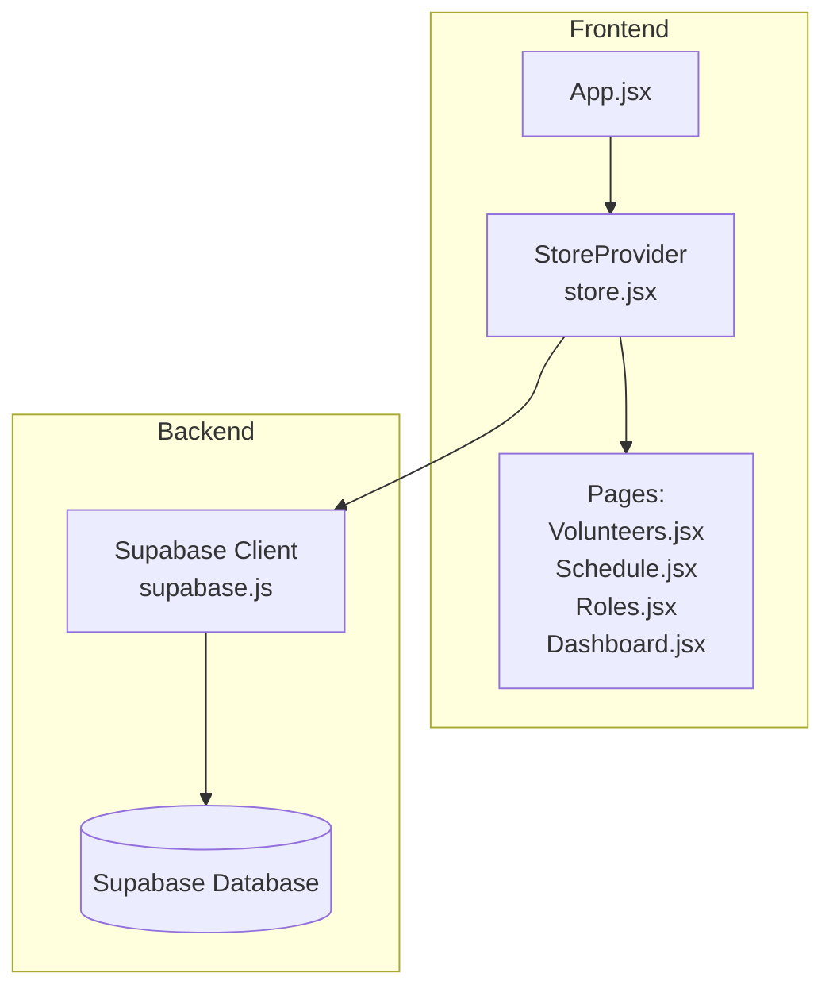
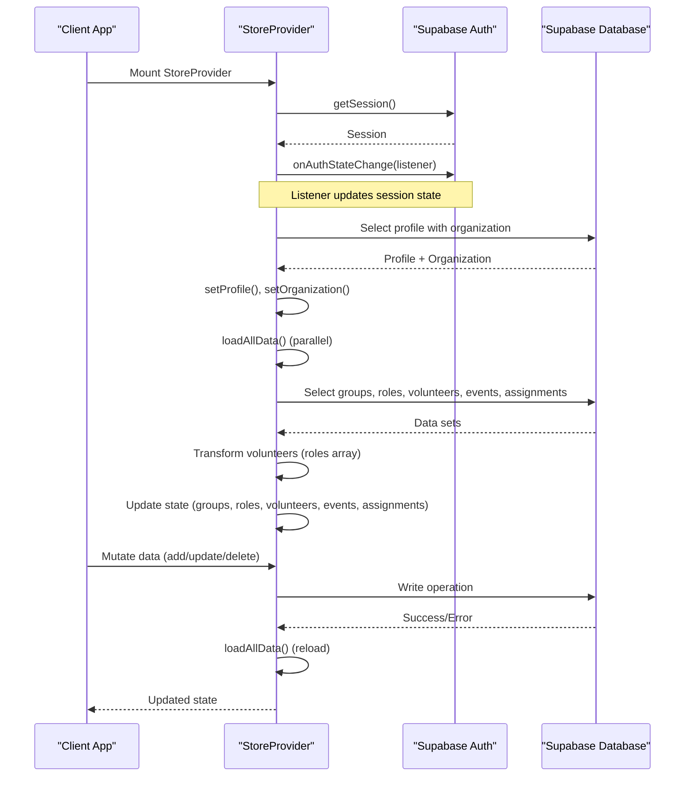
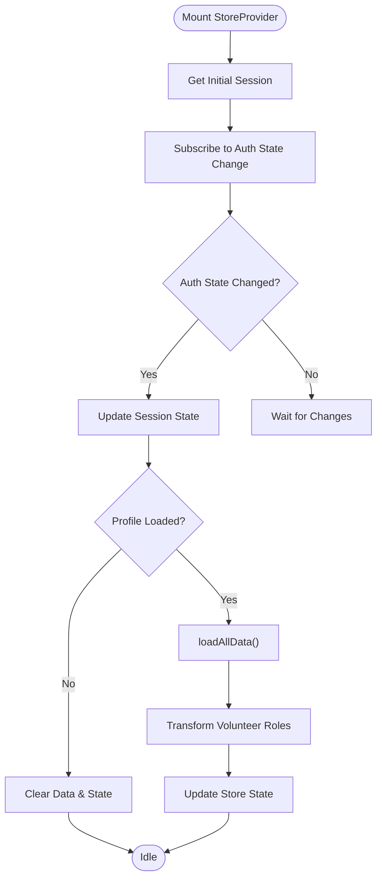
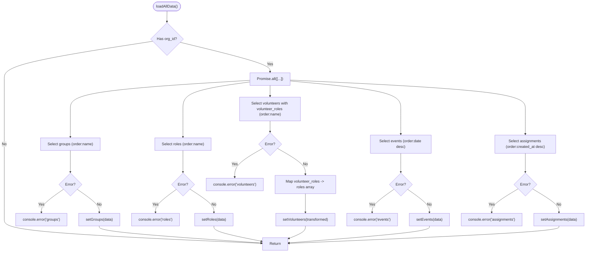
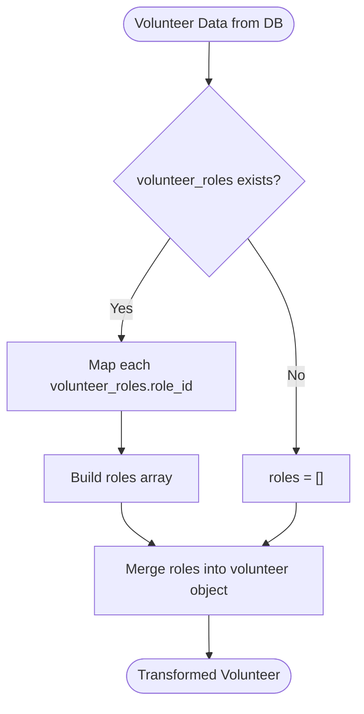
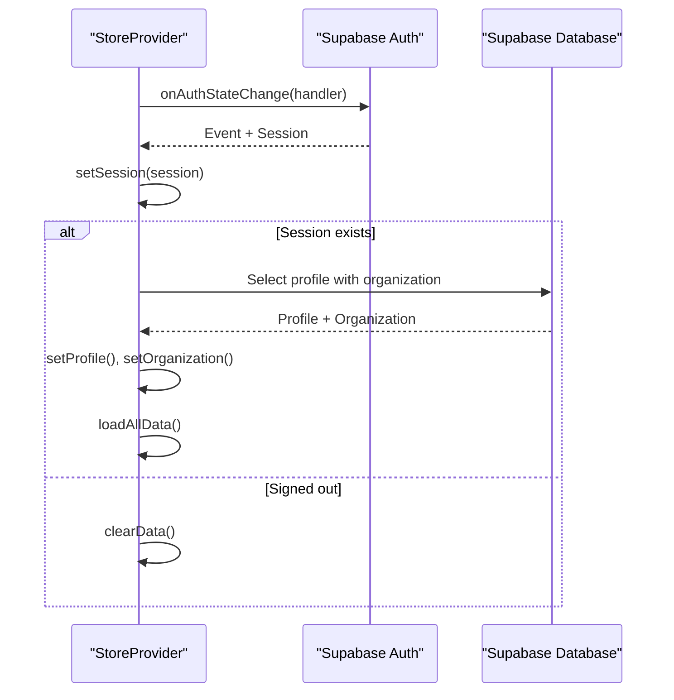
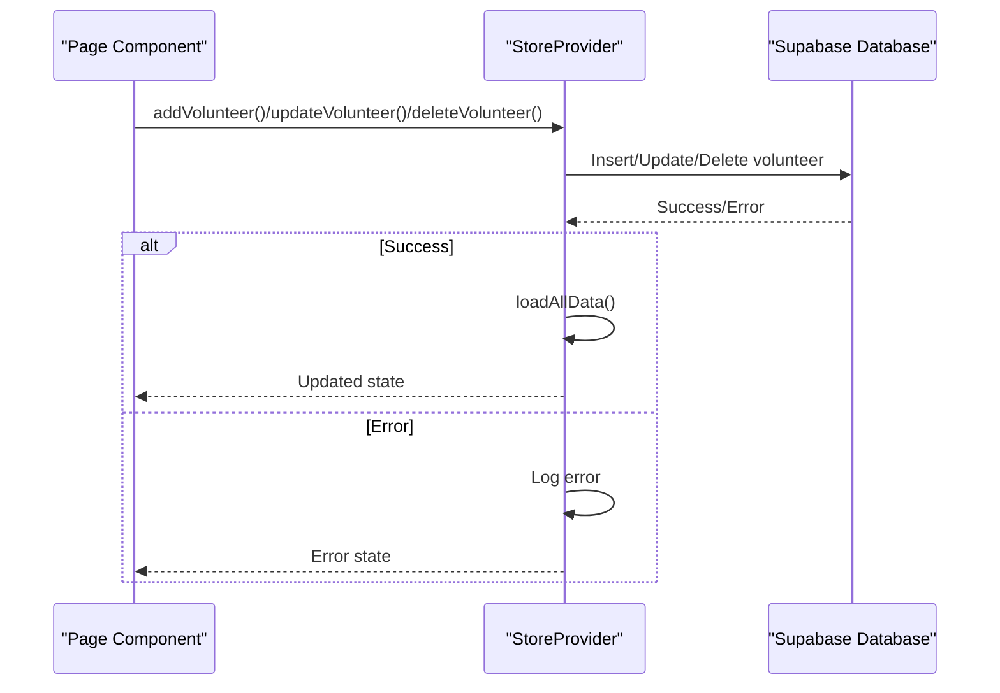
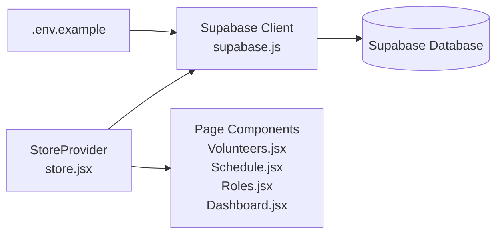

# Real-time Data Synchronization

<cite>
**Referenced Files in This Document**
- [store.jsx](file://src/services/store.jsx)
- [supabase.js](file://src/services/supabase.js)
- [Volunteers.jsx](file://src/pages/Volunteers.jsx)
- [Dashboard.jsx](file://src/pages/Dashboard.jsx)
- [Schedule.jsx](file://src/pages/Schedule.jsx)
- [Roles.jsx](file://src/pages/Roles.jsx)
- [App.jsx](file://src/App.jsx)
- [main.jsx](file://src/main.jsx)
- [supabase-schema.sql](file://supabase-schema.sql)
- [.env.example](file://.env.example)
</cite>

## Table of Contents
1. [Introduction](#introduction)
2. [Project Structure](#project-structure)
3. [Core Components](#core-components)
4. [Architecture Overview](#architecture-overview)
5. [Detailed Component Analysis](#detailed-component-analysis)
6. [Dependency Analysis](#dependency-analysis)
7. [Performance Considerations](#performance-considerations)
8. [Troubleshooting Guide](#troubleshooting-guide)
9. [Conclusion](#conclusion)

## Introduction
This document explains RosterFlow's real-time data synchronization system, focusing on how Supabase subscriptions integrate with the React store to maintain live updates across clients. It documents data loading patterns, error handling, state updates, authentication state change listeners, volunteer data transformation logic, and the orchestration of concurrent database operations through the `loadAllData` function. The guide also covers subscription cleanup, error recovery strategies, and performance optimization techniques for large datasets.

## Project Structure
RosterFlow follows a React-based frontend architecture with a centralized store that manages application state and integrates with Supabase for authentication and data persistence. The store orchestrates data loading, transformations, and updates across multiple pages.

**Diagram sources**
- [App.jsx](file://src/App.jsx#L13-L34)
- [store.jsx](file://src/services/store.jsx#L6-L467)
- [supabase.js](file://src/services/supabase.js#L1-L13)

**Section sources**
- [App.jsx](file://src/App.jsx#L1-L37)
- [main.jsx](file://src/main.jsx#L1-L11)

## Core Components
- Store Provider: Centralizes authentication state, organization/profile data, and all application data. Manages lifecycle hooks for authentication changes and orchestrates data loading.
- Supabase Client: Provides authentication and database client initialization with environment variables.
- Page Components: Consume store data and dispatch actions to mutate data, triggering reloads via the store.

Key responsibilities:
- Authentication state change listener with cleanup
- Parallel data loading for groups, roles, volunteers, events, and assignments
- Volunteer data transformation to align with legacy role arrays
- Error handling and logging for all data operations
- Data mutation functions that trigger reloads

**Section sources**
- [store.jsx](file://src/services/store.jsx#L6-L467)
- [supabase.js](file://src/services/supabase.js#L1-L13)

## Architecture Overview
The store initializes authentication state, listens for auth changes, loads profile and organization data, and then triggers a parallel data load. All mutations propagate changes that cause the store to reload data, ensuring UI consistency across clients.

**Diagram sources**
- [store.jsx](file://src/services/store.jsx#L21-L52)
- [store.jsx](file://src/services/store.jsx#L54-L111)

## Detailed Component Analysis

### Store Provider and Authentication State Management
The store initializes session state and subscribes to authentication changes. On sign-out or session changes, it clears data and resets state. When a session exists, it loads profile and organization data, then triggers a full data reload.

- Initialization and cleanup:
  - Uses `getSession()` to initialize session state
  - Subscribes to `onAuthStateChange` and unsubscribes on unmount
- Conditional data loading:
  - Loads profile and organization when session changes
  - Triggers `loadAllData()` when profile is available

**Diagram sources**
- [store.jsx](file://src/services/store.jsx#L21-L52)
- [store.jsx](file://src/services/store.jsx#L54-L76)

**Section sources**
- [store.jsx](file://src/services/store.jsx#L21-L52)
- [store.jsx](file://src/services/store.jsx#L54-L76)

### Data Loading Patterns and Parallel Fetching
The `loadAllData` function performs parallel database queries for all primary datasets, orders them appropriately, and updates state while handling errors per dataset.

- Parallel operations:
  - Groups: ordered by name
  - Roles: ordered by name
  - Volunteers: includes volunteer_roles join, ordered by name
  - Events: ordered by date descending
  - Assignments: ordered by created_at descending
- Error handling:
  - Logs errors per dataset without failing the entire batch
- State updates:
  - Updates groups, roles, events, assignments directly
  - Transforms volunteers to flatten role relationships

**Diagram sources**
- [store.jsx](file://src/services/store.jsx#L78-L111)

**Section sources**
- [store.jsx](file://src/services/store.jsx#L78-L111)

### Volunteer Data Transformation Logic
Volunteers are stored with a many-to-many relationship via the `volunteer_roles` table. The store transforms this into a simpler `roles` array for compatibility with existing components.

- Transformation process:
  - For each volunteer, extract `volunteer_roles.role_id` into a flat `roles` array
  - Preserves other volunteer fields unchanged
- Impact:
  - Simplifies UI rendering and editing workflows
  - Maintains backward compatibility with components expecting a flat roles array

**Diagram sources**
- [store.jsx](file://src/services/store.jsx#L96-L104)

**Section sources**
- [store.jsx](file://src/services/store.jsx#L96-L104)

### Authentication State Change Listeners and Data Reloads
The store listens for authentication state changes and reacts accordingly:

- Auth change listener:
  - Updates session state on any change
  - Clears profile, organization, and all data when signed out
- Conditional loading:
  - Loads profile and organization when session becomes available
  - Triggers `loadAllData()` to populate UI state
- Cleanup:
  - Unsubscribes from auth changes on component unmount

**Diagram sources**
- [store.jsx](file://src/services/store.jsx#L28-L45)

**Section sources**
- [store.jsx](file://src/services/store.jsx#L28-L45)

### Data Mutation Functions and Reload Orchestration
All mutation functions (add/update/delete) write to the database and then call `loadAllData()` to refresh state. This ensures UI consistency across clients.

- Volunteer mutations:
  - Add: inserts volunteer, optionally inserts volunteer_roles, then reloads
  - Update: updates volunteer, deletes/inserts volunteer_roles if provided, then reloads
  - Delete: removes volunteer, then reloads
- Event and assignment mutations:
  - Similar pattern: write to DB, then reload
- Role and group mutations:
  - Write to DB, then reload

**Diagram sources**
- [store.jsx](file://src/services/store.jsx#L162-L242)

**Section sources**
- [store.jsx](file://src/services/store.jsx#L162-L242)

### Page Components and Data Consumption
- Volunteers page consumes volunteers, roles, and groups to render and manage volunteers.
- Schedule page consumes events, assignments, roles, and volunteers to manage scheduling and assignments.
- Roles page consumes roles and groups to manage organizational structure.
- Dashboard page consumes volunteers, events, and roles to display statistics.

These components rely on the store for data and mutations, ensuring consistent state across the application.

**Section sources**
- [Volunteers.jsx](file://src/pages/Volunteers.jsx#L1-L354)
- [Schedule.jsx](file://src/pages/Schedule.jsx#L1-L731)
- [Roles.jsx](file://src/pages/Roles.jsx#L1-L386)
- [Dashboard.jsx](file://src/pages/Dashboard.jsx#L1-L90)

## Dependency Analysis
The store depends on Supabase for authentication and database operations. Environment variables configure the Supabase client. The store exposes a derived user object and provides CRUD functions for all entities.

**Diagram sources**
- [store.jsx](file://src/services/store.jsx#L1-L4)
- [supabase.js](file://src/services/supabase.js#L1-L13)
- [.env.example](file://.env.example#L1-L5)

**Section sources**
- [store.jsx](file://src/services/store.jsx#L1-L4)
- [supabase.js](file://src/services/supabase.js#L1-L13)
- [.env.example](file://.env.example#L1-L5)

## Performance Considerations
- Parallel data loading: The store uses `Promise.all` to fetch multiple datasets concurrently, reducing total load time.
- Minimal re-renders: The store updates state atomically per dataset, minimizing intermediate renders.
- Data transformation cost: Volunteer role flattening occurs once per reload; consider memoization if datasets grow large.
- Pagination and filtering: Current pages filter locally; for large datasets, consider server-side pagination and filtering.
- Subscription cleanup: Auth listener is properly unsubscribed to prevent memory leaks.
- Error isolation: Per-operation error logging prevents cascading failures during parallel loads.

[No sources needed since this section provides general guidance]

## Troubleshooting Guide
Common issues and resolutions:

- Authentication state not updating:
  - Verify auth listener subscription and cleanup are present.
  - Ensure session state is cleared on sign-out.
- Data not reloading after mutations:
  - Confirm mutation functions call `loadAllData()` on success.
  - Check for thrown errors that prevent reload.
- Volunteer roles not displaying:
  - Ensure volunteer selection includes the `volunteer_roles(role_id)` join.
  - Verify transformation logic maps role IDs correctly.
- Supabase client warnings:
  - Check that environment variables are configured in `.env.example` and loaded at runtime.
- Large dataset performance:
  - Implement server-side filtering and pagination.
  - Consider caching strategies and debounced search inputs.

**Section sources**
- [store.jsx](file://src/services/store.jsx#L28-L45)
- [store.jsx](file://src/services/store.jsx#L78-L111)
- [store.jsx](file://src/services/store.jsx#L162-L242)
- [supabase.js](file://src/services/supabase.js#L6-L8)
- [.env.example](file://.env.example#L1-L5)

## Conclusion
RosterFlow’s real-time synchronization relies on a robust store that:
- Listens for authentication changes and cleans up subscriptions
- Loads data in parallel and handles errors per dataset
- Transforms volunteer relationships for UI compatibility
- Orchestrates reloads after mutations to keep state consistent
- Exposes a clean API for page components to consume and modify data

This architecture scales well for small to medium organizations and can be extended with server-side pagination and advanced caching for larger deployments.