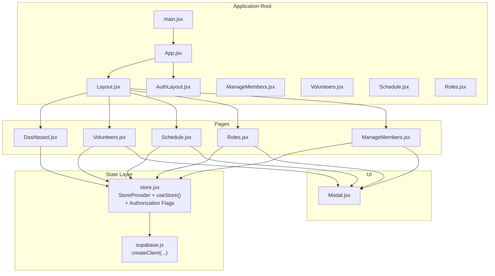
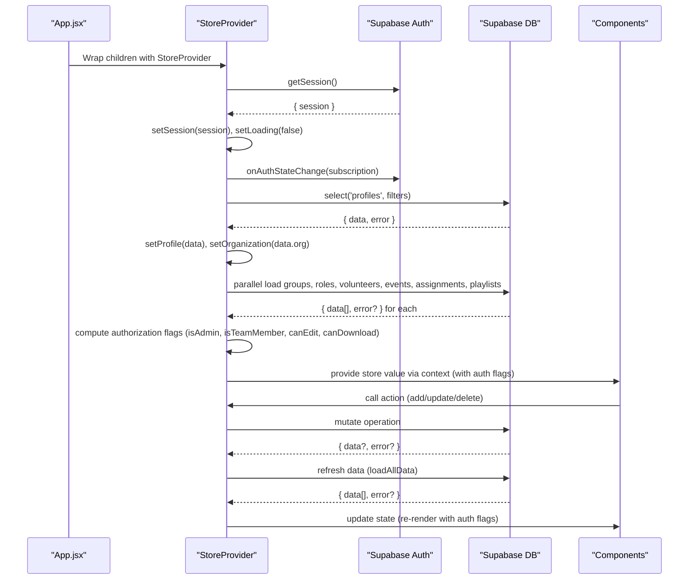
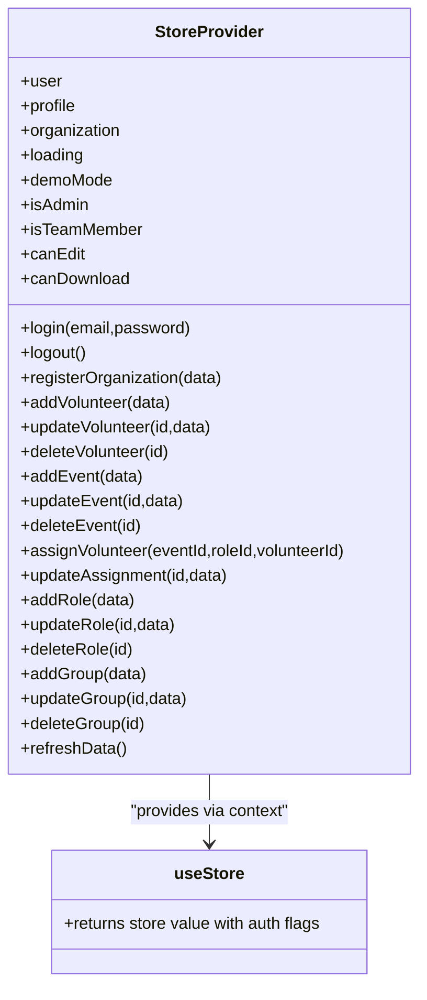
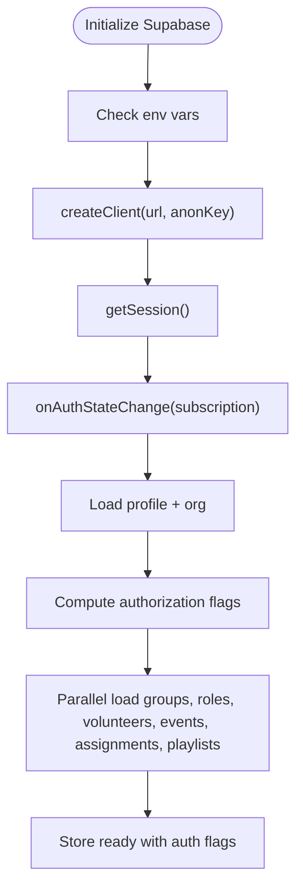
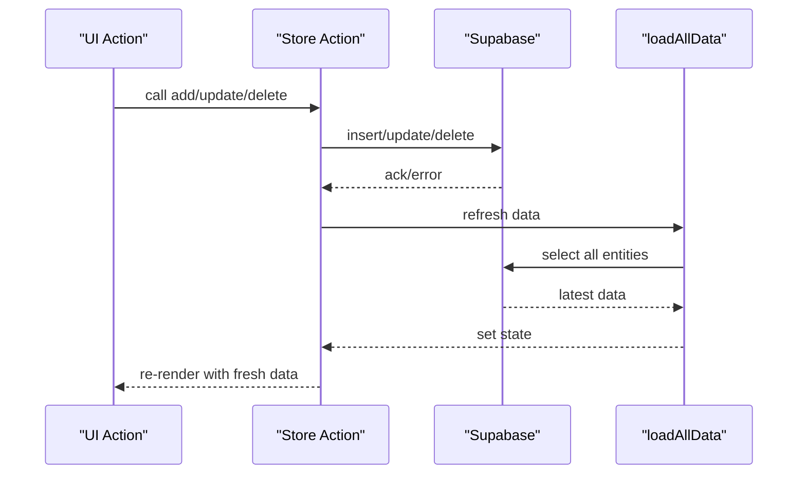
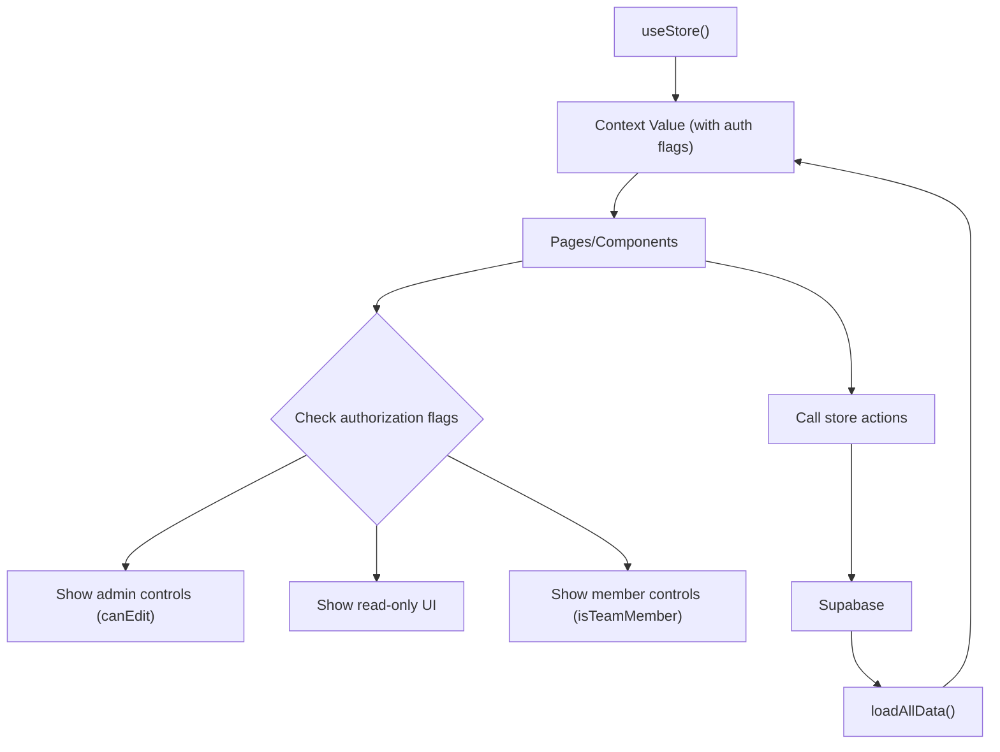
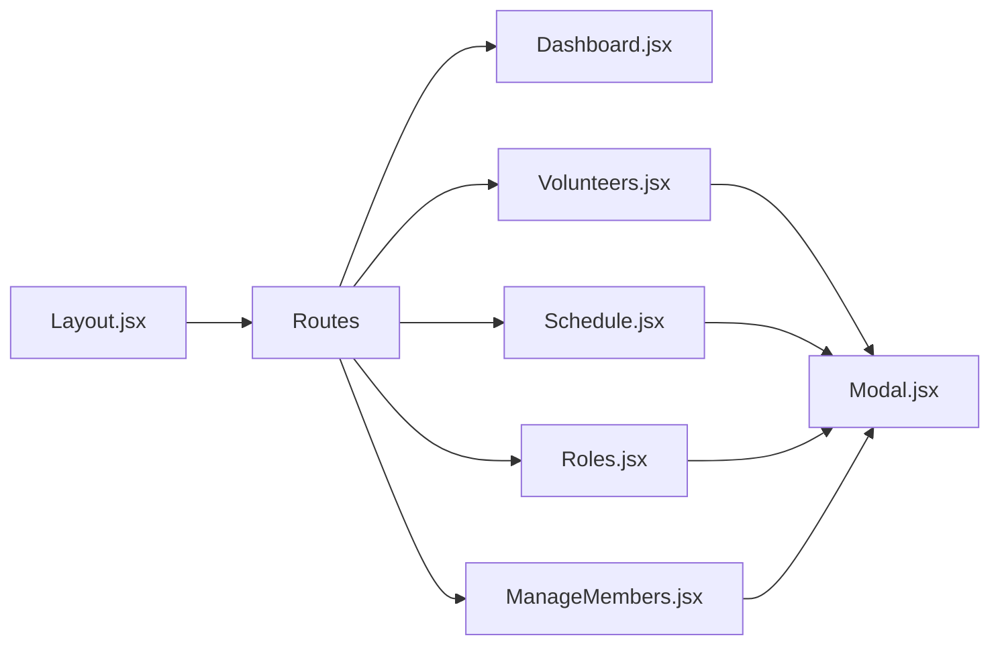
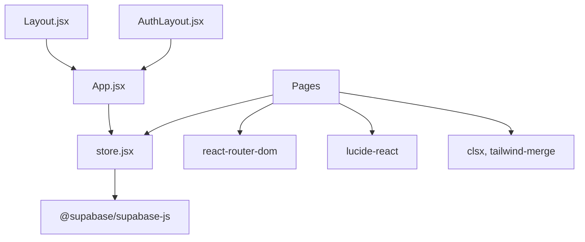
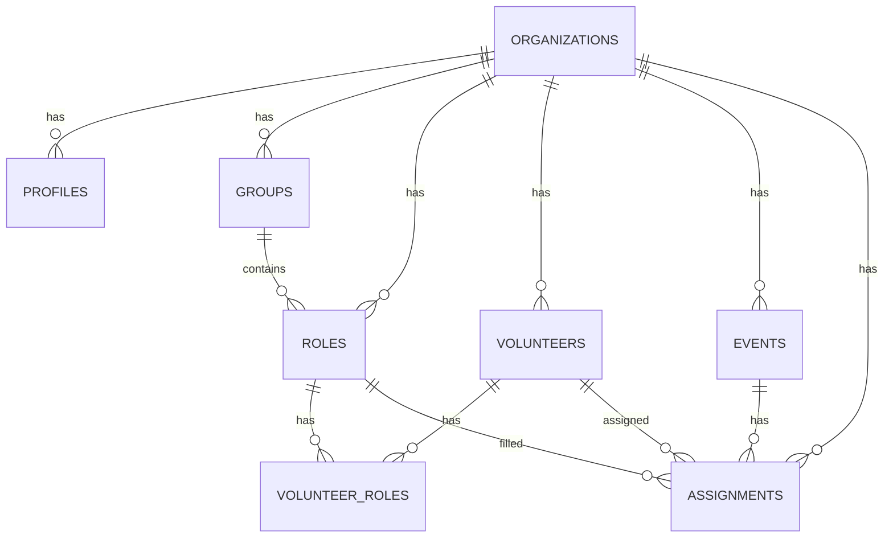

# State Management System

<cite>
**Referenced Files in This Document**
- [store.jsx](file://src/services/store.jsx)
- [supabase.js](file://src/services/supabase.js)
- [App.jsx](file://src/App.jsx)
- [main.jsx](file://src/main.jsx)
- [Layout.jsx](file://src/components/Layout.jsx)
- [AuthLayout.jsx](file://src/components/AuthLayout.jsx)
- [Dashboard.jsx](file://src/pages/Dashboard.jsx)
- [Volunteers.jsx](file://src/pages/Volunteers.jsx)
- [Schedule.jsx](file://src/pages/Schedule.jsx)
- [Roles.jsx](file://src/pages/Roles.jsx)
- [ManageMembers.jsx](file://src/pages/ManageMembers.jsx)
- [Modal.jsx](file://src/components/Modal.jsx)
- [supabase-schema.sql](file://supabase-schema.sql)
- [supabase-role-policies.sql](file://supabase-role-policies.sql)
- [package.json](file://package.json)
</cite>

## Update Summary
**Changes Made**
- Added comprehensive documentation for new role-based access control properties (isAdmin, isTeamMember, canEdit, canDownload)
- Updated StoreProvider architecture section to include authorization flags
- Enhanced Custom Hooks Design Pattern section with access control usage examples
- Added new section on Authorization and Access Control
- Updated Integration Patterns section to show how access control properties are used throughout the application

## Table of Contents
1. [Introduction](#introduction)
2. [Project Structure](#project-structure)
3. [Core Components](#core-components)
4. [Architecture Overview](#architecture-overview)
5. [Authorization and Access Control](#authorization-and-access-control)
6. [Detailed Component Analysis](#detailed-component-analysis)
7. [Dependency Analysis](#dependency-analysis)
8. [Performance Considerations](#performance-considerations)
9. [Troubleshooting Guide](#troubleshooting-guide)
10. [Conclusion](#conclusion)
11. [Appendices](#appendices)

## Introduction
This document explains RosterFlow's centralized state management system built with React Context and the Provider pattern. It covers how the store exposes global state and actions, how Supabase authentication and data are integrated, and how components consume the store. The system now includes enhanced role-based access control with authorization flags that provide granular permissions for different user roles. It also documents data loading patterns, error handling, and performance considerations such as memoization and selective re-rendering. Finally, it provides practical examples of common state operations and integration patterns with React components.

## Project Structure
RosterFlow organizes state management under a dedicated service module and integrates it into the application via a Provider wrapper around the routing tree. Components consume the store through a custom hook that now includes authorization properties for role-based access control.



**Diagram sources**
- [main.jsx:1-11](file://src/main.jsx#L1-L11)
- [App.jsx:1-37](file://src/App.jsx#L1-L37)
- [Layout.jsx:1-129](file://src/components/Layout.jsx#L1-L129)
- [AuthLayout.jsx:1-29](file://src/components/AuthLayout.jsx#L1-L29)
- [store.jsx:1-1279](file://src/services/store.jsx#L1-L1279)
- [supabase.js:1-13](file://src/services/supabase.js#L1-L13)
- [Dashboard.jsx:1-90](file://src/pages/Dashboard.jsx#L1-L90)
- [Volunteers.jsx:1-360](file://src/pages/Volunteers.jsx#L1-L360)
- [Schedule.jsx:1-935](file://src/pages/Schedule.jsx#L1-L935)
- [Roles.jsx:1-392](file://src/pages/Roles.jsx#L1-L392)
- [ManageMembers.jsx:1-133](file://src/pages/ManageMembers.jsx#L1-L133)
- [Modal.jsx:1-50](file://src/components/Modal.jsx#L1-L50)

**Section sources**
- [main.jsx:1-11](file://src/main.jsx#L1-L11)
- [App.jsx:1-37](file://src/App.jsx#L1-L37)
- [store.jsx:1-1279](file://src/services/store.jsx#L1-L1279)
- [supabase.js:1-13](file://src/services/supabase.js#L1-L13)

## Core Components
- StoreProvider: Wraps the app with React Context, initializes Supabase auth, loads organization and profile data, and exposes a comprehensive set of actions for CRUD operations on groups, roles, volunteers, events, and assignments. It also provides authorization flags (isAdmin, isTeamMember, canEdit, canDownload) and a refreshData function to reload all data.
- useStore: A custom hook that returns the current store value for consumption by components, including authorization properties.
- Supabase client: Created from environment variables and used for authentication and data operations.

Key responsibilities:
- Authentication lifecycle: initialize session, subscribe to auth state changes, and clear data on sign-out.
- Data loading: parallel fetch of groups, roles, volunteers, events, assignments, and playlists; transforms volunteer roles for compatibility.
- Data mutations: add/update/delete for volunteers, events, assignments, roles, and groups; maintains consistency by reloading data after changes.
- Authorization flags: derive role-based permissions from profile data for fine-grained access control.
- Derived user object: compatibility wrapper for existing components.

**Section sources**
- [store.jsx:6-1279](file://src/services/store.jsx#L6-L1279)
- [supabase.js:1-13](file://src/services/supabase.js#L1-L13)

## Architecture Overview
The store is a single source of truth for all application data. Components subscribe to the store via useStore and receive both state and action functions along with authorization properties. Data is loaded from Supabase and kept in sync through:
- Auth state subscription to keep session and derived profile/organization in sync.
- Parallel data loading on profile change to populate groups, roles, volunteers, events, assignments, and playlists.
- After mutation operations, the store reloads all data to ensure local state reflects database changes.
- Authorization flags are computed from profile data to provide role-based access control.



**Diagram sources**
- [store.jsx:58-111](file://src/services/store.jsx#L58-L111)
- [store.jsx:114-229](file://src/services/store.jsx#L114-L229)
- [store.jsx:1213-1229](file://src/services/store.jsx#L1213-L1229)

## Authorization and Access Control

**Updated** Enhanced with role-based access control properties for granular permission management.

The store now provides four key authorization flags that determine user capabilities throughout the application:

### Authorization Properties
- **isAdmin**: Boolean flag indicating administrative privileges. True for users with 'admin' role or in demo mode.
- **isTeamMember**: Boolean flag indicating team member status. True for users with 'member' or 'team_member' roles.
- **canEdit**: Boolean flag controlling write operations. Currently equals isAdmin, allowing only administrators to perform edits.
- **canDownload**: Boolean flag controlling download permissions. All authenticated users can download content.

### Implementation Details
The authorization flags are computed from the profile data and are available alongside all other store properties:

```javascript
// Authorization computation in StoreProvider
const isAdmin = profile?.role === 'admin' || demoMode;
const isTeamMember = profile?.role === 'member' || profile?.role === 'team_member';
const canEdit = isAdmin;
const canDownload = true; // All authenticated users can download
```

### Usage Patterns
Components use these flags to conditionally render UI elements and control functionality:

```javascript
// Navigation sidebar - only shows Manage Members for admins
{canEdit && [{ icon: ShieldCheck, label: 'Manage Members', path: '/manage-members' }]}

// Volunteer management - only admins can add/edit/remove volunteers
{canEdit ? (
    <button onClick={() => handleDelete(volunteer.id)}>Remove</button>
) : (
    <span>View Only</span>
)}

// Event management - only admins can add/edit/delete events
{canEdit && (
    <button onClick={() => handleDeleteEvent(e.id)}>Delete Event</button>
)}
```

### Security Considerations
- Server-side policies enforce data isolation at the database level
- Client-side authorization provides immediate UI feedback and prevents unauthorized operations
- All mutations validate organization membership before processing
- Profile data drives both UI permissions and server-side security checks

**Section sources**
- [store.jsx:1213-1229](file://src/services/store.jsx#L1213-L1229)
- [Layout.jsx:18-19](file://src/components/Layout.jsx#L18-L19)
- [ManageMembers.jsx:9-24](file://src/pages/ManageMembers.jsx#L9-L24)
- [Volunteers.jsx:130-138](file://src/pages/Volunteers.jsx#L130-L138)
- [Schedule.jsx:413-425](file://src/pages/Schedule.jsx#L413-L425)
- [Roles.jsx:120-141](file://src/pages/Roles.jsx#L120-L141)

## Detailed Component Analysis

### StoreProvider and useStore
- Context: A single context holds the store value, including user, profile, organization, loading flag, authorization flags, and all actions.
- Auth lifecycle: Initializes session, subscribes to auth changes, and clears data when signed out.
- Data lifecycle: Loads profile and organization when session is present; loads all data in parallel when profile is ready.
- Mutations: Each action performs a database write and then refreshes all data to ensure consistency.
- Authorization: Computes role-based access flags from profile data for UI and security decisions.
- Exposed actions: login, logout, registerOrganization, add/update/delete for volunteers, events, assignments, roles, and groups; plus refreshData.



**Diagram sources**
- [store.jsx:40-1279](file://src/services/store.jsx#L40-L1279)

**Section sources**
- [store.jsx:40-1279](file://src/services/store.jsx#L40-L1279)

### Supabase Integration
- Client creation: Uses VITE_SUPABASE_URL and VITE_SUPABASE_ANON_KEY environment variables.
- Authentication: Session initialization and auth state subscription.
- Data operations: CRUD actions for all entities; parallel loading; error logging; post-mutation refresh.
- Authorization: Profile data drives role-based permissions and server-side security policies.



**Diagram sources**
- [supabase.js:1-13](file://src/services/supabase.js#L1-L13)
- [store.jsx:58-111](file://src/services/store.jsx#L58-L111)
- [store.jsx:1213-1229](file://src/services/store.jsx#L1213-L1229)

**Section sources**
- [supabase.js:1-13](file://src/services/supabase.js#L1-L13)
- [store.jsx:58-111](file://src/services/store.jsx#L58-L111)
- [store.jsx:1213-1229](file://src/services/store.jsx#L1213-L1229)

### Real-time Synchronization and Local Consistency
- Current implementation: The store does not subscribe to Supabase Realtime channels. Instead, it refreshes data after each mutation by calling loadAllData.
- Implications: This ensures eventual consistency with the database after writes, but does not provide immediate UI updates from server-side changes without manual refresh.
- Recommended enhancement: Introduce Supabase Realtime subscriptions to listen for table changes and update local state incrementally. This would reduce network calls and improve responsiveness.



**Diagram sources**
- [store.jsx:174-229](file://src/services/store.jsx#L174-L229)
- [store.jsx:58-111](file://src/services/store.jsx#L58-L111)

**Section sources**
- [store.jsx:174-229](file://src/services/store.jsx#L174-L229)
- [store.jsx:58-111](file://src/services/store.jsx#L58-L111)

### Custom Hooks Design Pattern
- useStore: Returns the store value from context, including authorization properties. Components can destructure the parts they need (e.g., user, volunteers, events, roles, isAdmin, canEdit, addVolunteer, updateEvent).
- Authorization-aware usage:
  - Dashboard consumes user and lists counts for volunteers, events, and roles.
  - Volunteers page consumes volunteers, roles, groups, and CRUD actions with conditional UI based on canEdit.
  - Schedule page consumes events, assignments, roles, volunteers, groups, and assignment-related actions with edit controls for admins.
  - Roles page consumes roles and groups, and manages both roles and groups with admin-only controls.
  - ManageMembers page uses canEdit to restrict member management to administrators.



**Diagram sources**
- [store.jsx:1276-1279](file://src/services/store.jsx#L1276-L1279)
- [Dashboard.jsx:22-28](file://src/pages/Dashboard.jsx#L22-L28)
- [Volunteers.jsx:7-7](file://src/pages/Volunteers.jsx#L7-L7)
- [Schedule.jsx:9-9](file://src/pages/Schedule.jsx#L9-L9)
- [Roles.jsx:7-7](file://src/pages/Roles.jsx#L7-L7)
- [ManageMembers.jsx:7-7](file://src/pages/ManageMembers.jsx#L7-L7)

**Section sources**
- [store.jsx:1276-1279](file://src/services/store.jsx#L1276-L1279)
- [Dashboard.jsx:22-28](file://src/pages/Dashboard.jsx#L22-L28)
- [Volunteers.jsx:7-7](file://src/pages/Volunteers.jsx#L7-L7)
- [Schedule.jsx:9-9](file://src/pages/Schedule.jsx#L9-L9)
- [Roles.jsx:7-7](file://src/pages/Roles.jsx#L7-L7)
- [ManageMembers.jsx:7-7](file://src/pages/ManageMembers.jsx#L7-L7)

### State Update Mechanisms, Optimistic Updates, and Conflict Resolution
- Current mechanism: All mutations are executed against the database first, followed by a full refresh of all data. There is no optimistic update layer.
- Conflict resolution: Because the store reloads data after each write, conflicts are resolved by overwriting local state with the authoritative database state.
- Authorization: Authorization flags are recomputed after each data refresh to ensure they reflect the latest profile data.
- Recommendations:
  - Implement optimistic updates for immediate UI feedback.
  - Track pending operations and roll back or reconcile on errors.
  - Use incremental updates from Supabase Realtime subscriptions to minimize over-fetching and reduce conflicts.

**Section sources**
- [store.jsx:174-229](file://src/services/store.jsx#L174-L229)
- [store.jsx:1213-1229](file://src/services/store.jsx#L1213-L1229)

### Data Loading Patterns and Offline State Management
- Loading pattern:
  - Auth session initialization and subscription.
  - Profile and organization loading when session is present.
  - Parallel loading of all entities (groups, roles, volunteers, events, assignments, playlists) when profile is ready.
  - Authorization flags computation after data load.
- Offline considerations:
  - The current implementation assumes network availability for all reads/writes.
  - To support offline scenarios, consider:
    - Persisting a minimal cache (e.g., IndexedDB or localStorage) for recent entities.
    - Implementing a queue for pending writes and retrying on reconnect.
    - Showing cached data while network is unavailable and merging updates upon reconnect.

**Section sources**
- [store.jsx:58-111](file://src/services/store.jsx#L58-L111)
- [store.jsx:114-229](file://src/services/store.jsx#L114-L229)

### Error Handling
- Error logging: Errors from data operations are logged to the console.
- Error propagation: Some actions throw errors (e.g., login, registerOrganization, mutations). Consumers should handle these appropriately (e.g., display user-friendly messages).
- Authorization errors: Access control violations are handled both on the client side (UI restrictions) and server side (database policies).
- Recommendations:
  - Centralize error handling in the store with a shared error state and notification system.
  - Provide retry mechanisms for transient failures.
  - Implement graceful degradation when authorization data is unavailable.

**Section sources**
- [store.jsx:61-64](file://src/services/store.jsx#L61-L64)
- [store.jsx:90-94](file://src/services/store.jsx#L90-L94)
- [store.jsx:174-194](file://src/services/store.jsx#L174-L194)

### Integration Patterns with React Components
- Layout and navigation: Layout checks user presence and redirects to landing if not authenticated. Navigation items are filtered based on authorization flags (canEdit).
- Pages:
  - Dashboard: Reads user and entity counts.
  - Volunteers: Manages volunteer CRUD with admin-only controls (canEdit).
  - Schedule: Manages events, assignments, and email sharing with conditional edit controls.
  - Roles: Manages groups and roles with admin-only controls (canEdit).
  - ManageMembers: Restricts member management to administrators using canEdit.
- Modal: Reusable dialog component used across pages with authorization-aware functionality.



**Diagram sources**
- [Layout.jsx:18-19](file://src/components/Layout.jsx#L18-L19)
- [App.jsx:13-34](file://src/App.jsx#L13-L34)
- [Volunteers.jsx:130-138](file://src/pages/Volunteers.jsx#L130-L138)
- [Schedule.jsx:413-425](file://src/pages/Schedule.jsx#L413-L425)
- [Roles.jsx:120-141](file://src/pages/Roles.jsx#L120-L141)
- [ManageMembers.jsx:9-24](file://src/pages/ManageMembers.jsx#L9-L24)
- [Modal.jsx:1-50](file://src/components/Modal.jsx#L1-L50)

**Section sources**
- [Layout.jsx:18-19](file://src/components/Layout.jsx#L18-L19)
- [App.jsx:13-34](file://src/App.jsx#L13-L34)
- [Volunteers.jsx:130-138](file://src/pages/Volunteers.jsx#L130-L138)
- [Schedule.jsx:413-425](file://src/pages/Schedule.jsx#L413-L425)
- [Roles.jsx:120-141](file://src/pages/Roles.jsx#L120-L141)
- [ManageMembers.jsx:9-24](file://src/pages/ManageMembers.jsx#L9-L24)
- [Modal.jsx:1-50](file://src/components/Modal.jsx#L1-L50)

## Dependency Analysis
- External libraries:
  - @supabase/supabase-js: Database and auth client.
  - react-router-dom: Routing and navigation.
  - lucide-react: Icons.
  - clsx/tailwind-merge: Utility classes.
- Internal dependencies:
  - store.jsx depends on supabase.js for client creation.
  - All pages depend on store.jsx via useStore, including authorization properties.
  - Layout and AuthLayout wrap pages and manage navigation with authorization-aware filtering.



**Diagram sources**
- [package.json:15-24](file://package.json#L15-L24)
- [store.jsx:1-4](file://src/services/store.jsx#L1-L4)
- [supabase.js:1-13](file://src/services/supabase.js#L1-L13)
- [App.jsx:1-37](file://src/App.jsx#L1-L37)

**Section sources**
- [package.json:15-24](file://package.json#L15-L24)
- [store.jsx:1-4](file://src/services/store.jsx#L1-L4)
- [supabase.js:1-13](file://src/services/supabase.js#L1-L13)
- [App.jsx:1-37](file://src/App.jsx#L1-L37)

## Performance Considerations
- Current optimizations:
  - Parallel data loading reduces total load time.
  - Minimal state updates by replacing arrays wholesale after refresh.
  - Authorization flags are computed once per data refresh cycle.
- Potential improvements:
  - Memoization: Use useMemo/useCallback in components to prevent unnecessary re-renders when props are unchanged.
  - Selective re-rendering: Split store into smaller contexts or use a selector-based approach to deliver only changed slices to consumers.
  - Virtualized lists: For large datasets (volunteers/events), implement virtualization to reduce DOM nodes.
  - Debounced filtering/search: Apply debouncing to search inputs to limit re-computation.
  - Lazy loading: Load additional pages of data on demand rather than all at once.
  - Optimistic updates: Reduce perceived latency by updating UI immediately and reconciling on error.
  - Authorization caching: Cache authorization decisions to avoid recomputation in frequently accessed components.

## Troubleshooting Guide
- Environment variables missing:
  - If VITE_SUPABASE_URL or VITE_SUPABASE_ANON_KEY are not set, the Supabase client warns and initializes with empty keys. Ensure these are configured in your environment.
- Authentication issues:
  - Verify that Supabase auth is enabled and that the client is initialized correctly.
  - Check that onAuthStateChange subscriptions are active and that session state is being updated.
- Data not loading:
  - Confirm that profile is loaded and org_id is present before attempting to load entities.
  - Review console logs for errors during parallel fetches.
  - Check that authorization flags are computed correctly after data load.
- Mutations failing:
  - Inspect thrown errors from store actions and surface user-friendly messages.
  - Ensure that organization-scoped operations include org_id.
  - Verify that authorization flags reflect the current user's role.
- Authorization issues:
  - If UI elements aren't showing expected controls, verify that profile data contains correct role information.
  - Check that authorization flags (isAdmin, canEdit) are properly computed from profile data.
  - Ensure server-side policies match client-side authorization logic.
- Real-time updates not appearing:
  - The current implementation does not subscribe to Supabase Realtime. Implement subscriptions to receive live updates.

**Section sources**
- [supabase.js:6-8](file://src/services/supabase.js#L6-L8)
- [store.jsx:58-88](file://src/services/store.jsx#L58-L88)
- [store.jsx:114-124](file://src/services/store.jsx#L114-L124)
- [store.jsx:1213-1229](file://src/services/store.jsx#L1213-L1229)

## Conclusion
RosterFlow's state management centers on a single-store Provider pattern with React Context, backed by Supabase for authentication and data persistence. The store provides a clean API for CRUD operations and keeps local state consistent by refreshing all data after mutations. The enhanced authorization system adds role-based access control with four key flags (isAdmin, isTeamMember, canEdit, canDownload) that provide granular permissions throughout the application. While the current approach is straightforward and reliable, enhancing it with optimistic updates, incremental Realtime subscriptions, and selective re-rendering would significantly improve user experience and performance.

## Appendices

### Data Model Overview
The application's data model is organized around organizations, profiles, groups, roles, volunteers, and assignments. Relationships:
- Organizations have many profiles, groups, roles, volunteers, events, and assignments.
- Profiles belong to one organization and define user roles.
- Groups contain many roles; roles may belong to a group.
- Volunteers belong to an organization and can have many roles via a junction table.
- Events belong to an organization; assignments link events, roles, and volunteers.



**Diagram sources**
- [supabase-schema.sql:7-76](file://supabase-schema.sql#L7-L76)

**Section sources**
- [supabase-schema.sql:7-76](file://supabase-schema.sql#L7-L76)

### Authorization Policy Reference
The application enforces role-based access control through both client-side and server-side mechanisms:

#### Client-side Authorization
- **isAdmin**: True for users with 'admin' role or in demo mode
- **isTeamMember**: True for users with 'member' or 'team_member' roles  
- **canEdit**: Equals isAdmin (only administrators can edit)
- **canDownload**: True for all authenticated users

#### Server-side Policies
- Profiles table: Role-based access control with organization isolation
- Groups table: Admin-only insert/update/delete, everyone can view
- Organizations table: Admin-only updates, everyone can view
- File attachments: Organization-scoped access control

**Section sources**
- [store.jsx:1213-1229](file://src/services/store.jsx#L1213-L1229)
- [supabase-role-policies.sql:184-222](file://supabase-role-policies.sql#L184-L222)

### Common State Operations
- Authentication:
  - Initialize session and subscribe to auth changes.
  - Login, logout, and register organization.
- Data loading:
  - Load profile and organization on session change.
  - Parallel load of groups, roles, volunteers, events, assignments, playlists.
- Mutations:
  - Add/update/delete volunteers, events, assignments, roles, groups.
  - Transform volunteer roles for compatibility and persist relationships.
- Authorization:
  - Compute role-based access flags from profile data.
  - Apply authorization in UI components and server-side policies.
- Refresh:
  - Refresh all data after mutations to ensure consistency.

**Section sources**
- [store.jsx:58-111](file://src/services/store.jsx#L58-L111)
- [store.jsx:174-229](file://src/services/store.jsx#L174-L229)
- [store.jsx:1213-1229](file://src/services/store.jsx#L1213-L1229)
- [store.jsx:1265-1267](file://src/services/store.jsx#L1265-L1267)