# Store Provider Architecture

<cite>
**Referenced Files in This Document**
- [store.jsx](file://src/services/store.jsx)
- [supabase.js](file://src/services/supabase.js)
- [App.jsx](file://src/App.jsx)
- [main.jsx](file://src/main.jsx)
- [Login.jsx](file://src/pages/Login.jsx)
- [Dashboard.jsx](file://src/pages/Dashboard.jsx)
- [Layout.jsx](file://src/components/Layout.jsx)
- [Volunteers.jsx](file://src/pages/Volunteers.jsx)
- [Register.jsx](file://src/pages/Register.jsx)
- [ApprovalPending.jsx](file://src/pages/ApprovalPending.jsx)
- [.env.example](file://.env.example)
- [supabase-schema.sql](file://supabase-schema.sql)
</cite>

## Update Summary
**Changes Made**
- Enhanced profile loading mechanism with improved error handling to prevent HTTP 406 errors
- Added conditional organization loading with separate organization fetch functionality
- Improved support for new user onboarding with better error handling for missing profiles
- Added organization selection capability for existing users
- Enhanced registration flow with approval pending state

## Table of Contents
1. [Introduction](#introduction)
2. [Project Structure](#project-structure)
3. [Core Components](#core-components)
4. [Architecture Overview](#architecture-overview)
5. [Detailed Component Analysis](#detailed-component-analysis)
6. [Enhanced Profile Loading Mechanism](#enhanced-profile-loading-mechanism)
7. [New User Onboarding Flow](#new-user-onboarding-flow)
8. [Dependency Analysis](#dependency-analysis)
9. [Performance Considerations](#performance-considerations)
10. [Troubleshooting Guide](#troubleshooting-guide)
11. [Conclusion](#conclusion)
12. [Appendices](#appendices)

## Introduction
This document explains RosterFlow's Store Provider architecture built on React's Context API. It covers the StoreProvider component that manages global application state, the StoreContext for state sharing, and the Provider pattern that wraps the app tree. The store integrates with Supabase for authentication and data persistence, organizing state into distinct slices for authentication, profiles, organizations, and data entities (groups, roles, volunteers, events, assignments). We detail the initialization process, session management, data loading mechanisms, provider lifecycle hooks, and how child components consume context.

**Updated** Enhanced with improved profile loading mechanisms that prevent HTTP 406 errors, conditional organization loading, and better support for new user onboarding scenarios.

## Project Structure
RosterFlow organizes its store-related code under the services directory, with the main application wiring in App.jsx and component usage across pages and layouts.

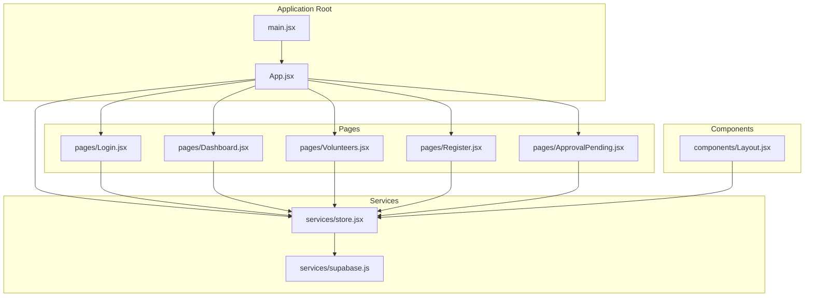

**Diagram sources**
- [main.jsx:1-11](file://src/main.jsx#L1-L11)
- [App.jsx:1-37](file://src/App.jsx#L1-L37)
- [store.jsx:1-1268](file://src/services/store.jsx#L1-L1268)
- [supabase.js:1-37](file://src/services/supabase.js#L1-L37)
- [Login.jsx:1-79](file://src/pages/Login.jsx#L1-L79)
- [Dashboard.jsx:1-90](file://src/pages/Dashboard.jsx#L1-L90)
- [Volunteers.jsx:1-354](file://src/pages/Volunteers.jsx#L1-L354)
- [Register.jsx:1-160](file://src/pages/Register.jsx#L1-L160)
- [ApprovalPending.jsx:1-47](file://src/pages/ApprovalPending.jsx#L1-L47)
- [Layout.jsx:1-102](file://src/components/Layout.jsx#L1-L102)

**Section sources**
- [main.jsx:1-11](file://src/main.jsx#L1-L11)
- [App.jsx:1-37](file://src/App.jsx#L1-L37)

## Core Components
- StoreContext: A React Context created with a default value to hold shared state and actions.
- StoreProvider: A component that initializes and manages application-wide state, including authentication, profile, organization, and data entities. It exposes a context value containing both state and action functions.
- useStore: A custom hook that consumers use to access the StoreContext value.

Key responsibilities:
- Authentication state initialization and change listening via Supabase.
- Profile and organization loading upon successful authentication.
- Enhanced profile loading with error handling to prevent HTTP 406 errors.
- Conditional organization loading when profile has org_id.
- Parallel data loading for groups, roles, volunteers, events, assignments, and playlists.
- Action functions for CRUD operations on volunteers, events, assignments, roles, groups, and playlists.
- Registration functions for new organizations and members with approval workflows.
- Derived user object for compatibility with existing components.

**Updated** Enhanced with improved error handling for profile loading and conditional organization loading.

**Section sources**
- [store.jsx:1-1268](file://src/services/store.jsx#L1-L1268)

## Architecture Overview
The Store Provider architecture follows a Provider pattern with React Context. The provider initializes state, subscribes to authentication changes, loads profile and organization data with enhanced error handling, and synchronizes application data. Child components consume context using the useStore hook to access state and dispatch actions.

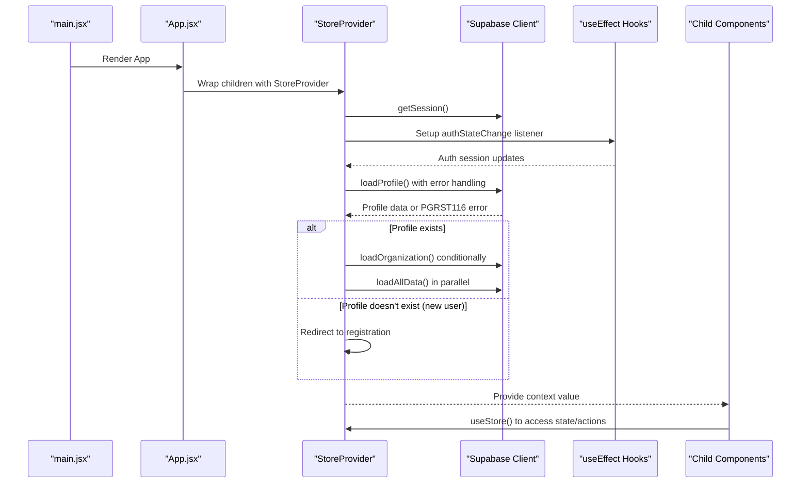

**Diagram sources**
- [main.jsx:6-10](file://src/main.jsx#L6-L10)
- [App.jsx:13-34](file://src/App.jsx#L13-L34)
- [store.jsx:21-52](file://src/services/store.jsx#L21-L52)
- [supabase.js:1-37](file://src/services/supabase.js#L1-L37)

## Detailed Component Analysis

### StoreProvider Implementation
The StoreProvider component encapsulates:
- Authentication state: session, profile, organization, loading flag, and demo mode flag.
- Data state: arrays for groups, roles, volunteers, events, assignments, and playlists.
- Enhanced initialization and lifecycle:
  - Retrieves initial session with error handling for network failure.
  - Subscribes to auth state changes and updates session accordingly.
  - Loads profile with improved error handling to prevent HTTP 406 errors.
  - Conditionally loads organization when profile has org_id.
  - Loads all application data in parallel when profile is available.
  - Clears data when user logs out or session ends.
- Enhanced action functions:
  - Authentication: login, logout, registerOrganization, registerMember.
  - Data operations: add/update/delete for volunteers, events, assignments, roles, groups.
  - Playlist operations: add/update/delete for event playlists.
  - File attachment operations: add, get, delete file attachments.
  - Utility: refreshData to reload all data, fetchOrganizations for existing user registration.

Context value structure:
- user: derived object combining session user, profile name, and orgId.
- profile, organization, loading, demoMode: state slices.
- login, logout, registerOrganization, registerMember: auth actions.
- groups, roles, volunteers, events, assignments, playlists: entity slices.
- CRUD actions for each entity slice.
- Organization management functions: fetchOrganizations, updateMemberStatus, completePayment.
- refreshData: convenience function to reload all data.

**Updated** Enhanced with improved error handling, conditional organization loading, and expanded registration functionality.

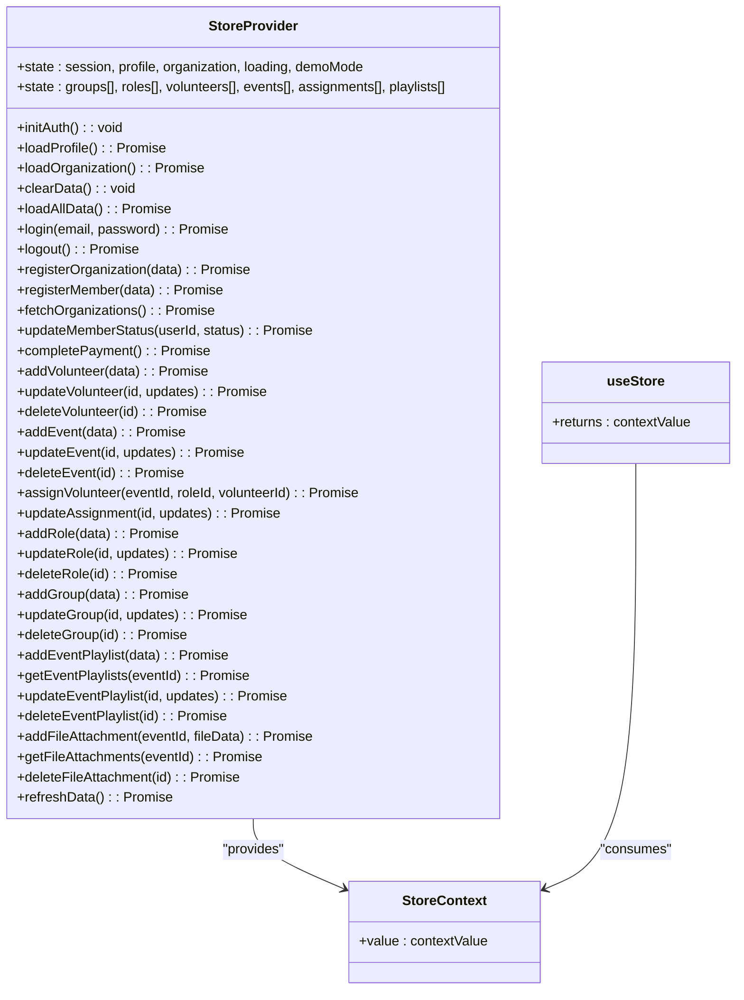

**Diagram sources**
- [store.jsx:6-1268](file://src/services/store.jsx#L6-L1268)

**Section sources**
- [store.jsx:6-1268](file://src/services/store.jsx#L6-L1268)

### Authentication State Setup and Session Management
- Initial session retrieval: The provider fetches the current session on mount and sets loading to false.
- Auth state change listener: Subscribes to Supabase auth state changes and updates session accordingly.
- Cleanup: Unsubscribes from the auth subscription when the component unmounts.
- Enhanced profile loading: When a session exists, the provider loads the user's profile with improved error handling. On logout or session end, it clears profile, organization, and all data slices.

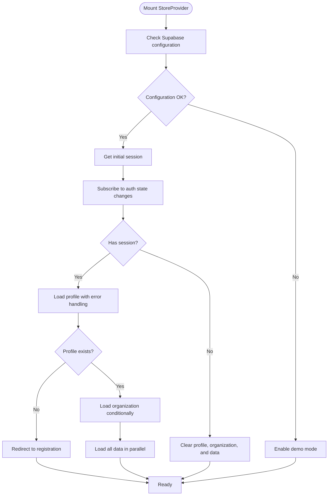

**Diagram sources**
- [store.jsx:58-88](file://src/services/store.jsx#L58-L88)
- [store.jsx:121-164](file://src/services/store.jsx#L121-L164)

**Section sources**
- [store.jsx:58-88](file://src/services/store.jsx#L58-L88)
- [store.jsx:121-164](file://src/services/store.jsx#L121-L164)

### Data Loading Mechanisms
- Parallel loading: The provider uses Promise.all to fetch groups, roles, volunteers, events, assignments, and playlists concurrently.
- Enhanced volunteer transformation: Volunteers are transformed to include a roles array derived from the volunteer_roles join table for compatibility.
- Enhanced ordering: Entities are ordered consistently (names ascending for groups/roles, dates descending for events, timestamps descending for assignments).
- Improved error handling: Errors for each fetch are logged to the console with specific handling for different error types.
- Conditional organization loading: Organizations are loaded separately when profile has org_id, preventing HTTP 406 errors during profile retrieval.

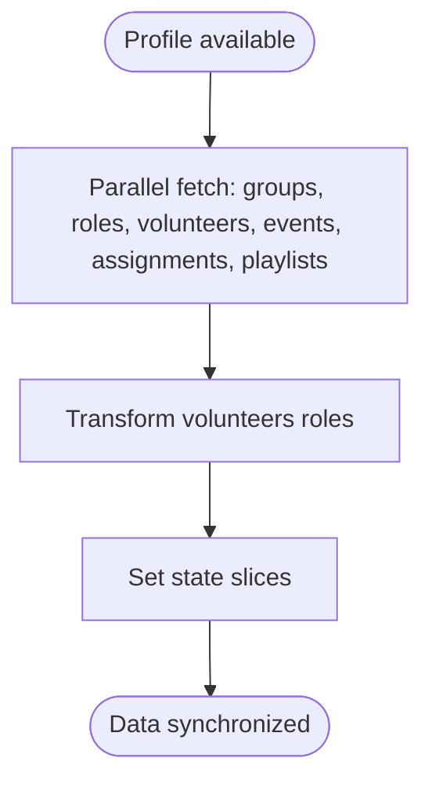

**Diagram sources**
- [store.jsx:174-229](file://src/services/store.jsx#L174-L229)

**Section sources**
- [store.jsx:174-229](file://src/services/store.jsx#L174-L229)

### State Structure and Slices
The store maintains separate state slices:
- Authentication slice: session, loading, demoMode.
- Identity slice: user (derived), profile, organization.
- Data entity slices: groups, roles, volunteers, events, assignments, playlists.
- Additional slices: organizationsList for existing user registration.

Each slice corresponds to a Supabase table or a derived transformation. The volunteer slice includes a roles array derived from the volunteer_roles join table.

**Updated** Added playlists slice for music playlist management and organizationsList for existing user registration.

**Section sources**
- [store.jsx:40-56](file://src/services/store.jsx#L40-L56)
- [store.jsx:174-229](file://src/services/store.jsx#L174-L229)
- [supabase-schema.sql:40-76](file://supabase-schema.sql#L40-L76)

### Provider Lifecycle and useEffect Hooks
- Auth initialization: useEffect retrieves the initial session and subscribes to auth state changes.
- Enhanced profile loading: useEffect triggers when session changes; loads profile with error handling for new users; clears state when not authenticated.
- Conditional organization loading: useEffect triggers when profile changes; loads organization separately when org_id exists.
- Data synchronization: useEffect triggers when profile changes; loads all data in parallel.

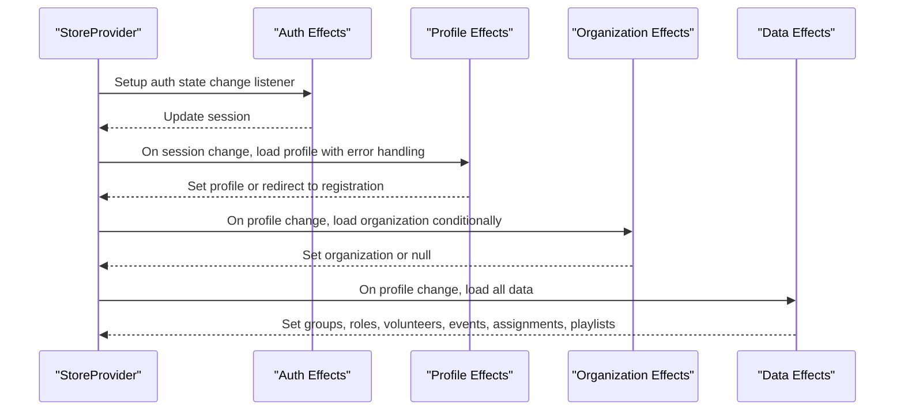

**Diagram sources**
- [store.jsx:58-88](file://src/services/store.jsx#L58-L88)
- [store.jsx:90-119](file://src/services/store.jsx#L90-L119)

**Section sources**
- [store.jsx:58-88](file://src/services/store.jsx#L58-L88)
- [store.jsx:90-119](file://src/services/store.jsx#L90-L119)

### Context Value Structure and Consumption Patterns
The context value exposes:
- State: user, profile, organization, loading, demoMode, groups, roles, volunteers, events, assignments, playlists.
- Actions: authentication functions, registration functions, CRUD functions for each entity slice, and utility functions.
- Consumers use the useStore hook to access the context value and destructure required fields.

Examples of consumption patterns:
- Login page consumes login and loading to sign in users.
- Dashboard consumes user, volunteers, events, and roles to render statistics.
- Layout consumes user, organization, and logout to manage navigation and authentication state.
- Volunteers page consumes volunteers, roles, groups, and CRUD actions to manage volunteers.
- Registration page consumes registerOrganization, registerMember, and organizationsList for user onboarding.

**Updated** Enhanced with registration functions and organizationsList for improved user onboarding experience.

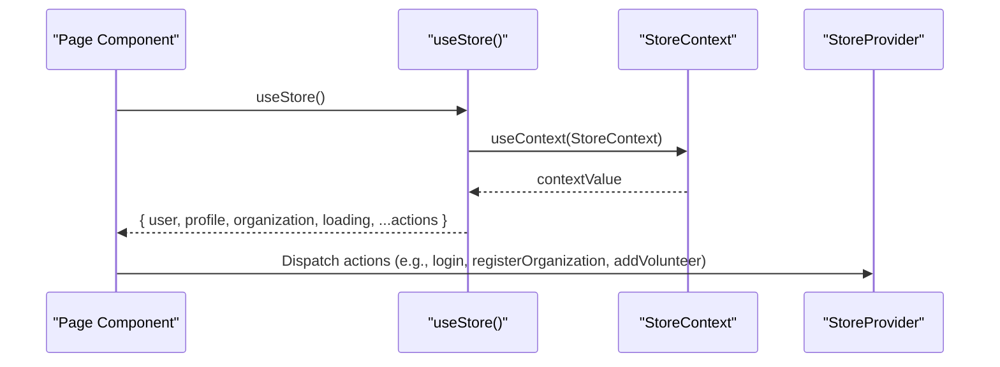

**Diagram sources**
- [store.jsx:1258-1263](file://src/services/store.jsx#L1258-L1263)
- [Login.jsx](file://src/pages/Login.jsx#L7)
- [Dashboard.jsx](file://src/pages/Dashboard.jsx#L22)
- [Layout.jsx](file://src/components/Layout.jsx#L17)
- [Volunteers.jsx](file://src/pages/Volunteers.jsx#L8)
- [Register.jsx](file://src/pages/Register.jsx#L7)

**Section sources**
- [store.jsx:1198-1256](file://src/services/store.jsx#L1198-L1256)
- [Login.jsx](file://src/pages/Login.jsx#L7)
- [Dashboard.jsx](file://src/pages/Dashboard.jsx#L22)
- [Layout.jsx](file://src/components/Layout.jsx#L17)
- [Volunteers.jsx](file://src/pages/Volunteers.jsx#L8)
- [Register.jsx](file://src/pages/Register.jsx#L7)

### Proper Provider Wrapping and Context Consumption
- Provider wrapping: The StoreProvider wraps the entire application in App.jsx, ensuring all routes and components have access to the store.
- Context consumption: Components import useStore and destructure the required state and actions for their functionality.

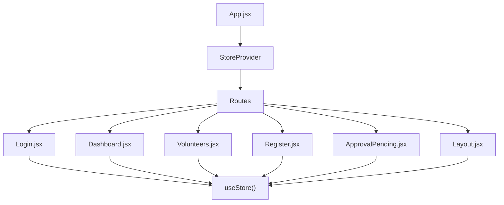

**Diagram sources**
- [App.jsx:13-34](file://src/App.jsx#L13-L34)
- [Login.jsx](file://src/pages/Login.jsx#L3)
- [Dashboard.jsx](file://src/pages/Dashboard.jsx#L3)
- [Volunteers.jsx](file://src/pages/Volunteers.jsx#L2)
- [Register.jsx](file://src/pages/Register.jsx#L3)
- [ApprovalPending.jsx](file://src/pages/ApprovalPending.jsx#L3)
- [Layout.jsx](file://src/components/Layout.jsx#L5)

**Section sources**
- [App.jsx:13-34](file://src/App.jsx#L13-L34)
- [Login.jsx](file://src/pages/Login.jsx#L3)
- [Dashboard.jsx](file://src/pages/Dashboard.jsx#L3)
- [Volunteers.jsx](file://src/pages/Volunteers.jsx#L2)
- [Register.jsx](file://src/pages/Register.jsx#L3)
- [ApprovalPending.jsx](file://src/pages/ApprovalPending.jsx#L3)
- [Layout.jsx](file://src/components/Layout.jsx#L5)

## Enhanced Profile Loading Mechanism

### HTTP 406 Error Prevention
The profile loading mechanism has been enhanced to prevent HTTP 406 errors through improved error handling:

- **Initial profile fetch without organization join**: The system first attempts to fetch the profile without joining with the organization table to avoid HTTP 406 errors.
- **Specific error code handling**: When encountering the PGRST116 error code (profile not found), the system recognizes this as expected for new users and redirects them to the registration flow.
- **Graceful fallback**: Other profile loading errors are logged and handled gracefully without crashing the application.

### Conditional Organization Loading
The organization loading has been made conditional to improve performance and reliability:

- **Separate organization fetch**: When a profile has an org_id, the system performs a separate organization fetch to avoid complex joins that could cause HTTP 406 errors.
- **Error-tolerant organization loading**: If organization loading fails, the system sets organization to null and continues with profile-only functionality.
- **Conditional data loading**: Data loading only proceeds when both profile and organization are available.

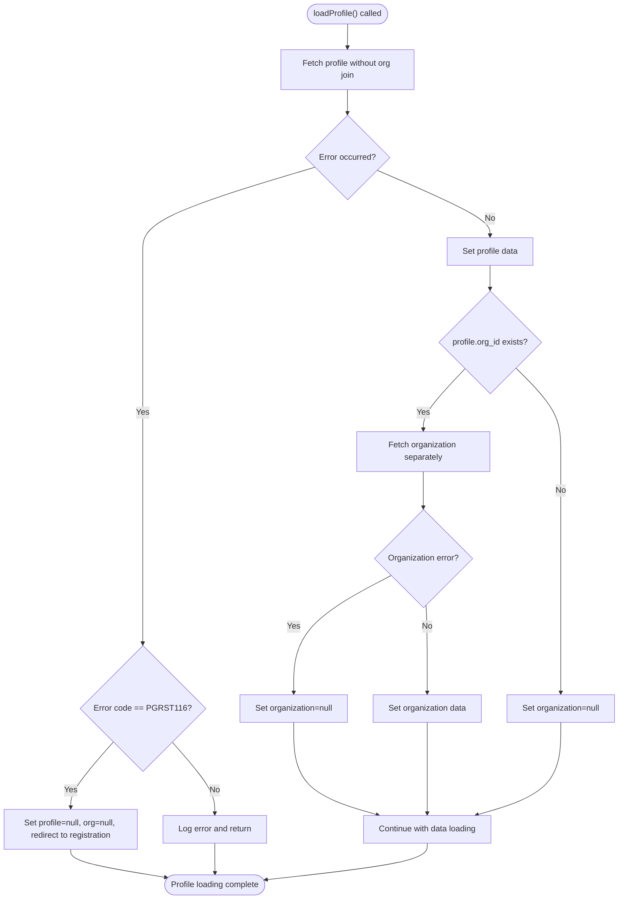

**Diagram sources**
- [store.jsx:121-164](file://src/services/store.jsx#L121-L164)

**Section sources**
- [store.jsx:121-164](file://src/services/store.jsx#L121-L164)

## New User Onboarding Flow

### Enhanced Registration Experience
The registration flow has been significantly improved to better support new users:

- **Dual registration modes**: Supports both new organization creation and joining existing organizations.
- **Organization selection**: Existing users can browse and select from available organizations.
- **Approval workflow**: New member registrations go through an approval process with clear feedback.
- **Improved error handling**: Better handling of edge cases during registration process.

### Registration Components
- **Register.jsx**: Main registration component with dual mode support (new organization vs join existing).
- **ApprovalPending.jsx**: Dedicated page for users awaiting administrator approval.
- **Enhanced registration functions**: registerOrganization and registerMember with comprehensive error handling.

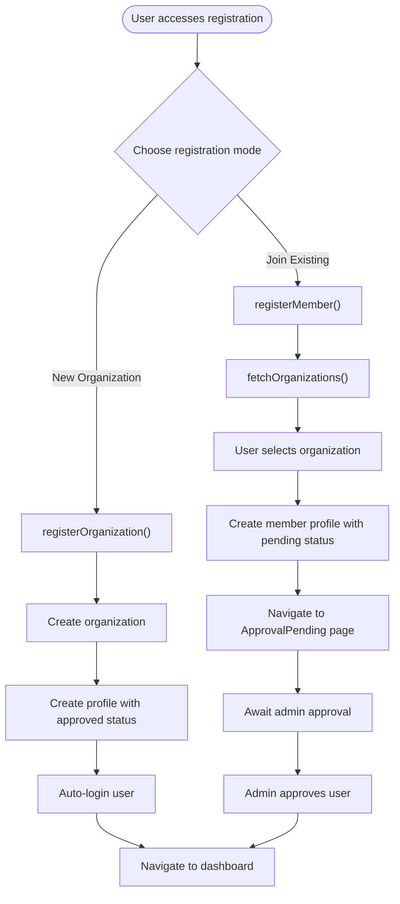

**Diagram sources**
- [Register.jsx:24-45](file://src/pages/Register.jsx#L24-L45)
- [ApprovalPending.jsx:6-13](file://src/pages/ApprovalPending.jsx#L6-L13)
- [store.jsx:290-395](file://src/services/store.jsx#L290-L395)
- [store.jsx:397-450](file://src/services/store.jsx#L397-L450)

**Section sources**
- [Register.jsx:1-160](file://src/pages/Register.jsx#L1-L160)
- [ApprovalPending.jsx:1-47](file://src/pages/ApprovalPending.jsx#L1-L47)
- [store.jsx:290-395](file://src/services/store.jsx#L290-L395)
- [store.jsx:397-450](file://src/services/store.jsx#L397-L450)

## Dependency Analysis
The store depends on Supabase for authentication and data operations. The provider orchestrates initialization, state updates, and data synchronization. Components depend on the store via the useStore hook.

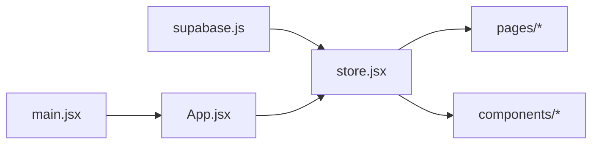

**Diagram sources**
- [supabase.js:1-37](file://src/services/supabase.js#L1-L37)
- [store.jsx:1-4](file://src/services/store.jsx#L1-L4)
- [main.jsx:6-10](file://src/main.jsx#L6-L10)
- [App.jsx](file://src/App.jsx#L11)

**Section sources**
- [supabase.js:1-37](file://src/services/supabase.js#L1-L37)
- [store.jsx:1-4](file://src/services/store.jsx#L1-L4)
- [main.jsx:6-10](file://src/main.jsx#L6-L10)
- [App.jsx](file://src/App.jsx#L11)

## Performance Considerations
- Parallel data loading: The provider uses Promise.all to fetch multiple datasets concurrently, reducing total load time.
- Minimal re-renders: State is split into focused slices, allowing components to subscribe to only the data they need.
- Efficient transformations: Volunteer roles are transformed once during load to avoid repeated computations.
- Auth subscription cleanup: The provider unsubscribes from auth state changes to prevent memory leaks.
- Conditional loading: Organizations are loaded conditionally to reduce unnecessary database queries.
- Error handling optimization: Specific error codes are handled efficiently to prevent cascading failures.

**Updated** Enhanced with conditional organization loading and improved error handling for better performance.

## Troubleshooting Guide
Common issues and resolutions:
- Missing environment variables: Ensure VITE_SUPABASE_URL and VITE_SUPABASE_ANON_KEY are configured in the environment. The Supabase client warns if these are missing.
- Authentication errors: The login action throws errors caught by components; display user-friendly messages and retry logic.
- Profile loading failures: Enhanced error handling prevents HTTP 406 errors; PGRST116 errors are handled as expected for new users.
- Data loading failures: Errors during data fetch are logged to the console; verify network connectivity and Supabase policies.
- Registration issues: New user registration handles both new organization creation and existing organization joining with clear error messages.
- Approval pending state: Users awaiting approval are directed to the ApprovalPending page with clear messaging.
- Logout behavior: The logout action clears profile, organization, and data slices; ensure navigation to landing or login route after logout.

**Updated** Enhanced troubleshooting guidance for new user onboarding and improved error handling scenarios.

**Section sources**
- [.env.example:1-5](file://.env.example#L1-L5)
- [supabase.js:15-21](file://src/services/supabase.js#L15-L21)
- [store.jsx:130-141](file://src/services/store.jsx#L130-L141)
- [store.jsx:174-229](file://src/services/store.jsx#L174-L229)
- [Register.jsx:40-45](file://src/pages/Register.jsx#L40-L45)
- [ApprovalPending.jsx:24-28](file://src/pages/ApprovalPending.jsx#L24-L28)

## Conclusion
RosterFlow's Store Provider architecture leverages React Context and the Provider pattern to centralize authentication and data management. The provider initializes auth state, loads profile and organization with enhanced error handling to prevent HTTP 406 errors, and synchronizes application data in parallel. The enhanced profile loading mechanism provides better support for new user onboarding with conditional organization loading and improved registration workflows. Child components consume context via useStore to access state and dispatch actions. The design promotes clean separation of concerns, predictable state updates, and scalable data operations aligned with Supabase's relational model.

**Updated** Enhanced conclusion reflecting the improved profile loading mechanism, conditional organization loading, and better new user onboarding support.

## Appendices

### Database Schema Overview
The application schema defines tables for organizations, profiles, groups, roles, volunteers, volunteer_roles, events, assignments, and playlists, with Row Level Security policies to enforce organization-scoped access.

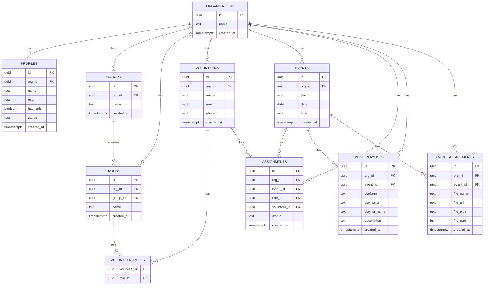

**Diagram sources**
- [supabase-schema.sql:7-76](file://supabase-schema.sql#L7-L76)

**Section sources**
- [supabase-schema.sql:7-76](file://supabase-schema.sql#L7-L76)