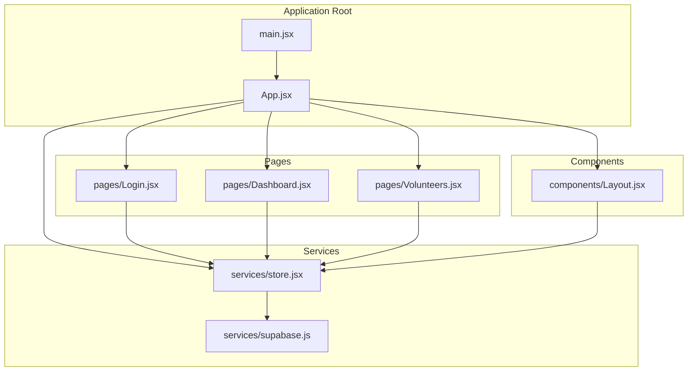
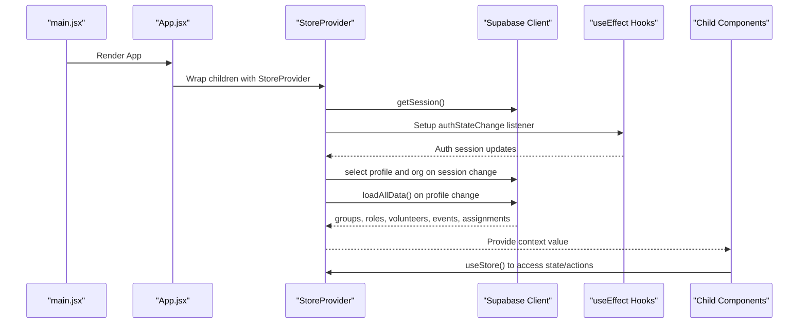
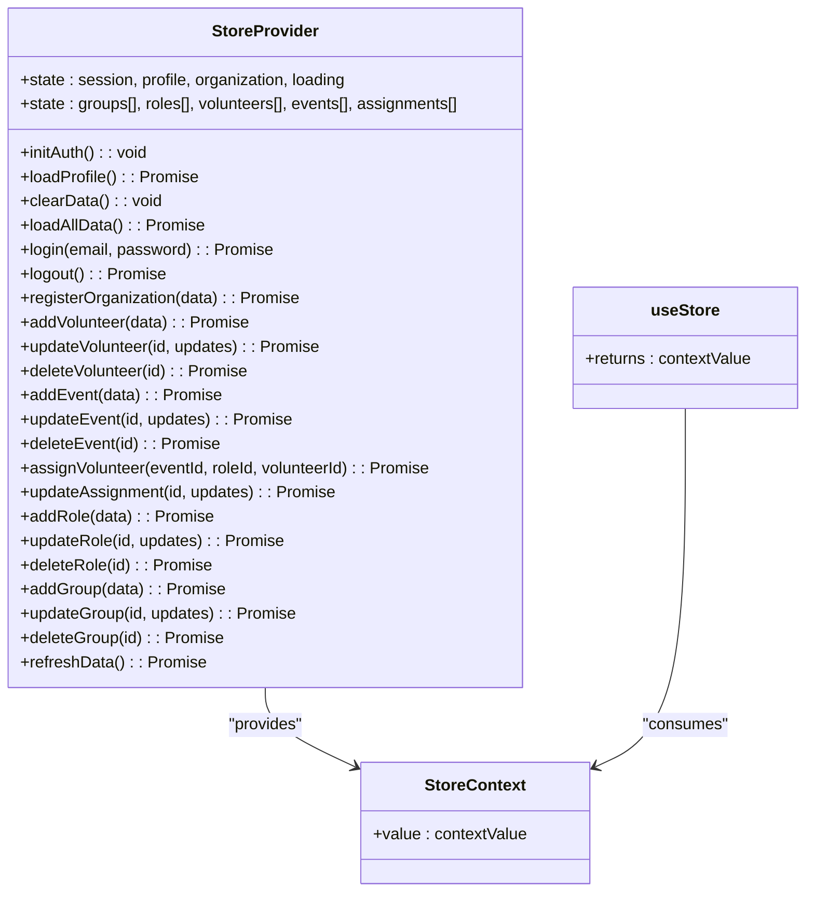
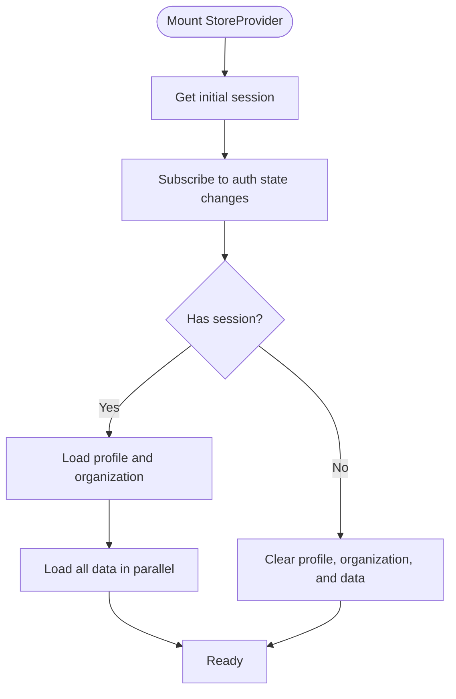
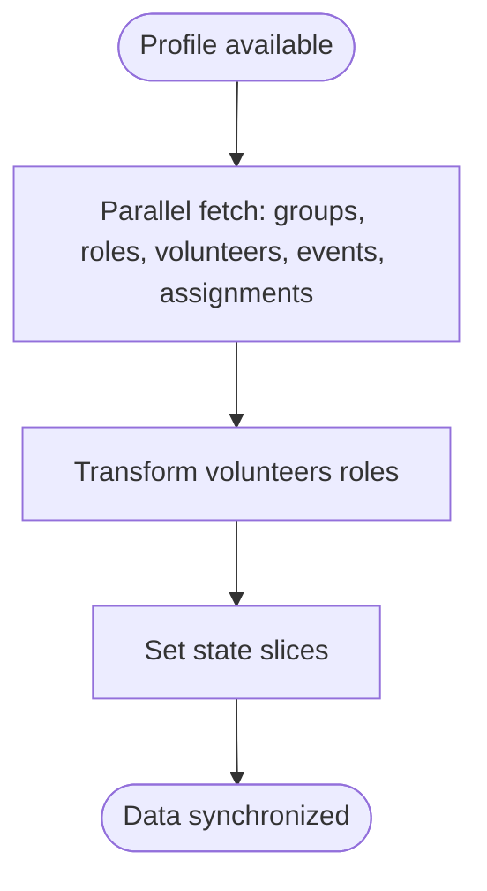
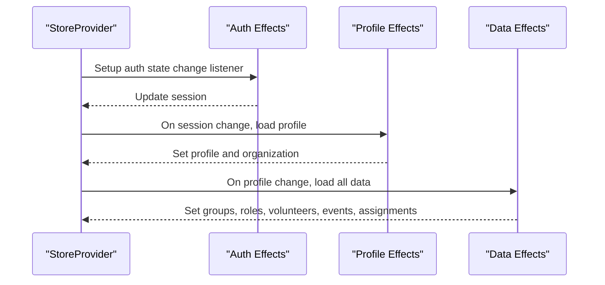
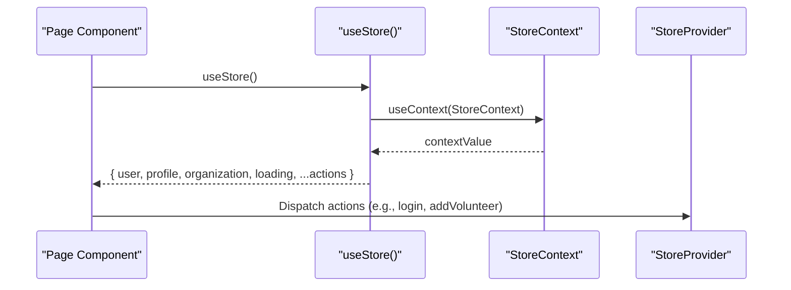
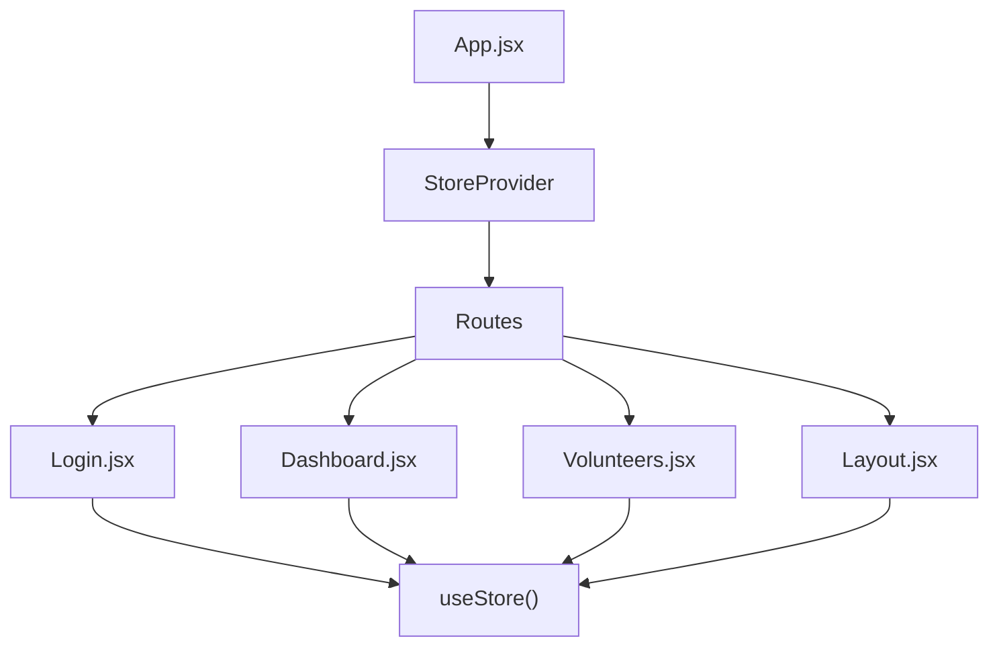
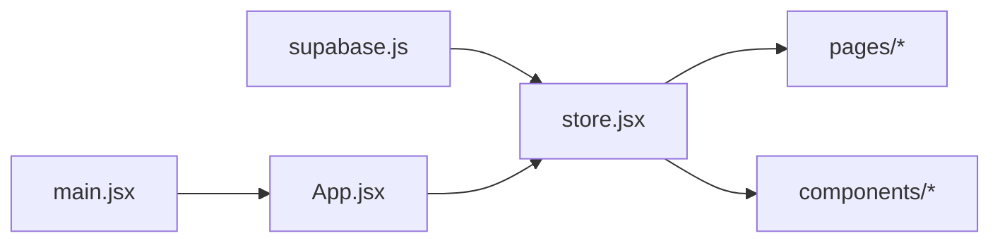
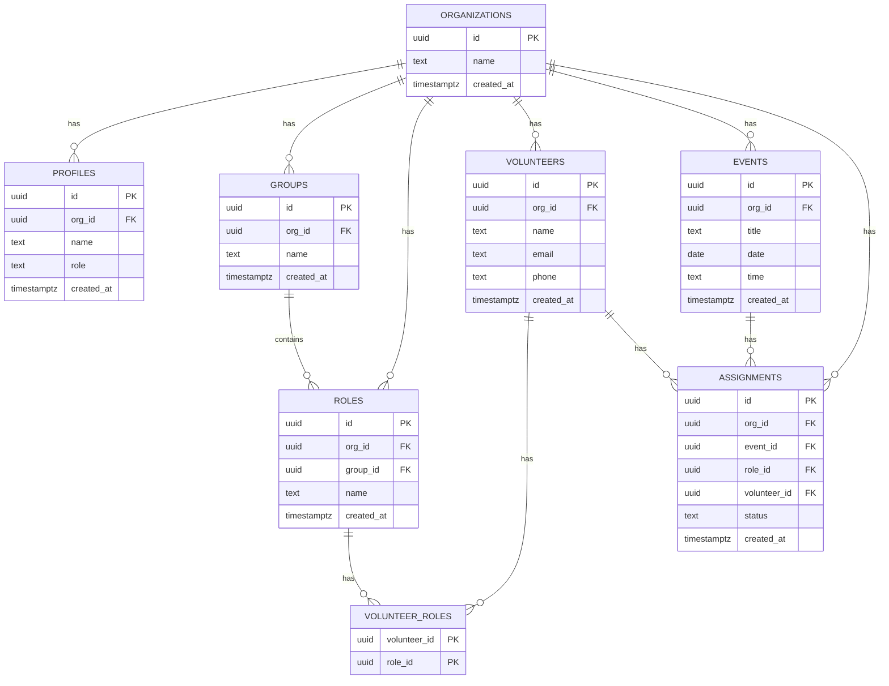

# Store Provider Architecture

<cite>
**Referenced Files in This Document**
- [store.jsx](file://src/services/store.jsx)
- [supabase.js](file://src/services/supabase.js)
- [App.jsx](file://src/App.jsx)
- [main.jsx](file://src/main.jsx)
- [Login.jsx](file://src/pages/Login.jsx)
- [Dashboard.jsx](file://src/pages/Dashboard.jsx)
- [Layout.jsx](file://src/components/Layout.jsx)
- [Volunteers.jsx](file://src/pages/Volunteers.jsx)
- [.env.example](file://.env.example)
- [supabase-schema.sql](file://supabase-schema.sql)
</cite>

## Table of Contents
1. [Introduction](#introduction)
2. [Project Structure](#project-structure)
3. [Core Components](#core-components)
4. [Architecture Overview](#architecture-overview)
5. [Detailed Component Analysis](#detailed-component-analysis)
6. [Dependency Analysis](#dependency-analysis)
7. [Performance Considerations](#performance-considerations)
8. [Troubleshooting Guide](#troubleshooting-guide)
9. [Conclusion](#conclusion)
10. [Appendices](#appendices)

## Introduction
This document explains RosterFlow's Store Provider architecture built on React's Context API. It covers the StoreProvider component that manages global application state, the StoreContext for state sharing, and the Provider pattern that wraps the app tree. The store integrates with Supabase for authentication and data persistence, organizing state into distinct slices for authentication, profiles, organizations, and data entities (groups, roles, volunteers, events, assignments). We detail the initialization process, session management, data loading mechanisms, provider lifecycle hooks, and how child components consume context.

## Project Structure
RosterFlow organizes its store-related code under the services directory, with the main application wiring in App.jsx and component usage across pages and layouts.

**Diagram sources**
- [main.jsx](file://src/main.jsx#L1-L11)
- [App.jsx](file://src/App.jsx#L1-L37)
- [store.jsx](file://src/services/store.jsx#L1-L472)
- [supabase.js](file://src/services/supabase.js#L1-L13)
- [Login.jsx](file://src/pages/Login.jsx#L1-L79)
- [Dashboard.jsx](file://src/pages/Dashboard.jsx#L1-L90)
- [Volunteers.jsx](file://src/pages/Volunteers.jsx#L1-L354)
- [Layout.jsx](file://src/components/Layout.jsx#L1-L102)

**Section sources**
- [main.jsx](file://src/main.jsx#L1-L11)
- [App.jsx](file://src/App.jsx#L1-L37)

## Core Components
- StoreContext: A React Context created with a default value to hold shared state and actions.
- StoreProvider: A component that initializes and manages application-wide state, including authentication, profile, organization, and data entities. It exposes a context value containing both state and action functions.
- useStore: A custom hook that consumers use to access the StoreContext value.

Key responsibilities:
- Authentication state initialization and change listening via Supabase.
- Profile and organization loading upon successful authentication.
- Parallel data loading for groups, roles, volunteers, events, and assignments.
- Action functions for CRUD operations on volunteers, events, assignments, roles, and groups.
- Derived user object for compatibility with existing components.

**Section sources**
- [store.jsx](file://src/services/store.jsx#L1-L472)

## Architecture Overview
The Store Provider architecture follows a Provider pattern with React Context. The provider initializes state, subscribes to authentication changes, loads profile and organization data, and synchronizes application data. Child components consume context using the useStore hook to access state and dispatch actions.

**Diagram sources**
- [main.jsx](file://src/main.jsx#L6-L10)
- [App.jsx](file://src/App.jsx#L13-L34)
- [store.jsx](file://src/services/store.jsx#L21-L52)
- [supabase.js](file://src/services/supabase.js#L1-L13)

## Detailed Component Analysis

### StoreProvider Implementation
The StoreProvider component encapsulates:
- Authentication state: session, profile, organization, and loading flag.
- Data state: arrays for groups, roles, volunteers, events, and assignments.
- Initialization and lifecycle:
  - Retrieves initial session and subscribes to auth state changes.
  - Loads profile and organization when a session exists.
  - Loads all application data in parallel when profile is available.
  - Clears data when user logs out or session ends.
- Action functions:
  - Authentication: login, logout, registerOrganization.
  - Data operations: add/update/delete for volunteers, events, assignments, roles, groups.
  - Utility: refreshData to reload all data.

Context value structure:
- user: derived object combining session user, profile name, and orgId.
- profile, organization, loading: state slices.
- login, logout, registerOrganization: auth actions.
- groups, roles, volunteers, events, assignments: entity slices.
- CRUD actions for each entity slice.
- refreshData: convenience function to reload all data.

**Diagram sources**
- [store.jsx](file://src/services/store.jsx#L6-L472)

**Section sources**
- [store.jsx](file://src/services/store.jsx#L6-L472)

### Authentication State Setup and Session Management
- Initial session retrieval: The provider fetches the current session on mount and sets loading to false.
- Auth state change listener: Subscribes to Supabase auth state changes and updates session accordingly.
- Cleanup: Unsubscribes from the auth subscription when the component unmounts.
- Profile and organization loading: When a session exists, the provider loads the user's profile and organization. On logout or session end, it clears profile, organization, and all data slices.

**Diagram sources**
- [store.jsx](file://src/services/store.jsx#L21-L52)

**Section sources**
- [store.jsx](file://src/services/store.jsx#L21-L52)

### Data Loading Mechanisms
- Parallel loading: The provider uses Promise.all to fetch groups, roles, volunteers, events, and assignments concurrently.
- Volunteer transformation: Volunteers are transformed to include a roles array derived from the volunteer_roles join table for compatibility.
- Ordering: Entities are ordered consistently (names ascending for groups/roles, dates descending for events, timestamps descending for assignments).
- Error handling: Errors for each fetch are logged to the console.

**Diagram sources**
- [store.jsx](file://src/services/store.jsx#L78-L111)

**Section sources**
- [store.jsx](file://src/services/store.jsx#L78-L111)

### State Structure and Slices
The store maintains separate state slices:
- Authentication slice: session, loading.
- Identity slice: user (derived), profile, organization.
- Data entity slices: groups, roles, volunteers, events, assignments.

Each slice corresponds to a Supabase table or a derived transformation. The volunteer slice includes a roles array derived from the volunteer_roles join table.

**Section sources**
- [store.jsx](file://src/services/store.jsx#L8-L18)
- [store.jsx](file://src/services/store.jsx#L98-L104)
- [supabase-schema.sql](file://supabase-schema.sql#L40-L76)

### Provider Lifecycle and useEffect Hooks
- Auth initialization: useEffect retrieves the initial session and subscribes to auth state changes.
- Profile loading: useEffect triggers when session changes; loads profile and organization when a session exists; clears state when not authenticated.
- Data synchronization: useEffect triggers when profile changes; loads all data in parallel.

**Diagram sources**
- [store.jsx](file://src/services/store.jsx#L21-L52)

**Section sources**
- [store.jsx](file://src/services/store.jsx#L21-L52)

### Context Value Structure and Consumption Patterns
The context value exposes:
- State: user, profile, organization, loading, groups, roles, volunteers, events, assignments.
- Actions: authentication functions and CRUD functions for each entity slice.
- Consumers use the useStore hook to access the context value and destructure required fields.

Examples of consumption patterns:
- Login page consumes login and loading to sign in users.
- Dashboard consumes user, volunteers, events, and roles to render statistics.
- Layout consumes user, organization, and logout to manage navigation and authentication state.
- Volunteers page consumes volunteers, roles, groups, and CRUD actions to manage volunteers.

**Diagram sources**
- [store.jsx](file://src/services/store.jsx#L469-L471)
- [Login.jsx](file://src/pages/Login.jsx#L7)
- [Dashboard.jsx](file://src/pages/Dashboard.jsx#L22)
- [Layout.jsx](file://src/components/Layout.jsx#L17)
- [Volunteers.jsx](file://src/pages/Volunteers.jsx#L8)

**Section sources**
- [store.jsx](file://src/services/store.jsx#L432-L460)
- [Login.jsx](file://src/pages/Login.jsx#L7)
- [Dashboard.jsx](file://src/pages/Dashboard.jsx#L22)
- [Layout.jsx](file://src/components/Layout.jsx#L17)
- [Volunteers.jsx](file://src/pages/Volunteers.jsx#L8)

### Proper Provider Wrapping and Context Consumption
- Provider wrapping: The StoreProvider wraps the entire application in App.jsx, ensuring all routes and components have access to the store.
- Context consumption: Components import useStore and destructure the required state and actions for their functionality.

**Diagram sources**
- [App.jsx](file://src/App.jsx#L13-L34)
- [Login.jsx](file://src/pages/Login.jsx#L3)
- [Dashboard.jsx](file://src/pages/Dashboard.jsx#L3)
- [Volunteers.jsx](file://src/pages/Volunteers.jsx#L2)
- [Layout.jsx](file://src/components/Layout.jsx#L5)

**Section sources**
- [App.jsx](file://src/App.jsx#L13-L34)
- [Login.jsx](file://src/pages/Login.jsx#L3)
- [Dashboard.jsx](file://src/pages/Dashboard.jsx#L3)
- [Volunteers.jsx](file://src/pages/Volunteers.jsx#L2)
- [Layout.jsx](file://src/components/Layout.jsx#L5)

## Dependency Analysis
The store depends on Supabase for authentication and data operations. The provider orchestrates initialization, state updates, and data synchronization. Components depend on the store via the useStore hook.

**Diagram sources**
- [supabase.js](file://src/services/supabase.js#L1-L13)
- [store.jsx](file://src/services/store.jsx#L1-L4)
- [main.jsx](file://src/main.jsx#L6-L10)
- [App.jsx](file://src/App.jsx#L11)

**Section sources**
- [supabase.js](file://src/services/supabase.js#L1-L13)
- [store.jsx](file://src/services/store.jsx#L1-L4)
- [main.jsx](file://src/main.jsx#L6-L10)
- [App.jsx](file://src/App.jsx#L11)

## Performance Considerations
- Parallel data loading: The provider uses Promise.all to fetch multiple datasets concurrently, reducing total load time.
- Minimal re-renders: State is split into focused slices, allowing components to subscribe to only the data they need.
- Efficient transformations: Volunteer roles are transformed once during load to avoid repeated computations.
- Auth subscription cleanup: The provider unsubscribes from auth state changes to prevent memory leaks.

## Troubleshooting Guide
Common issues and resolutions:
- Missing environment variables: Ensure VITE_SUPABASE_URL and VITE_SUPABASE_ANON_KEY are configured in the environment. The Supabase client warns if these are missing.
- Authentication errors: The login action throws errors caught by components; display user-friendly messages and retry logic.
- Data loading failures: Errors during data fetch are logged to the console; verify network connectivity and Supabase policies.
- Logout behavior: The logout action clears profile, organization, and data slices; ensure navigation to landing or login route after logout.

**Section sources**
- [.env.example](file://.env.example#L1-L5)
- [supabase.js](file://src/services/supabase.js#L6-L8)
- [store.jsx](file://src/services/store.jsx#L114-L124)
- [store.jsx](file://src/services/store.jsx#L90-L110)

## Conclusion
RosterFlow's Store Provider architecture leverages React Context and the Provider pattern to centralize authentication and data management. The provider initializes auth state, loads profile and organization, and synchronizes application data in parallel. Child components consume context via useStore to access state and dispatch actions. The design promotes clean separation of concerns, predictable state updates, and scalable data operations aligned with Supabase's relational model.

## Appendices

### Database Schema Overview
The application schema defines tables for organizations, profiles, groups, roles, volunteers, volunteer_roles, events, and assignments, with Row Level Security policies to enforce organization-scoped access.

**Diagram sources**
- [supabase-schema.sql](file://supabase-schema.sql#L7-L76)