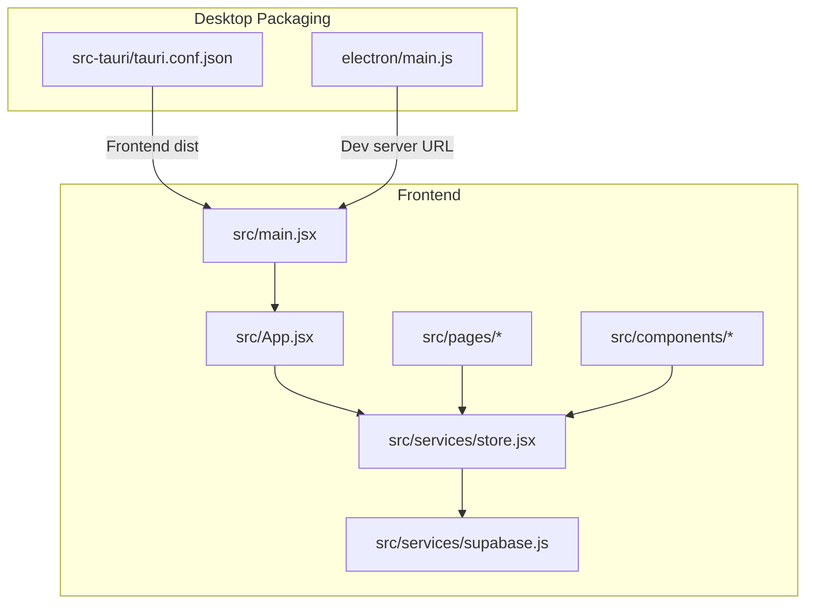
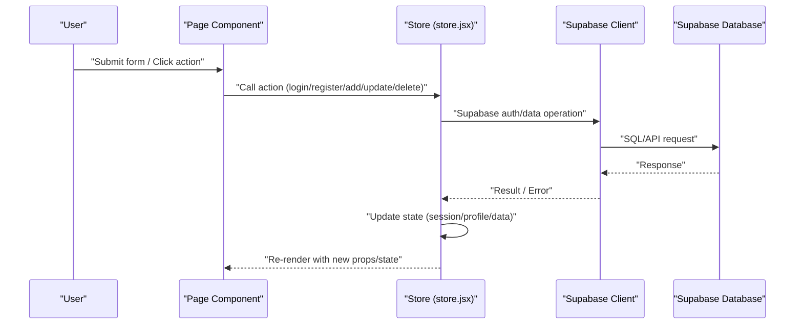
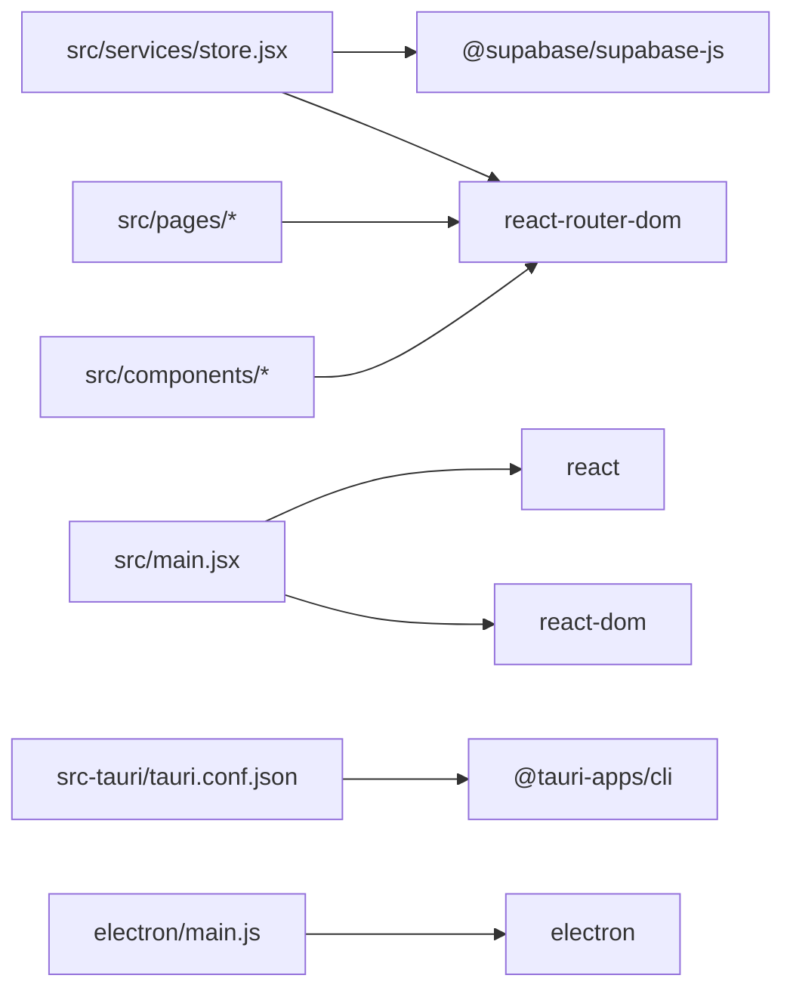

# Troubleshooting & FAQ

<cite>
**Referenced Files in This Document**
- [package.json](file://package.json)
- [.env.example](file://.env.example)
- [src/services/supabase.js](file://src/services/supabase.js)
- [src/services/store.jsx](file://src/services/store.jsx)
- [src/App.jsx](file://src/App.jsx)
- [src/main.jsx](file://src/main.jsx)
- [src/pages/Login.jsx](file://src/pages/Login.jsx)
- [src/pages/Register.jsx](file://src/pages/Register.jsx)
- [src/components/Layout.jsx](file://src/components/Layout.jsx)
- [src/components/AuthLayout.jsx](file://src/components/AuthLayout.jsx)
- [src/pages/Dashboard.jsx](file://src/pages/Dashboard.jsx)
- [src/pages/Volunteers.jsx](file://src/pages/Volunteers.jsx)
- [src/pages/Schedule.jsx](file://src/pages/Schedule.jsx)
- [src/pages/Roles.jsx](file://src/pages/Roles.jsx)
- [supabase-schema.sql](file://supabase-schema.sql)
- [electron/main.js](file://electron/main.js)
- [src-tauri/tauri.conf.json](file://src-tauri/tauri.conf.json)
- [README.md](file://README.md)
</cite>

## Table of Contents
1. [Introduction](#introduction)
2. [Project Structure](#project-structure)
3. [Core Components](#core-components)
4. [Architecture Overview](#architecture-overview)
5. [Detailed Component Analysis](#detailed-component-analysis)
6. [Dependency Analysis](#dependency-analysis)
7. [Performance Considerations](#performance-considerations)
8. [Troubleshooting Guide](#troubleshooting-guide)
9. [Conclusion](#conclusion)
10. [Appendices](#appendices)

## Introduction
This document provides comprehensive troubleshooting guidance and FAQs for RosterFlow. It focuses on installation and setup issues, environment configuration, database connectivity, authentication failures, state management, real-time synchronization, component rendering, performance bottlenecks, error interpretation, platform-specific diagnostics, and security-related issues. It also outlines diagnostic tools, logging strategies, and escalation steps.

## Project Structure
RosterFlow is a React application bundled with Vite and packaged for desktop using Tauri. Authentication and persistence are handled via Supabase. The frontend initializes the Supabase client using Vite environment variables, and the store orchestrates authentication state, real-time subscriptions, and data loading.

**Diagram sources**
- [src/main.jsx](file://src/main.jsx#L1-L11)
- [src/App.jsx](file://src/App.jsx#L1-L37)
- [src/services/supabase.js](file://src/services/supabase.js#L1-L13)
- [src/services/store.jsx](file://src/services/store.jsx#L1-L472)
- [src-tauri/tauri.conf.json](file://src-tauri/tauri.conf.json#L1-L35)
- [electron/main.js](file://electron/main.js#L1-L46)

**Section sources**
- [package.json](file://package.json#L1-L44)
- [README.md](file://README.md#L1-L17)
- [src/main.jsx](file://src/main.jsx#L1-L11)
- [src/App.jsx](file://src/App.jsx#L1-L37)
- [src/services/supabase.js](file://src/services/supabase.js#L1-L13)
- [src/services/store.jsx](file://src/services/store.jsx#L1-L472)
- [src-tauri/tauri.conf.json](file://src-tauri/tauri.conf.json#L1-L35)
- [electron/main.js](file://electron/main.js#L1-L46)

## Core Components
- Supabase client initialization and environment validation
- Centralized store for authentication, profile, organization, and domain data
- Routing and layout with protected routes and navigation
- Feature pages for dashboard, volunteers, schedule, and roles

Key implementation references:
- Supabase client creation and environment checks
- Store initialization of session, profile, organization, and data loaders
- Authenticated route protection and logout flow
- Page-level CRUD operations and modal interactions

**Section sources**
- [src/services/supabase.js](file://src/services/supabase.js#L1-L13)
- [src/services/store.jsx](file://src/services/store.jsx#L1-L472)
- [src/components/Layout.jsx](file://src/components/Layout.jsx#L1-L102)
- [src/pages/Dashboard.jsx](file://src/pages/Dashboard.jsx#L1-L90)
- [src/pages/Volunteers.jsx](file://src/pages/Volunteers.jsx#L1-L354)
- [src/pages/Schedule.jsx](file://src/pages/Schedule.jsx#L1-L731)
- [src/pages/Roles.jsx](file://src/pages/Roles.jsx#L1-L386)

## Architecture Overview
RosterFlow follows a unidirectional data flow:
- UI triggers actions via page components
- Store orchestrates Supabase operations and updates local state
- Real-time subscriptions keep state synchronized
- Protected layouts enforce authentication gating

**Diagram sources**
- [src/pages/Login.jsx](file://src/pages/Login.jsx#L1-L79)
- [src/pages/Register.jsx](file://src/pages/Register.jsx#L1-L100)
- [src/services/store.jsx](file://src/services/store.jsx#L114-L159)
- [src/services/store.jsx](file://src/services/store.jsx#L162-L242)
- [src/services/store.jsx](file://src/services/store.jsx#L244-L292)
- [src/services/store.jsx](file://src/services/store.jsx#L294-L328)
- [src/services/store.jsx](file://src/services/store.jsx#L330-L375)
- [src/services/store.jsx](file://src/services/store.jsx#L377-L422)

## Detailed Component Analysis

### Authentication and Session Management
Common issues:
- Missing or incorrect Supabase environment variables
- Session not persisting across reloads
- Auth state changes not reflected immediately

Diagnostics:
- Verify environment variables are present and correct
- Inspect Supabase client initialization warnings
- Confirm auth state change subscription is active

Resolution steps:
- Populate .env with Supabase URL and anon key
- Ensure environment variables are loaded by Vite during build
- Check that auth state subscription is established and not unsubscribed prematurely

**Section sources**
- [.env.example](file://.env.example#L1-L5)
- [src/services/supabase.js](file://src/services/supabase.js#L3-L10)
- [src/services/store.jsx](file://src/services/store.jsx#L21-L34)
- [src/components/Layout.jsx](file://src/components/Layout.jsx#L19-L23)

### Data Loading and Real-Time Synchronization
Common issues:
- Initial data not loading after login
- Data inconsistencies after edits
- Slow loading of large datasets

Diagnostics:
- Monitor console logs for Supabase errors
- Verify organization ID is present before loading data
- Check parallel data fetches and individual error handling

Resolution steps:
- Ensure profile loads and organization is set before fetching data
- Use centralized loader that handles all tables in parallel
- Add retry logic and user feedback for partial failures

**Section sources**
- [src/services/store.jsx](file://src/services/store.jsx#L37-L52)
- [src/services/store.jsx](file://src/services/store.jsx#L78-L111)

### Component Rendering and Navigation
Common issues:
- Unauthorized access to protected routes
- UI flickering or blank screens during auth transitions
- Navigation not redirecting after logout

Diagnostics:
- Confirm user presence before rendering protected content
- Check navigation guards and redirects
- Validate outlet rendering and layout composition

Resolution steps:
- Enforce route protection in layout component
- Redirect to landing page when user is missing
- Ensure logout clears state and navigates appropriately

**Section sources**
- [src/components/Layout.jsx](file://src/components/Layout.jsx#L19-L30)
- [src/components/AuthLayout.jsx](file://src/components/AuthLayout.jsx#L1-L29)
- [src/App.jsx](file://src/App.jsx#L13-L34)

### CRUD Operations and Forms
Common issues:
- Form submission errors not surfaced clearly
- Partial updates or missing relationships
- CSV import validation failures

Diagnostics:
- Capture thrown errors from store actions
- Validate required fields and relationships
- Inspect CSV parsing and header validation

Resolution steps:
- Display user-friendly error messages
- Normalize data before writes (e.g., volunteer roles)
- Provide clear CSV format expectations

**Section sources**
- [src/pages/Login.jsx](file://src/pages/Login.jsx#L14-L25)
- [src/pages/Register.jsx](file://src/pages/Register.jsx#L16-L27)
- [src/pages/Volunteers.jsx](file://src/pages/Volunteers.jsx#L45-L66)
- [src/pages/Volunteers.jsx](file://src/pages/Volunteers.jsx#L77-L121)

### Desktop Packaging and Bundling
Common issues:
- Dev server URL mismatch in Tauri
- Electron window not loading built assets
- CSP and security policy configuration

Diagnostics:
- Confirm devUrl and frontendDist in Tauri config
- Verify Electron start URL for dev vs prod
- Check CSP settings and window preferences

Resolution steps:
- Align Tauri frontendDist with Vite build output
- Use correct start URL for dev mode
- Adjust CSP and security policies per needs

**Section sources**
- [src-tauri/tauri.conf.json](file://src-tauri/tauri.conf.json#L6-L9)
- [electron/main.js](file://electron/main.js#L18-L22)

## Dependency Analysis
External dependencies and their roles:
- Supabase JS client for auth and database operations
- React Router DOM for routing and navigation
- Tailwind utilities for styling and responsive UI
- Tauri CLI for desktop packaging

**Diagram sources**
- [src/services/store.jsx](file://src/services/store.jsx#L1-L4)
- [src/main.jsx](file://src/main.jsx#L1-L11)
- [package.json](file://package.json#L15-L38)
- [src-tauri/tauri.conf.json](file://src-tauri/tauri.conf.json#L1-L35)
- [electron/main.js](file://electron/main.js#L1-L46)

**Section sources**
- [package.json](file://package.json#L15-L38)
- [src/services/store.jsx](file://src/services/store.jsx#L1-L4)
- [src/main.jsx](file://src/main.jsx#L1-L11)

## Performance Considerations
- Parallel data loading: The store fetches multiple tables concurrently; monitor for network saturation with large datasets.
- UI re-renders: Excessive state updates can cause layout thrashing; consider memoization and controlled re-renders.
- CSV imports: Parsing large files in the browser can block the UI; consider worker threads or chunked processing.
- Desktop builds: Ensure optimized asset bundling and minimize preload overhead.

[No sources needed since this section provides general guidance]

## Troubleshooting Guide

### Installation and Setup
Symptoms:
- Application fails to start or shows blank screen
- Environment variable warnings in console

Checks:
- Confirm .env file exists and contains Supabase URL and anon key
- Verify Vite scripts and environment variable injection
- Ensure dependencies are installed and build artifacts are generated

Resolution:
- Copy .env.example to .env and fill in Supabase credentials
- Run development or build scripts as appropriate
- Reinstall dependencies if needed

**Section sources**
- [.env.example](file://.env.example#L1-L5)
- [package.json](file://package.json#L7-L13)
- [src/services/supabase.js](file://src/services/supabase.js#L3-L10)

### Environment Configuration
Symptoms:
- Supabase client warns about missing environment variables
- Auth operations fail silently

Checks:
- Validate VITE_SUPABASE_URL and VITE_SUPABASE_ANON_KEY
- Confirm environment variables are injected at runtime

Resolution:
- Set environment variables in Vite-compatible format
- Rebuild the app after changes

**Section sources**
- [src/services/supabase.js](file://src/services/supabase.js#L3-L10)

### Database Connectivity
Symptoms:
- Data loading errors logged to console
- Real-time updates not reflected

Checks:
- Inspect Supabase errors returned by store operations
- Verify database schema and RLS policies
- Confirm organization ID is present before queries

Resolution:
- Ensure database is provisioned with the provided schema
- Validate RLS policies and user permissions
- Retry failed operations with user feedback

**Section sources**
- [src/services/store.jsx](file://src/services/store.jsx#L54-L68)
- [src/services/store.jsx](file://src/services/store.jsx#L78-L111)
- [supabase-schema.sql](file://supabase-schema.sql#L1-L251)

### Authentication Failures
Symptoms:
- Login/register throws errors
- User remains unauthorized after successful auth

Checks:
- Capture and display error messages from auth operations
- Verify auth state subscription and session retrieval
- Confirm logout clears state and navigates properly

Resolution:
- Present user-friendly error messages
- Ensure auth state subscription is active
- Clear local state on sign-out

**Section sources**
- [src/pages/Login.jsx](file://src/pages/Login.jsx#L14-L25)
- [src/pages/Register.jsx](file://src/pages/Register.jsx#L16-L27)
- [src/services/store.jsx](file://src/services/store.jsx#L21-L34)
- [src/services/store.jsx](file://src/services/store.jsx#L119-L124)
- [src/components/Layout.jsx](file://src/components/Layout.jsx#L27-L30)

### State Management Issues
Symptoms:
- UI does not reflect recent changes
- Data appears inconsistent across components

Checks:
- Verify that store updates are triggered after DB writes
- Confirm derived user object and organization presence
- Ensure refreshData is called after mutations

Resolution:
- Call centralized data refresh after mutations
- Normalize data transformations (e.g., volunteer roles)
- Debounce frequent updates to avoid thrashing

**Section sources**
- [src/services/store.jsx](file://src/services/store.jsx#L196-L228)
- [src/services/store.jsx](file://src/services/store.jsx#L244-L292)
- [src/services/store.jsx](file://src/services/store.jsx#L424-L430)

### Real-Time Synchronization Problems
Symptoms:
- Changes made by other users not visible immediately
- Stale data after long idle periods

Checks:
- Confirm auth state subscription is active
- Verify that refreshData is invoked after mutations
- Test with multiple browser tabs

Resolution:
- Keep auth subscription alive and reconnect on changes
- Manually refresh data periodically if needed

**Section sources**
- [src/services/store.jsx](file://src/services/store.jsx#L28-L34)
- [src/services/store.jsx](file://src/services/store.jsx#L48-L52)

### Component Rendering Errors
Symptoms:
- Protected routes render blank
- Navigation fails after logout

Checks:
- Ensure user presence before rendering protected content
- Validate navigation guards and redirects
- Confirm outlet rendering and layout composition

Resolution:
- Redirect to landing page when user is missing
- Ensure logout clears state and navigates appropriately

**Section sources**
- [src/components/Layout.jsx](file://src/components/Layout.jsx#L19-L30)

### Performance Troubleshooting
Symptoms:
- Slow queries and UI freezes
- Memory growth over time

Checks:
- Profile network requests and identify slow endpoints
- Monitor UI responsiveness during bulk operations
- Audit CSV import and large table renders

Resolution:
- Optimize queries and limit result sets
- Implement pagination or virtualization
- Offload heavy work to workers or backend

**Section sources**
- [src/pages/Volunteers.jsx](file://src/pages/Volunteers.jsx#L77-L121)
- [src/pages/Schedule.jsx](file://src/pages/Schedule.jsx#L193-L230)

### Error Message Interpretation and Resolution
Common categories:
- Authentication errors: Validate credentials and session state
- Database errors: Inspect returned error objects and RLS policies
- Network errors: Check connectivity and Supabase project status

Resolution strategies:
- Log error messages with context
- Provide actionable user feedback
- Suggest checking environment variables and database setup

**Section sources**
- [src/services/store.jsx](file://src/services/store.jsx#L114-L117)
- [src/services/store.jsx](file://src/services/store.jsx#L162-L194)
- [src/services/store.jsx](file://src/services/store.jsx#L244-L292)

### Platform-Specific Troubleshooting

- Web browsers
  - Symptom: Blank screen or environment warnings
  - Checks: Console for environment errors, network tab for blocked requests
  - Resolution: Fix .env variables and CORS settings

- Mobile devices
  - Symptom: Touch interactions sluggish
  - Checks: Device performance, network speed
  - Resolution: Reduce DOM complexity, optimize images

- Desktop applications (Tauri)
  - Symptom: Dev URL mismatch or CSP issues
  - Checks: Tauri config devUrl and frontendDist
  - Resolution: Align paths and adjust CSP/security policies

- Desktop applications (Electron)
  - Symptom: Window not loading built assets
  - Checks: Start URL for dev/prod, preload script
  - Resolution: Use correct start URL and disable remote module

**Section sources**
- [src-tauri/tauri.conf.json](file://src-tauri/tauri.conf.json#L6-L9)
- [electron/main.js](file://electron/main.js#L18-L22)

### Diagnostic Tools and Logging Strategies
Recommended practices:
- Use browser DevTools to inspect network requests and console logs
- Add structured logging around store operations
- Capture error boundaries for unhandled exceptions
- Monitor Supabase dashboard for rate limits and anomalies

**Section sources**
- [src/services/store.jsx](file://src/services/store.jsx#L54-L68)
- [src/services/store.jsx](file://src/services/store.jsx#L78-L111)

### Security-Related Troubleshooting
Common issues:
- Permission denied errors
- Unexpected data visibility
- Role-based access violations

Checks:
- Review RLS policies and user roles
- Verify organization-scoped queries
- Confirm profile and org_id presence

Resolution:
- Align RLS policies with application logic
- Restrict queries to user’s organization
- Ensure profile loads before data access

**Section sources**
- [supabase-schema.sql](file://supabase-schema.sql#L78-L224)
- [src/services/store.jsx](file://src/services/store.jsx#L37-L52)

### Community Resources, Support Channels, and Escalation
- For general questions, open an issue in the repository
- For database-specific issues, consult Supabase documentation and community forums
- For desktop packaging, refer to Tauri and Electron documentation

[No sources needed since this section provides general guidance]

## Conclusion
This guide consolidates practical troubleshooting steps for RosterFlow across installation, environment configuration, authentication, data access, real-time synchronization, performance, platform specifics, and security. By following the diagnostics and resolutions outlined above, most issues can be identified and resolved efficiently.

## Appendices

### Quick Checklist
- [ ] .env configured with Supabase URL and anon key
- [ ] Supabase database provisioned with provided schema
- [ ] RLS policies aligned with application logic
- [ ] Auth state subscription active
- [ ] Data refresh invoked after mutations
- [ ] Desktop config paths match build output
- [ ] Network and console inspected for errors

[No sources needed since this section provides general guidance]