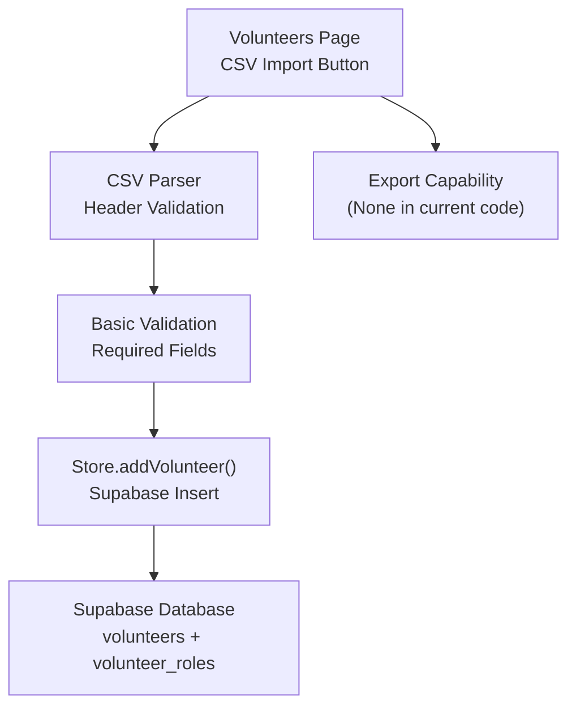
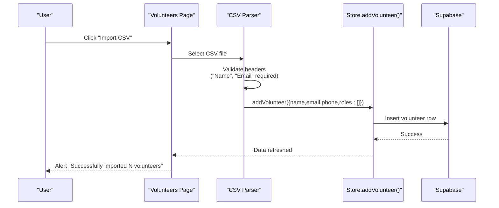
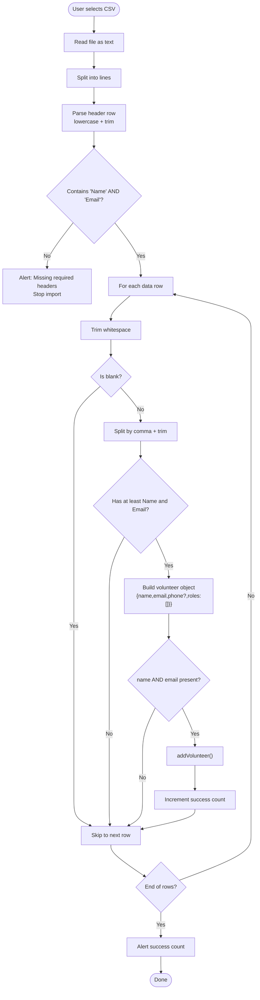
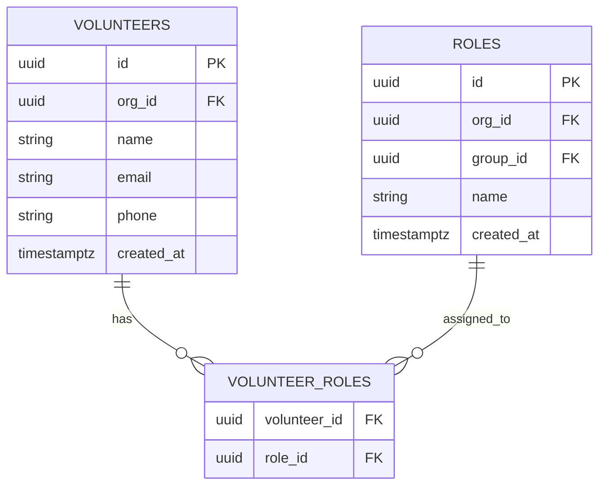
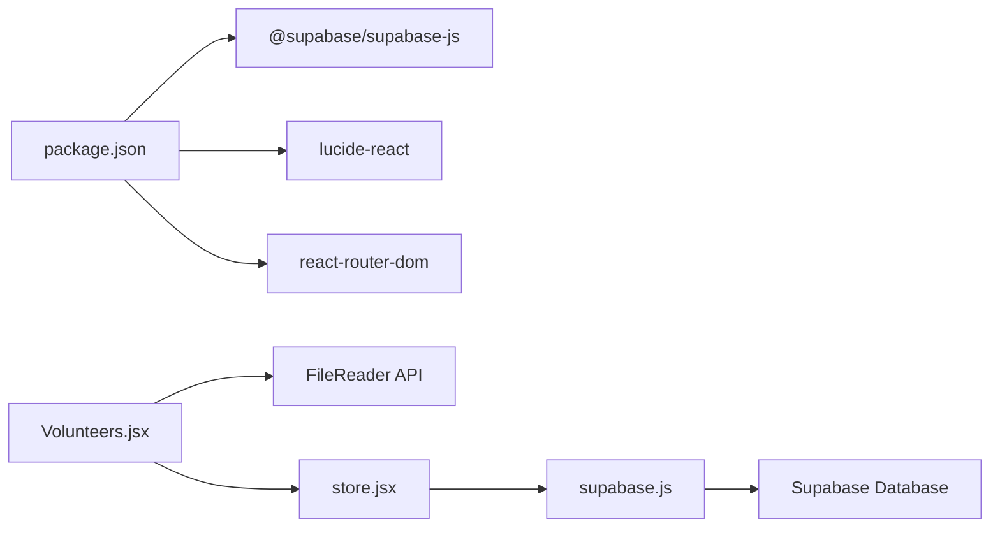

# CSV Import & Export

<cite>
**Referenced Files in This Document**
- [Volunteers.jsx](file://src/pages/Volunteers.jsx)
- [store.jsx](file://src/services/store.jsx)
- [supabase.js](file://src/services/supabase.js)
- [supabase-schema.sql](file://supabase-schema.sql)
- [package.json](file://package.json)
</cite>

## Table of Contents
1. [Introduction](#introduction)
2. [Project Structure](#project-structure)
3. [Core Components](#core-components)
4. [Architecture Overview](#architecture-overview)
5. [Detailed Component Analysis](#detailed-component-analysis)
6. [Dependency Analysis](#dependency-analysis)
7. [Performance Considerations](#performance-considerations)
8. [Troubleshooting Guide](#troubleshooting-guide)
9. [Conclusion](#conclusion)
10. [Appendices](#appendices)

## Introduction
This document explains the CSV import and export functionality for volunteer records. It covers supported file formats, required and optional fields, parsing logic, validation rules, error handling, success feedback, and export capabilities. It also provides examples of properly formatted CSV files, common import scenarios, limitations, and best practices for bulk volunteer operations.

## Project Structure
The CSV import feature is implemented in the Volunteers page. The application persists data via Supabase, and the store orchestrates data loading and mutations. The database schema defines the underlying structure for volunteers and related entities.

**Diagram sources**
- [Volunteers.jsx](file://src/pages/Volunteers.jsx#L77-L121)
- [store.jsx](file://src/services/store.jsx#L161-L194)
- [supabase.js](file://src/services/supabase.js#L1-L13)
- [supabase-schema.sql](file://supabase-schema.sql#L40-L55)

**Section sources**
- [Volunteers.jsx](file://src/pages/Volunteers.jsx#L1-L354)
- [store.jsx](file://src/services/store.jsx#L1-L472)
- [supabase.js](file://src/services/supabase.js#L1-L13)
- [supabase-schema.sql](file://supabase-schema.sql#L1-L251)

## Core Components
- CSV Import UI and Parser
  - Trigger: Import CSV button opens a file dialog.
  - Parser: Reads the selected CSV file and splits into lines and fields.
  - Header validation: Requires "Name" and "Email" headers; "Phone" is optional.
  - Validation: Skips rows without required fields; creates volunteer records with default empty roles.
  - Feedback: Alerts the user with the number of successfully imported volunteers.
- Store and Persistence
  - The store’s addVolunteer function inserts volunteers into Supabase and refreshes data.
  - The database schema defines the volunteers table and volunteer_roles junction table.

**Section sources**
- [Volunteers.jsx](file://src/pages/Volunteers.jsx#L77-L121)
- [store.jsx](file://src/services/store.jsx#L161-L194)
- [supabase-schema.sql](file://supabase-schema.sql#L40-L55)

## Architecture Overview
The CSV import pipeline is client-side for the UI and server-side via Supabase for persistence. The flow is:

**Diagram sources**
- [Volunteers.jsx](file://src/pages/Volunteers.jsx#L77-L121)
- [store.jsx](file://src/services/store.jsx#L161-L194)
- [supabase.js](file://src/services/supabase.js#L1-L13)

## Detailed Component Analysis

### CSV Import Pipeline
- Supported file format
  - .csv (comma-separated values)
- Required headers
  - "Name" and "Email" (case-insensitive)
- Optional fields
  - "Phone" (if present, included in the record)
- Parsing logic
  - Reads the file as text.
  - Splits into lines and trims whitespace.
  - Parses header row and determines indices for "Name", "Email", and optionally "Phone".
  - Iterates rows, splits by comma, trims values, and constructs a volunteer object.
  - Validates that both "Name" and "Email" are present before importing.
  - Imports each valid row into the store.
  - Provides success feedback with a count of imported records.
- Error handling
  - If required headers are missing, alerts the user and stops processing.
  - Skips blank lines and rows with insufficient fields.
  - On insertion errors, the store logs and throws an error; the UI remains responsive for subsequent imports.

**Diagram sources**
- [Volunteers.jsx](file://src/pages/Volunteers.jsx#L77-L121)

**Section sources**
- [Volunteers.jsx](file://src/pages/Volunteers.jsx#L77-L121)

### Data Model and Persistence
- Volunteers table
  - Columns: id, org_id, name, email, phone, created_at
  - Organization scoping via org_id enforced by Supabase policies and triggers
- Volunteer-Roles relationship
  - Junction table volunteer_roles links volunteers to roles
- Store operations
  - addVolunteer inserts a volunteer and optionally inserts role relationships
  - updateVolunteer and deleteVolunteer manage lifecycle
  - loadAllData fetches groups, roles, volunteers, events, assignments in parallel

**Diagram sources**
- [supabase-schema.sql](file://supabase-schema.sql#L40-L55)
- [supabase-schema.sql](file://supabase-schema.sql#L50-L55)

**Section sources**
- [store.jsx](file://src/services/store.jsx#L161-L242)
- [supabase-schema.sql](file://supabase-schema.sql#L40-L55)

### Export Functionality
- Current state
  - There is no built-in export feature for volunteer data in the current codebase.
- Available data
  - The store exposes a refreshData method and loads volunteers from Supabase; however, exporting to CSV is not implemented.
- Workaround
  - Users can view volunteers in the UI and copy data manually, or use external tools to export from the web app if supported by the browser.

**Section sources**
- [store.jsx](file://src/services/store.jsx#L459-L460)
- [Volunteers.jsx](file://src/pages/Volunteers.jsx#L123-L244)

## Dependency Analysis
- Frontend dependencies
  - @supabase/supabase-js: Client library for Supabase
  - lucide-react: Icons for UI
  - react-router-dom: Routing
- CSV import relies on:
  - FileReader API (browser native)
  - DOM input[type=file] and hidden file input
  - Store.addVolunteer for persistence

**Diagram sources**
- [package.json](file://package.json#L15-L24)
- [Volunteers.jsx](file://src/pages/Volunteers.jsx#L1-L354)
- [store.jsx](file://src/services/store.jsx#L1-L472)
- [supabase.js](file://src/services/supabase.js#L1-L13)

**Section sources**
- [package.json](file://package.json#L15-L24)
- [Volunteers.jsx](file://src/pages/Volunteers.jsx#L1-L354)
- [store.jsx](file://src/services/store.jsx#L1-L472)
- [supabase.js](file://src/services/supabase.js#L1-L13)

## Performance Considerations
- Client-side parsing
  - CSV parsing runs in the browser; very large files may cause UI blocking or memory pressure.
  - Recommendation: Keep CSV files reasonably sized (e.g., under 1000 rows) to avoid delays.
- Supabase writes
  - Each volunteer import triggers a separate insert; for large batches, consider batching or server-side import to reduce round trips.
- Rendering
  - After import, the store reloads data. For very large datasets, expect a brief delay while lists re-render.

[No sources needed since this section provides general guidance]

## Troubleshooting Guide
- Missing required headers
  - Symptom: Import fails immediately with an alert indicating missing "Name" and/or "Email".
  - Resolution: Ensure the first row contains "Name" and "Email" (case-insensitive).
- Malformed CSV
  - Symptom: Some rows are skipped; success count lower than expected.
  - Resolution: Verify each row has at least Name and Email; extra commas are fine; blank lines are ignored.
- Partial fields
  - Symptom: Rows with only "Name" or only "Email" are ignored.
  - Resolution: Provide both required fields for each row.
- Phone field
  - Symptom: Phone appears empty even when present in CSV.
  - Resolution: "Phone" is optional; it is only used if the "Phone" header exists and has a value in the row.
- Supabase errors
  - Symptom: Errors logged to console during addVolunteer.
  - Resolution: Check environment variables for Supabase URL and anon key; ensure network connectivity and Supabase policies allow inserts.

**Section sources**
- [Volunteers.jsx](file://src/pages/Volunteers.jsx#L77-L121)
- [store.jsx](file://src/services/store.jsx#L161-L194)
- [supabase.js](file://src/services/supabase.js#L6-L8)

## Conclusion
The CSV import feature supports a simple, robust workflow for bulk volunteer creation with clear validation and immediate feedback. While there is no built-in export capability, the underlying data model and store operations are well-defined for future enhancements. For best results, follow the field requirements and keep files reasonably sized.

[No sources needed since this section summarizes without analyzing specific files]

## Appendices

### Example CSV Formats
- Minimal valid CSV
  - Header: Name,Email
  - Example rows:
    - John Doe,john@example.com
    - Jane Smith,jane@example.com
- CSV with optional Phone
  - Header: Name,Email,Phone
  - Example rows:
    - John Doe,john@example.com,555-1234
    - Jane Smith,jane@example.com,555-5678

### Common Import Scenarios
- Bulk onboarding
  - Prepare a CSV with Name and Email; import to quickly add volunteers.
- Adding contact info
  - Include Phone in the CSV to populate phone numbers alongside Name and Email.
- Skipping invalid rows
  - Rows missing either Name or Email are ignored; ensure data hygiene before import.

### Best Practices for Bulk Operations
- Validate CSV externally (e.g., spreadsheet tools) to ensure required fields are present.
- Keep files under 1000 rows for smooth client-side parsing.
- Use a single import per file to minimize UI churn; review the success alert before proceeding.
- For enterprise-scale imports, consider server-side batch processing to reduce client overhead.

[No sources needed since this section provides general guidance]