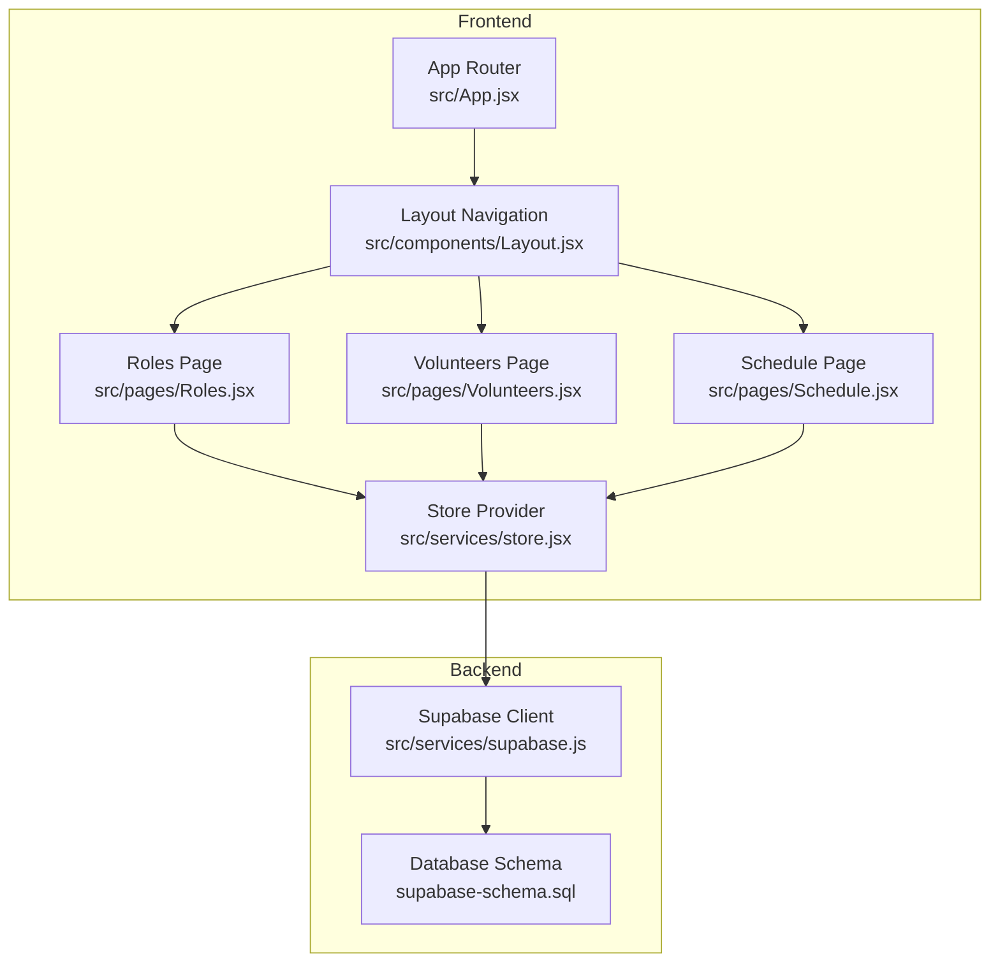
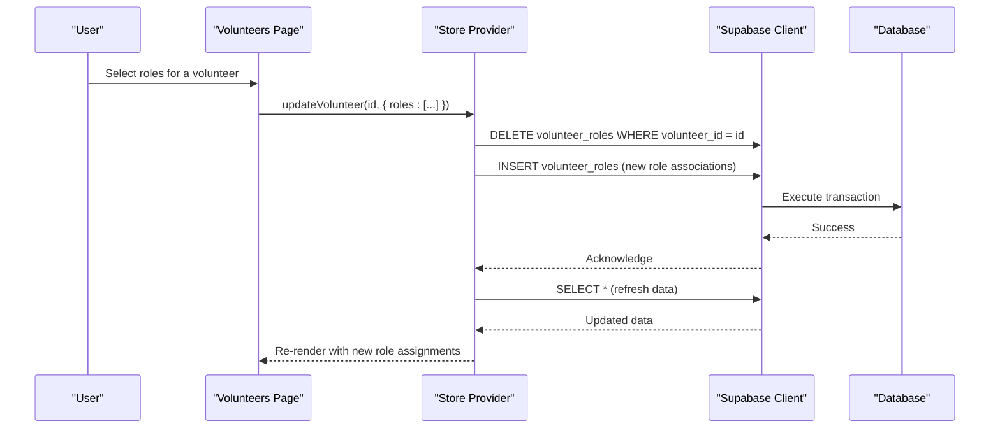
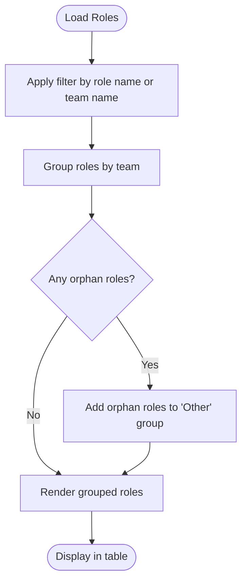
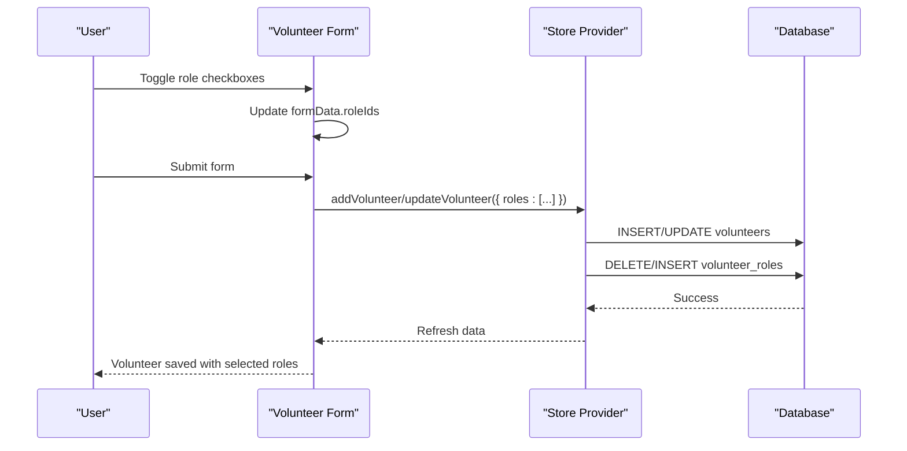
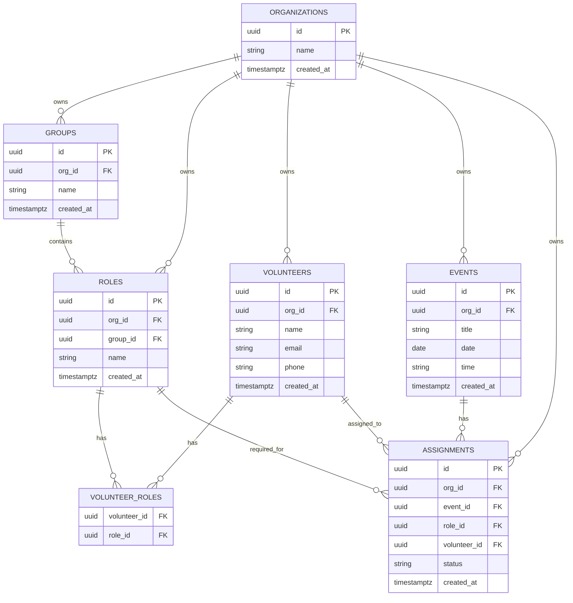
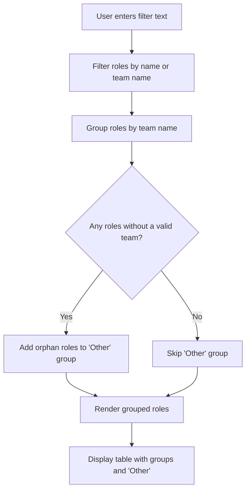
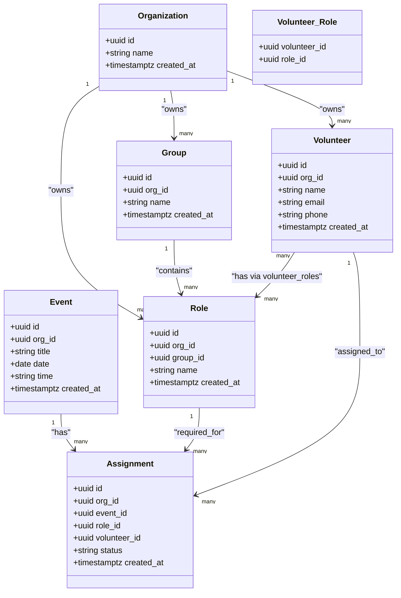
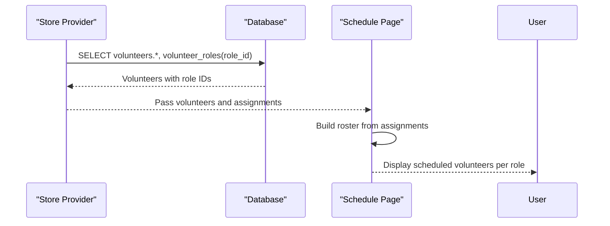
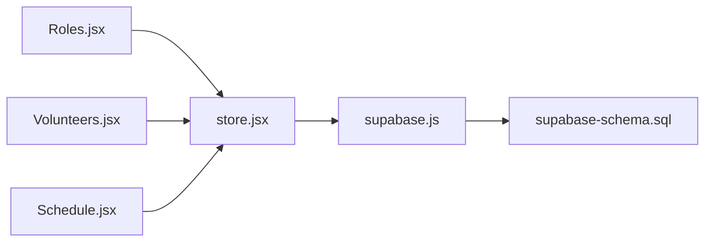

# Role Assignment System

<cite>
**Referenced Files in This Document**
- [Roles.jsx](file://src/pages/Roles.jsx)
- [Volunteers.jsx](file://src/pages/Volunteers.jsx)
- [store.jsx](file://src/services/store.jsx)
- [supabase.js](file://src/services/supabase.js)
- [supabase-schema.sql](file://supabase-schema.sql)
- [Schedule.jsx](file://src/pages/Schedule.jsx)
- [Layout.jsx](file://src/components/Layout.jsx)
- [App.jsx](file://src/App.jsx)
</cite>

## Table of Contents
1. [Introduction](#introduction)
2. [Project Structure](#project-structure)
3. [Core Components](#core-components)
4. [Architecture Overview](#architecture-overview)
5. [Detailed Component Analysis](#detailed-component-analysis)
6. [Dependency Analysis](#dependency-analysis)
7. [Performance Considerations](#performance-considerations)
8. [Troubleshooting Guide](#troubleshooting-guide)
9. [Conclusion](#conclusion)

## Introduction
This document explains the volunteer role assignment system used to organize ministry structure and manage volunteer scheduling. It covers how volunteers can be assigned multiple roles across different ministry groups, how roles are displayed hierarchically, and how role assignments are managed during volunteer creation and editing. It also documents the filtering and grouping logic for roles, the underlying data model, and how role assignments affect volunteer visibility and scheduling permissions.

## Project Structure
The role assignment system spans several frontend components and a Supabase backend:
- Frontend pages: Roles management, Volunteers management, Schedule management
- Store layer: Centralized state and Supabase integration
- Database schema: Defines the many-to-many relationship between volunteers and roles

**Diagram sources**
- [App.jsx](file://src/App.jsx#L13-L34)
- [Layout.jsx](file://src/components/Layout.jsx#L7-L12)
- [Roles.jsx](file://src/pages/Roles.jsx#L6-L7)
- [Volunteers.jsx](file://src/pages/Volunteers.jsx#L8)
- [Schedule.jsx](file://src/pages/Schedule.jsx#L8)
- [store.jsx](file://src/services/store.jsx#L6-L467)
- [supabase.js](file://src/services/supabase.js#L1-L13)
- [supabase-schema.sql](file://supabase-schema.sql#L1-L251)

**Section sources**
- [App.jsx](file://src/App.jsx#L13-L34)
- [Layout.jsx](file://src/components/Layout.jsx#L7-L12)

## Core Components
- Roles management page: Allows creating, editing, and deleting roles and groups (teams). Roles can be grouped under groups and orphaned roles (without a group) are supported.
- Volunteers management page: Allows creating/editing volunteers and selecting multiple roles via a checkbox interface grouped by team.
- Store provider: Centralizes data fetching, mutations, and synchronization with Supabase, including transforming volunteer-role relationships.
- Database schema: Defines organizations, groups, roles, volunteers, assignments, and the volunteer_roles junction table for many-to-many relationships.

**Section sources**
- [Roles.jsx](file://src/pages/Roles.jsx#L6-L113)
- [Volunteers.jsx](file://src/pages/Volunteers.jsx#L7-L354)
- [store.jsx](file://src/services/store.jsx#L78-L111)
- [supabase-schema.sql](file://supabase-schema.sql#L23-L55)

## Architecture Overview
The system follows a client-side state management pattern with Supabase as the backend:
- Components consume data from the store.
- Store loads data from Supabase and transforms it for UI consumption.
- Mutations (add/update/delete) are performed against Supabase and then reload data to keep the UI synchronized.

**Diagram sources**
- [Volunteers.jsx](file://src/pages/Volunteers.jsx#L45-L66)
- [store.jsx](file://src/services/store.jsx#L196-L228)
- [supabase.js](file://src/services/supabase.js#L10)
- [supabase-schema.sql](file://supabase-schema.sql#L50-L55)

## Detailed Component Analysis

### Roles Management: Hierarchical Display and Filtering
- Filtering: The roles list supports searching by role name or team name.
- Grouping: Roles are grouped by their associated group; orphan roles (those without a valid group) are shown under an "Other" group.
- Actions: Roles can be edited or deleted; groups can be managed separately.

**Diagram sources**
- [Roles.jsx](file://src/pages/Roles.jsx#L23-L41)

**Section sources**
- [Roles.jsx](file://src/pages/Roles.jsx#L21-L41)

### Volunteers Management: Checkbox-Based Role Assignment
- Role selection: During volunteer creation/editing, roles are presented in a grid grouped by team. Each role has a checkbox; selecting multiple roles assigns them to the volunteer.
- Orphan roles: Roles without a team are shown under an "Other" section.
- Data binding: The form state maintains an array of selected role IDs, which are persisted to the volunteer record.

**Diagram sources**
- [Volunteers.jsx](file://src/pages/Volunteers.jsx#L68-L75)
- [Volunteers.jsx](file://src/pages/Volunteers.jsx#L45-L66)
- [store.jsx](file://src/services/store.jsx#L161-L194)
- [store.jsx](file://src/services/store.jsx#L196-L228)

**Section sources**
- [Volunteers.jsx](file://src/pages/Volunteers.jsx#L285-L332)
- [Volunteers.jsx](file://src/pages/Volunteers.jsx#L68-L75)

### Data Model: Volunteers, Roles, Groups, and Assignments
The system uses a many-to-many relationship between volunteers and roles via a junction table:
- organizations: Tenant isolation
- groups: Ministry teams
- roles: Specific positions within groups
- volunteers: Individuals
- volunteer_roles: Junction table linking volunteers to roles
- assignments: Links events, roles, and volunteers for scheduling

**Diagram sources**
- [supabase-schema.sql](file://supabase-schema.sql#L7-L76)

**Section sources**
- [supabase-schema.sql](file://supabase-schema.sql#L23-L55)

### Role Filtering and Grouping Logic
- Filtering: Roles are filtered by role name or the associated group's name.
- Grouping: Roles are grouped by team name; orphan roles (no group or invalid group) are aggregated under "Other".
- Rendering: The UI iterates through groups and renders role rows, followed by an "Other" section if needed.

**Diagram sources**
- [Roles.jsx](file://src/pages/Roles.jsx#L23-L41)

**Section sources**
- [Roles.jsx](file://src/pages/Roles.jsx#L23-L41)

### Relationship Between Volunteers, Roles, and Groups
- Volunteers belong to an organization and can have zero or more roles.
- Roles belong to an organization and optionally belong to a group.
- The junction table volunteer_roles stores the many-to-many mapping between volunteers and roles.
- Scheduling uses assignments to connect events, roles, and volunteers.

**Diagram sources**
- [supabase-schema.sql](file://supabase-schema.sql#L7-L76)

**Section sources**
- [supabase-schema.sql](file://supabase-schema.sql#L23-L76)

### How Role Assignments Affect Visibility and Scheduling Permissions
- Visibility: The store loads volunteers with their role IDs resolved from the volunteer_roles junction table, ensuring the UI displays accurate role assignments.
- Scheduling: Assignments link events, roles, and volunteers. The schedule page uses these relationships to render rosters and send emails to assigned volunteers.

**Diagram sources**
- [store.jsx](file://src/services/store.jsx#L82-L111)
- [store.jsx](file://src/services/store.jsx#L98-L103)
- [Schedule.jsx](file://src/pages/Schedule.jsx#L27-L29)

**Section sources**
- [store.jsx](file://src/services/store.jsx#L82-L111)
- [store.jsx](file://src/services/store.jsx#L98-L103)
- [Schedule.jsx](file://src/pages/Schedule.jsx#L27-L29)

### Common Role Assignment Scenarios and Best Practices
- Scenario: Assign multiple roles to a single volunteer
  - Use the checkbox interface in the volunteer editor to select multiple roles across different teams.
  - Save the form to persist the many-to-many relationships via the junction table.
- Scenario: Reorganize ministry structure
  - Create or edit groups (teams) in the Roles area.
  - Move roles between groups; orphan roles appear under "Other" until reassigned.
- Scenario: Prepare for scheduling
  - Ensure volunteers have the appropriate roles assigned so they appear in relevant scheduling views.
  - Use the schedule page to assign volunteers to specific roles for events.

**Section sources**
- [Volunteers.jsx](file://src/pages/Volunteers.jsx#L285-L332)
- [Roles.jsx](file://src/pages/Roles.jsx#L28-L41)
- [Schedule.jsx](file://src/pages/Schedule.jsx#L37-L49)

## Dependency Analysis
The system exhibits clear separation of concerns:
- Pages depend on the store for data and actions.
- The store depends on Supabase for persistence.
- The database schema defines the relationships used by the store and pages.

**Diagram sources**
- [Roles.jsx](file://src/pages/Roles.jsx#L6-L7)
- [Volunteers.jsx](file://src/pages/Volunteers.jsx#L8)
- [Schedule.jsx](file://src/pages/Schedule.jsx#L8)
- [store.jsx](file://src/services/store.jsx#L6-L467)
- [supabase.js](file://src/services/supabase.js#L1-L13)
- [supabase-schema.sql](file://supabase-schema.sql#L1-L251)

**Section sources**
- [store.jsx](file://src/services/store.jsx#L78-L111)
- [supabase.js](file://src/services/supabase.js#L1-L13)

## Performance Considerations
- Data loading: The store fetches multiple datasets concurrently to reduce latency.
- Transformations: Volunteer records are transformed to include role IDs from the junction table to simplify UI rendering.
- Filtering and grouping: Client-side filtering and grouping are efficient for moderate dataset sizes; consider server-side pagination for very large deployments.

[No sources needed since this section provides general guidance]

## Troubleshooting Guide
- Roles not appearing under expected teams
  - Verify the role's group ID is set correctly; orphan roles will show under "Other".
- Role changes not reflected after saving
  - Confirm the volunteer_roles junction table is being updated on save.
- Missing role assignments in schedule
  - Ensure assignments exist linking events, roles, and volunteers.

**Section sources**
- [Roles.jsx](file://src/pages/Roles.jsx#L37-L41)
- [store.jsx](file://src/services/store.jsx#L180-L194)
- [store.jsx](file://src/services/store.jsx#L208-L228)
- [Schedule.jsx](file://src/pages/Schedule.jsx#L27-L29)

## Conclusion
The role assignment system provides a flexible, hierarchical way to organize ministry structure and assign volunteers to multiple roles across teams. The frontend components integrate seamlessly with the store and Supabase to maintain accurate role assignments, while the database schema enforces many-to-many relationships and tenant isolation. By following the best practices outlined above, administrators can efficiently manage volunteers, roles, and schedules.