# Role Assignment System

<cite>
**Referenced Files in This Document**
- [Roles.jsx](file://src/pages/Roles.jsx)
- [Volunteers.jsx](file://src/pages/Volunteers.jsx)
- [store.jsx](file://src/services/store.jsx)
- [supabase.js](file://src/services/supabase.js)
- [supabase-schema.sql](file://supabase-schema.sql)
- [Schedule.jsx](file://src/pages/Schedule.jsx)
- [Layout.jsx](file://src/components/Layout.jsx)
- [App.jsx](file://src/App.jsx)
- [ManageMembers.jsx](file://src/pages/ManageMembers.jsx)
</cite>

## Update Summary
**Changes Made**
- Added comprehensive documentation for the enhanced role management system with conditional rendering
- Documented the `canEdit` property and role-based access control implementation
- Updated sections to explain how administrative features are hidden from non-admin users
- Added new section covering the conditional rendering system for administrative privileges
- Enhanced troubleshooting guide with role-based access issues

## Table of Contents
1. [Introduction](#introduction)
2. [Project Structure](#project-structure)
3. [Core Components](#core-components)
4. [Architecture Overview](#architecture-overview)
5. [Role-Based Access Control System](#role-based-access-control-system)
6. [Conditional Rendering Implementation](#conditional-rendering-implementation)
7. [Detailed Component Analysis](#detailed-component-analysis)
8. [Dependency Analysis](#dependency-analysis)
9. [Performance Considerations](#performance-considerations)
10. [Troubleshooting Guide](#troubleshooting-guide)
11. [Conclusion](#conclusion)

## Introduction
This document explains the volunteer role assignment system used to organize ministry structure and manage volunteer scheduling. The system now includes enhanced role management with conditional rendering that hides administrative features from non-admin users while preserving full functionality for administrators. It covers how volunteers can be assigned multiple roles across different ministry groups, how roles are displayed hierarchically, and how role assignments are managed during volunteer creation and editing. It also documents the filtering and grouping logic for roles, the underlying data model, and how role assignments affect volunteer visibility and scheduling permissions.

## Project Structure
The role assignment system spans several frontend components and a Supabase backend with enhanced role-based access control:
- Frontend pages: Roles management, Volunteers management, Schedule management, Manage Members
- Store layer: Centralized state and Supabase integration with role-based access control
- Database schema: Defines the many-to-many relationship between volunteers and roles

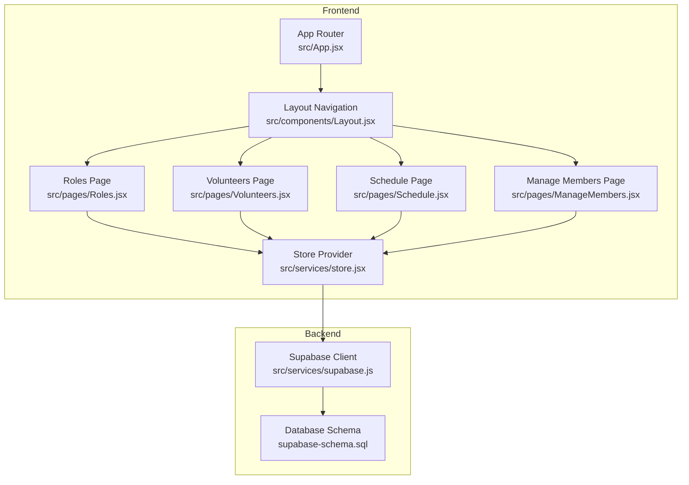

**Diagram sources**
- [App.jsx:13-34](file://src/App.jsx#L13-L34)
- [Layout.jsx:7-12](file://src/components/Layout.jsx#L7-L12)
- [Roles.jsx:6-7](file://src/pages/Roles.jsx#L6-L7)
- [Volunteers.jsx](file://src/pages/Volunteers.jsx#L8)
- [Schedule.jsx](file://src/pages/Schedule.jsx#L8)
- [ManageMembers.jsx:6-7](file://src/pages/ManageMembers.jsx#L6-L7)
- [store.jsx:6-467](file://src/services/store.jsx#L6-L467)
- [supabase.js:1-13](file://src/services/supabase.js#L1-L13)
- [supabase-schema.sql:1-251](file://supabase-schema.sql#L1-L251)

**Section sources**
- [App.jsx:13-34](file://src/App.jsx#L13-L34)
- [Layout.jsx:7-12](file://src/components/Layout.jsx#L7-L12)

## Core Components
- Roles management page: Allows creating, editing, and deleting roles and groups (teams). Roles can be grouped under groups and orphaned roles (without a group) are supported. Administrative features are conditionally rendered based on user role.
- Volunteers management page: Allows creating/editing volunteers and selecting multiple roles via a checkbox interface grouped by team. Administrative features are conditionally rendered based on user role.
- Schedule management page: Displays volunteer assignments and allows scheduling. Administrative features are conditionally rendered based on user role.
- Manage Members page: Handles member approval/rejection processes. Only accessible to administrators.
- Store provider: Centralizes data fetching, mutations, and synchronization with Supabase, including role-based access control and conditional rendering logic.
- Database schema: Defines organizations, groups, roles, volunteers, assignments, and the volunteer_roles junction table for many-to-many relationships.

**Section sources**
- [Roles.jsx:6-113](file://src/pages/Roles.jsx#L6-L113)
- [Volunteers.jsx:7-354](file://src/pages/Volunteers.jsx#L7-L354)
- [Schedule.jsx:9-9](file://src/pages/Schedule.jsx#L9-L9)
- [ManageMembers.jsx:6-133](file://src/pages/ManageMembers.jsx#L6-L133)
- [store.jsx:78-111](file://src/services/store.jsx#L78-L111)
- [supabase-schema.sql:23-55](file://supabase-schema.sql#L23-L55)

## Architecture Overview
The system follows a client-side state management pattern with Supabase as the backend and enhanced role-based access control:
- Components consume data from the store and check the `canEdit` property for administrative features.
- Store loads data from Supabase and transforms it for UI consumption.
- Mutations (add/update/delete) are performed against Supabase and then reload data to keep the UI synchronized.
- Role-based access control determines which features are visible to users based on their profile role.

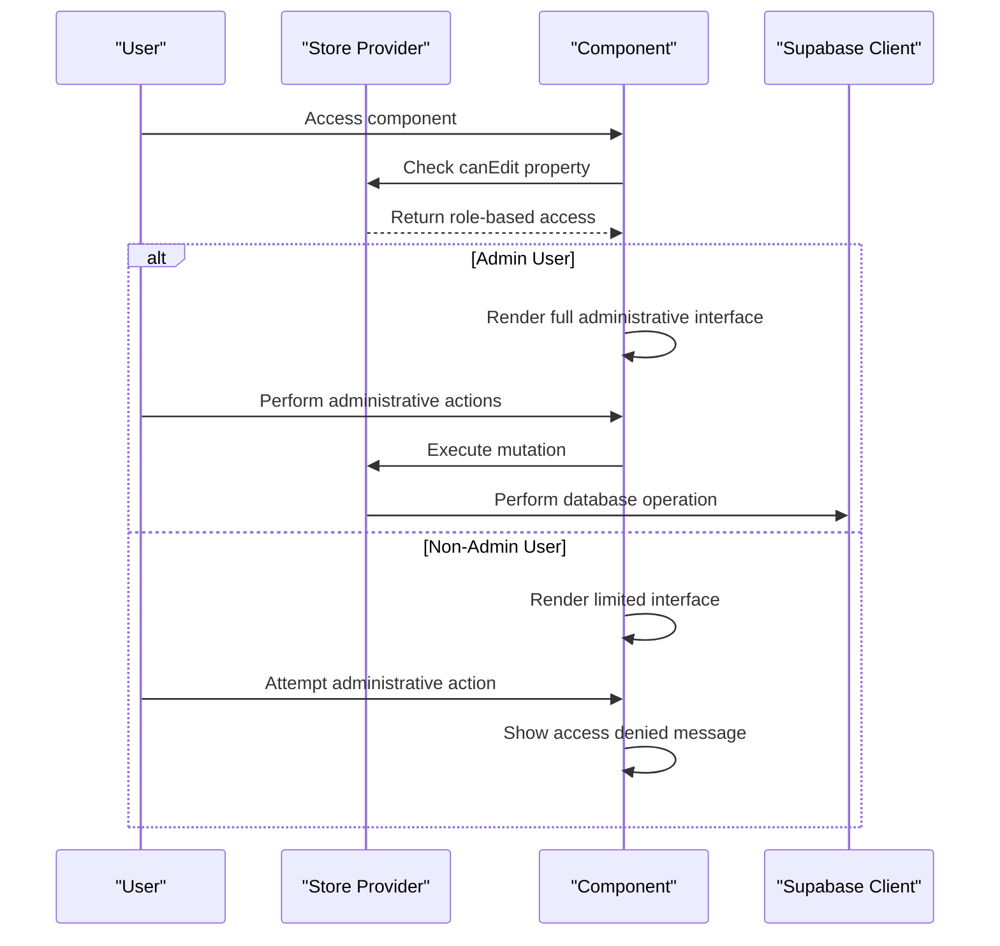

**Diagram sources**
- [store.jsx:1213-1217](file://src/services/store.jsx#L1213-L1217)
- [Roles.jsx:120-141](file://src/pages/Roles.jsx#L120-L141)
- [Volunteers.jsx:129-158](file://src/pages/Volunteers.jsx#L129-L158)
- [ManageMembers.jsx:9-24](file://src/pages/ManageMembers.jsx#L9-L24)

## Role-Based Access Control System

### Role Definitions and Access Levels
The system implements a tiered role-based access control system with three distinct user types:

- **Admin Users**: Full administrative privileges including creating, editing, and deleting roles and groups; managing team members; accessing all administrative features.
- **Team Members**: Limited access to view and edit their own information; can see volunteer lists but cannot modify roles or groups.
- **Demo Mode**: Special case where all users have administrative privileges for demonstration purposes.

### Implementation Details
The access control system is implemented in the store provider with the following key properties:

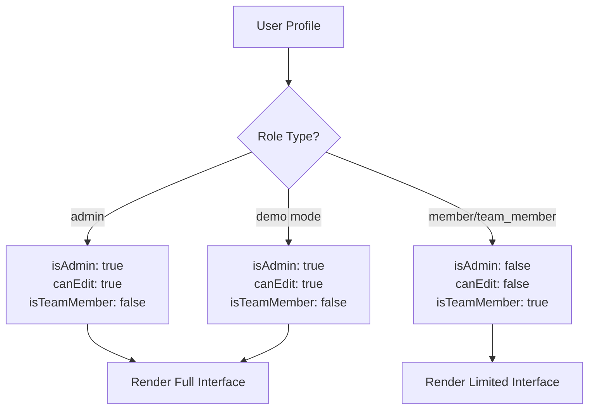

**Diagram sources**
- [store.jsx:1213-1217](file://src/services/store.jsx#L1213-L1217)

**Section sources**
- [store.jsx:1213-1217](file://src/services/store.jsx#L1213-L1217)

## Conditional Rendering Implementation

### Component-Level Conditional Rendering
Components implement conditional rendering using the `canEdit` property from the store to determine which UI elements to display:

#### Roles Management Conditional Rendering
- **Administrative Buttons**: "Manage Teams" and "Add Role" buttons are only visible to admin users
- **Action Buttons**: Edit and Delete buttons in role tables are only visible to admin users
- **View Only State**: Non-admin users see "View Only" instead of action buttons

#### Volunteers Management Conditional Rendering
- **Import and Add Buttons**: CSV import and "Add Volunteer" buttons are only visible to admin users
- **Action Buttons**: Edit and Remove buttons in volunteer tables are only visible to admin users
- **View Only State**: Non-admin users see "View Only" instead of action buttons

#### Schedule Management Conditional Rendering
- **Event Management**: Add, edit, and delete event buttons are only visible to admin users
- **Assignment Management**: Volunteer assignment controls are only visible to admin users
- **File Operations**: Attachment upload and playlist management are only visible to admin users

#### Layout Navigation Conditional Rendering
- **Manage Members Link**: Only appears in navigation for admin users
- **Other Links**: All other navigation items are always visible

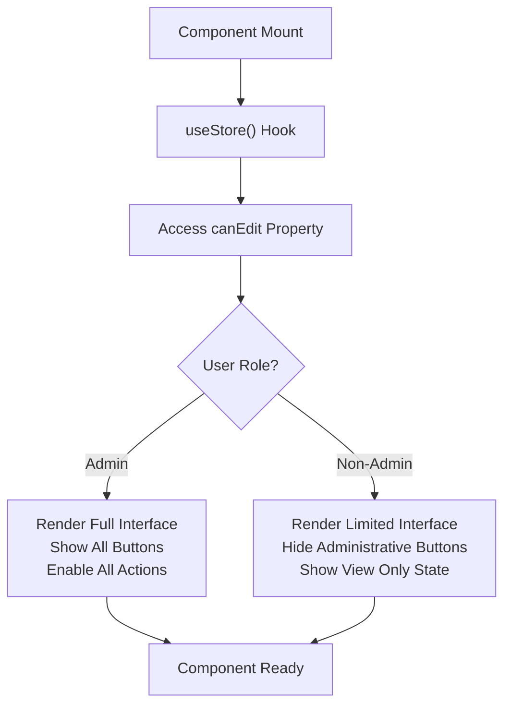

**Diagram sources**
- [Layout.jsx:12-20](file://src/components/Layout.jsx#L12-L20)
- [Roles.jsx:120-206](file://src/pages/Roles.jsx#L120-L206)
- [Volunteers.jsx:129-238](file://src/pages/Volunteers.jsx#L129-L238)

**Section sources**
- [Layout.jsx:12-20](file://src/components/Layout.jsx#L12-L20)
- [Roles.jsx:120-206](file://src/pages/Roles.jsx#L120-L206)
- [Volunteers.jsx:129-238](file://src/pages/Volunteers.jsx#L129-L238)
- [Schedule.jsx:412-651](file://src/pages/Schedule.jsx#L412-L651)

## Detailed Component Analysis

### Roles Management: Hierarchical Display and Filtering
- Filtering: The roles list supports searching by role name or team name.
- Grouping: Roles are grouped by their associated group; orphan roles (those without a valid group) are shown under an "Other" group.
- Actions: Roles can be edited or deleted; groups can be managed separately.
- **Enhanced**: Administrative features are conditionally rendered based on user role.

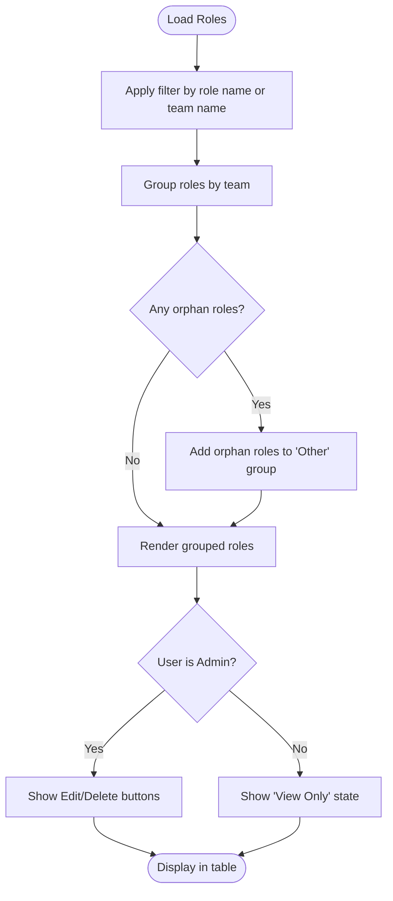

**Diagram sources**
- [Roles.jsx:23-41](file://src/pages/Roles.jsx#L23-L41)
- [Roles.jsx:188-206](file://src/pages/Roles.jsx#L188-L206)

**Section sources**
- [Roles.jsx:21-41](file://src/pages/Roles.jsx#L21-L41)
- [Roles.jsx:188-206](file://src/pages/Roles.jsx#L188-L206)

### Volunteers Management: Checkbox-Based Role Assignment
- Role selection: During volunteer creation/editing, roles are presented in a grid grouped by team. Each role has a checkbox; selecting multiple roles assigns them to the volunteer.
- Orphan roles: Roles without a team are shown under an "Other" section.
- Data binding: The form state maintains an array of selected role IDs, which are persisted to the volunteer record.
- **Enhanced**: Administrative features are conditionally rendered based on user role.

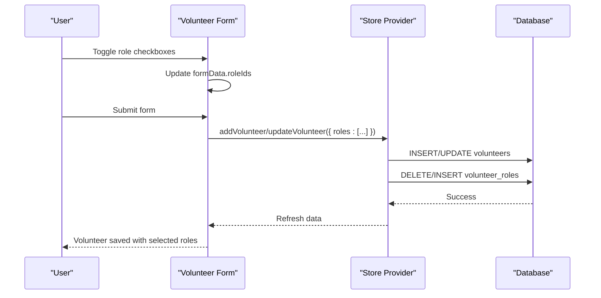

**Diagram sources**
- [Volunteers.jsx:68-75](file://src/pages/Volunteers.jsx#L68-L75)
- [Volunteers.jsx:45-66](file://src/pages/Volunteers.jsx#L45-L66)
- [store.jsx:161-194](file://src/services/store.jsx#L161-L194)
- [store.jsx:196-228](file://src/services/store.jsx#L196-L228)

**Section sources**
- [Volunteers.jsx:285-332](file://src/pages/Volunteers.jsx#L285-L332)
- [Volunteers.jsx:68-75](file://src/pages/Volunteers.jsx#L68-L75)
- [Volunteers.jsx:129-158](file://src/pages/Volunteers.jsx#L129-L158)

### Data Model: Volunteers, Roles, Groups, and Assignments
The system uses a many-to-many relationship between volunteers and roles via a junction table:
- organizations: Tenant isolation
- groups: Ministry teams
- roles: Specific positions within groups
- volunteers: Individuals
- volunteer_roles: Junction table linking volunteers to roles
- assignments: Links events, roles, and volunteers for scheduling

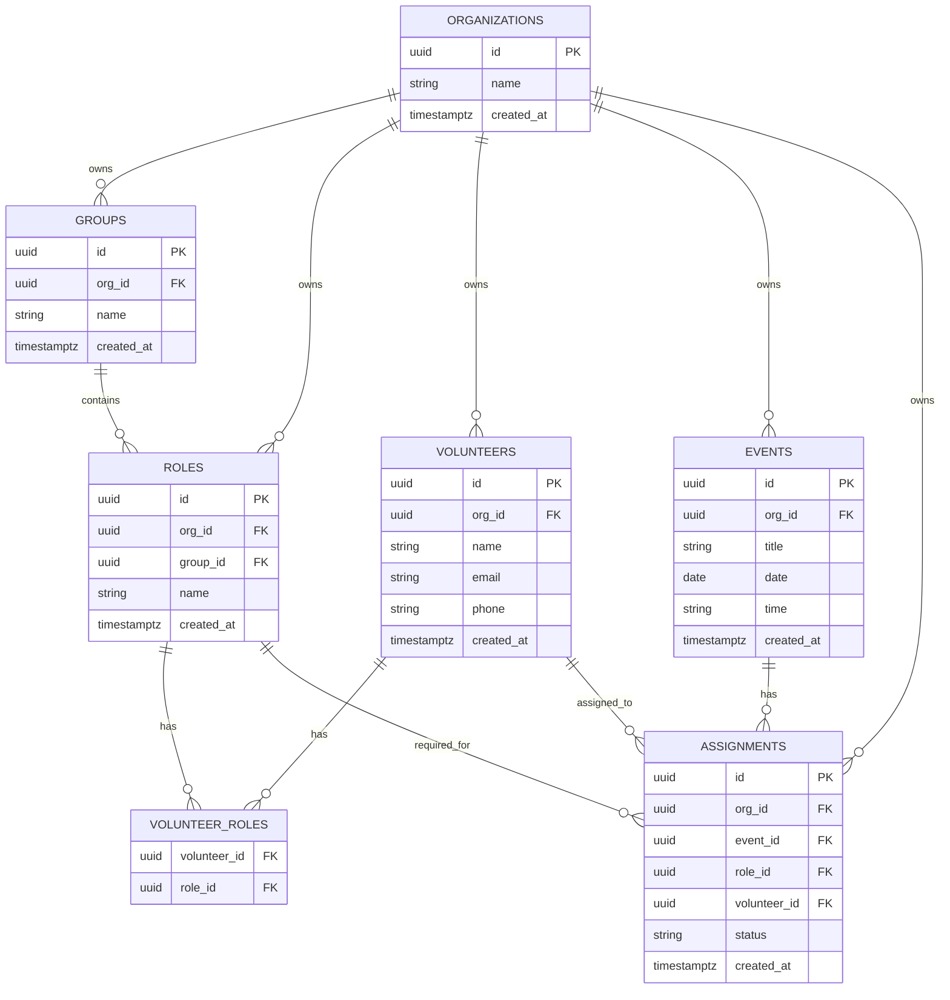

**Diagram sources**
- [supabase-schema.sql:7-76](file://supabase-schema.sql#L7-L76)

**Section sources**
- [supabase-schema.sql:23-55](file://supabase-schema.sql#L23-L55)

### Role Filtering and Grouping Logic
- Filtering: Roles are filtered by role name or the associated group's name.
- Grouping: Roles are grouped by team name; orphan roles (no group or invalid group) are aggregated under "Other".
- Rendering: The UI iterates through groups and renders role rows, followed by an "Other" section if needed.
- **Enhanced**: Administrative features are conditionally rendered based on user role.

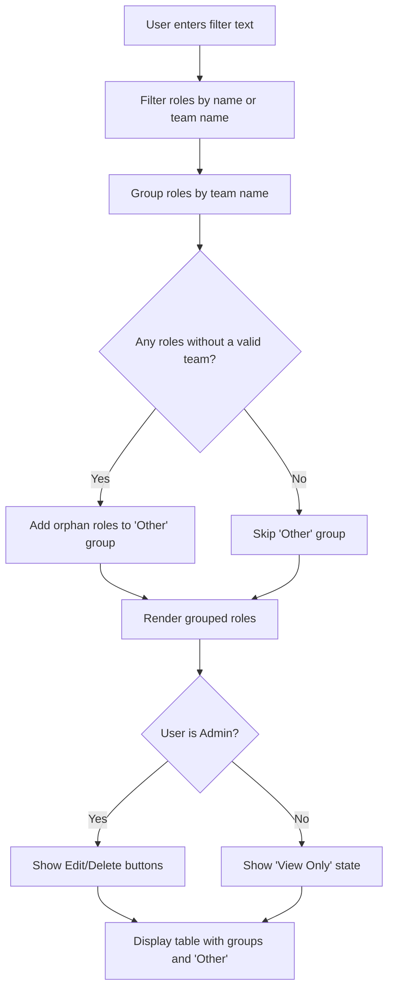

**Diagram sources**
- [Roles.jsx:23-41](file://src/pages/Roles.jsx#L23-L41)

**Section sources**
- [Roles.jsx:23-41](file://src/pages/Roles.jsx#L23-L41)

### Relationship Between Volunteers, Roles, and Groups
- Volunteers belong to an organization and can have zero or more roles.
- Roles belong to an organization and optionally belong to a group.
- The junction table volunteer_roles stores the many-to-many mapping between volunteers and roles.
- Scheduling uses assignments to connect events, roles, and volunteers.

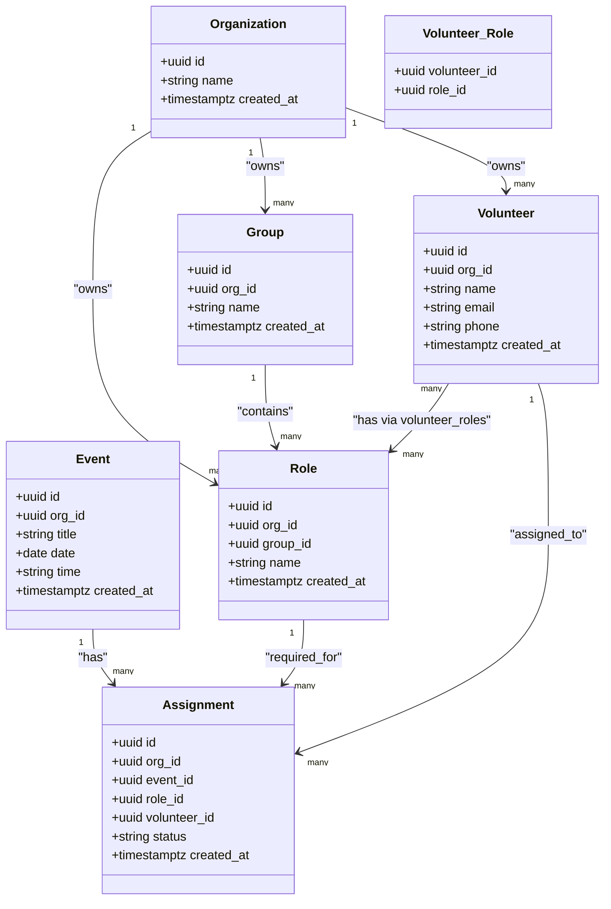

**Diagram sources**
- [supabase-schema.sql:7-76](file://supabase-schema.sql#L7-L76)

**Section sources**
- [supabase-schema.sql:23-76](file://supabase-schema.sql#L23-L76)

### How Role Assignments Affect Visibility and Scheduling Permissions
- Visibility: The store loads volunteers with their role IDs resolved from the volunteer_roles junction table, ensuring the UI displays accurate role assignments.
- Scheduling: Assignments link events, roles, and volunteers. The schedule page uses these relationships to render rosters and send emails to assigned volunteers.
- **Enhanced**: Administrative features are conditionally rendered based on user role, affecting which actions users can perform.

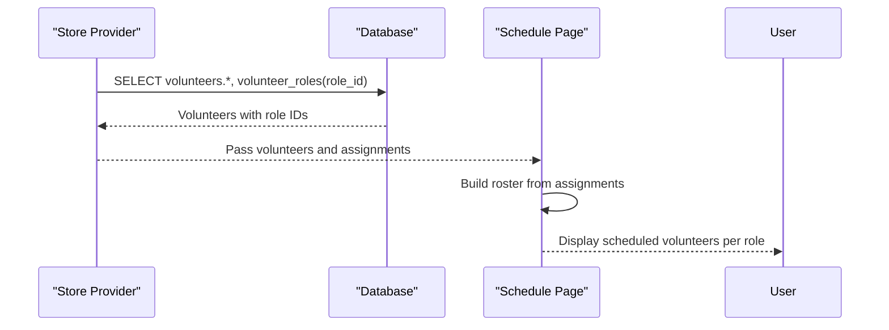

**Diagram sources**
- [store.jsx:82-111](file://src/services/store.jsx#L82-L111)
- [store.jsx:98-103](file://src/services/store.jsx#L98-L103)
- [Schedule.jsx:27-29](file://src/pages/Schedule.jsx#L27-L29)

**Section sources**
- [store.jsx:82-111](file://src/services/store.jsx#L82-L111)
- [store.jsx:98-103](file://src/services/store.jsx#L98-L103)
- [Schedule.jsx:27-29](file://src/pages/Schedule.jsx#L27-L29)

### Common Role Assignment Scenarios and Best Practices
- Scenario: Assign multiple roles to a single volunteer
  - Use the checkbox interface in the volunteer editor to select multiple roles across different teams.
  - Save the form to persist the many-to-many relationships via the junction table.
  - **Enhanced**: Only admin users can access the full volunteer editor with role assignment capabilities.
- Scenario: Reorganize ministry structure
  - Create or edit groups (teams) in the Roles area.
  - Move roles between groups; orphan roles appear under "Other" until reassigned.
  - **Enhanced**: Only admin users can create, edit, or delete roles and groups.
- Scenario: Prepare for scheduling
  - Ensure volunteers have the appropriate roles assigned so they appear in relevant scheduling views.
  - Use the schedule page to assign volunteers to specific roles for events.
  - **Enhanced**: Only admin users can manage events, assignments, and scheduling features.

**Section sources**
- [Volunteers.jsx:285-332](file://src/pages/Volunteers.jsx#L285-L332)
- [Roles.jsx:28-41](file://src/pages/Roles.jsx#L28-L41)
- [Schedule.jsx:37-49](file://src/pages/Schedule.jsx#L37-L49)

## Dependency Analysis
The system exhibits clear separation of concerns with enhanced role-based access control:
- Pages depend on the store for data and actions, checking the `canEdit` property for administrative features.
- The store depends on Supabase for persistence and implements role-based access control.
- The database schema defines the relationships used by the store and pages.
- Components conditionally render based on the `canEdit` property from the store.

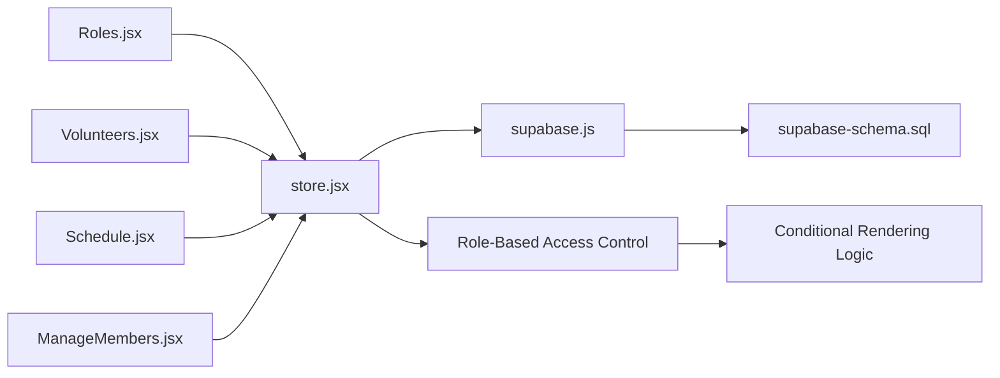

**Diagram sources**
- [Roles.jsx:6-7](file://src/pages/Roles.jsx#L6-L7)
- [Volunteers.jsx](file://src/pages/Volunteers.jsx#L8)
- [Schedule.jsx](file://src/pages/Schedule.jsx#L9)
- [ManageMembers.jsx:6-7](file://src/pages/ManageMembers.jsx#L6-L7)
- [store.jsx:6-467](file://src/services/store.jsx#L6-L467)
- [supabase.js:1-13](file://src/services/supabase.js#L1-L13)
- [supabase-schema.sql:1-251](file://supabase-schema.sql#L1-L251)

**Section sources**
- [store.jsx:78-111](file://src/services/store.jsx#L78-L111)
- [supabase.js:1-13](file://src/services/supabase.js#L1-L13)

## Performance Considerations
- Data loading: The store fetches multiple datasets concurrently to reduce latency.
- Transformations: Volunteer records are transformed to include role IDs from the junction table to simplify UI rendering.
- Filtering and grouping: Client-side filtering and grouping are efficient for moderate dataset sizes; consider server-side pagination for very large deployments.
- **Enhanced**: Conditional rendering reduces DOM complexity by hiding unnecessary elements from non-admin users, improving performance for basic users.

## Troubleshooting Guide
- Roles not appearing under expected teams
  - Verify the role's group ID is set correctly; orphan roles will show under "Other".
- Role changes not reflected after saving
  - Confirm the volunteer_roles junction table is being updated on save.
- Missing role assignments in schedule
  - Ensure assignments exist linking events, roles, and volunteers.
- **New**: Administrative features not visible to admin users
  - Check that the user profile role is correctly set to 'admin'.
  - Verify the `canEdit` property is properly computed in the store.
  - Ensure the store is providing the `canEdit` property to components.
- **New**: Non-admin users seeing administrative features
  - Verify the user profile role is not incorrectly set to 'admin'.
  - Check that conditional rendering logic is properly implemented in components.
  - Ensure the `canEdit` property is being used consistently across components.
- **New**: Access denied messages when performing administrative actions
  - Confirm the user has the appropriate role ('admin').
  - Verify the store's role-based access control is functioning correctly.
  - Check that the component is properly checking the `canEdit` property before allowing actions.

**Section sources**
- [Roles.jsx:37-41](file://src/pages/Roles.jsx#L37-L41)
- [store.jsx:180-194](file://src/services/store.jsx#L180-L194)
- [store.jsx:208-228](file://src/services/store.jsx#L208-L228)
- [Schedule.jsx:27-29](file://src/pages/Schedule.jsx#L27-L29)
- [store.jsx:1213-1217](file://src/services/store.jsx#L1213-L1217)
- [ManageMembers.jsx:9-24](file://src/pages/ManageMembers.jsx#L9-L24)

## Conclusion
The role assignment system provides a flexible, hierarchical way to organize ministry structure and assign volunteers to multiple roles across teams. The enhanced system now includes robust role-based access control with conditional rendering that hides administrative features from non-admin users while preserving full functionality for administrators. The frontend components integrate seamlessly with the store and Supabase to maintain accurate role assignments, while the database schema enforces many-to-many relationships and tenant isolation. The conditional rendering system ensures security by preventing unauthorized access to administrative features while maintaining a clean user experience for different user types. By following the best practices outlined above, administrators can efficiently manage volunteers, roles, and schedules, while non-admin users can access the features appropriate to their role level.