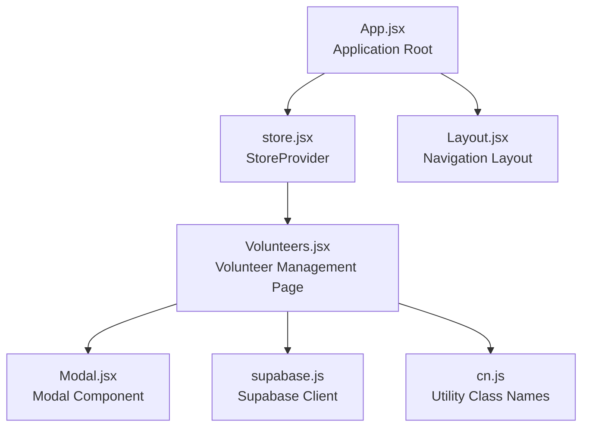
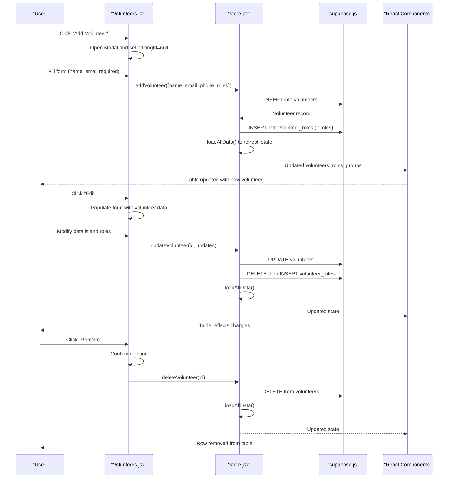
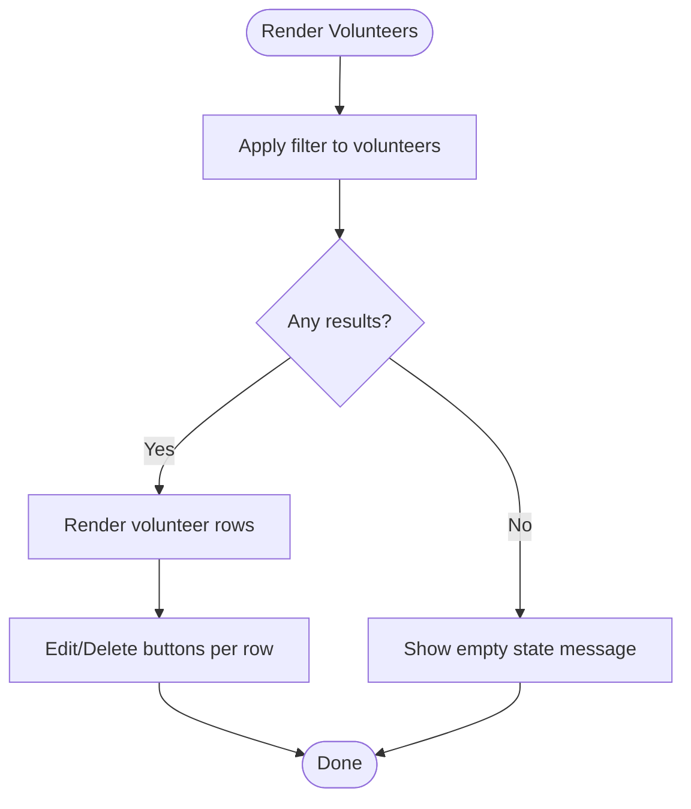
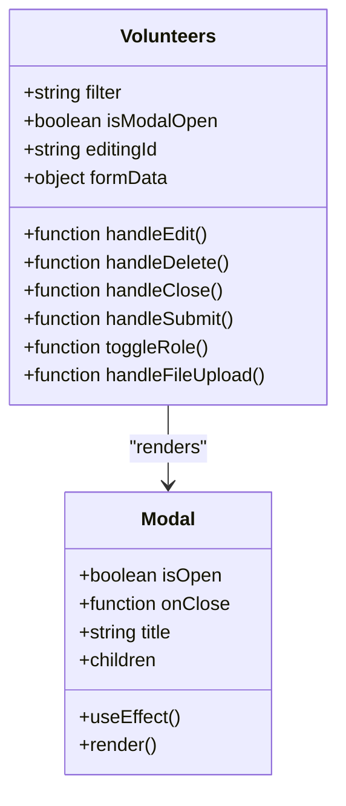
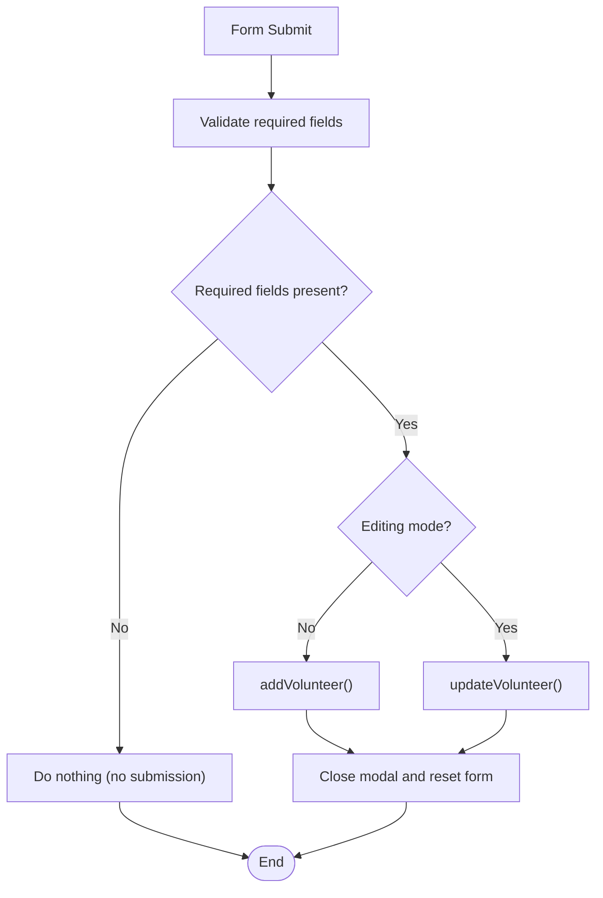
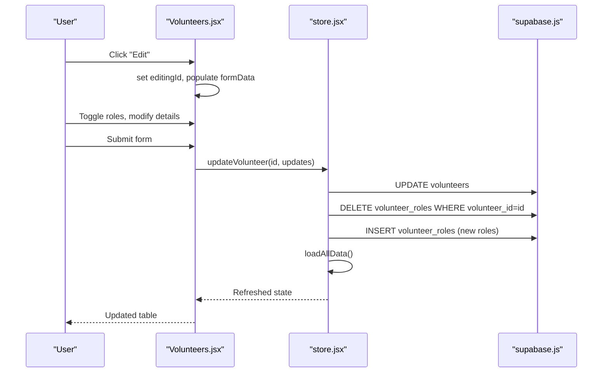
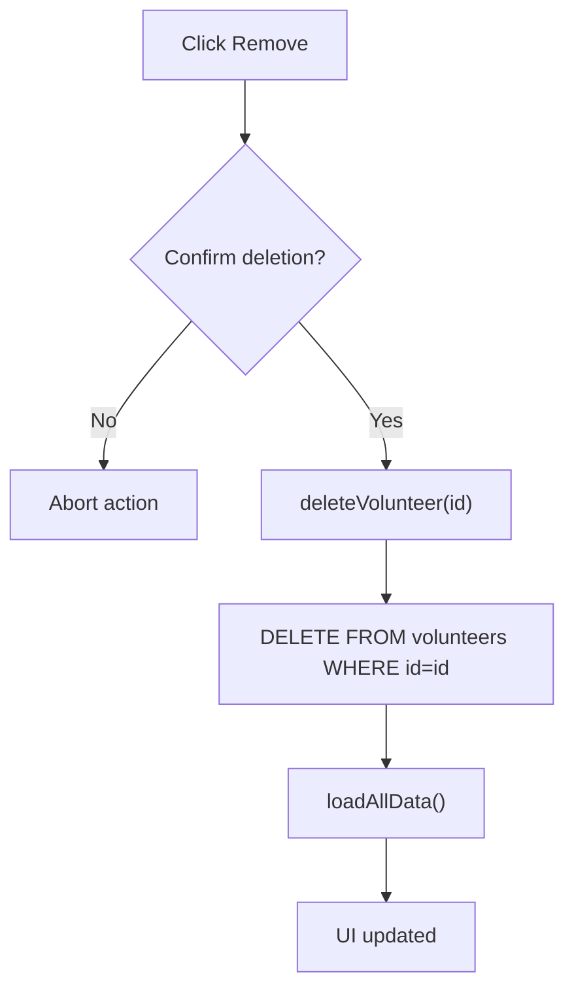
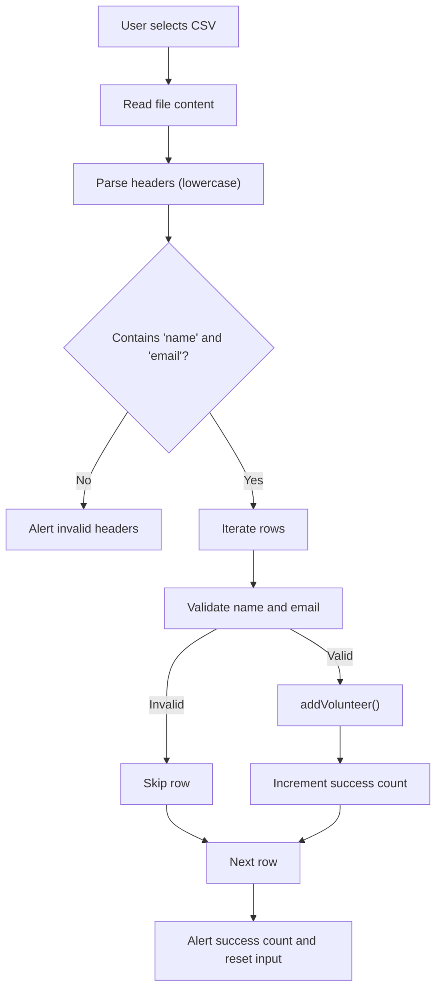
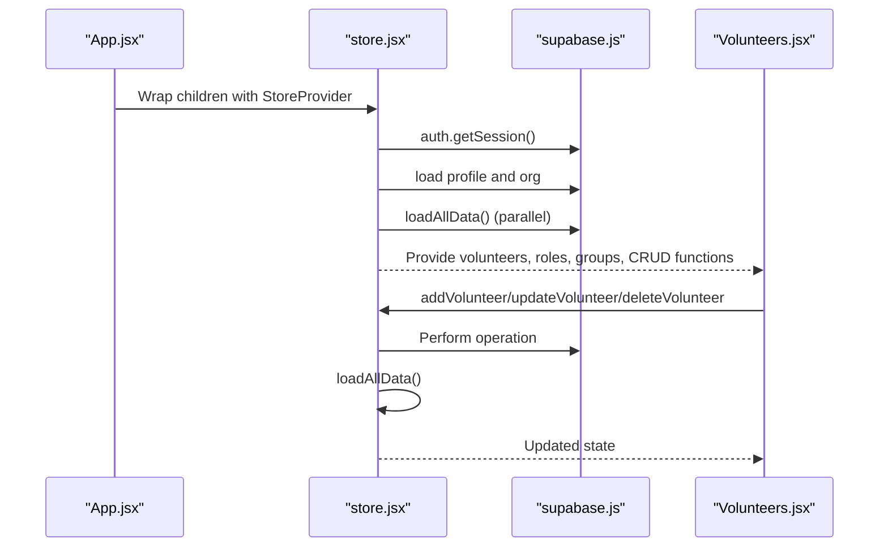
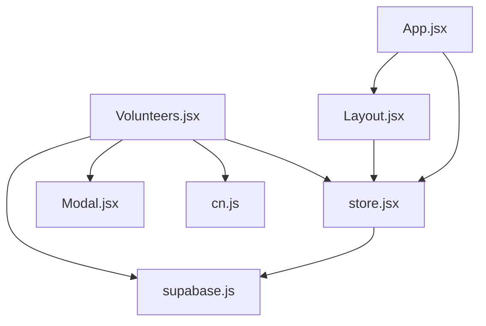

# Volunteer CRUD Operations

<cite>
**Referenced Files in This Document**
- [Volunteers.jsx](file://src/pages/Volunteers.jsx)
- [store.jsx](file://src/services/store.jsx)
- [Modal.jsx](file://src/components/Modal.jsx)
- [supabase.js](file://src/services/supabase.js)
- [App.jsx](file://src/App.jsx)
- [Layout.jsx](file://src/components/Layout.jsx)
- [cn.js](file://src/utils/cn.js)
</cite>

## Table of Contents
1. [Introduction](#introduction)
2. [Project Structure](#project-structure)
3. [Core Components](#core-components)
4. [Architecture Overview](#architecture-overview)
5. [Detailed Component Analysis](#detailed-component-analysis)
6. [Dependency Analysis](#dependency-analysis)
7. [Performance Considerations](#performance-considerations)
8. [Troubleshooting Guide](#troubleshooting-guide)
9. [Conclusion](#conclusion)

## Introduction
This document provides comprehensive coverage of volunteer CRUD (Create, Read, Update, Delete) operations within the RosterFlow application. It explains the volunteer creation form with validation for required fields, the edit functionality for updating volunteer details and role assignments, the delete confirmation workflow, and data integrity considerations. Additionally, it documents the volunteer listing interface with search functionality and table display, the modal-based form system for both adding and editing volunteers, and the state management integration with the store provider that propagates changes throughout the application.

## Project Structure
The volunteer management functionality is implemented primarily in the Volunteers page component, supported by a centralized store provider for state management and persistence via Supabase. The application uses a modal-based form system for both creating and editing volunteers, and includes CSV import capabilities for bulk operations.

**Diagram sources**
- [App.jsx](file://src/App.jsx#L13-L34)
- [store.jsx](file://src/services/store.jsx#L6-L467)
- [Volunteers.jsx](file://src/pages/Volunteers.jsx#L1-L354)
- [Modal.jsx](file://src/components/Modal.jsx#L1-L50)
- [supabase.js](file://src/services/supabase.js#L1-L13)
- [Layout.jsx](file://src/components/Layout.jsx#L1-L108)
- [cn.js](file://src/utils/cn.js#L1-L7)

**Section sources**
- [App.jsx](file://src/App.jsx#L13-L34)
- [store.jsx](file://src/services/store.jsx#L6-L467)
- [Volunteers.jsx](file://src/pages/Volunteers.jsx#L1-L354)
- [Modal.jsx](file://src/components/Modal.jsx#L1-L50)
- [supabase.js](file://src/services/supabase.js#L1-L13)
- [Layout.jsx](file://src/components/Layout.jsx#L1-L108)
- [cn.js](file://src/utils/cn.js#L1-L7)

## Core Components
- Volunteers page: Implements volunteer listing, filtering, modal-based forms, role assignment, and CSV import.
- Store provider: Centralizes state for volunteers, roles, groups, and exposes CRUD functions for volunteers.
- Modal component: Provides reusable modal dialog with escape key support and portal rendering.
- Supabase client: Handles authentication and data persistence for volunteers and related entities.
- Layout component: Provides navigation and ensures user authentication context.

**Section sources**
- [Volunteers.jsx](file://src/pages/Volunteers.jsx#L7-L354)
- [store.jsx](file://src/services/store.jsx#L161-L242)
- [Modal.jsx](file://src/components/Modal.jsx#L5-L49)
- [supabase.js](file://src/services/supabase.js#L1-L13)
- [Layout.jsx](file://src/components/Layout.jsx#L14-L107)

## Architecture Overview
The volunteer CRUD architecture follows a unidirectional data flow:
- UI actions trigger local state updates and store functions.
- Store functions perform Supabase operations and refresh derived data.
- UI re-renders automatically due to React state changes.

**Diagram sources**
- [Volunteers.jsx](file://src/pages/Volunteers.jsx#L22-L66)
- [store.jsx](file://src/services/store.jsx#L162-L242)
- [supabase.js](file://src/services/supabase.js#L10-L10)

## Detailed Component Analysis

### Volunteer Listing and Search
- Displays a responsive table of volunteers with avatar initials, contact information, and role badges.
- Implements live search filtering by name or email.
- Provides action buttons to edit or remove volunteers.

**Diagram sources**
- [Volunteers.jsx](file://src/pages/Volunteers.jsx#L15-L244)

**Section sources**
- [Volunteers.jsx](file://src/pages/Volunteers.jsx#L15-L244)

### Modal-Based Form System
- Reusable modal component handles open/close state, escape key, and portal rendering.
- Single form supports both create and edit modes via editingId flag.
- Form fields include required name and email, optional phone, and role checkboxes grouped by team/group.

**Diagram sources**
- [Modal.jsx](file://src/components/Modal.jsx#L5-L49)
- [Volunteers.jsx](file://src/pages/Volunteers.jsx#L22-L75)

**Section sources**
- [Modal.jsx](file://src/components/Modal.jsx#L5-L49)
- [Volunteers.jsx](file://src/pages/Volunteers.jsx#L247-L350)

### Volunteer Creation Form and Validation
- Required fields: Full Name and Email Address.
- Optional fields: Phone Number.
- Role assignment: Multi-select via grouped checkboxes organized by team/group.
- Validation: Prevents submission if required fields are missing; otherwise calls addVolunteer.

**Diagram sources**
- [Volunteers.jsx](file://src/pages/Volunteers.jsx#L45-L66)
- [Volunteers.jsx](file://src/pages/Volunteers.jsx#L252-L349)

**Section sources**
- [Volunteers.jsx](file://src/pages/Volunteers.jsx#L45-L66)
- [Volunteers.jsx](file://src/pages/Volunteers.jsx#L252-L349)

### Edit Functionality and Role Updates
- Populates form with current volunteer data and selected roles.
- Supports toggling roles via checkbox interactions.
- On save, calls updateVolunteer with the volunteer ID and updated attributes.
- Role updates are handled by deleting existing volunteer_roles entries and inserting new ones.

**Diagram sources**
- [Volunteers.jsx](file://src/pages/Volunteers.jsx#L22-L31)
- [Volunteers.jsx](file://src/pages/Volunteers.jsx#L49-L55)
- [store.jsx](file://src/services/store.jsx#L196-L228)

**Section sources**
- [Volunteers.jsx](file://src/pages/Volunteers.jsx#L22-L31)
- [Volunteers.jsx](file://src/pages/Volunteers.jsx#L49-L55)
- [store.jsx](file://src/services/store.jsx#L196-L228)

### Delete Confirmation Workflow and Data Integrity
- Confirmation prompt prevents accidental deletions.
- Deletion triggers a database DELETE operation on the volunteers table.
- After deletion, the store refreshes all data to maintain consistency across the UI.

**Diagram sources**
- [Volunteers.jsx](file://src/pages/Volunteers.jsx#L33-L37)
- [store.jsx](file://src/services/store.jsx#L230-L242)

**Section sources**
- [Volunteers.jsx](file://src/pages/Volunteers.jsx#L33-L37)
- [store.jsx](file://src/services/store.jsx#L230-L242)

### CSV Import for Bulk Volunteer Creation
- Accepts CSV files with headers "Name" and "Email".
- Optionally includes "Phone" header.
- Validates presence of required headers and imports records with basic validation.
- Adds each valid volunteer via addVolunteer and displays a success count.

**Diagram sources**
- [Volunteers.jsx](file://src/pages/Volunteers.jsx#L77-L121)

**Section sources**
- [Volunteers.jsx](file://src/pages/Volunteers.jsx#L77-L121)

### State Management Integration with Store Provider
- The store provider initializes authentication state and loads organizational data.
- Volunteers, roles, and groups are loaded in parallel and transformed for compatibility.
- CRUD functions for volunteers are exposed to the UI and perform Supabase operations followed by a refresh.

**Diagram sources**
- [App.jsx](file://src/App.jsx#L15-L32)
- [store.jsx](file://src/services/store.jsx#L21-L111)
- [store.jsx](file://src/services/store.jsx#L161-L242)

**Section sources**
- [App.jsx](file://src/App.jsx#L15-L32)
- [store.jsx](file://src/services/store.jsx#L21-L111)
- [store.jsx](file://src/services/store.jsx#L161-L242)

## Dependency Analysis
- Volunteers page depends on:
  - Store provider for state and CRUD functions.
  - Modal component for form presentation.
  - Supabase client for persistence.
  - Utility class names for Tailwind styling.
- Store provider depends on:
  - Supabase client for authentication and data operations.
  - React context for state distribution.
- Layout component depends on:
  - Store provider for user and organization context.
  - Navigation routing for page transitions.

**Diagram sources**
- [Volunteers.jsx](file://src/pages/Volunteers.jsx#L1-L6)
- [store.jsx](file://src/services/store.jsx#L1-L2)
- [Modal.jsx](file://src/components/Modal.jsx#L1-L3)
- [supabase.js](file://src/services/supabase.js#L1-L10)
- [Layout.jsx](file://src/components/Layout.jsx#L1-L5)
- [App.jsx](file://src/App.jsx#L1-L11)

**Section sources**
- [Volunteers.jsx](file://src/pages/Volunteers.jsx#L1-L6)
- [store.jsx](file://src/services/store.jsx#L1-L2)
- [Modal.jsx](file://src/components/Modal.jsx#L1-L3)
- [supabase.js](file://src/services/supabase.js#L1-L10)
- [Layout.jsx](file://src/components/Layout.jsx#L1-L5)
- [App.jsx](file://src/App.jsx#L1-L11)

## Performance Considerations
- Parallel data loading: The store loads groups, roles, volunteers, events, and assignments concurrently to minimize initialization latency.
- Local filtering: The volunteer list applies client-side filtering for responsiveness during search.
- Minimal re-renders: Form state is scoped to the page component, reducing unnecessary re-renders in sibling components.
- Efficient role updates: Role updates delete and re-insert volunteer_roles entries, ensuring consistency with minimal overhead.

[No sources needed since this section provides general guidance]

## Troubleshooting Guide
Common issues and resolutions:
- Missing environment variables: Ensure VITE_SUPABASE_URL and VITE_SUPABASE_ANON_KEY are configured; the client logs a warning if missing.
- Authentication errors: Verify session state and profile loading; the store subscribes to auth state changes and clears data when logged out.
- Database errors: CRUD functions log errors to the console and throw exceptions; check browser console for detailed messages.
- Role assignment failures: Role updates rely on deleting and re-inserting volunteer_roles; confirm volunteer roles are properly cleared before re-adding.
- CSV import errors: Ensure CSV contains "Name" and "Email" headers; the importer validates headers and skips invalid rows.

**Section sources**
- [supabase.js](file://src/services/supabase.js#L6-L8)
- [store.jsx](file://src/services/store.jsx#L21-L34)
- [store.jsx](file://src/services/store.jsx#L61-L64)
- [store.jsx](file://src/services/store.jsx#L176-L179)
- [store.jsx](file://src/services/store.jsx#L204-L207)
- [store.jsx](file://src/services/store.jsx#L236-L239)
- [Volunteers.jsx](file://src/pages/Volunteers.jsx#L91-L94)

## Conclusion
The volunteer CRUD implementation integrates a modal-based form system with robust state management and Supabase-backed persistence. It enforces required field validation, supports role assignment and CSV imports, and maintains data integrity through careful update and delete operations. The store provider centralizes state and ensures UI consistency across the application.