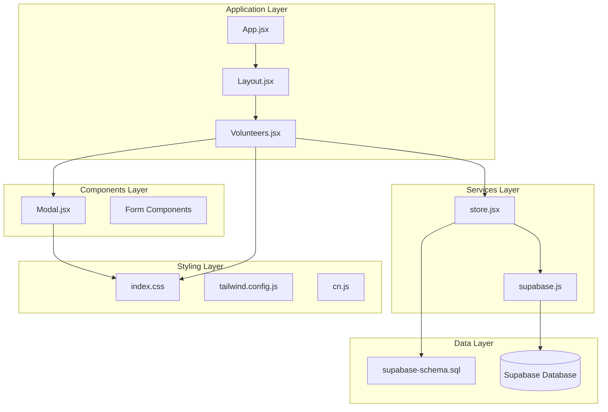
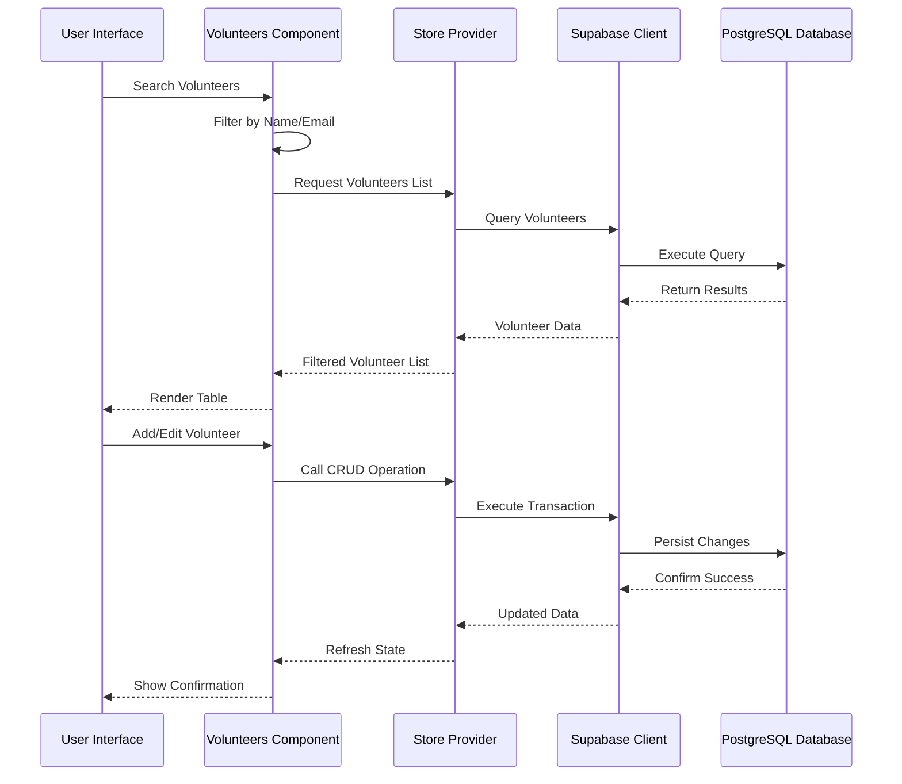
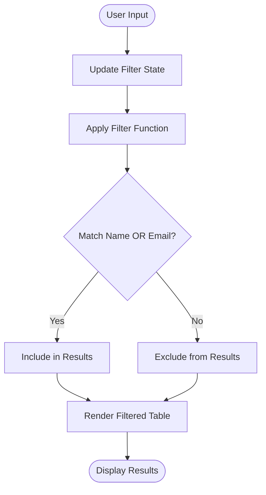
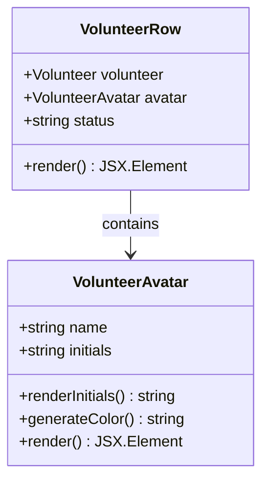
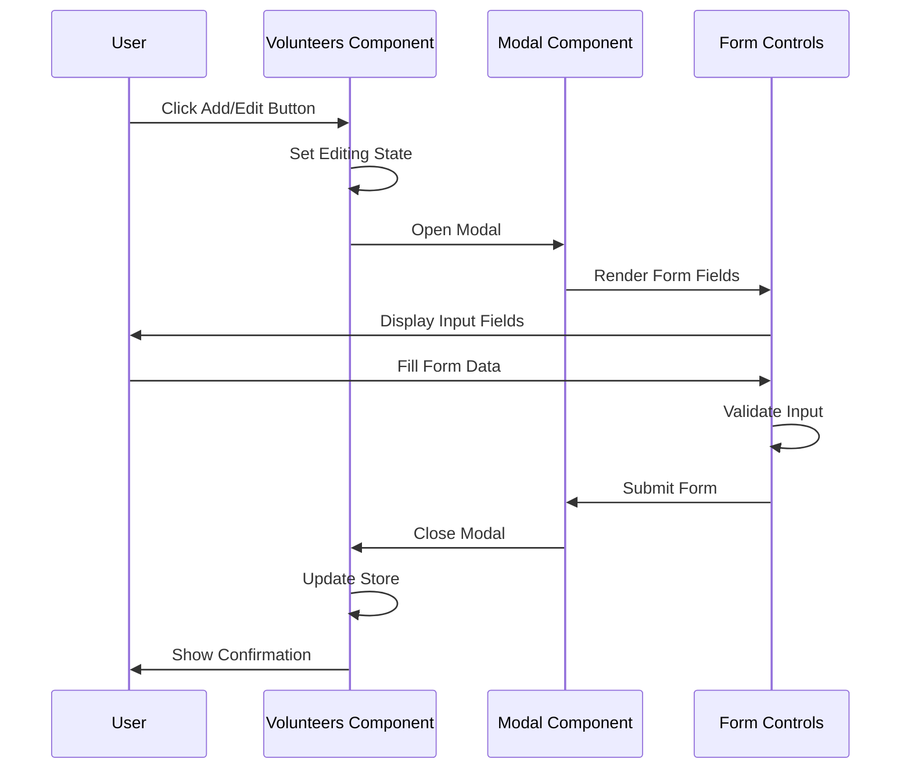
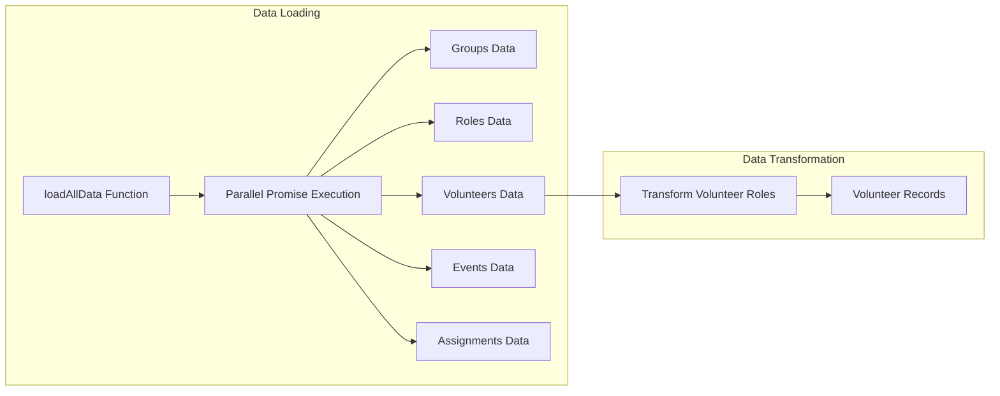
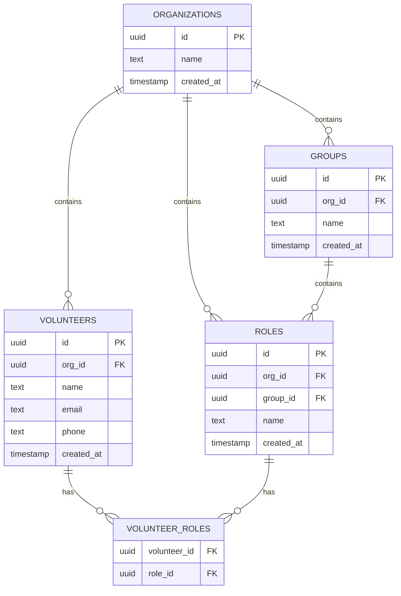
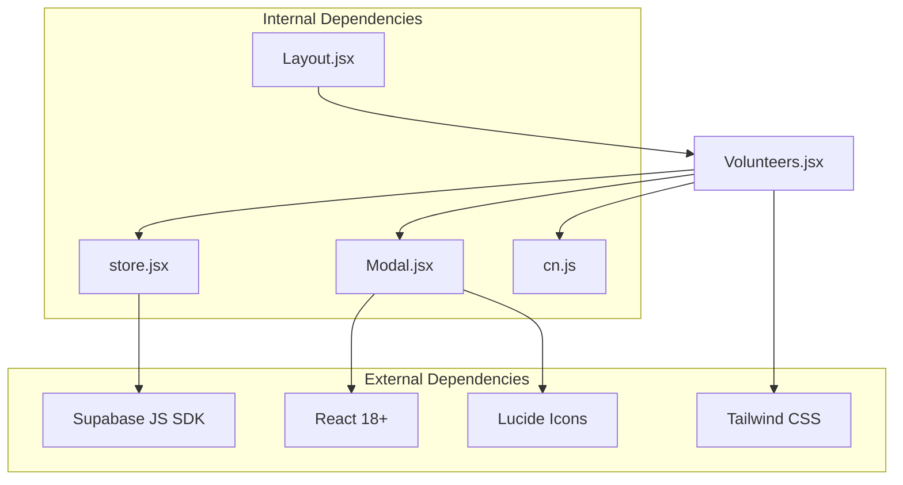

# Volunteer Directory Interface

<cite>
**Referenced Files in This Document**
- [Volunteers.jsx](file://src/pages/Volunteers.jsx)
- [Modal.jsx](file://src/components/Modal.jsx)
- [store.jsx](file://src/services/store.jsx)
- [supabase.js](file://src/services/supabase.js)
- [Layout.jsx](file://src/components/Layout.jsx)
- [App.jsx](file://src/App.jsx)
- [index.css](file://src/index.css)
- [tailwind.config.js](file://tailwind.config.js)
- [cn.js](file://src/utils/cn.js)
- [supabase-schema.sql](file://supabase-schema.sql)
</cite>

## Table of Contents
1. [Introduction](#introduction)
2. [Project Structure](#project-structure)
3. [Core Components](#core-components)
4. [Architecture Overview](#architecture-overview)
5. [Detailed Component Analysis](#detailed-component-analysis)
6. [Dependency Analysis](#dependency-analysis)
7. [Performance Considerations](#performance-considerations)
8. [Troubleshooting Guide](#troubleshooting-guide)
9. [Conclusion](#conclusion)

## Introduction
The volunteer directory interface is a comprehensive React-based solution for managing volunteer records within an organization. This system provides a searchable table-based interface for viewing volunteers, with integrated functionality for adding, editing, and removing volunteer records. The interface features a modern design with responsive layouts, accessible form controls, and seamless integration with a Supabase backend for data persistence.

The volunteer directory serves as a central hub for volunteer management, offering intuitive search capabilities, role assignment functionality, and streamlined administrative workflows. The interface is designed to be both user-friendly for administrators and accessible to users with varying technical abilities.

## Project Structure
The volunteer directory interface is built as part of a larger React application using modern frontend development practices. The system follows a component-based architecture with clear separation of concerns between presentation, data management, and service integration layers.

**Diagram sources**
- [App.jsx](file://src/App.jsx#L1-L37)
- [Layout.jsx](file://src/components/Layout.jsx#L1-L108)
- [Volunteers.jsx](file://src/pages/Volunteers.jsx#L1-L354)
- [store.jsx](file://src/services/store.jsx#L1-L472)
- [supabase.js](file://src/services/supabase.js#L1-L13)

**Section sources**
- [App.jsx](file://src/App.jsx#L1-L37)
- [Layout.jsx](file://src/components/Layout.jsx#L1-L108)
- [Volunteers.jsx](file://src/pages/Volunteers.jsx#L1-L354)

## Core Components

### Volunteer Listing Table
The volunteer directory presents data in a structured table format with four primary columns:

- **Name Column**: Displays volunteer initials in a circular avatar container with "Active" status indicator
- **Contact Information Column**: Shows email and phone number with appropriate icons
- **Assigned Roles Column**: Lists volunteer qualifications as colored badges organized by ministry groups
- **Actions Column**: Provides edit and remove functionality with clear visual distinction

### Search and Filter System
The interface includes a sophisticated search mechanism that filters volunteers based on both name and email fields. The search operates in real-time with case-insensitive matching, allowing users to quickly locate specific volunteers within large datasets.

### Modal-Based Management Forms
All volunteer management operations utilize modal dialogs for a consistent user experience. The modal system supports both creation and editing workflows with comprehensive form validation and role assignment capabilities.

### Responsive Design Implementation
The interface adapts seamlessly across device sizes using Tailwind CSS responsive utilities. Mobile devices receive optimized layouts while maintaining full functionality, and desktop users benefit from expanded table layouts and enhanced interaction capabilities.

**Section sources**
- [Volunteers.jsx](file://src/pages/Volunteers.jsx#L15-L244)
- [Modal.jsx](file://src/components/Modal.jsx#L1-L50)

## Architecture Overview

**Diagram sources**
- [Volunteers.jsx](file://src/pages/Volunteers.jsx#L15-L66)
- [store.jsx](file://src/services/store.jsx#L161-L242)
- [supabase.js](file://src/services/supabase.js#L1-L13)

The architecture follows a unidirectional data flow pattern where the store manages application state and coordinates with the Supabase client for data persistence. This design ensures predictable state management and simplifies debugging and testing procedures.

**Section sources**
- [store.jsx](file://src/services/store.jsx#L1-L472)
- [supabase.js](file://src/services/supabase.js#L1-L13)

## Detailed Component Analysis

### Volunteers Component Analysis

The Volunteers component serves as the primary interface for volunteer management, implementing comprehensive functionality for data display, filtering, and user interactions.

#### Data Flow and State Management
The component maintains several key state variables:
- `volunteers`: Main dataset from the store
- `filter`: Search term for volunteer filtering
- `isModalOpen`: Controls modal visibility
- `editingId`: Tracks currently edited volunteer
- `formData`: Manages form input values

#### Search Functionality Implementation
The search system implements a dual-field filtering mechanism that searches both volunteer names and email addresses. The filtering algorithm performs case-insensitive substring matching and debounces user input for optimal performance.

**Diagram sources**
- [Volunteers.jsx](file://src/pages/Volunteers.jsx#L15-L18)

#### Volunteer Avatar System
The volunteer avatar implementation creates personalized initials-based avatars with consistent styling:

**Diagram sources**
- [Volunteers.jsx](file://src/pages/Volunteers.jsx#L187-L195)

The avatar system generates initials from the volunteer's name and applies a consistent color scheme using the primary color palette. The active status indicator provides immediate visual feedback about volunteer availability.

#### Action Button Implementation
The action column provides two primary functions with distinct visual treatments:

- **Edit Button**: Blue text with hover effects for positive actions
- **Remove Button**: Red text with hover effects for destructive actions

Both buttons include subtle animations and proper spacing for optimal user experience.

#### Modal-Based Form System
The modal component implements a comprehensive form system supporting both creation and editing workflows:

**Diagram sources**
- [Volunteers.jsx](file://src/pages/Volunteers.jsx#L247-L350)
- [Modal.jsx](file://src/components/Modal.jsx#L5-L49)

**Section sources**
- [Volunteers.jsx](file://src/pages/Volunteers.jsx#L1-L354)
- [Modal.jsx](file://src/components/Modal.jsx#L1-L50)

### Store Provider and Data Management

The store provider implements a comprehensive state management solution that coordinates data fetching, caching, and synchronization with the Supabase backend.

#### Data Loading Strategy
The store employs a parallel loading strategy to optimize performance when initializing the application:

**Diagram sources**
- [store.jsx](file://src/services/store.jsx#L78-L111)

#### Volunteer CRUD Operations
The store provides comprehensive CRUD functionality for volunteer management:

- **Add Volunteer**: Creates new volunteer records with role associations
- **Update Volunteer**: Modifies existing volunteer information and role assignments
- **Delete Volunteer**: Removes volunteer records with cascading role deletions

Each operation includes proper error handling and automatic data refresh to maintain consistency.

**Section sources**
- [store.jsx](file://src/services/store.jsx#L161-L242)

### Database Schema and Relationships

The volunteer directory integrates with a well-designed PostgreSQL schema that supports organization-based data isolation and flexible role assignment:

**Diagram sources**
- [supabase-schema.sql](file://supabase-schema.sql#L7-L55)

**Section sources**
- [supabase-schema.sql](file://supabase-schema.sql#L1-L251)

## Dependency Analysis

The volunteer directory interface demonstrates excellent architectural separation with clear dependency relationships:

**Diagram sources**
- [Volunteers.jsx](file://src/pages/Volunteers.jsx#L1-L5)
- [store.jsx](file://src/services/store.jsx#L1-L4)
- [Modal.jsx](file://src/components/Modal.jsx#L1-L3)

The dependency graph reveals a clean architecture where the Volunteers component depends on the store for data management and the modal component for user interactions. The store itself manages its dependencies on external services while maintaining internal consistency.

**Section sources**
- [Volunteers.jsx](file://src/pages/Volunteers.jsx#L1-L5)
- [store.jsx](file://src/services/store.jsx#L1-L4)
- [Modal.jsx](file://src/components/Modal.jsx#L1-L3)

## Performance Considerations

### Data Loading Optimization
The application implements several performance optimizations to ensure smooth operation with large datasets:

- **Parallel Data Loading**: Multiple data sources are loaded simultaneously using Promise.all
- **Client-Side Filtering**: Search operations are performed on the client-side for immediate feedback
- **State Management**: Efficient state updates minimize unnecessary re-renders

### Memory Management
The interface includes proper cleanup mechanisms for event listeners and DOM modifications, particularly important for modal components that temporarily modify the document body.

### Accessibility Features
The application incorporates numerous accessibility features:
- Keyboard navigation support for all interactive elements
- Proper focus management in modal dialogs
- Semantic HTML structure with appropriate ARIA attributes
- Color contrast compliance for text and interactive elements
- Screen reader friendly form labels and error messages

## Troubleshooting Guide

### Common Issues and Solutions

#### Search Function Not Working
**Symptoms**: Search input has no effect on volunteer table
**Causes**: 
- Incorrect filter state management
- Case sensitivity issues
- Missing volunteer data

**Solutions**:
- Verify filter state updates correctly
- Ensure case-insensitive comparison implementation
- Check volunteer data loading completion

#### Modal Form Validation Failures
**Symptoms**: Form submission blocked despite valid input
**Causes**:
- Missing required field validation
- Incorrect form state management
- Event handler binding issues

**Solutions**:
- Implement proper required field checks
- Verify form state updates on input changes
- Ensure event handlers are properly bound

#### Data Synchronization Issues
**Symptoms**: Changes not reflected in the interface
**Causes**:
- Store state not updating after API calls
- Missing data refresh after mutations
- Error handling preventing state updates

**Solutions**:
- Verify store state updates after successful API calls
- Implement proper error handling and state recovery
- Ensure data refresh is triggered after mutations

**Section sources**
- [Volunteers.jsx](file://src/pages/Volunteers.jsx#L45-L66)
- [store.jsx](file://src/services/store.jsx#L161-L242)

## Conclusion

The volunteer directory interface represents a comprehensive solution for volunteer management with thoughtful attention to user experience, accessibility, and technical architecture. The implementation demonstrates best practices in React development, including proper state management, component composition, and responsive design principles.

Key strengths of the implementation include:
- **Intuitive User Interface**: Clean table layout with clear visual hierarchy
- **Robust Data Management**: Comprehensive CRUD operations with proper validation
- **Responsive Design**: Adaptive layouts that work across all device sizes
- **Accessibility Compliance**: Built-in accessibility features and keyboard navigation
- **Performance Optimization**: Efficient data loading and client-side filtering

The modular architecture ensures maintainability and extensibility, while the integration with Supabase provides reliable data persistence and organization-based security. The volunteer directory interface serves as an excellent foundation for volunteer management workflows and can be extended with additional features as organizational needs evolve.