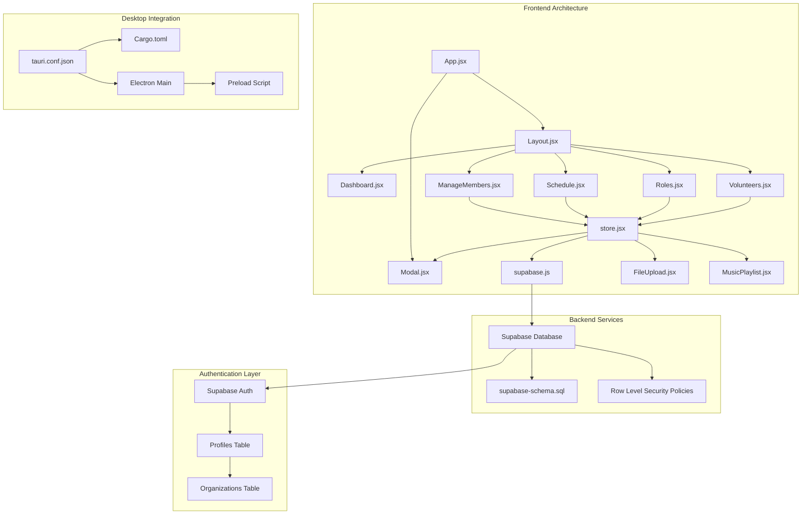
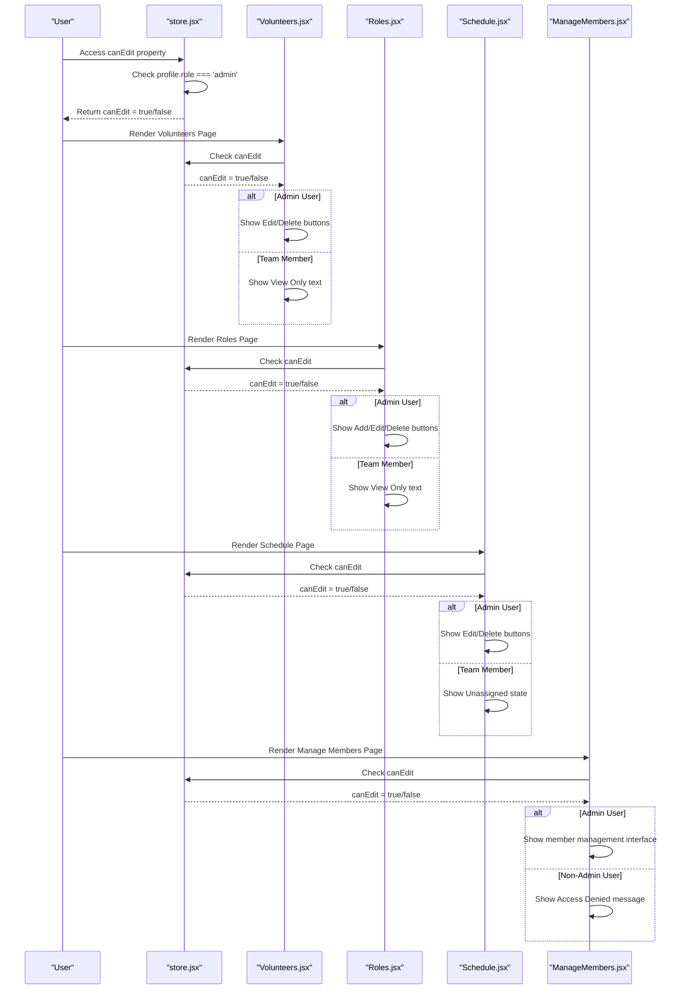
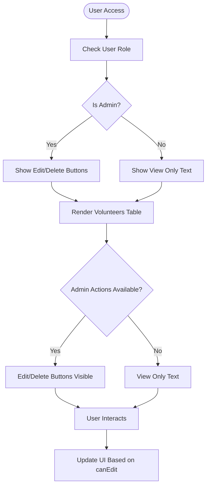
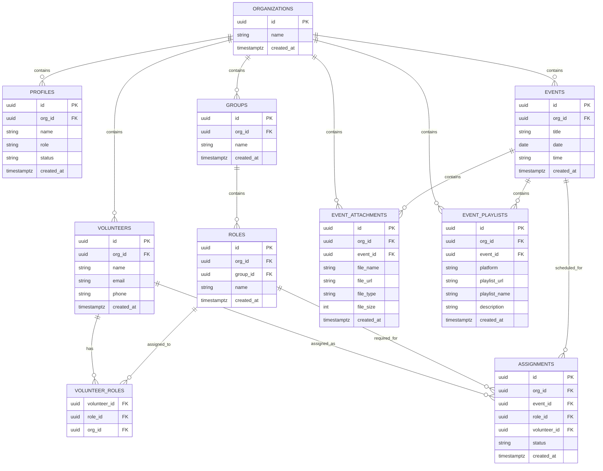
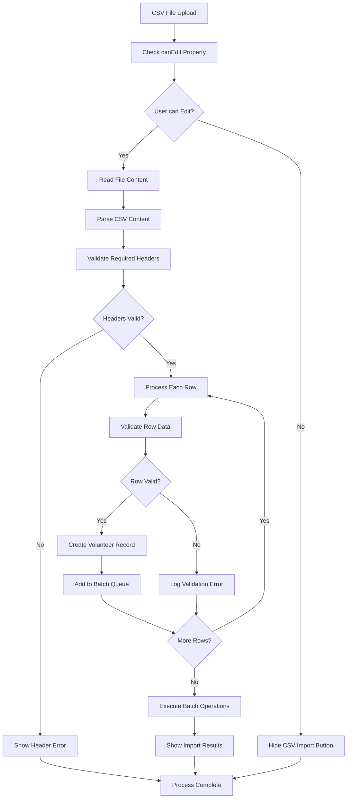
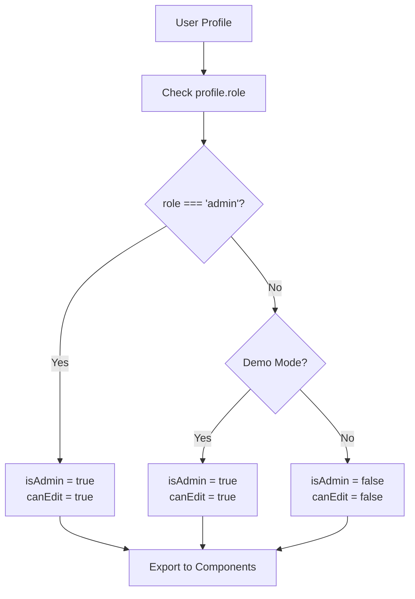
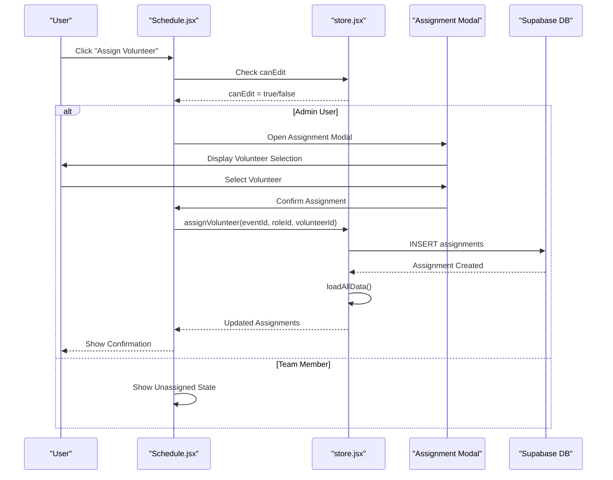

# Volunteer Management System

<cite>
**Referenced Files in This Document**
- [Volunteers.jsx](file://src/pages/Volunteers.jsx)
- [store.jsx](file://src/services/store.jsx)
- [supabase.js](file://src/services/supabase.js)
- [supabase-schema.sql](file://supabase-schema.sql)
- [App.jsx](file://src/App.jsx)
- [Layout.jsx](file://src/components/Layout.jsx)
- [Dashboard.jsx](file://src/pages/Dashboard.jsx)
- [Roles.jsx](file://src/pages/Roles.jsx)
- [Schedule.jsx](file://src/pages/Schedule.jsx)
- [ManageMembers.jsx](file://src/pages/ManageMembers.jsx)
- [Modal.jsx](file://src/components/Modal.jsx)
- [tauri.conf.json](file://src-tauri/tauri.conf.json)
- [Cargo.toml](file://src-tauri/Cargo.toml)
- [package.json](file://package.json)
- [.env.example](file://.env.example)
</cite>

## Update Summary
**Changes Made**
- Enhanced volunteer management with conditional rendering based on user roles - administrative features hidden from team members while maintaining full functionality for admins
- Implemented comprehensive role-based access control system with admin-only features
- Added conditional rendering for administrative actions across all volunteer management pages
- Integrated role-based UI modifications in Volunteers, Roles, Schedule, and Manage Members pages
- Enhanced security with role-based feature gating and access control enforcement

## Table of Contents
1. [Introduction](#introduction)
2. [Project Structure](#project-structure)
3. [Core Components](#core-components)
4. [Architecture Overview](#architecture-overview)
5. [Detailed Component Analysis](#detailed-component-analysis)
6. [Role-Based Conditional Rendering System](#role-based-conditional-rendering-system)
7. [Advanced Features](#advanced-features)
8. [Enhanced Scheduling System](#enhanced-scheduling-system)
9. [Data Management and Storage](#data-management-and-storage)
10. [Security and Access Control](#security-and-access-control)
11. [Performance Considerations](#performance-considerations)
12. [Troubleshooting Guide](#troubleshooting-guide)
13. [Conclusion](#conclusion)
14. [Appendices](#appendices)

## Introduction
This document provides comprehensive documentation for the volunteer management functionality of the ServeFlow system. The system has evolved into a comprehensive volunteer management platform featuring advanced CRUD operations, CSV import/export capabilities, sophisticated role assignment linking volunteers to ministry positions and groups, comprehensive scheduling with complex scenarios, file attachment management, music playlist integration, contact management, emergency information storage, communication preferences, volunteer status tracking, availability management, skill categorization, volunteer directory interface with filtering/search capabilities, onboarding workflows, background check integration, compliance features, reporting capabilities, and analytics. The system now includes enhanced role-based conditional rendering that hides administrative features from team members while maintaining full functionality for administrators, providing a secure and streamlined user experience.

## Project Structure
The application is a modern React single-page application bundled with Vite and integrated with Tauri for desktop builds. State management is centralized via a comprehensive store provider that wraps the entire app and connects to Supabase for authentication and data persistence. The volunteer management features are implemented across multiple specialized pages including Volunteers, Roles, Schedule, Dashboard, and supporting components for file management and modal dialogs. The system now includes role-based conditional rendering that controls feature visibility based on user permissions.

**Diagram sources**
- [App.jsx:16-40](file://src/App.jsx#L16-L40)
- [Layout.jsx:14-101](file://src/components/Layout.jsx#L14-L101)
- [Dashboard.jsx:21-89](file://src/pages/Dashboard.jsx#L21-L89)
- [Volunteers.jsx:7-354](file://src/pages/Volunteers.jsx#L7-L354)
- [Roles.jsx:6-386](file://src/pages/Roles.jsx#L6-L386)
- [Schedule.jsx:9-917](file://src/pages/Schedule.jsx#L9-L917)
- [ManageMembers.jsx:6-133](file://src/pages/ManageMembers.jsx#L6-L133)
- [Modal.jsx:5-50](file://src/components/Modal.jsx#L5-L50)
- [store.jsx:40-1247](file://src/services/store.jsx#L40-L1247)
- [supabase.js:1-37](file://src/services/supabase.js#L1-L37)
- [supabase-schema.sql:1-286](file://supabase-schema.sql#L1-L286)
- [tauri.conf.json:1-35](file://src-tauri/tauri.conf.json#L1-L35)
- [Cargo.toml:1-26](file://src-tauri/Cargo.toml#L1-L26)

**Section sources**
- [App.jsx:16-40](file://src/App.jsx#L16-L40)
- [Layout.jsx:14-101](file://src/components/Layout.jsx#L14-L101)
- [Dashboard.jsx:21-89](file://src/pages/Dashboard.jsx#L21-L89)
- [Volunteers.jsx:7-354](file://src/pages/Volunteers.jsx#L7-L354)
- [Roles.jsx:6-386](file://src/pages/Roles.jsx#L6-L386)
- [Schedule.jsx:9-917](file://src/pages/Schedule.jsx#L9-L917)
- [ManageMembers.jsx:6-133](file://src/pages/ManageMembers.jsx#L6-L133)
- [Modal.jsx:5-50](file://src/components/Modal.jsx#L5-L50)
- [store.jsx:40-1247](file://src/services/store.jsx#L40-L1247)
- [supabase.js:1-37](file://src/services/supabase.js#L1-L37)
- [supabase-schema.sql:1-286](file://supabase-schema.sql#L1-L286)
- [tauri.conf.json:1-35](file://src-tauri/tauri.conf.json#L1-L35)
- [Cargo.toml:1-26](file://src-tauri/Cargo.toml#L1-L26)

## Core Components
- **Volunteer Directory Page**: Advanced CRUD operations with CSV import/export, real-time search, comprehensive volunteer management interface, and role-based conditional rendering
- **Comprehensive Store Provider**: Centralized state management with Supabase integration for volunteers, roles, groups, events, assignments, file attachments, and playlists, including role-based access control
- **Enhanced Roles and Groups Management**: Sophisticated ministry area definition with team-based organization, complex role hierarchies, and administrative feature gating
- **Advanced Schedule Management**: Complex scheduling system linking volunteers to events via assignments with status tracking, file attachments, music playlists, and conditional editing controls
- **File Attachment System**: Comprehensive document management for events with validation and organization-based access control
- **Music Playlist Integration**: Event-specific playlist management with multiple platform support (YouTube, Spotify, Apple Music, SoundCloud)
- **Manage Members Administration**: Dedicated member management interface with role-based access control and approval workflows
- **Modal Component System**: Reusable modal dialogs for forms, assignments, and administrative actions with conditional rendering
- **Supabase Client**: Robust authentication and data persistence layer with error handling and fallback mechanisms
- **Database Schema**: Comprehensive relational schema with row-level security policies and organization-based access control

**Section sources**
- [Volunteers.jsx:7-354](file://src/pages/Volunteers.jsx#L7-L354)
- [store.jsx:40-1247](file://src/services/store.jsx#L40-L1247)
- [Roles.jsx:6-386](file://src/pages/Roles.jsx#L6-L386)
- [Schedule.jsx:9-917](file://src/pages/Schedule.jsx#L9-L917)
- [ManageMembers.jsx:6-133](file://src/pages/ManageMembers.jsx#L6-L133)
- [Modal.jsx:5-50](file://src/components/Modal.jsx#L5-L50)
- [supabase.js:1-37](file://src/services/supabase.js#L1-L37)
- [supabase-schema.sql:1-286](file://supabase-schema.sql#L1-L286)

## Architecture Overview
The system follows a sophisticated client-side state management pattern with a comprehensive store that orchestrates Supabase operations. The store implements parallel data loading, transformation of volunteer-role relationships, and exposes extensive CRUD functions for all entities. The UI components render filtered lists, manage complex forms, and delegate persistence to the store with comprehensive error handling and fallback mechanisms. The system now includes role-based conditional rendering that controls feature visibility based on user permissions.

**Diagram sources**
- [store.jsx:1213-1217](file://src/services/store.jsx#L1213-L1217)
- [Volunteers.jsx:129-238](file://src/pages/Volunteers.jsx#L129-L238)
- [Roles.jsx:120-206](file://src/pages/Roles.jsx#L120-L206)
- [Schedule.jsx:412-526](file://src/pages/Schedule.jsx#L412-L526)
- [ManageMembers.jsx:9-24](file://src/pages/ManageMembers.jsx#L9-L24)

**Section sources**
- [store.jsx:1213-1217](file://src/services/store.jsx#L1213-L1217)
- [Volunteers.jsx:129-238](file://src/pages/Volunteers.jsx#L129-L238)
- [Roles.jsx:120-206](file://src/pages/Roles.jsx#L120-L206)
- [Schedule.jsx:412-526](file://src/pages/Schedule.jsx#L412-L526)
- [ManageMembers.jsx:9-24](file://src/pages/ManageMembers.jsx#L9-L24)

## Detailed Component Analysis

### Enhanced Volunteer CRUD Operations
The system provides comprehensive CRUD operations with advanced features and role-based conditional rendering:

- **Creation**: Form captures name, email, phone, and selected roles with validation. Supports bulk creation via CSV import
- **Updating**: Edits update volunteer fields and replace volunteer_roles with new selection set
- **Deletion**: Removes volunteers with cascading effects on assignments and relationships
- **Search**: Real-time filtering by name or email with instant UI updates
- **CSV Import**: Advanced CSV parsing with header validation, automatic role assignment, and batch processing
- **Bulk Operations**: Support for importing multiple volunteers with predefined roles
- **Conditional Rendering**: Administrative actions (Edit/Delete) are hidden from team members, showing "View Only" instead

**Diagram sources**
- [Volunteers.jsx:129-238](file://src/pages/Volunteers.jsx#L129-L238)
- [store.jsx:1213-1217](file://src/services/store.jsx#L1213-L1217)

**Section sources**
- [Volunteers.jsx:45-121](file://src/pages/Volunteers.jsx#L45-L121)
- [store.jsx:481-581](file://src/services/store.jsx#L481-L581)
- [Volunteers.jsx:129-238](file://src/pages/Volunteers.jsx#L129-L238)

### Advanced Role Assignment System
The system implements a sophisticated role assignment mechanism with complex organizational structure and role-based access control:

- **Hierarchical Organization**: Groups (teams) contain roles (positions) with optional parent-child relationships
- **Many-to-Many Relationships**: Volunteers can be assigned to multiple roles across different groups
- **Assignment Management**: Complex assignment system linking volunteers to specific roles for events with status tracking
- **Group-Based Organization**: Roles are organized by ministry teams for better management and visibility
- **Dynamic Role Loading**: Roles are dynamically loaded and grouped for optimal user experience
- **Conditional Editing**: Administrative role management features are hidden from non-admin users

**Diagram sources**
- [supabase-schema.sql:7-286](file://supabase-schema.sql#L7-L286)

**Section sources**
- [supabase-schema.sql:7-286](file://supabase-schema.sql#L7-L286)
- [store.jsx:158-213](file://src/services/store.jsx#L158-L213)
- [Roles.jsx:6-386](file://src/pages/Roles.jsx#L6-L386)
- [Volunteers.jsx:286-332](file://src/pages/Volunteers.jsx#L286-L332)
- [Roles.jsx:120-206](file://src/pages/Roles.jsx#L120-L206)

### Enhanced CSV Import/Export Functionality
The system provides comprehensive CSV management capabilities with role-based access control:

- **Import Processing**: Advanced CSV parsing with header validation (Name, Email required, Phone optional)
- **Batch Operations**: Efficient bulk processing of volunteer records with transaction-like behavior
- **Validation Pipeline**: Comprehensive validation of required fields and data integrity checks
- **Error Handling**: Graceful error handling with user feedback for malformed CSV files
- **Export Capabilities**: Future-ready architecture supporting CSV export functionality
- **Conditional Availability**: CSV import button is hidden from non-admin users

**Diagram sources**
- [Volunteers.jsx:77-121](file://src/pages/Volunteers.jsx#L77-L121)
- [store.jsx:1213-1217](file://src/services/store.jsx#L1213-L1217)

**Section sources**
- [Volunteers.jsx:77-121](file://src/pages/Volunteers.jsx#L77-L121)
- [Volunteers.jsx:129-158](file://src/pages/Volunteers.jsx#L129-L158)

### Comprehensive Dashboard and Statistics
The dashboard provides comprehensive overview and quick access to system features with role-based customization:

- **Quick Stats Cards**: Display total volunteers, upcoming services, and ministry areas with visual indicators
- **Welcome Banner**: Personalized welcome messages with organization branding
- **Quick Actions**: Direct navigation to key features (Add Volunteer, Schedule Service, Manage Areas)
- **Responsive Design**: Optimized layout for different screen sizes and devices
- **Conditional Navigation**: Administrative navigation items are hidden from non-admin users

**Section sources**
- [Dashboard.jsx:21-89](file://src/pages/Dashboard.jsx#L21-L89)
- [Layout.jsx:12-20](file://src/components/Layout.jsx#L12-L20)

## Role-Based Conditional Rendering System

### Overview
The system implements a comprehensive role-based conditional rendering system that controls feature visibility based on user permissions. The `canEdit` property serves as the primary access control mechanism, determining whether users can perform administrative actions across all volunteer management features.

### Implementation Details

#### Store-Level Role Management
The role-based access control is implemented at the store level with the following key components:

- **isAdmin Detection**: Automatically identifies admin users based on profile role or demo mode
- **canEdit Property**: Boolean flag that determines administrative capabilities
- **Role-Based Exports**: Provides `isAdmin`, `isTeamMember`, and `canEdit` properties to all components

**Diagram sources**
- [store.jsx:1213-1217](file://src/services/store.jsx#L1213-L1217)

#### Component-Level Conditional Rendering
Each component implements conditional rendering based on the `canEdit` property:

- **Volunteers Page**: Hides Edit/Delete buttons from non-admin users, showing "View Only" instead
- **Roles Page**: Hides role management buttons from non-admin users, showing "View Only" text
- **Schedule Page**: Hides event editing controls from non-admin users, showing unassigned states
- **Manage Members Page**: Completely hides the interface from non-admin users with access denied message

**Section sources**
- [store.jsx:1213-1217](file://src/services/store.jsx#L1213-L1217)
- [Volunteers.jsx:129-238](file://src/pages/Volunteers.jsx#L129-L238)
- [Roles.jsx:120-206](file://src/pages/Roles.jsx#L120-L206)
- [Schedule.jsx:412-526](file://src/pages/Schedule.jsx#L412-L526)
- [ManageMembers.jsx:9-24](file://src/pages/ManageMembers.jsx#L9-L24)

### Administrative Feature Gating

#### Hidden Features
Non-admin users lose access to the following administrative features:

- **Volunteer Management**: Edit/Delete buttons in volunteer listings
- **Role Management**: Add/Edit/Delete buttons in roles interface  
- **Event Management**: Edit/Delete buttons in schedule interface
- **Member Management**: Complete member approval interface
- **CSV Import**: CSV upload functionality for bulk operations

#### Alternative User Experience
Team members still have access to view-only functionality:

- **Volunteer Directory**: Browse and search volunteers
- **Role Information**: View available roles and team assignments
- **Event Listings**: View scheduled events and assignments
- **Basic Interface**: All read-only features remain accessible

**Section sources**
- [Volunteers.jsx:129-238](file://src/pages/Volunteers.jsx#L129-L238)
- [Roles.jsx:120-206](file://src/pages/Roles.jsx#L120-L206)
- [Schedule.jsx:412-526](file://src/pages/Schedule.jsx#L412-L526)
- [ManageMembers.jsx:9-24](file://src/pages/ManageMembers.jsx#L9-L24)

## Advanced Features

### File Attachment Management System
The system includes comprehensive file attachment capabilities for events:

- **File Validation**: Type and size validation (PDF, DOC, images, audio up to 10MB)
- **Organization Security**: Files are organization-scoped with access control
- **Event Association**: Files are linked to specific events with automatic cleanup
- **Download Support**: Secure file access with proper authentication

**Section sources**
- [store.jsx:922-1044](file://src/services/store.jsx#L922-L1044)

### Music Playlist Integration
Advanced playlist management for events with multiple platform support:

- **Platform Support**: YouTube, Spotify, Apple Music, SoundCloud integration
- **URL Validation**: Strict URL validation and platform verification
- **Metadata Management**: Playlist names, descriptions, and platform-specific URLs
- **Event Association**: Playlists are tied to specific events with organization scoping

**Section sources**
- [store.jsx:1047-1180](file://src/services/store.jsx#L1047-L1180)

### Enhanced Modal System
Reusable modal components with comprehensive functionality:

- **Escape Key Support**: Automatic modal closure on Escape key press
- **Backdrop Interaction**: Click outside modal to close
- **Portal Rendering**: Proper z-index management and DOM placement
- **Accessibility**: Screen reader support and keyboard navigation

**Section sources**
- [Modal.jsx:5-50](file://src/components/Modal.jsx#L5-L50)

## Enhanced Scheduling System
The scheduling system provides comprehensive event management with advanced features and role-based conditional rendering:

- **Event Management**: Create, edit, and delete events with date/time scheduling
- **Assignment System**: Complex assignment linking volunteers to roles for specific events with status tracking
- **Progress Tracking**: Visual indicators showing role fulfillment percentages
- **Bulk Operations**: Select multiple events for sharing via WhatsApp, Email, or Print
- **Integration Features**: File attachments and music playlists for each event
- **Conditional Editing**: Administrative editing controls are hidden from non-admin users

**Diagram sources**
- [Schedule.jsx:78-97](file://src/pages/Schedule.jsx#L78-L97)
- [store.jsx:655-729](file://src/services/store.jsx#L655-L729)
- [store.jsx:1213-1217](file://src/services/store.jsx#L1213-L1217)

**Section sources**
- [Schedule.jsx:78-97](file://src/pages/Schedule.jsx#L78-L97)
- [store.jsx:655-729](file://src/services/store.jsx#L655-L729)
- [Schedule.jsx:412-526](file://src/pages/Schedule.jsx#L412-L526)

## Data Management and Storage
The system implements comprehensive data management with robust storage mechanisms:

- **Parallel Data Loading**: Concurrent loading of all data types for optimal performance
- **Local Transformation**: Client-side transformation of database field names for frontend compatibility
- **Demo Mode Support**: Full offline functionality with demo data for development and testing
- **Error Recovery**: Graceful degradation and error handling for network failures

**Section sources**
- [store.jsx:158-213](file://src/services/store.jsx#L158-L213)
- [store.jsx:90-111](file://src/services/store.jsx#L90-L111)

## Security and Access Control
The system implements comprehensive security measures with role-based access control:

- **Row-Level Security**: All tables have organization-scoped RLS policies
- **Organization Isolation**: Data is automatically scoped to user's organization
- **Authentication Integration**: Supabase auth integration with session management
- **Authorization Checks**: Server-side validation for all critical operations
- **Role-Based Feature Gating**: Client-side conditional rendering based on user permissions
- **Access Control Enforcement**: Both client-side and server-side access control mechanisms

**Section sources**
- [supabase-schema.sql:86-286](file://supabase-schema.sql#L86-L286)
- [store.jsx:674-711](file://src/services/store.jsx#L674-L711)
- [store.jsx:1213-1217](file://src/services/store.jsx#L1213-L1217)

## Performance Considerations
The system is optimized for performance and scalability:

- **Parallel Data Loading**: All major data types are loaded concurrently
- **Client-Side Transformations**: Database field name transformations happen locally
- **Virtualized Lists**: Consider implementing virtualized tables for large datasets
- **Debounced Search**: Input debouncing reduces unnecessary re-renders
- **Efficient State Updates**: Minimal re-rendering through selective state updates
- **Conditional Rendering Optimization**: Reduces DOM complexity by hiding non-applicable features

**Section sources**
- [store.jsx:162-170](file://src/services/store.jsx#L162-L170)
- [Volunteers.jsx:15-18](file://src/pages/Volunteers.jsx#L15-L18)

## Troubleshooting Guide
Comprehensive troubleshooting for common issues:

- **Environment Configuration**: Ensure Supabase URL and anonymous key are properly configured
- **Authentication Issues**: Verify login/logout flows and session handling
- **Data Synchronization**: Use refreshData function to reload data after mutations
- **Modal Problems**: Confirm modals close properly and escape key support is active
- **CSV Import Errors**: Check CSV format, required headers, and file encoding
- **Network Connectivity**: Monitor Supabase connection status and error logs
- **Role-Based Access Issues**: Verify user profile role is correctly set in database
- **Conditional Rendering Problems**: Check canEdit property in store context

**Section sources**
- [.env.example:1-5](file://.env.example#L1-L5)
- [supabase.js:15-33](file://src/services/supabase.js#L15-L33)
- [store.jsx](file://src/services/store.jsx#L1238)
- [Modal.jsx:6-20](file://src/components/Modal.jsx#L6-L20)
- [store.jsx:1213-1217](file://src/services/store.jsx#L1213-L1217)

## Conclusion
The ServeFlow volunteer management system provides a comprehensive, enterprise-grade solution for managing volunteers, roles, and assignments. The system has evolved into a sophisticated platform featuring advanced CRUD operations with CSV import/export, comprehensive role assignment with hierarchical organization, complex scheduling with file attachments and music playlists, robust security with organization-based access control, and intuitive user interfaces. The newly implemented role-based conditional rendering system enhances security and user experience by hiding administrative features from team members while maintaining full functionality for administrators. The modular architecture, centralized store, and comprehensive error handling facilitate extensibility while maintaining clean separation of concerns. The system supports both online and offline operation with demo mode capabilities, making it suitable for various deployment scenarios.

## Appendices
- **Desktop Integration**: Tauri configuration enables native desktop application packaging with custom icons and build settings
- **Package Dependencies**: Modern React ecosystem with Supabase integration, Tailwind CSS styling, and comprehensive development tooling
- **Deployment Options**: Multi-platform support including web, desktop (Tauri), and Electron builds
- **Development Workflow**: Vite-based development server with hot module replacement and production optimization

**Section sources**
- [tauri.conf.json:1-35](file://src-tauri/tauri.conf.json#L1-L35)
- [Cargo.toml:1-26](file://src-tauri/Cargo.toml#L1-L26)
- [package.json:16-46](file://package.json#L16-L46)